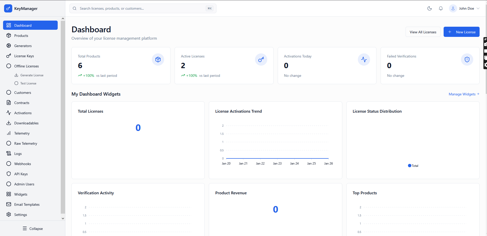

# Admin Portal

*Screenshot placeholder - will be added*

---

## Overview

The **Admin Portal** is the control plane of the License Management Platform. It provides comprehensive tools for managing products, licenses, customers, and system configuration.

### Who Is This For?

- Platform administrators
- System operators
- Support staff with appropriate permissions

### Key Capabilities

- Manage products and license generators
- Create and assign licenses
- Monitor activations and telemetry
- Configure system settings
- Manage contracts and API keys
- View logs and audit trails

---

## Available Pages

The Admin Portal consists of the following pages:

### [Dashboard](dashboard)

Provides a comprehensive operational overview of the entire license management platform with real-time KPIs, activity feeds, and customizable widgets.

### [Products](products)

Manage all licensable products in your platform. Each product represents software or services that can be licensed to customers.

### [License Generators](generators)

Define how license keys are created for each product. Generators control the format, activation limits, and validity rules for licenses.

### [License Keys](licenses)

Manage all license keys in the system. View, create, assign, suspend, revoke, and monitor licenses throughout their lifecycle.

### [Contracts](contracts)

Manage enterprise contracts that allow controlled license generation by third parties (resellers, partners). Contracts provide quota-based license management.

### [Activations](activations)

Monitor and manage license activations representing real installations on devices, machines, or domains.

### [Customers](customers)

Manage customer accounts that own licenses. View customer information, license ownership, and account status.

### [Admin Users](admins)

Manage administrative users who have access to the admin portal. Control roles, permissions, and account status.

### [Downloadables](downloadables)

Manage downloadable files and updates that customers can access. Control versions, access rules, and file uploads.

### [API Keys](api-keys)

Manage API keys for automation and third-party integrations. Control access permissions and rate limits.

### [Webhooks](webhooks)

Configure webhooks to receive real-time notifications about platform events. Enable event-driven integrations.

### [Email Templates](email-templates)

Manage email templates used for automated communications with customers and admins.

### [Dashboard Widgets](widgets)

Create and manage custom dashboard widgets to visualize telemetry data and platform metrics.

### [Telemetry](telemetry)

View and analyze usage data sent from products in the field. Monitor product usage, detect anomalies, and gain insights.

### [Background Jobs](background-jobs)

Monitor and manage background jobs running on the platform. Track job status, progress, and errors.

### [Webhook Deliveries](webhook-deliveries)

Track webhook delivery attempts and monitor integration health. Troubleshoot webhook failures.

### [System Logs](logs)

View operational system logs for troubleshooting, monitoring, and security auditing.

### [Data Retention Policies](retention-policies)

Configure automatic data purging policies for logs, telemetry, and other operational data.

### [Notifications](notifications)

Manage system notifications and alerts. Configure notification preferences and review notification history.

### [Settings](settings)

Configure system-wide settings across 11 different categories. Control platform behavior, integrations, and security.

### [Profile & Security](profile)

Manage your admin profile, security settings, and personal preferences.

### [Global Search](global-search)

Quickly search across the entire platform to find products, licenses, customers, activations, contracts, and more.

---

## Getting Started

1. **Login**: Access the admin portal with your admin credentials
2. **Dashboard**: Start at the dashboard to get an overview
3. **Products**: Create your first product
4. **Generators**: Configure a license generator
5. **Licenses**: Generate and assign licenses
6. **Settings**: Configure system settings as needed

---

## Navigation

Use the sidebar menu to navigate between different pages. Each page is focused on a specific task or area of functionality.

### Quick Access

- Use **Global Search** (Ctrl+K / Cmd+K) to quickly find records
- The **Dashboard** provides quick access to common actions
- Use **Profile** menu for account settings and logout
