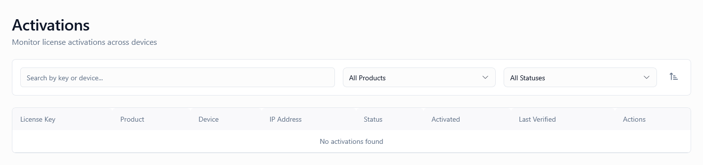

*Screenshot of the Activations page showing the list view with search, filters, and activation management actions*

---

## What Is This Page?

The **Activations** page is where you monitor and manage all license activations across your platform. Each activation represents a **real-world installation** of your product on a specific device, machine, or domain. This page gives you visibility into:

* **Where licenses are being used** (device identifiers, IP addresses)
* **When they were activated** and last verified
* **Which devices are active** vs inactive
* **Usage patterns** and potential abuse

Think of this page as your "deployment tracker"—every time a customer activates a license in your software, an activation record appears here.

---

## When to Use This Page

You'll use the Activations page when you need to:

* **Monitor active installations** — See how many devices are using each license
* **Track license usage** — Identify customers approaching activation limits
* **Troubleshoot activation issues** — Find why a customer can't activate
* **Deactivate devices remotely** — Free up slots for customers who changed hardware
* **Detect suspicious activity** — Spot rapid activations from different IPs
* **Audit compliance** — Verify licenses are used according to terms
* **View last verification timestamps** — Check if installations are still active
* **Search for specific devices** — Find activations by HWID or domain
* **Filter by product** — Focus on activations for specific products
* **Investigate piracy** — Detect license key sharing or unusual patterns

💡 **Tip:** Keep this page open during peak hours or product launches to monitor activation patterns in real-time.

---

## What You Can Do Here

### 1. View All Activations

The main table displays all activations across all licenses and products with the following columns:

| Column | Description |
|--------|-------------|
| **License Key** | The license key used (monospace font, truncated for readability) |
| **Product** | Product name this license belongs to |
| **Device** | Device identifier (HWID or domain name) |
| **IP Address** | IP address used during activation (monospace font) |
| **Status** | `active` (currently valid) or `inactive` (deactivated) |
| **Activated** | Date and time when device was first activated |
| **Last Verified** | Last time this activation was verified by the software |
| **Actions** | Dropdown menu with Deactivate option |

#### Understanding the Columns

**License Key**
- Partial license key for identification
- Click to copy full key to clipboard (if implemented)
- Links to [License Details]() page (if clickable)

**Product**
- Name of the product this activation belongs to
- Helpful when managing multiple products

**Device**
- **For desktop/server software:** Hardware ID (HWID) — unique machine fingerprint
- **For web-based software:** Domain name (e.g., `example.com`, `app.mysite.net`)
- Identifies the specific installation uniquely

**IP Address**
- Public IP used during activation
- Useful for detecting geographic anomalies
- May change over time (mobile devices, VPNs)
- Empty if activation was offline

**Status**
- **Active** (green badge): Device can currently use the license
- **Inactive** (gray badge): Device has been deactivated (slot freed)

**Activated**
- Timestamp of first activation on this device
- Format: "Jan 26, 2026" or "5 days ago" (relative)

**Last Verified**
- Last time software checked license validity
- Format: "5 minutes ago", "2 hours ago", "3 days ago"
- If more than 7 days: May indicate abandoned installation or offline use
- If "Never": Activation hasn't been verified yet (possibly offline activation)

💡 **Tip:** Sort by "Last Verified (Desc)" to find recently active installations, or by "Activated (Desc)" to see newest activations.

---

### 2. Search Activations

**Search Box** (top-left, spans 2 columns)
- **Placeholder:** "Search by key or device..."
- Real-time search with 300ms debounce

**What You Can Search:**
- License key (full or partial)
- Device identifier (HWID or domain)
- IP address
- Product name (if included in search index)

**Examples:**
- Search: `ABC123` → Finds licenses containing "ABC123"
- Search: `example.com` → Finds activations on example.com domain
- Search: `192.168` → Finds activations from IPs starting with 192.168
- Search: `HWID-12345` → Finds specific hardware ID

💡 **Tip:** Use partial searches to find patterns. For example, search for a specific IP range to find activations from the same network.

---

### 3. Filter Activations

#### Product Filter (Dropdown)
- **All Products** (default) — Shows activations for all products
- Individual products — Shows activations only for selected product
- Dropdown populated with all products in current environment

**Use Case:** Focus on activations for a specific product when troubleshooting or monitoring.

#### Status Filter (Dropdown)
- **All Statuses** (default) — Shows both active and inactive
- **Active** — Only currently valid activations
- **Inactive** — Only deactivated devices

**Use Cases:**
- "Active" filter: See current deployment count
- "Inactive" filter: Audit deactivation history or find patterns

💡 **Tip:** Combine filters for precise searches. Example: "Product: Pro Plugin + Status: Active" shows all active installations of the Pro Plugin.

---

### 4. Sort Activations

Click the **Sort icon** (top-right of filters panel) to open the Sort Modal (right-side panel).

**Sort By Options:**
- **License Key** — Alphabetically by license key
- **Product** — Alphabetically by product name
- **Device** — Alphabetically by device identifier
- **IP Address** — Numerically by IP (useful for finding activations from same network)
- **Status** — Active first, then inactive (or vice versa)
- **Activated** — By activation date (newest or oldest first)
- **Last Verified** — By last verification timestamp (most or least recent)

**Order Options:**
- **Ascending** — A-Z, 0-9, oldest first
- **Descending** — Z-A, 9-0, newest first

**Common Sorting Combinations:**
- **Last Verified (Desc)** — Find most recently active installations
- **Activated (Desc)** — Find newest activations (useful during launches)
- **IP Address (Asc)** — Group activations by network (detect license sharing)
- **Device (Asc)** — Sort alphabetically by device for easier scanning

💡 **Tip:** Sort by "Activated (Desc)" during product launches to monitor activation velocity in real-time.

---

### 5. Deactivate Device

To deactivate a specific device:

1. Find the activation in the table
2. Click the **Actions** menu (three-dot icon)
3. Click **"Deactivate"**
4. Confirmation modal appears:
   - **Title:** "Deactivate Device"
   - **Message:** "Are you sure you want to deactivate this device? The user will need to reactivate if they want to use this device again."
5. Click **"Deactivate"** to confirm (or Cancel to abort)

**What Happens:**
- Activation status changes from `active` to `inactive`
- Device slot is freed (customer can activate on a different device)
- Next license verification on this device will fail
- Offline licenses for this device become invalid
- Audit trail is created (immutable record)
- Customer is NOT notified automatically (you may want to email them manually)

**When to Deactivate:**
- Customer requests it (changed hardware, lost device)
- Suspected unauthorized use (license sharing, piracy)
- Customer exceeded activation limit and needs to move to new device
- Troubleshooting activation issues (reset and try again)
- Enforcement action (TOS violation, refund issued)

⚠️ **Warning:** Deactivation is immediate. The next time the software verifies the license on this device, it will fail. The customer will need to reactivate (which will create a new activation record).

💡 **Tip:** Before deactivating, check "Last Verified" timestamp. If it's old (30+ days), the device may already be abandoned, and deactivation won't affect the customer.

---

## Pagination

If there are more than the per-page limit (default 15), pagination controls appear at the bottom of the table:

- **Previous / Next** buttons
- **Page numbers** (1, 2, 3, ... or 1 ... 5 ... 10)
- **Current page** highlighted
- **Total count** displayed: "Showing 1-15 of 247 activations"

Page number persists in URL (`?page=2`) so you can bookmark specific pages.

---

## Understanding Activation Behavior

### How Activations Are Created

**Online Activation** (most common)
1. Customer installs your software on a device
2. Software calls `/api/v1/licenses/activate` endpoint with:
   - License key
   - Device identifier (HWID or domain)
   - (Optional) IP address, user agent, metadata
3. System validates:
   - License key exists and is valid
   - License is in `available` or `assigned` state (or already `active`)
   - Activation limit not exceeded (if set)
   - Environment matches
4. If valid: Creates activation record, returns success
5. If invalid: Returns error (license revoked, limit reached, etc.)

**Offline Activation** (less common)
1. Customer downloads offline license file from [Client Portal]()
2. Customer places file in software directory
3. Software validates cryptographic signature locally (no server call)
4. Activation record is created only when software first verifies online
5. Until then, activation doesn't appear in this list

💡 **Tip:** Offline activations may show "Last Verified: Never" if the customer has never gone online after activating.

---

### Activation Limits

Licenses can have **activation limits** (configured in [Generators]()):
- **Limit = 1:** License can only be activated on one device (most common for single-user licenses)
- **Limit = 3:** License can be activated on up to 3 devices simultaneously
- **Limit = Unlimited:** No limit (common for enterprise or site licenses)

**What Happens When Limit is Reached:**
- Activation attempts fail with error: "Activation limit reached"
- Customer must deactivate an existing device to activate a new one
- Deactivation can be done by:
  - Customer via [Client Portal]()
  - Admin via this page (manual intervention)
  - Software calling `/api/v1/licenses/deactivate` endpoint

**Checking Current Usage:**
1. Go to [Licenses]() page
2. Find the license
3. View **Activations** column: "2 / 3" (2 active out of 3 allowed)

---

### Last Verified Timestamp

**What "Last Verified" Means:**
- The most recent time the software successfully called `/api/v1/licenses/verify` endpoint
- Updated automatically during normal software operation
- Indicates the device is still actively using the license

**Interpreting the Timestamp:**

| Last Verified | Interpretation |
|---------------|----------------|
| Less than 1 hour ago | Device is currently active, software is running |
| 1-24 hours ago | Recent usage, software was used today |
| 1-7 days ago | Infrequent usage, or software verifies weekly |
| 7-30 days ago | Rarely used, or customer may have stopped using it |
| More than 30 days | Likely abandoned, or customer is offline |
| "Never" | Offline activation, or activation never verified online |

**Why This Matters:**
- Helps detect abandoned activations (can be deactivated to free slots)
- Indicates verification frequency (hourly vs daily vs weekly)
- Useful for piracy detection (rapid verifications from different IPs)

💡 **Pro Tip:** If a customer complains "my license isn't working," check Last Verified timestamp. If it's very old or "Never," they may be using an outdated offline license file.

---

## Use Cases & Workflows

### Workflow 1: Customer Changed Hardware and Needs to Reactivate

**Scenario:** Customer emailed: "I upgraded my computer and now my license says 'activation limit reached.' Can you help?"

**Steps:**
1. Get customer's license key from email or ticket
2. Go to **Activations** page
3. Search for the license key
4. You'll see activations, e.g.:
   - Device: `HWID-ABC123` (old computer) — Last Verified: 7 days ago
   - Device: `HWID-XYZ789` (new computer, failed activation) — not shown yet
5. Click **Actions** → **Deactivate** on the old device (`HWID-ABC123`)
6. Confirm deactivation
7. Reply to customer: "I've freed up an activation slot. Please try activating again on your new computer."
8. Customer activates successfully on new device

**Result:** New activation appears in list with new HWID.

---

### Workflow 2: Detecting License Key Sharing (Piracy)

**Scenario:** You suspect a customer is sharing their license key with multiple people.

**Steps:**
1. Go to **Activations** page
2. Search for the suspicious license key
3. Review the activation records:

**Red Flags:**
- **Many activations in short time** (e.g., 10 activations in 1 hour)
- **Different IP addresses in different countries** (e.g., USA, India, Brazil simultaneously)
- **Different device identifiers** that don't match normal patterns (e.g., all HWIDs look randomized)
- **Activation limit exceeded** (if limit is set, it may be being circumvented)

**Actions:**
1. Go to [Licenses]() page
2. Find the license
3. Click **Actions** → **Revoke License** to immediately disable it
4. Contact customer to investigate (they may have legitimate reason, e.g., team license)
5. If confirmed abuse: Keep license revoked
6. If legitimate: Create additional licenses or increase activation limit

💡 **Tip:** Sort by "Activated (Desc)" to see rapid activation patterns. If 5+ devices activated within minutes, it's likely automated sharing.

---

### Workflow 3: Freeing Activation Slots for Inactive Devices

**Scenario:** Customer has reached activation limit (3/3), but two of the devices haven't verified in 30+ days (likely abandoned).

**Steps:**
1. Go to **Activations** page
2. Search for customer's license key
3. Review "Last Verified" timestamps:
   - Device A: 2 minutes ago ✅ (active)
   - Device B: 35 days ago ⚠️ (abandoned)
   - Device C: 90 days ago ⚠️ (abandoned)
4. Deactivate Device B and Device C
5. Customer can now activate on new devices (slots available: 1/3)
6. Optional: Email customer to inform them

**Alternative:** Set up automatic deactivation policy:
- Go to [Settings > Retention Policies]()
- Configure: "Auto-deactivate devices inactive for 60+ days"
- System will handle this automatically

---

### Workflow 4: Troubleshooting "Activation Failed" Errors

**Scenario:** Customer reports: "I get 'Activation failed' error when trying to activate my license."

**Investigation Steps:**

1. **Check License Status:**
   - Go to [Licenses]() page
   - Search for customer's license key
   - Verify status is `active` (not `suspended`, `expired`, or `revoked`)

2. **Check Activation Limit:**
   - Still on Licenses page
   - Check "Activations" column: e.g., "3 / 3" (limit reached)
   - If limit reached, go to step 3

3. **Check Current Activations:**
   - Go to **Activations** page
   - Search for license key
   - Count active activations
   - Review "Last Verified" timestamps
   - Deactivate old/abandoned devices if needed

4. **Check Environment:**
   - Verify license and product are in correct environment
   - Customer may be using staging license in production build (or vice versa)

5. **Check Logs:**
   - Go to [Logs]() page
   - Filter by license key or API endpoint: `/api/v1/licenses/activate`
   - Review error messages for specific failure reason

**Common Causes:**
- License expired or revoked
- Activation limit reached
- Wrong environment (license is `staging`, software is set to `production`)
- Device identifier mismatch (rare, but possible with hardware changes)
- Network/firewall blocking API calls

---

### Workflow 5: Migrating Customer to New License

**Scenario:** Customer upgraded from "Basic" to "Pro" license. You need to deactivate old license and activate new one.

**Steps:**
1. **Deactivate Old License Activations:**
   - Go to **Activations** page
   - Search for old license key
   - Deactivate all active devices
   - This frees customer to activate on new license

2. **Verify New License:**
   - Go to [Licenses]() page
   - Confirm new "Pro" license is created and assigned to customer
   - Verify status is `active`

3. **Inform Customer:**
   - Email customer with new license key
   - Provide instructions to update license in software
   - Customer activates with new key

4. **Revoke Old License (Optional):**
   - Go to [Licenses]() page
   - Find old license
   - Click **Revoke** to prevent future use
   - Old activations remain in history for audit purposes

💡 **Tip:** Don't delete old activations. They remain as audit trail and proof of customer's license history.

---

## Security & Abuse Detection

### Detecting Suspicious Patterns

**Pattern 1: Rapid Activations**
- **What:** 5+ activations in less than 1 minute
- **Possible Cause:** Automated script activating license on multiple machines
- **Action:** Investigate customer, consider rate limiting or temporary suspension

**Pattern 2: Geographic Spread**
- **What:** Activations from IPs in widely different countries (USA, China, Russia) within short time
- **Possible Cause:** License key sharing or reselling
- **Action:** Contact customer, request explanation, revoke if confirmed abuse

**Pattern 3: Identical IPs**
- **What:** Multiple different licenses activated from same IP address
- **Possible Cause:** Legitimate (office network, ISP NAT) or abuse (reseller, cracker)
- **Action:** Review context (same customer? different customers?), investigate

**Pattern 4: Randomized Device IDs**
- **What:** Device identifiers look generated/random instead of hardware-based
- **Possible Cause:** Customer bypassing HWID tracking (modifying SDK)
- **Action:** Review activation frequency, contact customer, enforce stricter verification

---

### Audit Trail

Every activation and deactivation is logged in the [Audit Trail]():
- **Who** performed the action (admin user or system/customer)
- **When** it occurred (timestamp)
- **What** changed (before/after snapshot)
- **Why** (if reason provided)
- **Request ID** for tracing

This is immutable and cannot be deleted. Useful for:
- Compliance audits
- Dispute resolution (customer claims they didn't activate X devices)
- Internal investigations (which admin deactivated this?)

💡 **Tip:** Always leave a comment or note when manually deactivating devices so future admins understand why.

---

## Best Practices

1. **Monitor "Last Verified" timestamps regularly** — Inactive devices (30+ days) can be safely deactivated to free slots
2. **Document deactivation reasons** — Use internal notes or ticket references
3. **Check patterns before revoking licenses** — Some legitimate uses look like abuse (offices, families)
4. **Set up automated policies** — Use [Retention Policies]() for auto-deactivation of old devices
5. **Communicate with customers before deactivating** — Unexpected deactivations damage trust
6. **Use geographic data wisely** — VPNs and travel can cause false positives
7. **Keep activation limits reasonable** — Too strict causes support burden; too loose enables abuse
8. **Regularly audit high-activation licenses** — Focus on licenses approaching limits
9. **Preserve activation history** — Never delete old activation records (keep for audits)
10. **Cross-reference with telemetry** — Go to [Telemetry]() page to see actual usage patterns

---

## Troubleshooting

### Problem: Activation appears in list but customer says "license invalid"

**Solution:**
- Check activation **Status**: It may be marked `inactive` (deactivated)
- Check parent license **Status** in [Licenses]() page: May be `expired`, `suspended`, or `revoked`
- Check "Last Verified" timestamp: If "Never," customer may have offline license file that's outdated
- Check environment match: Activation may be in `staging` but customer is using `production` build
- Ask customer to try activating again (may resolve transient issue)

---

### Problem: Customer says "activation limit reached" but activations list shows only 1 active

**Solution:**
- Refresh the page (activation may have been deactivated recently but cached)
- Check if activation is marked `inactive` but still counted (rare bug)
- Verify generator configuration: Activation limit may be set to 1 (check [Generators]() page)
- Review license status: Suspended licenses may block new activations
- Check [Logs]() for detailed error message from last activation attempt

---

### Problem: "Last Verified" timestamp not updating

**Solution:**
- Customer's software may be configured to verify infrequently (e.g., weekly)
- Customer may be using offline license file (doesn't verify online)
- Network issues preventing API calls (firewall, proxy, no internet)
- SDK misconfiguration (not calling verify endpoint)
- Check [Telemetry]() page: If telemetry is arriving, license is in use even if not verifying

---

### Problem: Can't deactivate device - "Action failed"

**Solution:**
- Refresh page and try again (transient error)
- Check [Logs]() for specific error message
- Verify you have admin permissions for deactivation
- Activation may already be deactivated (status = `inactive`)
- Check if license has been deleted (activations for deleted licenses can't be deactivated)

---

### Problem: Multiple activations with same device ID

**Solution:**
- This shouldn't happen (device ID should be unique per activation)
- Possible causes:
  - Customer reinstalled software (created new activation with same HWID)
  - System bug (duplicate activation records)
- Review "Activated" timestamps to identify oldest
- Deactivate older duplicates, keep newest
- Report bug to development team if reproducible

---

### Problem: Search not finding known activation

**Solution:**
- Search only works on license key, device, and IP address (not all fields)
- Try searching partial key or device ID
- Try filtering by Product first, then search
- Verify activation exists by browsing pages manually
- Check if activation is very old (may be paginated far down)
- Verify correct environment (production vs staging)

---

## FAQs

### Can customers deactivate their own devices?

**Yes.** Customers can deactivate devices from the [Client Portal > Activations]() page. This frees up activation slots without admin intervention.

However, admins have **additional powers:**
- Can deactivate any device (customers can only deactivate their own)
- Can deactivate devices for any license (customers only see their own)
- Can see all historical activations (customers only see active ones)

---

### What happens to activations when a license is revoked?

When you revoke a license (via [Licenses]() page):
- All activation records remain in the database (for audit purposes)
- Activation **status stays as `active`** but license status is `revoked`
- Next verification attempt will fail (license is revoked)
- Customers cannot create new activations (license is revoked)

**Activations are NOT automatically deactivated.** This is intentional—activation history is preserved for auditing.

---

### Can I bulk deactivate activations?

**Not in the UI currently.** Bulk deactivation must be done individually by clicking each activation's Actions menu.

**Alternative:** Use the API:
```bash
# Deactivate all activations for a license
curl -X POST https://yoursite.com/api/v1/licenses/{license-uuid}/deactivate-all \
  -H "Authorization: Bearer YOUR_API_KEY"
```

**Feature Request:** Bulk actions (checkbox selection + bulk deactivate button) may be added in future.

---

### How long are deactivated activation records kept?

**Forever (by default).** Activation records are never auto-deleted, even when marked `inactive`.

Reasons:
- Audit compliance (prove activation history)
- Dispute resolution (customer claims they didn't use X devices)
- Analytics (track activation patterns over time)

**Exception:** You can manually delete activations via API (not exposed in UI). Not recommended unless required by data retention policies.

---

### Can I see which admin deactivated a device?

**Yes.** Go to [Logs > Audit Trail]() and filter by:
- Action: "Deactivation"
- Resource: Activation UUID

The audit trail shows:
- Admin user who performed action
- Timestamp
- Before/after state
- Request ID for full tracing

---

### Why do some activations show "IP Address: (empty)"?

**Possible reasons:**
- Offline activation (no API call made, no IP captured)
- Privacy mode (SDK configured to not send IP address)
- Local network (software running on `localhost` or private IP that wasn't forwarded)
- Very old activation (before IP tracking was implemented)

This is not a bug—IP address is optional metadata.

---

### Can I reactivate a deactivated device?

**Not directly.** Once deactivated, the activation record is marked `inactive` and cannot be reactivated.

However, the customer can **activate the device again**, which will:
- Create a **new** activation record
- Use a new activation slot (if limit not reached)
- Have a new "Activated" timestamp

The old deactivated record remains for audit purposes.

---

### What's the difference between "Deactivate" here and "Revoke" on the Licenses page?

**Deactivate (this page):**
- Affects **one specific device/activation**
- Frees up an activation slot
- Other devices using same license continue working
- Customer can reactivate this device (creates new activation)

**Revoke ([Licenses]() page):**
- Affects **the entire license**
- All activations immediately fail on next verification
- No devices can use this license anymore
- Cannot be undone (license permanently revoked)

**Use deactivate when:** Customer needs to move license to different device
**Use revoke when:** License is compromised, refunded, or abused

---

## Related Documentation

- **[License Keys]()** — Manage the licenses that these activations belong to
- **[Customers]()** — View customer details and their licenses
- **[Telemetry]()** — See actual usage patterns beyond just activation
- **[Logs]()** — Review activation/deactivation events in detail
- **[Settings > Retention Policies]()** — Configure auto-deactivation rules

---

## How to Access

1. Log in to the Admin Portal with your admin credentials
2. Click **Activations** in the main navigation menu
3. The page will load showing all activations in your current environment

**Direct URL:** `/admin/activations`

**Keyboard Shortcut:** Press `Ctrl+K` (Windows) or `Cmd+K` (Mac) to open Global Search, then type "activations" and press Enter.

---

## Related Pages

- [Dashboard]() - Main overview and KPIs
- [License Keys]() - Manage licenses
- [Customers]() - Customer management
- [Settings]() - System configuration
- [Profile]() - Your admin profile and security settings
