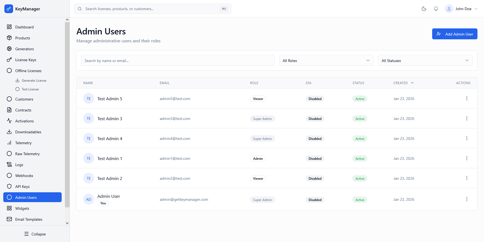

# Admin Users

*Screenshot of the Admin Users page with roles and permissions*

---

## What Is This Page?

The **Admin Users** page manages platform administrators who have access to the Admin Portal. Control who can manage products, licenses, customers, and system settings.

---

## When to Use This Page

* **Add new team members** — Create accounts for staff who need admin access
* **Manage roles** — Set permissions (Super Admin, Admin, Operator, Viewer)
* **Enable 2FA** — Enforce two-factor authentication for security
* **Deactivate users** — Disable access for former employees
* **View admin activity** — Check when admins last logged in
* **Reset passwords** — Help admins who forgot credentials

---

## What You Can Do Here

### 1. View Admin Users

| Column | Description |
|--------|-------------|
| **Name** | Admin full name with avatar initials |
| **Email** | Login email address |
| **Role** | Super Admin, Admin, Operator, or Viewer |
| **2FA** | Enabled (✓) or Disabled (×) |
| **Status** | Active or Inactive |
| **Created** | When account was created |
| **Actions** | Edit, Deactivate, Delete |

### 2. Search & Filter

* **Search:** By name or email
* **Role Filter:** All Roles, Super Admin, Admin, Operator, Viewer
* **Status Filter:** All Statuses, Active, Inactive

### 3. Admin Roles Explained

**Super Admin**
* Full system access
* Can create/delete admin users
* Can modify system settings
* Can access all environments
* Cannot be restricted

**Admin**
* Manage products, licenses, customers
* Create generators and contracts
* View telemetry and logs
* Cannot manage other admins
* Cannot modify critical system settings

**Operator**
* Day-to-day license management
* Assign/revoke licenses
* Deactivate devices
* View customers and activations
* Cannot create products or generators
* Cannot access system settings

**Viewer** (Read-Only)
* View-only access to all pages
* Can search and export data
* Cannot create, edit, or delete anything
* Useful for reporting/analytics team members

### 4. Create Admin User

1. Click **"Add Admin User"** button
2. Fill in:
   - **Name** — Full name
   - **Email** — Login email (must be unique)
   - **Role** — Select from dropdown
   - **Status** — Active or Inactive
   - **Require 2FA** — Enforce two-factor authentication (recommended)
3. Click **Save**
4. Admin receives invitation email with setup link
5. They set their password and configure 2FA (if required)

### 5. Edit Admin User

* Click **Edit** to update name, role, or status
* Cannot change email (it's the unique identifier)
* Status changes take effect immediately (Active → Inactive logs user out)

### 6. Deactivate vs Delete

**Deactivate (Recommended)**
* Sets status to Inactive
* Blocks login immediately
* Preserves audit history
* Can be reactivated later

**Delete (Permanent)**
* Removes admin account completely
* Cannot be undone
* Audit trail shows "Deleted Admin" (ID preserved)
* Use only for test accounts or data cleanup

---

## Security Best Practices

* **Enable 2FA for all admins** (especially Super Admins)
* **Use strong passwords** (min 12 characters, mixed case, numbers, symbols)
* **Follow least privilege principle** (don't give everyone Super Admin)
* **Deactivate accounts immediately** when staff leaves
* **Review admin list quarterly** (remove unused accounts)
* **Use role-specific accounts** (don't share logins)
* **Monitor login activity** in [Logs](../logs)

---

## Common Workflows

### Workflow 1: Onboarding New Admin

**Steps:**
1. Click **Add Admin User**
2. Enter details (use company email)
3. Set role based on responsibilities
4. ☑ Require 2FA
5. Status: Active
6. Save
7. New admin receives email
8. They complete setup (password + 2FA)
9. Verify login works
10. Add to internal documentation (who has access)

### Workflow 2: Offboarding Admin

**Steps:**
1. Go to **Admin Users** page
2. Find the user
3. Click **Edit**
4. Change Status to **Inactive**
5. Save (logs user out immediately)
6. Document in HR/IT records
7. After 90 days: Delete account permanently

---

## Troubleshooting

**Problem:** Can't create new admin - "Email already exists"

**Solution:** Email must be unique. Check if account already exists (may be inactive). Reactivate existing account instead.

**Problem:** Admin can't login after creation

**Solution:** Check status is Active. Verify invitation email was sent and not in spam. Resend invitation. Check email address is correct.

**Problem:** Admin says they have wrong permissions

**Solution:** Verify role assignment. Some features require Super Admin role. Log out and back in to refresh permissions.

---

## Related Pages

* [Profile](../profile) — Your admin account settings
* [Logs](../logs) — View admin activity and login history
* [Settings](../settings) — System configuration (Super Admin only)

---

## How to Access

**Navigation:** Admin Portal → **Admin Users**
**URL:** `/admin/admins`
**Shortcut:** `Ctrl+K` / `Cmd+K` → type "admins"

**Permission Required:** Super Admin role
