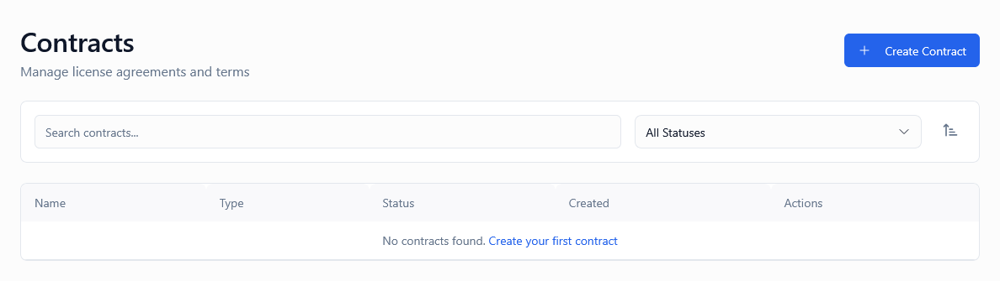

*Screenshot of the Contracts page showing contract list with management options*

---

## What Is This Page?

The **Contracts** page is where you manage licensing agreements, bulk license generation templates, and quota-based license distribution. Contracts serve as the foundation for:

* **Reseller partnerships** — Pre-configured licenses for partners who distribute your software
* **Enterprise agreements** — Bulk licenses for corporate customers with special terms
* **License pools** — Pre-generated license inventory for rapid fulfillment
* **Partnership programs** — Controlled license generation for strategic partners
* **Quota management** — Track license usage against allocated limits
* **Contract-based API access** — Programmatic license generation with restrictions

Think of contracts as "license generation blueprints" — each contract defines rules, quotas, and constraints that control how licenses are created and distributed at scale.

---

## When to Use This Page

You'll use the Contracts page when you need to:

* **Set up reseller agreements** — Create contract for partner to generate/distribute licenses
* **Configure enterprise licensing** — Bulk license generation for corporate customers
* **Prepare license inventory** — Pre-generate pools of licenses for quick assignment
* **Control bulk generation** — Set quotas and limits on license creation
* **Track contract usage** — Monitor how many licenses generated vs quota
* **Manage partner access** — Provide API keys tied to specific contracts
* **Audit contract history** — View all licenses generated from a contract
* **Update contract terms** — Modify quotas, features, or expiry rules
* **Deactivate contracts** — Pause or terminate licensing agreements
* **Generate contract reports** — Export data for accounting or compliance

💡 **Tip:** Contracts are especially powerful for SaaS businesses, reseller networks, and enterprise customers who need controlled, automated license distribution.

---

## What You Can Do Here

### 1. View All Contracts

The contracts table displays all licensing agreements with the following information:

| Column | Description |
|--------|-------------|
| **Name** | Contract identifier (e.g., "Acme Corp Enterprise - 500 Licenses Q1 2026") |
| **Type** | Contract category: standard, reseller, enterprise, pool |
| **Status** | Active (can generate licenses) or Inactive (paused/expired) |
| **Created** | Date when contract was established |
| **Actions** | View Details, Edit, Delete |

#### Contract Types Explained

**Standard Contract**
- Default contract type
- Used for general bulk license generation
- No special restrictions or terms
- Suitable for one-time bulk orders

**Reseller Contract**
- Designed for partner/reseller programs
- Can have API access for automated license generation
- Tracks licenses generated per reseller
- May include revenue sharing or commission tracking (external)

**Enterprise Contract**
- For large corporate customers
- Often includes custom terms, features, or limits
- May have special pricing or volume discounts (tracked externally)
- Can span multiple products or generators

**Pool Contract**
- Pre-generates a pool of available licenses
- Licenses remain unassigned until distributed
- Used for rapid fulfillment (no generation delay)
- Ideal for high-volume sales periods

---

### 2. Search & Filter Contracts

**Search Box** (top-left, spans 2 columns)
- Search by contract name
- Search by contract UUID
- Real-time search with 300ms debounce

**Status Filter** (dropdown)
- **All Statuses** (default) — Shows all contracts regardless of status
- **Active** — Only contracts currently generating licenses
- **Inactive** — Paused, expired, or completed contracts

**Sort Options** (right-side panel)
- **Sort By:** Name, Type, Status, Created date
- **Order:** Ascending (A-Z, oldest first) or Descending (Z-A, newest first)

💡 **Tip:** Filter by "Type: Reseller + Status: Active" to see all active reseller agreements at a glance.

---

### 3. Create Contract

Click **"Create Contract"** button (top-right) to set up a new licensing agreement.

#### Basic Information

**Contract Name** (Required)
- Descriptive identifier for internal tracking
- Include partner name, purpose, and time period
- Examples:
  - "TechPartner Inc - Reseller Agreement Q1 2026"
  - "Acme Corp - Enterprise 500 License Deal"
  - "Holiday Sale Pool - 1000 Licenses"
- Can be changed later
- Appears in license source field (Licenses page)

**Contract Type** (Required, dropdown)
- **Standard** — General bulk generation
- **Reseller** — Partner distribution agreement
- **Enterprise** — Corporate customer deal
- **Pool** — Pre-generated inventory

Choose based on business relationship and use case.

**Status** (Required, dropdown)
- **Active** — Contract can generate licenses now
- **Inactive** — Contract is paused (no generation allowed)

Set to Inactive for:
- Contracts being configured (not ready yet)
- Expired agreements
- Terminated partnerships
- Completed license pools

#### Product & Generator Configuration

**Product** (Required, dropdown)
- Select which product this contract is for
- Only products in current environment are shown
- Product must be Active status
- Cannot be changed after contract creation

**Generator** (Required, dropdown)
- Select which generator to use for license creation
- Only generators for selected product are shown
- Generator defines license format, features, and limits
- Can be changed later (affects only NEW licenses)

💡 **Why This Matters:** Product and generator determine what kind of licenses are created. Wrong selection = wrong license types distributed.

#### License Quota Configuration

**License Quota** (Required, number field)
- Total number of licenses this contract can generate
- Minimum: 1
- Maximum: No hard limit (but consider performance for 10,000+)
- Can be increased later (but not decreased if licenses already generated)

**Examples:**
- Reseller agreement: 100 (monthly quota)
- Enterprise deal: 500 (one-time bulk)
- License pool: 1,000 (pre-generate for peak season)

**Quota Tracking:**
- System tracks: Generated / Total
- Example: "247 / 500" means 247 created, 253 remaining
- Reaching quota blocks further generation (can be increased)

#### Feature Flags & Customization

**Feature Overrides** (Optional, JSON or UI toggles)
- Override default generator features for this contract
- Useful for special contract terms (more features, higher limits)
- Example: Enterprise contract includes features not in standard generator

**Activation Limit Override** (Optional, number)
- Override generator's default activation limit
- Leave blank to use generator default
- Set custom limit for specific contracts (e.g., enterprise gets 10 activations instead of 3)

**Expiry Configuration** (Optional)
- **Expiry Duration** — Number of days/months/years until license expires
- **Expiry Date** — Absolute date when all licenses expire
- Leave blank for perpetual licenses
- Applies to all licenses generated from this contract

#### Environment Isolation

**Environment** (Auto-detected, non-editable)
- Automatically set based on product's environment
- Contracts are environment-specific (same as products)
- Cannot generate production licenses from staging contract

#### Advanced Settings

**API Access** (Optional, checkbox)
- ☑ Enable API-based license generation for this contract
- Generates contract-specific API key
- Partner can call API to create licenses programmatically
- Useful for reseller automation

**Rate Limits** (Optional, if API enabled)
- Max license generations per minute/hour/day
- Prevents abuse or runaway scripts
- Example: 10 per minute, 100 per hour, 500 per day

**IP Allowlist** (Optional, if API enabled)
- Restrict API access to specific IP addresses
- One IP per line
- Enhances security for contract-based generation
- Example: Partner's office IP only

**Webhook Notifications** (Optional)
- Notify URL when licenses generated via this contract
- Useful for partner systems integration
- Receives POST with license details

---

### 4. View Contract Details

Click **"View Details"** in the Actions menu to see comprehensive contract information:

#### Overview Section
- Contract Name, Type, Status
- Product and Generator used
- Created date and last updated
- Created by (admin user)

#### Quota Status
- **Total Quota:** How many licenses contract can generate
- **Used:** How many licenses already generated
- **Remaining:** Available quota (Total - Used)
- **Utilization:** Percentage used (e.g., "47% utilized")
- Visual progress bar

#### Generation History
- Table showing all license generation events:
  - Date/time of generation
  - Number of licenses created
  - Method (Manual, API, Background Job)
  - Generated by (admin user or API key)
  - Job status (Completed, Failed)

#### Associated Licenses
- Count of licenses created via this contract
- Link to [Licenses](../licenses) page filtered by this contract
- Export licenses to CSV (contract-specific export)

#### API Access (if enabled)
- Contract-specific API key (masked, with "Reveal" button)
- API endpoint URL
- Rate limit statistics (calls made, remaining)
- Last API call timestamp

#### Activity Log
- Audit trail of contract changes:
  - Status changes (Active ↔ Inactive)
  - Quota increases
  - Feature/generator changes
  - Who made changes and when

---

### 5. Generate Licenses from Contract

**Two Methods:**

#### Method 1: Manual Generation (UI)
1. Go to contract details page
2. Click **"Generate Licenses"** button
3. Enter number of licenses (cannot exceed remaining quota)
4. Click **"Generate"**
5. For small batches (< 100): Immediate generation
6. For large batches (100+): Queued as background job
7. Monitor progress in [Background Jobs](../background-jobs)
8. Generated licenses appear in [Licenses](../licenses) page with source = "Contract"

#### Method 2: API Generation (Automated)
```bash
POST /api/v1/contracts/{contract-uuid}/generate
Authorization: Bearer {contract-api-key}
Content-Type: application/json

{
  "count": 50,
  "idempotency_key": "unique-request-id"
}
```

Response:
```json
{
  "success": true,
  "licenses_generated": 50,
  "quota_remaining": 450,
  "job_id": "job-uuid" // if queued
}
```

💡 **Idempotency:** Use idempotency_key to prevent duplicate generation on network retries.

---

### 6. Edit Contract

Click **"Edit"** to update contract settings.

**What You Can Edit:**
- Contract name
- Status (Active ↔ Inactive)
- License quota (increase only if licenses already generated)
- Feature overrides
- Activation limit override
- Expiry configuration
- API access settings
- Rate limits
- IP allowlist
- Webhook URL

**What You CANNOT Edit:**
- Contract type (immutable after creation)
- Product (immutable after creation)
- Environment (immutable, tied to product)
- Contract UUID (immutable identifier)

**Important Notes:**
- Editing generator affects only NEW licenses (existing licenses unchanged)
- Increasing quota takes effect immediately
- Changing features only applies to future license generation
- Status change to Inactive blocks further generation but doesn't affect existing licenses

---

### 7. Delete Contract

Click **"Delete"** in the Actions menu to permanently remove the contract.

**Confirmation Required:**
- Modal displays: "Are you sure? This action cannot be undone."
- Must type contract name to confirm (for additional safety)

**What Gets Deleted:**
- The contract record itself
- API keys associated with the contract
- Rate limit tracking data
- Webhook configuration

**What Does NOT Get Deleted:**
- Licenses already generated from this contract (remain in system)
- Customers who received these licenses
- Audit trails (preserved for compliance)

**When to Delete:**
- Test contracts that are no longer needed
- Duplicate contracts created by mistake
- Expired partnerships (after archiving data externally)

**When NOT to Delete:**
- Active contracts (set to Inactive instead)
- Contracts with business/legal significance (preserve for records)
- Contracts that may be renewed (just set Inactive)

⚠️ **Warning:** Deletion is permanent. Consider setting status to Inactive instead to preserve historical data.

---

## Understanding Contract-Based License Generation

### How It Works

1. **Contract Created** → Defines rules, quotas, product, generator
2. **Generation Triggered** → Manual (UI), API call, or scheduled job
3. **Validation** → Check quota remaining, contract active, generator valid
4. **License Creation** → Generate licenses using specified generator
5. **Quota Update** → Increment "used" count, decrement "remaining"
6. **Source Tracking** → Licenses marked with source = "Contract" + contract UUID
7. **Notification** → Webhook called (if configured)
8. **Audit Log** → Event recorded in system logs

### Contract vs Direct License Creation

| Aspect | Direct Creation | Contract-Based |
|--------|-----------------|----------------|
| **Quota** | None (unlimited) | Enforced quota limit |
| **Tracking** | Source = "Manual" | Source = "Contract" + UUID |
| **API Access** | Admin API key | Contract-specific API key |
| **Permissions** | Admin permission required | Contract controls access |
| **Reporting** | General | Contract-specific reports |
| **Use Case** | Ad-hoc, one-off | Bulk, reseller, enterprise |

---

## Common Workflows

### Workflow 1: Setting Up Reseller Partnership

**Scenario:** You're partnering with "TechReseller Inc" to distribute 200 licenses per quarter with API integration.

**Steps:**

1. **Create Contract**
   - Name: "TechReseller Inc - Q1 2026 - 200 Licenses"
   - Type: Reseller
   - Status: Inactive (configure first, activate later)
   - Product: Select your product
   - Generator: Select appropriate generator (e.g., "Pro Plan Generator")
   - Quota: 200
   - Feature Overrides: (if any special terms)
   - Activation Limit: Use generator default (or override if needed)
   - Expiry: 1 year from generation date
   - ☑ Enable API Access
   - Rate Limits: 10/min, 100/hour, 200/day
   - IP Allowlist: Enter partner's office IP
   - Webhook: (Optional) Partner's webhook endpoint for notifications

2. **Save Contract** (status still Inactive)

3. **Test Generation**
   - Generate 1 test license manually
   - Verify license has correct features, limits, expiry
   - Check license appears in [Licenses](../licenses) with source "Contract: TechReseller Inc..."
   - Test API generation with contract API key
   - Verify webhook receives notification (if configured)

4. **Activate Contract**
   - Edit contract
   - Change Status to Active
   - Save

5. **Provide Access to Reseller**
   - Send contract API key (securely, via encrypted channel)
   - Provide API documentation
   - Share endpoint URL: `/api/v1/contracts/{contract-uuid}/generate`
   - Document rate limits and restrictions

6. **Monitor Usage**
   - Check contract details regularly
   - Review quota utilization: "47 / 200 used"
   - Monitor generation history
   - Check for API errors or rate limit violations in [Logs](../logs)

7. **Quarterly Renewal**
   - At end of quarter, evaluate performance
   - If renewing: Edit contract, increase quota by 200 (now 400 total)
   - If not renewing: Set Status to Inactive
   - For new quarter: Create new contract or increase quota on existing

---

### Workflow 2: Enterprise Bulk License Deal

**Scenario:** "Acme Corporation" purchased 500 licenses for their entire organization. Need to generate all at once and assign to their admin.

**Steps:**

1. **Create Contract**
   - Name: "Acme Corp - Enterprise Deal - 500 Licenses - 2026"
   - Type: Enterprise
   - Status: Active
   - Product: Select product
   - Generator: Select "Enterprise Generator" (with more features)
   - Quota: 500
   - Feature Overrides: (if custom terms negotiated)
   - Activation Limit: 5 (enterprise users have multiple devices)
   - Expiry: 2 years from today
   - API Access: Not needed (one-time generation)
   - Save

2. **Generate Licenses**
   - Click **"Generate Licenses"** button in contract details
   - Enter count: 500
   - Click **"Generate"**
   - System queues as background job (large batch)
   - Copy job ID for tracking

3. **Monitor Generation**
   - Go to [Background Jobs](../background-jobs)
   - Find job by ID
   - Monitor progress: "Generating... 127 / 500 completed"
   - Wait for status: "Completed"

4. **Assign to Customer**
   - Go to [Licenses](../licenses) page
   - Filter: Source = "Contract: Acme Corp..."
   - Bulk select all 500 licenses
   - Click **"Bulk Assign"**
   - Enter customer email: acme-admin@acmecorp.com
   - System creates customer account (if doesn't exist)
   - Save

5. **Notify Customer**
   - Email acme-admin@acmecorp.com:
     - "Your 500 enterprise licenses are ready"
     - "Access the Client Portal at: [link]"
     - "Use your email to login"
     - "You can view all licenses and distribute to your team"

6. **Set Contract to Inactive**
   - Edit contract
   - Status: Inactive (one-time deal, quota fulfilled)
   - Save
   - Contract now shows: "500 / 500 used (100%)"

---

### Workflow 3: Pre-Generate License Pool for Black Friday

**Scenario:** Expecting high sales volume during Black Friday. Pre-generate 2,000 licenses for instant fulfillment.

**Steps:**

1. **Create Pool Contract**
   - Name: "Black Friday 2026 License Pool - 2000 Licenses"
   - Type: Pool
   - Status: Active
   - Product: Your product
   - Generator: Standard generator
   - Quota: 2,000
   - Expiry: 1 year from today
   - Save

2. **Pre-Generate All Licenses**
   - Generate 2,000 licenses (queued as background job)
   - Wait for completion (may take 10-30 minutes)

3. **Verify Pool**
   - Go to [Licenses](../licenses)
   - Filter: Source = "Contract: Black Friday 2026..."
   - Status = "Available" (unassigned)
   - Should see 2,000 licenses ready

4. **During Black Friday Sales**
   - Customer purchases product
   - Your order fulfillment system:
     - Grabs 1 available license from pool
     - Assigns to customer email
     - Customer receives instant email with license
   - No generation delay (licenses already exist)

5. **Monitor Pool Depletion**
   - Check contract details: "1,847 / 2,000 used"
   - If running low (< 100 remaining), generate more:
     - Edit contract
     - Increase quota to 3,000
     - Generate another 1,000 licenses
     - Pool replenished

6. **Post-Black Friday**
   - Unused licenses remain available for future orders
   - Can assign manually or via API
   - Or: Create new contract for next event
   - Or: Set to Inactive if sale ended

---

### Workflow 4: Quarterly Reseller Quota Increase

**Scenario:** Reseller used their Q1 quota (200 licenses). Renewing for Q2 with increased quota (300 licenses).

**Steps:**

1. **Review Q1 Performance**
   - View contract details
   - Quota: "200 / 200 used (100%)"
   - Generation history: Check dates, verify legitimate use
   - No abuse detected (consistent generation over 3 months)

2. **Negotiate Q2 Terms**
   - (External) Discuss with reseller
   - Agree on 300 licenses for Q2
   - Pricing updated in billing system (external)

3. **Update Contract**
   - Edit contract
   - Change Name: "TechReseller Inc - Q2 2026 - 300 Licenses"
   - Quota: Increase from 200 to 500 (200 already used + 300 new)
   - Save

4. **Notify Reseller**
   - Email: "Q2 quota activated: 300 licenses available"
   - Reseller continues using same API key
   - No interruption in service

5. **Alternative: Create New Contract**
   - Some businesses prefer separate contracts per period
   - Set Q1 contract to Inactive
   - Create new Q2 contract (fresh quota)
   - Issue new API key (better for tracking)
   - Advantage: Clean separation for accounting

---

### Workflow 5: Handling Contract Quota Exceeded

**Scenario:** Reseller reached quota (200 / 200) mid-month. Needs emergency increase.

**Steps:**

1. **Detection**
   - Reseller calls support: "API returning error 'Quota exceeded'"
   - Check contract details: "200 / 200 used (100%)"

2. **Verification**
   - Review generation history: Verify legitimate use
   - Check last 24 hours: Sudden spike or consistent usage?
   - If abuse suspected: Investigate before increasing

3. **Business Decision**
   - Should quota be increased? (Policy question)
   - Will reseller pay for extra licenses?
   - One-time exception or adjust agreement?

4. **Increase Quota**
   - Edit contract
   - Quota: Increase to 250 (adds 50 more)
   - Save
   - Takes effect immediately

5. **Notify Reseller**
   - Email: "Emergency quota increase approved: 50 additional licenses"
   - "Current: 200 / 250 used"
   - "Please discuss permanent increase for next quarter"

6. **Follow-Up**
   - Document in CRM / internal notes
   - Include in next contract renewal discussion
   - Update billing (if applicable)

---

## Contract Permissions & Security

### Who Can Create Contracts?

**Role Requirements:**
- Super Admin: Full access (create, edit, delete all contracts)
- Admin: Can create and manage contracts
- Operator: View-only access to contracts
- Viewer: Read-only access

### API Key Security

**Contract API Keys:**
- Unique per contract (not admin API key)
- Scoped to specific contract (can only generate licenses for that contract)
- Cannot access other contracts or admin functions
- Can be rotated (regenerated) if compromised
- Should be transmitted securely (encrypted channel, not email)

**Best Practices:**
- Store API keys in partner's secure vault (not hardcoded)
- Use HTTPS only (never HTTP)
- Implement IP allowlisting when possible
- Rotate keys periodically (quarterly or annually)
- Revoke keys immediately if partnership ends

### Rate Limiting

**Why Rate Limits Matter:**
- Prevent abuse (runaway scripts)
- Protect system performance (bulk generation is resource-intensive)
- Fair usage across partners
- Detect anomalies (sudden spikes)

**Recommended Limits:**
- Small resellers: 10/min, 100/hour, 500/day
- Large resellers: 50/min, 500/hour, 5000/day
- Enterprise self-service: 5/min, 20/hour, 100/day

**What Happens When Limit Exceeded:**
- API returns HTTP 429 (Too Many Requests)
- Response includes: "Retry-After" header
- Generation is blocked until rate limit window resets
- Event logged in [Logs](../logs)

---

## Reporting & Analytics

### Contract Performance Metrics

**Key Metrics:**
1. **Quota Utilization** — % of quota used
2. **Generation Velocity** — Licenses generated per day/week
3. **Time to Quota** — Days until quota exhausted
4. **API vs Manual** — Breakdown of generation methods
5. **Error Rate** — Failed generation attempts

### Generating Reports

**Export Contract Data:**
1. Go to contract details page
2. Click **"Export Report"** (if available)
3. Or: Go to [Licenses](../licenses) → Filter by contract → Export CSV

**What's Included:**
- All licenses generated via contract
- License keys, statuses, assigned customers
- Activation counts
- Creation dates
- Feature flags

**Use Cases:**
- Accounting reconciliation (licenses sold vs generated)
- Partner commission calculations
- Compliance audits
- Internal reporting (sales team)

---

## Best Practices

1. **Name contracts descriptively** — Include partner, period, quantity
2. **Use correct contract type** — Affects reporting and analytics
3. **Set realistic quotas** — Based on historical data or projections
4. **Enable API access judiciously** — Only for trusted, automated partners
5. **Monitor quota usage** — Don't wait until 100% to discuss renewal
6. **Test before activating** — Generate 1-2 test licenses first
7. **Document contract terms externally** — This system doesn't store legal agreements
8. **Set expiry dates** — Perpetual licenses harder to manage long-term
9. **Use IP allowlisting** — When partner has static IP
10. **Review contracts quarterly** — Deactivate unused, increase active
11. **Track in external CRM** — Link contracts to billing/accounting systems
12. **Archive inactive contracts** — Don't delete (preserve audit trail)
13. **Standardize naming conventions** — Easier to search and report
14. **Separate production and staging** — Test contracts in staging first

---

## Troubleshooting

### Problem: License generation fails with "Quota exceeded"

**Solution:** Check contract details → Quota used = Quota total. Need to increase quota: Edit contract, increase total. If quota should not be exceeded, investigate usage (possible abuse or misconfiguration).

---

### Problem: Generated licenses have wrong features

**Solution:** Check contract's generator configuration. Generator defines features. Either: (1) Edit contract to use different generator, or (2) Edit contract's feature overrides. Note: Changes only affect new licenses, not existing.

---

### Problem: API key not working for reseller

**Solution:** Verify API key copied correctly (no extra spaces). Check contract status is Active. Verify IP allowlist (if configured) includes reseller's IP. Check rate limits not exceeded. Review [Logs](../logs) for specific API error messages.

---

### Problem: Cannot increase quota below already-generated count

**Solution:** System prevents decreasing quota below used amount (e.g., can't set to 150 if 200 already generated). This is by design (would violate already-fulfilled licenses). Only way: Create new contract.

---

### Problem: Licenses generated via contract not appearing in Licenses page

**Solution:** Verify background job completed successfully (check [Background Jobs](../background-jobs)). If job failed, review error message. Common causes: Product inactive, generator deleted, database issues. May need to regenerate.

---

### Problem: Want to transfer quota from one contract to another

**Solution:** Not supported. Workaround: (1) Create new contract with combined quota, or (2) Manually track externally. Contracts are immutable in terms of product/generator (intentional design).

---

## FAQs

### Can I change a contract's product after creation?

**No.** Product is immutable once contract is created. This ensures all licenses from a contract are for the same product. If you need a different product, create a new contract.

---

### Can multiple contracts use the same API key?

**No.** Each contract has its own unique API key. This provides granular control and tracking per contract.

---

### What happens if I delete a contract that has generated licenses?

The licenses remain in the system and continue to work normally. Only the contract record and its API key are deleted. License source field still shows the deleted contract's name (for historical reference).

---

### Can a reseller see how many licenses they've generated?

Not directly in this system (they don't have admin access). You can:
1. Provide them with periodic reports (export CSV and email)
2. Build custom reseller dashboard (external to this system)
3. Use webhook notifications to keep their system in sync

---

### How do I revoke a reseller's access without deleting the contract?

Set contract Status to **Inactive**. This immediately blocks all license generation (manual and API). API calls will return "Contract inactive" error. Existing licenses are not affected.

---

### Can I have multiple contracts for the same product?

**Yes.** You can create unlimited contracts for the same product. Use this for:
- Different resellers (each gets their own contract)
- Different time periods (Q1, Q2, Q3 contracts)
- Different license types (Basic, Pro, Enterprise generators)

---

### Do contract licenses expire automatically?

If you set an expiry configuration on the contract, yes. All licenses generated will have that expiry. If no expiry set, licenses are perpetual (never expire unless manually revoked).

---

### Can I generate licenses manually from a contract even if API access is enabled?

**Yes.** API access doesn't restrict manual generation. Quota is shared between manual and API generation.

---

## Related Pages

* [Licenses](../licenses) — View licenses generated from contracts
* [Generators](../generators) — Configure license generation rules used by contracts
* [Background Jobs](../background-jobs) — Monitor bulk license generation progress
* [Customers](../customers) — Assign contract licenses to customers
* [API Keys](../api-keys) — Manage admin API keys (different from contract API keys)
* [Logs](../logs) — Audit contract activity and API calls

---

## How to Access

**Navigation:** Admin Portal → **Contracts**
**Direct URL:** `/admin/contracts`
**Keyboard Shortcut:** `Ctrl+K` / `Cmd+K` → type "contracts" → Enter
