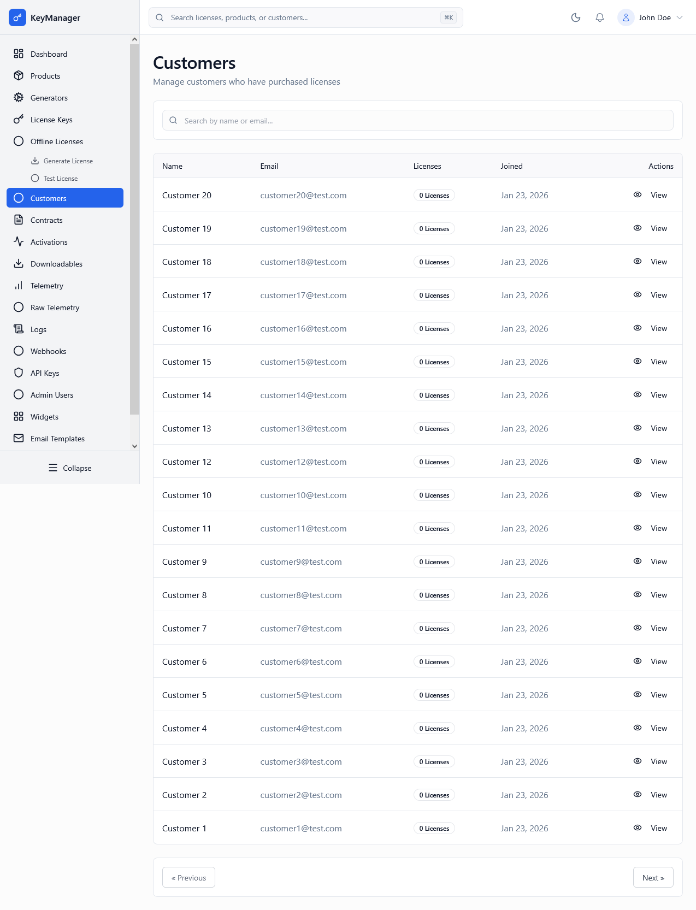

*Screenshot of the Customers page showing customer list with license counts and management options*

---

## What Is This Page?

The **Customers** page is your complete customer database and management hub. This is where you view, search, and manage all customers who own licenses in your system. Customers are the end users who:

* **Own licenses** assigned to their accounts
* **Access the [Client Portal]()** to manage their licenses and activations
* **Activate licenses** on their devices, machines, or domains
* **Download product files** and software updates (if downloadables are enabled)
* **View their activation history** and device management
* **Receive notifications** about license status, renewals, and updates

This page serves as the central hub for customer relationship management within the licensing system. While it doesn't replace a full CRM (like Salesforce or HubSpot), it provides all the customer data related to license ownership and usage.

---

## When to Use This Page

You'll use the Customers page when you need to:

* **Search for a specific customer** — Find by name or email quickly
* **View customer license inventory** — See all licenses owned by a customer
* **Check license counts** — How many licenses does this customer have?
* **Troubleshoot customer issues** — Access customer's complete license and activation history
* **Verify customer accounts** — Check when customer joined, what they own, last login
* **Navigate to customer's licenses** — Jump directly to filtered license list
* **Audit customer activity** — Review customer's usage patterns and history
* **Manage customer access** — View or update customer account status
* **Support ticket resolution** — Quick lookup of customer data during support calls
* **Sales follow-up** — Identify customers with multiple licenses (upsell opportunities)
* **Compliance reporting** — Export customer data for audit or GDPR requests

💡 **Tip:** Keep this page bookmarked and use the search function for instant customer lookup during support calls.

---

## What You Can Do Here

### 1. View All Customers

The customer list table displays all customers who have licenses assigned to them:

| Column | Description |
|--------|-------------|
| **Name** | Customer's full name (or "N/A" if not provided during account creation) |
| **Email** | Customer's email address (unique identifier and login credential) |
| **Licenses** | Total number of licenses assigned to this customer (badge format) |
| **Joined** | Date when customer account was created in the system |
| **Actions** | **View** button to see complete customer details |

#### Column Details

**Name Column**
- Displays the customer's full name if provided
- Shows "N/A" if customer was created without a name (email-only)
- Font weight: Bold (emphasizes primary identifier)
- Can be updated later via customer profile edit

**Email Column**
- Primary identifier for the customer
- Unique across all customers (no duplicates allowed)
- Used for login to [Client Portal]()
- Text color: Muted foreground (secondary information style)
- Cannot be changed after account creation (immutable)

**Licenses Column**
- Shows total count: number of licenses assigned to this customer
- Displayed as outlined badge: "3 Licenses" or "1 License" (proper singular/plural)
- Count includes licenses in all states (active, expired, revoked, etc.)
- Clicking row opens customer detail view with full license list

**Joined Column**
- Account creation date formatted as: "Jan 26, 2026"
- Helps identify new customers vs long-time customers
- Useful for customer lifetime value analysis
- Text color: Muted foreground (secondary information)

**Actions Column**
- Contains **"View"** button (with eye icon)
- Opens customer detail page in same window (uses wire:navigate for SPA feel)
- Variant: Ghost button (minimal visual weight)
- Size: Small (compact for table rows)

---

### 2. Search Customers

**Search Box** (top of page, full-width)
- **Icon:** Search icon (magnifying glass) on the left
- **Placeholder:** "Search by name or email..."
- **Real-time search** with 300ms debounce (smooth performance)
- **Search scope:** Name AND email (searches both fields)

**Search Examples:**

```
Search: "john"
Results: 
  - John Smith (john@example.com)
  - Sarah Johnson (sarah@company.com)
  - John Doe (john.doe@email.com)
```

```
Search: "@gmail.com"
Results: All customers with Gmail email addresses
```

```
Search: "acme"
Results:
  - Acme Admin (admin@acme.com)
  - John at Acme (john@acmecorp.com)
```

```
Search: "sarah@"
Results: Sarah Johnson (sarah@company.com) - exact email match
```

**Search Behavior:**
- Case-insensitive (JOHN = john = John)
- Partial matching (searches for substring)
- Updates results as you type (live search)
- Clears by deleting search text or clicking X icon (if present)
- Persists in URL for bookmarking: `?search=john`

💡 **Tip:** Use partial email domains to find all customers from a specific company (e.g., search "@acme.com" to find all Acme employees).

---

### 3. Sort Customers

Click on column headers to sort the table. Sortable columns are indicated by clickable headers with hover effects.

**Sortable Columns:**

**Name** (Click header to toggle)
- First click: A→Z (ascending alphabetical)
- Second click: Z→A (descending alphabetical)
- Chevron icon indicates current sort direction (up/down)
- "N/A" names appear at the end (regardless of direction)

**Email** (Click header to toggle)
- First click: A→Z (ascending alphabetical)
- Second click: Z→A (descending alphabetical)
- Useful for grouping by domain (e.g., all @gmail.com together)

**Joined** (Click header to toggle)
- First click: Oldest first (earliest dates)
- Second click: Newest first (latest dates)
- Default: Usually newest first (recent customers more relevant)

**Licenses Column** (Not Sortable)
- Shows count only
- Sorting would require database join (performance impact)
- To find customers by license count: Use database queries or reports

**Current Sort Indicator:**
- Active sort column shows chevron-up or chevron-down icon
- Icon direction: Up = ascending, Down = descending
- Only one column sorted at a time

---

### 4. View Customer Details

Click the **"View"** button or click the customer row to open the customer detail page.

#### Customer Detail Page Structure

**Section 1: Customer Profile**
- **Full Name:** Editable field (can be updated)
- **Email Address:** Read-only (immutable identifier)
- **Customer UUID:** System-generated unique identifier (used in API calls)
- **Account Status:** Active, Inactive, Suspended (if status management implemented)
- **Created Date:** When account was first created
- **Last Login:** Last time customer accessed Client Portal (if tracked)
- **Email Verified:** ✓ Verified or ✗ Not Verified
- **2FA Enabled:** ✓ Yes or ✗ No (if two-factor authentication is available)

**Section 2: License Inventory**
- Complete list of all licenses owned by this customer
- Table format with columns:
  - License Key (masked or full, with copy button)
  - Product Name
  - Status (badge: active, expired, suspended, revoked)
  - Expiry Date (or "Never" for perpetual)
  - Activations (current/limit, e.g., "2 / 5")
  - Created Date
  - Actions (View Details, Revoke, Edit)
- Pagination if customer has many licenses (15 per page)
- **Quick Actions:**
  - **Assign New License** — Button to assign additional license to this customer
  - **View All in Licenses Page** — Opens [Licenses]() filtered by this customer

**Section 3: Activation History**
- All devices/domains where customer has activated licenses
- Table format with columns:
  - License Key (which license was activated)
  - Product
  - Device Identifier (HWID or domain)
  - IP Address (last used)
  - Status (active or inactive)
  - Activated Date
  - Last Verified (how recently device checked license)
  - Actions (Deactivate)
- Useful for troubleshooting "activation limit reached" issues
- Link to [Activations]() page filtered by customer

**Section 4: Customer Activity Timeline** (if implemented)
- Chronological event history:
  - Account created
  - License assigned
  - License activated
  - Device deactivated
  - Password reset
  - Email verification
  - Downloads (if tracked)
- Helps with support investigations
- Shows who performed action (customer or admin)

**Section 5: Quick Actions Panel**
- **Send Email to Customer** — Opens email client or internal messaging
- **Reset Customer Password** — Sends password reset email
- **View as Customer** — Admin view of what customer sees in Client Portal
- **Export Customer Data** — GDPR data export (JSON or CSV)
- **Delete Customer Account** — Permanent deletion (requires confirmation)

---

## Understanding Customer Accounts

### How Customer Accounts Are Created

**Automatic Creation (Most Common)**

When you assign a license to an email address that doesn't exist in the system:

1. Go to [Licenses]() page
2. Find an unassigned license (Status: Available)
3. Click **Edit** or **Assign** button
4. Enter customer email in "Assign To" field
5. Click **Save**
6. **System automatically:**
   - Checks if customer with that email exists
   - If not: Creates new customer account
   - Sets customer name to "N/A" (can be updated later)
   - Generates customer UUID
   - Assigns license to customer
   - Sends invitation email (if email settings configured)
7. Customer receives email with:
   - Welcome message
   - Magic link or password setup link
   - Instructions to access Client Portal
8. Customer clicks link, sets password (if required), logs in
9. Customer sees their license(s) in [Client Portal]()

**Manual Creation (Not Available in UI)**

Customer accounts cannot be created independently through the Admin UI. They are ONLY created when:
- A license is assigned to a new email address
- Bulk import creates licenses with customer emails
- API call assigns license to new email

**Why This Design?**

This ensures every customer account has a purpose (owns at least one license). Prevents orphaned accounts with no licenses. Simplifies customer lifecycle management.

---

### Customer Account Lifecycle

**Stage 1: Creation**
- Customer account created when first license assigned
- Status: Active (default)
- Email: Unverified (until customer logs in)
- Password: Not set (until customer uses invitation link)

**Stage 2: Activation (First Login)**
- Customer receives invitation email
- Clicks link, sets password
- Email becomes verified
- Can now access Client Portal independently

**Stage 3: Active Use**
- Customer logs into Client Portal regularly
- Activates licenses on devices
- Downloads software updates
- Manages activations
- Views license details

**Stage 4: Dormant (Optional)**
- Customer hasn't logged in for extended period (e.g., 6+ months)
- Licenses may be expired or unused
- Account remains active (not auto-deleted)
- Can be reactivated at any time

**Stage 5: Account Closure (Manual Only)**
- Admin deletes customer account
- Licenses become unassigned (or remain with "Deleted Customer" reference)
- Customer can no longer access Client Portal
- Permanent action (cannot be undone)

---

### Customer vs Admin User Distinction

**Critical Concept:** Customers are NOT the same as Admin Users. They are completely separate authentication systems.

| Aspect | Customers | Admin Users |
|--------|-----------|-------------|
| **Purpose** | Own and use licenses | Manage the platform |
| **Portal Access** | [Client Portal]() | [Admin Portal]() |
| **Authentication** | Email + password (customer accounts) | Email + password (admin accounts) |
| **Permissions** | View/manage own licenses only | View/manage all system data |
| **Can See** | Only their own licenses and activations | All customers, all licenses, all data |
| **Can Create** | Nothing (read-only + self-service) | Products, licenses, generators, etc. |
| **Data Isolation** | Strict (cannot see other customers) | Global access (see everything) |
| **Account Creation** | Automatic (when license assigned) | Manual (by admins) |
| **Database Table** | `customers` table | `admins` table |
| **Role System** | No roles (all equal) | Super Admin, Admin, Operator, Viewer |

**Why This Matters:**

- An admin cannot log into the Client Portal as a customer (separate auth systems)
- A customer cannot access the Admin Portal (no permissions)
- Same email can exist as both customer AND admin (different systems)
- If you want to test customer experience, create a test customer account

💡 **Testing Tip:** Create a test customer (e.g., test@yourcompany.com), assign a license, and use "View as Customer" feature to see what they see.

---

## Common Workflows

### Workflow 1: Looking Up Customer During Support Call

**Scenario:** Customer calls support: "I can't find my license key. My email is john@example.com."

**Steps:**

1. **Quick Lookup**
   - Go to **Customers** page (already open on second monitor)
   - Type in search box: `john@example.com`
   - Press Enter (or wait for auto-search)
   - Customer appears in table

2. **View Details**
   - Click **View** button
   - Customer detail page opens

3. **Find License Key**
   - Scroll to "License Inventory" section
   - See all licenses: License keys listed with products
   - Copy license key using copy button

4. **Provide to Customer**
   - Read license key over phone (or email securely)
   - While on phone, verify: "Your license is for [Product Name], correct?"

5. **Check Additional Info**
   - Look at Activations: "I see you have 2 devices activated, is that right?"
   - Check Expiry: "Your license expires on [date]"
   - Document call in your external ticketing system

**Total Time:** ~30 seconds (with this page open)

---

### Workflow 2: Customer Says "I Bought 5 Licenses But Only See 3"

**Scenario:** Customer purchased 5 licenses but only 3 appear in their Client Portal.

**Investigation Steps:**

1. **Verify Customer Email**
   - "What email did you use to purchase?"
   - Customer says: "john@company.com"

2. **Search Customer**
   - Go to Customers page
   - Search: `john@company.com`
   - Found: "John Smith (john@company.com)"

3. **Check License Count**
   - Licenses column shows: "3 Licenses"
   - Click **View** to see details

4. **Review License Inventory**
   - Customer detail page shows 3 licenses:
     - License 1: Product A, Status: Active
     - License 2: Product A, Status: Active
     - License 3: Product B, Status: Active
   - Expected 5, found 3 → 2 licenses missing

5. **Check for Unassigned Licenses**
   - Go to [Licenses]() page
   - Filter: Status = "Available" (unassigned)
   - Search: Customer email or order number
   - Found: 2 licenses with Status = "Available"
   - **Reason:** Licenses were generated but not assigned yet

6. **Assign Missing Licenses**
   - Select the 2 unassigned licenses
   - Click **Bulk Assign**
   - Enter: john@company.com
   - Click **Save**

7. **Verify Fix**
   - Go back to Customers page
   - Search customer again
   - Licenses column now shows: "5 Licenses" ✓
   - Click View → See all 5 licenses in inventory

8. **Notify Customer**
   - "I've assigned the remaining 2 licenses to your account"
   - "Please refresh your Client Portal, you should see all 5 now"
   - Customer verifies: "Yes, I see all 5 now. Thank you!"

---

### Workflow 3: Troubleshooting "My License Won't Activate"

**Scenario:** Customer reports activation error: "Activation failed" or "Activation limit reached."

**Investigation Steps:**

1. **Customer Lookup**
   - Get customer email from ticket
   - Search in Customers page
   - Click View

2. **Check License Status**
   - Review "License Inventory" section
   - Find the specific license customer is trying to activate
   - Check Status badge:
     - **Active** → License is valid (not the problem)
     - **Expired** → License expired (needs renewal)
     - **Suspended** → Admin suspended it (check why)
     - **Revoked** → License revoked (cannot be used)

3. **If Status = Active, Check Activations**
   - Scroll to "Activation History" section
   - Count active activations for this license
   - Check activation limit:
     - Example: 3 active devices, limit is 3
     - **Diagnosis:** Activation limit reached

4. **Review Last Verified Timestamps**
   - Look at "Last Verified" column in activation history
   - Check for abandoned devices:
     - Device 1: "5 minutes ago" ← Currently in use
     - Device 2: "2 hours ago" ← Recently used
     - Device 3: "45 days ago" ← Likely abandoned

5. **Deactivate Old Device**
   - Click **Deactivate** on Device 3 (45 days old)
   - Confirm deactivation
   - Activation slot now free: 2 / 3 used

6. **Instruct Customer**
   - "I've freed up an activation slot by removing an old device"
   - "Please try activating again on your current device"
   - Customer tries → Success! ✓

7. **Document**
   - Note in support ticket: "Deactivated abandoned device (45 days inactive)"
   - Close ticket

---

### Workflow 4: Customer Changed Email, Need to Update Account

**Scenario:** Customer says: "I changed my email from old@email.com to new@email.com. Please update my account."

**Important:** Email addresses are immutable (cannot be changed) because they're used for authentication.

**Solution: Transfer Licenses to New Account**

1. **Verify Identity**
   - Confirm customer identity (ask security question, order number, etc.)
   - Confirm both emails belong to same person

2. **Find Old Account**
   - Search: `old@email.com`
   - Note all licenses (e.g., 3 licenses found)

3. **Create New Account** (if doesn't exist)
   - Go to [Licenses]() page
   - Find any unassigned license OR select one from old account
   - Assign to: `new@email.com`
   - System creates new customer account automatically

4. **Transfer All Licenses**
   - Go back to old account detail page
   - For each license:
     - Click **Edit**
     - Change "Assigned To" from old@email.com to new@email.com
     - Save
   - Repeat for all licenses (or use bulk reassign if available)

5. **Verify Transfer**
   - Search new email: `new@email.com`
   - Licenses column should show all transferred licenses (e.g., "3 Licenses")

6. **Handle Old Account**
   - Search old email: `old@email.com`
   - Licenses column now shows: "0 Licenses"
   - Options:
     - **Delete old account** (clean up database)
     - **Leave it** (harmless, has no licenses)

7. **Notify Customer**
   - "All your licenses have been transferred to new@email.com"
   - "Please log into the Client Portal using your new email"
   - "You may need to reset your password (use 'Forgot Password')"

**Alternative (If Many Licenses):**
- Use database query or API to bulk reassign (faster for 100+ licenses)
- Document the transfer in internal notes

---

### Workflow 5: Identifying Customers for Upsell/Renewal Campaign

**Scenario:** Sales team wants to contact customers with expiring licenses for renewal campaign.

**Steps:**

1. **Go to Licenses Page** (Not Customers page)
   - [Licenses]() page has better filtering for this
   - Filter: Status = "Active"
   - Filter: Expiry Date → Next 30 days (if available)
   - OR: Export all licenses, filter in spreadsheet

2. **Export License Data**
   - Click **Export** button
   - Download CSV with all licenses
   - Columns include: License Key, Customer Email, Expiry Date, Product

3. **Identify Unique Customers**
   - Open CSV in Excel/Google Sheets
   - Remove duplicate customer emails
   - Sort by Expiry Date (soonest first)

4. **Cross-Reference with Customers Page**
   - For each customer email, search in Customers page
   - Check total licenses: Customers with many licenses = higher value
   - Example: John has 10 licenses expiring → Priority contact

5. **Segment Customers**
   - **High Priority:** 5+ licenses, expiring in 14 days
   - **Medium Priority:** 2-4 licenses, expiring in 30 days
   - **Low Priority:** 1 license, expiring in 60 days

6. **Export Customer Contact List**
   - Create list: Name, Email, License Count, Soonest Expiry
   - Provide to sales team for outreach
   - Sales emails: "Your licenses expire soon. Renew now for 20% off!"

7. **Track Renewals**
   - As renewals come in, check Customers page
   - Updated license counts reflect renewals
   - Mark customers as "Renewed" in your external CRM

---

### Workflow 6: GDPR Data Export Request

**Scenario:** Customer requests all their data per GDPR Article 15 (Right of Access).

**Steps:**

1. **Verify Request**
   - Confirm customer identity (ask for order number, etc.)
   - Ensure request is from actual customer (not impersonator)

2. **Find Customer**
   - Search customer email in Customers page
   - Click **View**

3. **Export Customer Data**
   - Click **Export Customer Data** button (if implemented)
   - OR manually compile data:

4. **Data to Include** (GDPR Compliance):
   - **Profile:** Name, Email, Customer UUID, Created Date
   - **Licenses:** All license keys, products, statuses, expiry dates
   - **Activations:** All devices activated (HWIDs, IPs, dates)
   - **Downloads:** Files downloaded and when (if tracked)
   - **Login History:** Last login, IP addresses used (if tracked)
   - **Support Tickets:** Any support interactions (link to external system)

5. **Format Data**
   - JSON format (machine-readable) OR PDF (human-readable)
   - Example JSON:
   ```json
   {
     "customer": {
       "name": "John Smith",
       "email": "john@example.com",
       "uuid": "cust-uuid-123",
       "created_at": "2024-01-15",
       "last_login": "2026-01-20"
     },
     "licenses": [
       {
         "key": "ABC-123-XYZ",
         "product": "Pro App",
         "status": "active",
         "expiry": "2027-01-15"
       }
     ],
     "activations": [...]
   }
   ```

6. **Send to Customer**
   - Email encrypted file (or secure download link)
   - "Attached is all your data per GDPR Article 15"
   - Keep record of export date (compliance)

7. **Document in Compliance Log**
   - Record: Customer name, email, export date, delivered method
   - Required for GDPR audit trail

---

## Customer Data & Privacy

### What Data Is Stored

**Minimum Required Data:**
- Email address (unique identifier, login credential)
- Customer UUID (system-generated)
- Account creation timestamp

**Optional Data:**
- Full name (can be "N/A")
- Password hash (if customer set password)
- Email verification status (verified/unverified)
- Last login timestamp
- 2FA secret (if 2FA enabled)
- Password reset tokens (temporary)

### What Data Is NOT Stored (By Design)

This system is license-focused, not a full CRM:

- **No billing information** (credit cards, payment methods)
- **No physical addresses** (shipping, billing)
- **No phone numbers**
- **No company information** (company name, size, industry)
- **No order history** (order IDs, amounts paid)
- **No payment history** (invoices, receipts)
- **No support tickets** (managed externally)
- **No communication history** (emails sent, opened)

**Why?**

This keeps the system focused on its core purpose: license management. Integrate with external systems for CRM, billing, support:
- **Billing:** Stripe, PayPal, Paddle, your custom system
- **CRM:** Salesforce, HubSpot, Zoho
- **Support:** Zendesk, Freshdesk, Intercom
- **Email:** SendGrid, Mailgun, AWS SES

---

### GDPR Compliance

**Right of Access (Article 15)**
- Customer can request all their data
- Provide export within 30 days (see Workflow 6 above)

**Right to Erasure (Article 17)**
- Customer can request account deletion
- **Note:** Deleting customer does NOT delete licenses (by design)
- Licenses remain but show "Unassigned" or "Deleted Customer"
- **Why:** Audit trail, licensing compliance, prevent piracy

**Right to Rectification (Article 16)**
- Customer can update their name, password
- Email cannot be changed (see Workflow 4 for workaround)

**Right to Data Portability (Article 20)**
- Customer can export data in machine-readable format (JSON, CSV)

**Data Retention:**
- Customer accounts never auto-deleted (manual only)
- Licenses have separate retention (see [Retention Policies]())
- Logs may be auto-purged (see [Retention Policies]())
- Audit trails are immutable (never deleted)

---

## Security Considerations

### Customer Authentication

**Login Methods:**
1. **Email + Password** (traditional)
2. **Magic Link** (passwordless, email-based)
3. **2FA** (if enabled): TOTP codes (Google Authenticator, etc.)

**Password Requirements:**
- Minimum length (configurable in settings)
- Complexity rules (uppercase, lowercase, numbers, symbols)
- Hashing: bcrypt with appropriate work factor
- Password resets: Secure token-based flow

### Customer Data Access

**What Customers Can See:**
- Only their own licenses
- Only their own activations
- Only their own downloads
- Only their own profile

**What Customers CANNOT See:**
- Other customers' data (strict isolation)
- Admin portal data
- System settings
- License generation internals
- Product cryptographic keys

**Enforcement:**
- Database queries filtered by customer ID
- Authorization checks in every controller
- API endpoints validate customer ownership
- Client Portal views restricted

---

## Best Practices

1. **Search by email** (primary identifier) rather than name (name can be duplicate or N/A)
2. **Don't delete customers unnecessarily** (breaks historical data, audit trails)
3. **Verify identity before account changes** (prevent social engineering)
4. **Use "View as Customer" feature** to debug issues (see what they see)
5. **Document support actions externally** (this system doesn't store admin notes)
6. **Keep email addresses accurate** (typos create wrong accounts)
7. **Use consistent email formats** (lowercase preferred)
8. **Integrate with external CRM** for full customer management
9. **Export data regularly** for backup/compliance
10. **Monitor for duplicate accounts** (same person, different emails)
11. **Test customer workflows in staging** before production changes
12. **Respect customer privacy** (don't share data inappropriately)

---

## Troubleshooting

### Problem: Customer Not Appearing in List

**Solution:** Customers are only created when licenses are assigned. If customer has no licenses, they don't exist in this system. Check if licenses were assigned to a different email (typo).

---

### Problem: Customer Has 0 Licenses But Appears in List

**Solution:** Licenses were deleted or revoked. Customer account remains (by design). Click View to see history. Consider deleting customer account if no longer needed.

---

### Problem: Duplicate Customer Accounts (Same Person, Different Emails)

**Solution:** System has no merge function. Manual process: (1) Choose primary email, (2) Reassign all licenses from secondary accounts to primary, (3) Delete secondary accounts. Prevention: Use single email consistently.

---

### Problem: Customer Can't Access Client Portal

**Solutions:**
- Check account status (may be inactive/suspended)
- Verify email is correct (check for typos)
- Resend invitation email or password reset
- Check email isn't in spam folder
- Verify customer has active licenses (access may be restricted without licenses)
- Check [Logs]() for authentication errors

---

### Problem: Customer Says They Didn't Receive Invitation Email

**Solutions:**
- Check spam/junk folder
- Verify email settings configured in [Settings > Email]()
- Check [Logs]() for email send failures
- Resend invitation manually
- Use password reset flow as alternative
- Verify email address is correct (no typos)

---

### Problem: Need to Merge Two Customer Accounts

**Solution:** No automatic merge. Manual process: (1) Choose which account to keep, (2) Reassign all licenses from duplicate to primary account, (3) Update any external references (CRM, billing), (4) Delete duplicate account. Document merge in internal notes.

---

## FAQs

### Can I create a customer account without assigning a license?

**No.** Customer accounts are only created when licenses are assigned. This is by design to prevent orphaned accounts.

---

### Can I change a customer's email address?

**No.** Email is the immutable unique identifier. Workaround: Transfer all licenses to new email address (creates new account), then delete old account. See Workflow 4 above.

---

### What happens to licenses if I delete a customer?

Licenses are NOT automatically deleted. They remain in the system with customer reference showing "Deleted Customer" or becoming unassigned (depending on configuration). This preserves audit history.

---

### Can the same email be both a customer and an admin?

**Yes.** They're separate authentication systems. Same email can exist as customer (owns licenses) AND admin (manages platform). Use different passwords for each.

---

### Why does a customer see "N/A" as their name in the portal?

Name was not provided when license was assigned. Customer can update their name in Client Portal profile settings (if implemented). Admin can update via customer detail page.

---

### How do I find all customers with licenses expiring soon?

Go to [Licenses]() page (better filtering), not Customers page. Filter by expiry date range. Export list of customer emails. Cross-reference with Customers page for contact info.

---

### Can I bulk export all customer data?

Yes (if implemented). Look for "Export All" button or use database export. Respect privacy laws (GDPR, CCPA) when handling exports.

---

### Do customers get notified when licenses are assigned to them?

Only if email notifications are configured in [Settings > Email]() and "Send email on license issue" is enabled for the product. Otherwise, no automatic notification.

---

## Related Pages

* [Licenses]() — Assign licenses to customers, bulk operations
* [Activations]() — View customer device activations and usage
* [Client Portal]() — What customers see (their perspective)
* [Settings > Email]() — Configure customer invitation and notification emails
* [Logs]() — Audit customer activity, logins, and actions

---

## How to Access

**Navigation:** Admin Portal → **Customers**
**Direct URL:** `/admin/customers`
**Keyboard Shortcut:** `Ctrl+K` / `Cmd+K` → type "customers" → Enter

**Permission Required:** Admin or higher (Operators and Viewers have read-only access)
