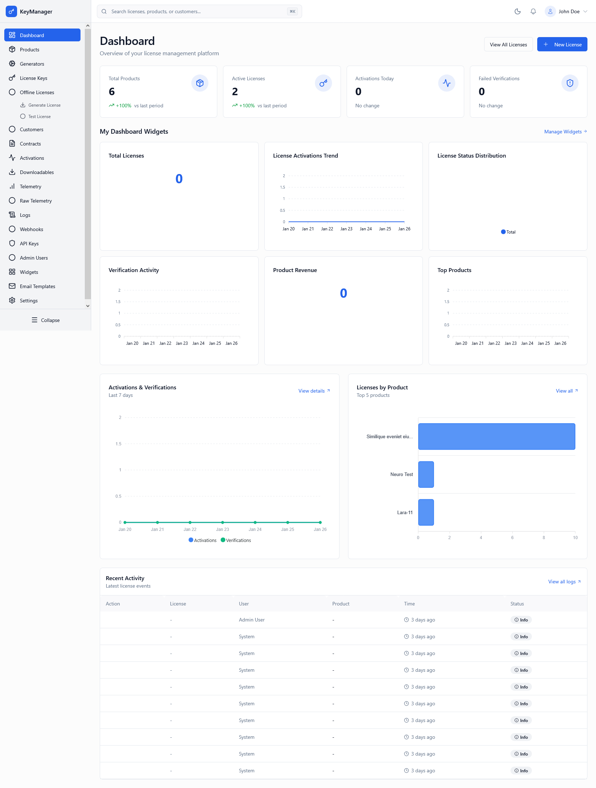
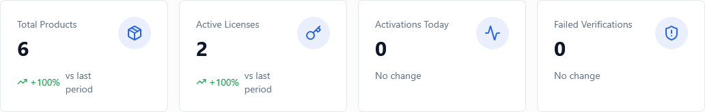
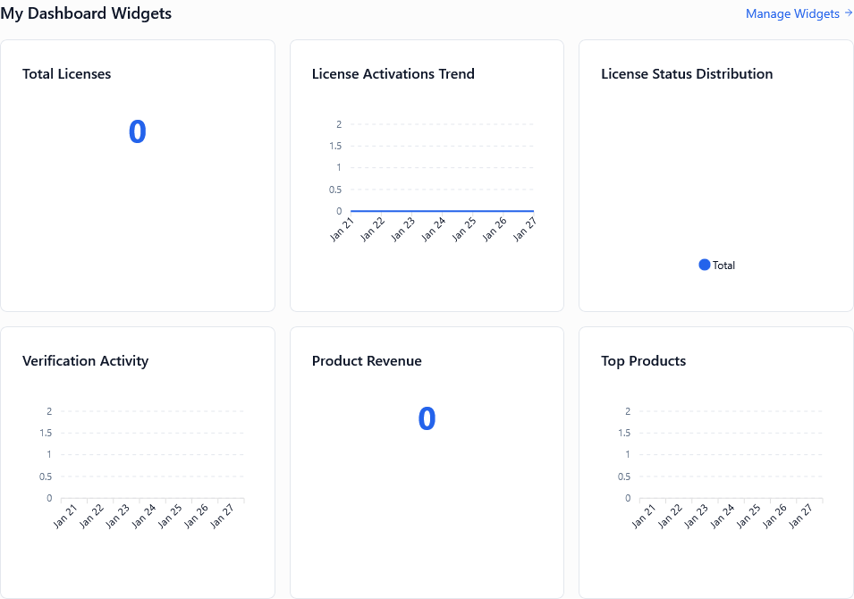
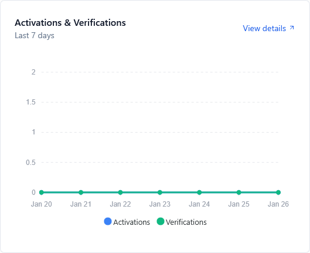
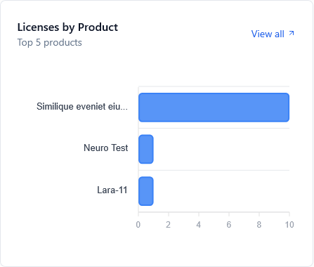
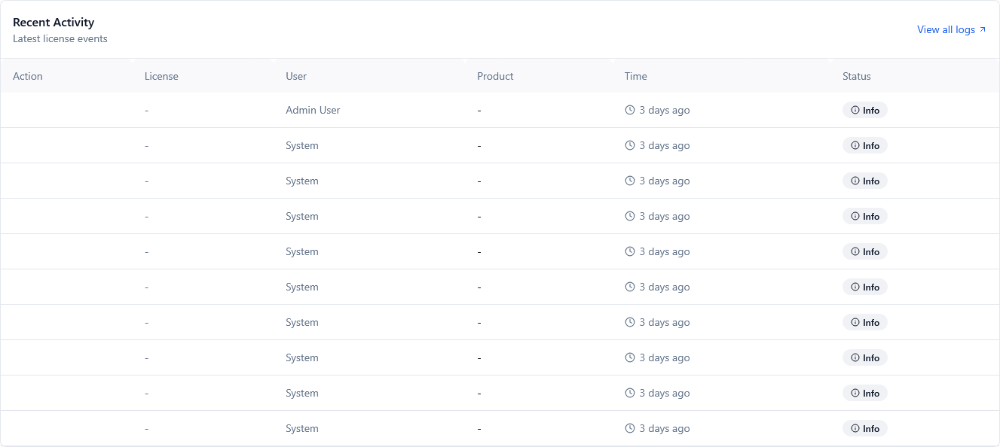

*Screenshot showing the complete dashboard with KPIs, charts, widgets, and activity feed*

---

## What Is This Page?

The **Admin Dashboard** is your central command center for the entire license management platform. It provides a **real-time operational overview** with key performance indicators (KPIs), trend charts, customizable widgets, and a live activity feed. Think of it as your "mission control" for monitoring system health, tracking business metrics, and quickly identifying issues that need attention.

This page is designed to give you maximum insight with minimal effort—everything you need to know about your licensing platform in one glance.

---

## When to Use This Page

### Primary Use Cases

1. **Daily Morning Review**: Start your day here to check overnight activity and system health
2. **Real-Time Monitoring**: Keep the dashboard open during business hours to track live metrics
3. **Incident Detection**: Quickly spot anomalies like failed verification spikes or activation drops
4. **Business Intelligence**: Track trends in license usage, product adoption, and customer activity
5. **Quick Navigation Hub**: Use quick action buttons to jump to common tasks

### Who Should Use This

- **Administrators**: Daily operational monitoring
- **Product Managers**: Track product performance and adoption
- **Support Teams**: Identify potential customer issues proactively
- **Business Owners**: Monitor revenue-related metrics and growth trends

---

## Page Components Overview

The dashboard is divided into **5 main sections**:

1. **KPI Cards** (4 metrics) - Top-level numbers with trend indicators
2. **Custom Widgets Section** - Your personalized data visualizations
3. **Activations & Verifications Chart** - 7-day trend line chart
4. **Licenses by Product Chart** - Horizontal bar chart showing distribution
5. **Recent Activity Table** - Live event stream with status indicators

---

## KPI Cards (Real-Time Metrics)


*Screenshot showing 4 KPI cards with numbers and trend arrows*

### What This Shows

The dashboard displays **4 critical KPI cards** across the top:

#### 1. Total Products

**Type**: Counter  
**Default Display**: Total count of all products configured in the system

**What It Means**:
- Shows how many products you're actively managing
- Includes products across all states (enabled and disabled)
- Environment-scoped (only counts products in current environment)

**Trend Indicator**:
- Green up arrow: You've added new products recently
- Red down arrow: Products have been deleted
- "No change": Product count is stable

💡 **Tip**: A growing product count is normal for expanding businesses. If it drops unexpectedly, check if products were accidentally deleted.

#### 2. Active Licenses

**Type**: Counter  
**Default Display**: Count of licenses in "Active" state only

**What It Means**:
- Licenses currently being used by customers
- Excludes: Available, Assigned (but not activated), Suspended, Expired, Revoked
- Most important metric for understanding actual platform usage

**Trend Indicator**:
- Shows percentage change vs. previous period (yesterday for daily view)
- Positive change = growth in active usage
- Negative change = licenses expiring, being revoked, or suspended

💡 **Tip**: Active licenses directly correlate with revenue. A downward trend needs investigation—check expiration dates and renewal rates.

#### 3. Activations Today

**Type**: Counter  
**Default Display**: Number of new activations created today (resets at midnight)

**What It Means**:
- How many devices/domains were activated today
- Includes first-time activations and re-activations
- Good indicator of product adoption velocity

**Trend Indicator**:
- Compares today vs. yesterday
- Useful for identifying daily patterns (weekdays vs. weekends)

💡 **Tip**: Sudden spikes might indicate a new customer onboarding or a product launch. Sudden drops might indicate technical issues preventing activations.

#### 4. Failed Verifications

**Type**: Counter (Alarm Metric)  
**Default Display**: License verification failures in last 24 hours

**What It Means**:
- How many license verification attempts failed
- Could indicate piracy attempts, expired licenses, or system misconfiguration
- Acts as an early warning system

**Trend Indicator**:
- Red up arrow: Increasing failures (investigate immediately)
- Green down arrow: Failures decreasing (good sign)

⚠️ **Warning**: A sudden spike (>50 failures) often indicates:
- Attempted license sharing or key leakage
- System clock issues on customer devices
- Expired licenses customers are still trying to use
- Potential piracy or cracking attempts

💡 **Tip**: Set up alerts in Settings > Webhooks to get notified when failed verifications exceed a threshold.

---

## Custom Widgets Section


*Screenshot showing grid of customizable data widgets*

### What This Shows

**Custom Widgets** allow you to add personalized data visualizations to your dashboard. Each admin can configure their own set of widgets based on what matters most to their role.

### Widget Types Available

| Widget Type | Description | Best For |
|-------------|-------------|----------|
| **Number** | Single large metric | KPIs, totals, counts |
| **Line Chart** | Trend over time | Usage patterns, growth |
| **Bar Chart** | Comparisons | Product distribution, regional data |
| **Pie Chart** | Proportions | Market share, category breakdown |

### How It Works

1. Widgets are created from the **Widgets** page
2. You define the data source (telemetry, licenses, products, etc.)
3. Widgets appear on your dashboard automatically
4. Each admin has their own widget configuration (not shared)
5. Widgets auto-refresh every 5 minutes (configurable)

### Managing Widgets

**To Add Widgets**:
1. Click **Manage Widgets** link in the widgets section
2. Browse available widget templates or create custom
3. Enable widgets you want on your dashboard
4. Drag to reorder by priority

**If No Widgets Configured**:
- Dashboard shows a helpful empty state
- Click **Browse Widgets** button to explore available options
- System provides pre-built templates for common metrics

💡 **Pro Tips**:
- Create separate widgets for each product to track individually
- Use line charts for trends, bar charts for comparisons
- Set appropriate time ranges (7 days, 30 days, 90 days)
- Export widget data as CSV for offline analysis
- Share widget configurations with team members

---

## Activations & Verifications Chart


*Screenshot showing dual-line chart with 7-day trend*

### What This Shows

**Type**: Dual-line chart  
**Time Range**: Last 7 days  
**Data Points**: Daily activations and verifications

This chart plots two critical metrics over time:

1. **Blue Line - Activations**: New device/domain activations per day
2. **Green Line - Verifications**: Successful license verifications per day

### How to Read This Chart

**Healthy Pattern**:
- Activations: Steady or gradually increasing
- Verifications: Significantly higher than activations (customers using licenses daily)
- Smooth curves without dramatic drops

**Warning Patterns**:
- Verifications dropping while activations stay constant = customers abandoning product
- Activations spiking without verification increase = activation fraud
- Both lines dropping = serious product or technical issue

### Example Scenarios

| Pattern | What It Means | Action |
|---------|---------------|--------|
| Activations flat, Verifications growing | Existing customers using product more | Good! Monitor retention |
| Both growing together | New customers + active usage | Excellent growth signal |
| Activations spike, Verifications flat | Activations may be fraudulent | Check for abuse patterns |
| Both dropping | Critical issue | Investigate immediately |

💡 **Analysis Tips**:
- Hover over data points to see exact numbers
- Look for day-of-week patterns (typically lower on weekends)
- Compare current week to previous weeks
- Export data by clicking **View Details** link

---

## Licenses by Product Chart


*Screenshot showing horizontal bar chart*

### What This Shows

**Type**: Horizontal bar chart  
**Data**: Top 5 products by license count  
**Sorting**: Highest to lowest count

This chart shows which products have the most licenses, helping you understand product adoption and resource allocation.

### How to Read This Chart

- **Longest bar**: Most popular product (highest license count)
- **Shortest bar**: Least popular among top 5
- **Missing products**: Products outside top 5 aren't shown

### Use Cases

1. **Product Performance**: Identify your best-sellers
2. **Resource Allocation**: Focus support on high-volume products
3. **Portfolio Management**: Consider retiring products with very low counts
4. **Capacity Planning**: Ensure high-volume products have sufficient generator capacity

### Example Analysis

```
Product A: ████████████████████ 1,250 licenses
Product B: ████████████ 750 licenses
Product C: ████████ 500 licenses
Product D: ████ 200 licenses
Product E: ██ 100 licenses
```

**Insights**:
- Product A dominates (43% of all licenses)
- Long tail: Products D & E might be candidates for consolidation
- Product B & C are healthy mid-tier offerings

💡 **Strategic Tips**:
- If distribution is too concentrated, diversify product portfolio
- Products with <50 licenses might not be economically viable
- Compare license counts to renewal rates for health score

---

## Recent Activity Table


*Screenshot showing activity table with status badges*

### What This Shows

**Type**: Live event table  
**Refresh**: Real-time (as events occur)  
**Limit**: Last 50 events  
**Columns**: Action, License, User, Product, Time, Status

This table provides a **live stream of significant events** happening across your platform.

### Column Descriptions

#### Action
The type of event that occurred:
- `License Activated` - New device/domain activation
- `License Assigned` - License assigned to customer
- `License Verified` - Successful verification attempt
- `License Revoked` - License manually revoked by admin
- `Product Created` - New product added
- `Contract Quota Used` - Contract-based license consumed

#### License
- Shows license key (truncated for security)
- Monospaced font for readability
- Click to view full license details
- Shows `-` if event not license-specific

#### User
- Customer email or admin username
- Shows who initiated the action
- Helps track user-specific activity

#### Product
- Product name the event relates to
- Links to product details page
- Shows `-` for system-wide events

#### Time
- Relative time format: "2 minutes ago", "1 hour ago"
- Updates automatically as time passes
- Hover for exact timestamp

#### Status
Badge indicators:
- 🟢 **Success** (Green): Normal successful operation
- 🔴 **Error** (Red): Failed operation requiring attention
- 🟡 **Warning** (Yellow): Completed but with warnings
- 🔵 **Info** (Blue): Informational event

### How to Use Activity Feed

**Monitoring Workflows**:
1. Watch for error badges - investigate immediately
2. Track customer activation patterns
3. Identify unusual activation spikes
4. Monitor admin actions for audit purposes

**Common Patterns**:
- Morning activation surge: Normal customer behavior
- Multiple activations same user: May indicate device testing
- Many errors in sequence: System or product issue
- Late-night admin actions: Verify legitimate access

⚠️ **Security Monitoring**:
- Activations from unexpected geographies
- Rapid successive activations (bot behavior)
- Failed verifications followed by successful ones (brute force attempt)
- Admin actions during off-hours

💡 **Tips**:
- Use **View All Logs** link for advanced filtering
- Set up webhook notifications for critical events
- Export activity data for compliance audits
- Activity feed is environment-scoped automatically

---

## Quick Action Buttons

Located in the page header, these buttons provide fast access to common tasks:

### View All Licenses
- Opens main Licenses page
- Shows all licenses across all states
- Use when you need to search/filter licenses

### New License
- Opens license creation form
- Quick way to manually create a single license
- Bypasses bulk generation workflow

💡 **Tip**: For creating multiple licenses, use Generators page instead of "New License" button.

---

## Common Workflows

### Morning Health Check (2 minutes)

1. Open dashboard
2. Scan KPI cards for anomalies (check red/green arrows)
3. Review failed verifications - investigate if >20
4. Check activity feed for errors (red badges)
5. Glance at charts for unusual patterns
6. Note any action items for follow-up

### Real-Time Issue Detection

1. Keep dashboard visible on second monitor
2. Watch for failed verification spikes
3. Monitor activity feed for error bursts
4. Set browser tab to auto-refresh every 60 seconds
5. Configure webhooks for proactive alerts

### Weekly Business Review

1. Export activation trends chart data
2. Compare product distribution vs. last week
3. Calculate activation-to-verification ratios
4. Identify products needing attention
5. Share insights with product/business teams

---

## ✅ Best Practices

### For Administrators

- ✅ **Start every day on the dashboard** - Make it your default landing page
- ✅ **Set realistic KPI baselines** - Know what's "normal" for your business
- ✅ **Configure custom widgets** - Personalize for your responsibilities
- ✅ **Monitor failed verifications daily** - Early warning system for issues
- ✅ **Review trends weekly** - Spot patterns before they become problems

### For Product Managers

- ✅ **Track product-specific widgets** - Create one widget per product
- ✅ **Compare activation rates** - Identify which products need marketing push
- ✅ **Monitor verification ratios** - High verification = engaged users
- ✅ **Export data regularly** - Share insights with stakeholders

### For Support Teams

- ✅ **Watch activity feed during business hours** - Proactive issue detection
- ✅ **Note failed verification patterns** - Anticipate support tickets
- ✅ **Track error rates by product** - Identify problem products early
- ✅ **Document recurring issues** - Build knowledge base

---

## 💡 Tips & Tricks

### Performance Tips

- **Browser Tab Title**: Shows "Dashboard" - easy to find among many tabs
- **Keyboard Navigation**: Use `Ctrl+K` (Cmd+K on Mac) to quickly return to dashboard
- **Auto-Refresh**: Keep page open; data refreshes automatically every 5 minutes
- **Bookmark**: Set as browser home page for instant access

### Data Analysis Tips

- **Trend Context**: Always compare current metrics to historical averages
- **Seasonal Patterns**: B2B products often have higher activations on weekdays
- **Time Zones**: Activity feed shows times in your local timezone
- **Export Everything**: Charts have "View Details" links for deeper analysis

### Customization Tips

- **Widget Priority**: Put most critical widgets in top-left position
- **Color Coding**: Use consistent colors across widgets (blue=activations, green=revenue)
- **Refresh Rates**: Set high-priority widgets to refresh every minute
- **Mobile Access**: Dashboard is responsive and works on tablets

---

## ❗ Troubleshooting

### KPI Cards Showing Zero or Old Data

**Symptoms**: Cards show "0" or data hasn't updated in hours

**Causes**:
- Dashboard service not running
- Database connection issues
- Caching problems

**Solutions**:
1. Hard refresh: `Ctrl+F5` (Windows) or `Cmd+Shift+R` (Mac)
2. Clear browser cache and cookies
3. Check Settings > General to verify system is operational
4. Contact support if issue persists after 5 minutes

---

### Charts Display "No Data Available"

**Symptoms**: Line or bar charts show empty state message

**Causes**:
- Brand new system with no historical data
- Data collection not enabled
- Time range filter excluding all data
- Environment mismatch

**Solutions**:
1. **New System**: Wait 24 hours for data to accumulate
2. **Enable Telemetry**: Go to Settings > Telemetry > Enable telemetry collection
3. **Check Environment**: Ensure you're viewing correct environment (production/staging/development)
4. **Adjust Time Range**: Charts show last 7 days - if system is newer, adjust range
5. **Verify Products**: Ensure products are configured and sending data

---

### Widgets Not Appearing

**Symptoms**: "No Widgets on Your Dashboard" message displays

**Causes**:
- No widgets created yet
- Widgets disabled
- Widgets assigned to different environment

**Solutions**:
1. Click **Browse Widgets** button
2. Create or enable at least one widget
3. Verify widget's environment matches current environment
4. Check widget "Enabled" toggle is ON
5. Refresh page after enabling widgets

---

### Activity Feed Shows "No Recent Activity"

**Symptoms**: Activity table is empty

**Causes**:
- New system with no events yet
- Logging disabled
- Database retention policy purged old logs
- Environment has no activity

**Solutions**:
1. **New System**: Create test license to generate activity
2. **Enable Logging**: Settings > Logging > Enable activity logging
3. **Check Environment**: Switch to production if you're in staging/dev
4. **Generate Activity**: Perform actions (create license, activate, etc.)
5. **Wait 30 seconds**: Activity feed refreshes every 30 seconds

---

### Failed Verifications Spike Suddenly

**Symptoms**: Failed Verifications KPI suddenly jumps to high number (>100)

**Causes**:
- License key leakage (shared publicly)
- System clock issues on customer devices
- Mass license expiration event
- DDoS or abuse attempt
- Product configuration error

**Solutions**:
1. **Identify Pattern**: Check Recent Activity for error details
2. **Check Specific Licenses**: Go to Licenses page, filter by product
3. **Review Abuse Detection**: Settings > Abuse Detection > Check suspended licenses
4. **Inspect Telemetry**: Check if failures are from same IP range
5. **Contact Affected Customers**: Email customers with expiring licenses
6. **Enable Auto-Suspend**: Settings > Abuse Detection if not already enabled

**Prevention**:
- Set up webhook alerts for verification failure threshold (e.g., >50/hour)
- Enable abuse detection with appropriate thresholds
- Implement proper key rotation strategy
- Use hardware binding where possible

---

### Performance Issues (Slow Loading)

**Symptoms**: Dashboard takes >5 seconds to load

**Causes**:
- Large dataset (>100k licenses)
- Many custom widgets (>10)
- Unoptimized widgets with complex queries
- Server resource constraints

**Solutions**:
1. **Reduce Widgets**: Disable widgets you don't actively use
2. **Optimize Time Ranges**: Use shorter ranges (7 days vs. 90 days)
3. **Check Server Resources**: Verify adequate CPU/RAM allocation
4. **Database Optimization**: Run maintenance tasks (contact support)
5. **Limit Activity Feed**: Reduce visible rows in Recent Activity table

---

## Environment Awareness

⚠️ **Important**: The dashboard is **environment-scoped**. All data shown is for the **currently selected environment** only.

### Environment Selector

- Located in top navigation bar
- Options: Production, Staging, Development
- KPIs, charts, and activity feed all filter to selected environment
- Widgets are environment-specific (production widgets don't appear in staging)

### Use Cases by Environment

**Production**:
- Real customer data and revenue metrics
- Monitor for production incidents
- Track actual business KPIs

**Staging**:
- Pre-release testing and validation
- QA team monitoring
- Safe environment for experiments

**Development**:
- Local testing and debugging
- Development team use only
- Minimal or synthetic data

💡 **Tip**: Keep production and staging in separate browser profiles to avoid accidental actions in wrong environment.

---

## Security Considerations

### Data Visibility

- Dashboard shows aggregate data only (no PII)
- License keys are truncated in activity feed
- Customer emails visible only to admins with appropriate permissions

### Admin Audit Trail

- All dashboard views are logged
- Widget changes are tracked
- KPI exports are recorded for compliance

### Access Control

- Dashboard requires active admin session
- Auto-locks after 30 minutes of inactivity
- IP restrictions apply (if configured in Settings)

---

## How to Access

### Primary Navigation

1. Log in to Admin Portal with admin credentials
2. Dashboard is the **default landing page** after login
3. Or click **Dashboard** in left sidebar navigation

### Keyboard Shortcuts

- **Ctrl+K** (Windows) or **Cmd+K** (Mac): Open global search → type "Dashboard"
- **Alt+D** (Windows) or **Option+D** (Mac): Direct shortcut to dashboard (if configured)

### URL Access

Direct URL: `https://your-domain.com/admin/dashboard` (requires authentication)

---

## Related Pages

- [Widgets]() - Create and manage custom dashboard widgets
- [Telemetry]() - View detailed telemetry data feeding dashboard charts
- [Logs]() - Full activity log with advanced filtering (feeds Recent Activity)
- [Products]() - Manage products shown in dashboard charts
- [Licenses]() - View detailed license data behind KPI cards
- [Settings]() - Configure dashboard behavior and data collection
- [Profile]() - Customize your personal dashboard preferences

---

## FAQ

### Q: Can I customize which KPIs appear in the top cards?

**A**: The 4 main KPI cards are standard and cannot be changed. However, you can create custom widgets to display any metrics you want. Go to Widgets page to create number-type widgets for additional KPIs.

---

### Q: How often does dashboard data refresh?

**A**: 
- KPI cards: Every 5 minutes automatically
- Charts: Every 5 minutes automatically
- Activity feed: Every 30 seconds
- Custom widgets: Configurable per widget (1-60 minutes)
- Manual refresh: Use browser refresh (F5) anytime

---

### Q: Can multiple admins have different dashboard configurations?

**A**: Yes! Each admin has their own **personal widget configuration**. Your widgets don't affect other admins' dashboards. KPI cards, charts, and activity feed are the same for all admins.

---

### Q: What's the difference between Dashboard and Telemetry page?

**A**: 
- **Dashboard**: High-level overview with KPIs, trends, and activity (operational monitoring)
- **Telemetry**: Detailed granular data with filtering and export (deep analysis)

Use Dashboard for daily monitoring; use Telemetry for investigations and detailed analysis.

---

### Q: Can I export dashboard data?

**A**: Yes, in multiple ways:
- Click "View Details" on charts to access export options
- Click "View All Logs" for activity export
- Go to individual pages (Licenses, Products, etc.) for full exports
- Custom widgets have individual export buttons

---

### Q: Why don't I see any widgets on my dashboard?

**A**: Widgets are opt-in. You must create or enable them first:
1. Click **Browse Widgets** button on dashboard
2. Choose from pre-built templates or create custom
3. Enable widgets you want on your dashboard
4. Return to dashboard to see them

---

### Q: What does "Environment-Scoped" mean?

**A**: All dashboard data is filtered to the **currently selected environment** (production, staging, or development). If you switch environments, all numbers, charts, and activity will change to reflect that environment's data only. This prevents mixing production and staging data.

---

### Q: How far back does the "Recent Activity" table go?

**A**: Shows last **50 events** regardless of time. For older events or advanced filtering, click **View All Logs** to access the full Logs page with date range filtering and search.

---

### Q: Can I embed dashboard charts in external tools?

**A**: Not directly, but you can:
- Export chart data as CSV
- Use API endpoints to fetch raw data
- Create webhooks to push data to external systems
- Take screenshots for presentations

For programmatic access, see API Documentation.

---

## Summary

The Dashboard is your **operational command center** providing:

| Component | Purpose | Update Frequency |
|-----------|---------|------------------|
| **KPI Cards** | Top-level health metrics | 5 minutes |
| **Custom Widgets** | Personalized visualizations | Configurable |
| **Trend Charts** | 7-day patterns | 5 minutes |
| **Product Distribution** | License allocation | 5 minutes |
| **Activity Feed** | Live event stream | 30 seconds |

**Pro Tip**: Start every day here, keep it open on a second monitor, and configure widgets that matter to your role for maximum efficiency.
