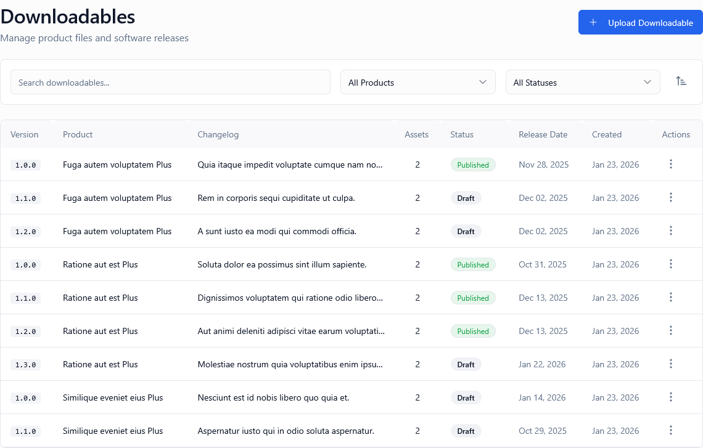

*Screenshot of Downloadables page showing product files and releases*

---

## What Is This Page?

The **Downloadables** page manages product files and software releases that customers can download. Upload installers, binaries, updates, documentation, or any files related to your products.

---

## When to Use This Page

* **Upload new product versions** — Release updates, patches, or major versions
* **Manage software installers** — Windows .exe, Mac .dmg, Linux packages
* **Provide documentation** — PDFs, user manuals, API docs
* **Distribute assets** — Themes, plugins, templates, resources
* **Control access** — Publish or unpublish releases
* **Organize by product** — Each downloadable is linked to a specific product

---

## What You Can Do Here

### 1. View All Downloadables

| Column | Description |
|--------|-------------|
| **Version** | Release version (e.g., "1.0.0", "2.5.3", "v3.0-beta") |
| **Product** | Which product this file belongs to |
| **Changelog** | Brief description of changes/features |
| **Assets** | Number of files (e.g., "3 files" for Windows/Mac/Linux) |
| **Status** | Published (customers can download) or Draft (hidden) |
| **Release Date** | When version was released |
| **Actions** | Edit, Download, Delete |

### 2. Search & Filter

* **Search:** By version or changelog text
* **Product Filter:** Show downloadables for specific product
* **Status Filter:** All, Published, Draft
* **Sort:** Version, Product, Status, Release Date, Created

### 3. Upload Downloadable

1. Click **"Upload Downloadable"** button
2. Fill in:
   - **Product** — Select from dropdown
   - **Version** — Semantic versioning (e.g., 1.0.0)
   - **Changelog** — What's new in this version
   - **Release Date** — When version is officially released
   - **Status** — Draft (prepare first) or Published (available immediately)
   - **Files** — Upload 1+ files (exe, dmg, zip, tar.gz, pdf, etc.)
3. Each file can have:
   - **File Type** — Installer, Update, Documentation, Source Code, Other
   - **Platform** — Windows, macOS, Linux, Android, iOS, Web, All
   - **Architecture** — x64, ARM, Universal, or leave blank
4. Click **Save**
5. Files are uploaded to S3 storage
6. Customers access via [Client Portal > Downloads](../../client-portal/downloads)

### 4. Edit Downloadable

* Update version, changelog, or release date
* Add or remove files
* Change status (Draft ↔ Published)
* **Note:** Editing creates new version—old downloads remain accessible

### 5. Delete Downloadable

* Permanently removes downloadable and all associated files from S3
* Customers can no longer download these files
* **Warning:** Cannot be undone

---

## File Storage & Access

**Where Files Are Stored:** AWS S3 or S3-compatible storage (configured in [Settings > S3](../settings))

**File Access Control:**
* Customers with active licenses can download published files
* Files are served via **signed URLs** (expires after time limit)
* No direct S3 access (files are private)

**File Size Limits:**
* Max per file: Configured in system settings (default 2GB)
* Total storage: Limited by your S3 bucket size

**Supported File Types:** Any file type allowed (.exe, .dmg, .zip, .tar.gz, .pdf, .apk, .ipa, etc.)

---

## Common Workflows

### Workflow 1: Release New Version

**Scenario:** Releasing version 2.0.0 with Windows and Mac installers.

**Steps:**
1. Click **Upload Downloadable**
2. Select Product
3. Version: `2.0.0`
4. Changelog: "Major update: New UI, Performance improvements, Bug fixes"
5. Release Date: Today's date
6. Status: **Draft** (test first)
7. Upload Files:
   - File 1: `MyApp-2.0.0-Windows-x64.exe` → Type: Installer, Platform: Windows, Arch: x64
   - File 2: `MyApp-2.0.0-macOS-Universal.dmg` → Type: Installer, Platform: macOS, Arch: Universal
8. Save
9. Test downloads in [Client Portal](../../client-portal/downloads) (admin view)
10. Once verified, Edit and change Status to **Published**
11. Announce release to customers via email

### Workflow 2: Hotfix Release

**Scenario:** Critical bug requires urgent patch.

**Steps:**
1. Quick upload (Version: 2.0.1)
2. Changelog: "Critical bugfix: Resolved crash on startup"
3. Status: **Published** immediately
4. Upload files
5. Save
6. Customers see new version instantly in Client Portal
7. Send notification via email or in-app

### Workflow 3: Beta Testing

**Scenario:** Want testers to try new version before public release.

**Steps:**
1. Upload as Draft (Version: 3.0.0-beta)
2. Share direct download link with testers
3. Collect feedback
4. Make changes, upload new beta (3.0.0-beta2)
5. Once stable, upload final version (3.0.0) as Published
6. Delete or unpublish beta versions

---

## Best Practices

* **Use semantic versioning** (MAJOR.MINOR.PATCH) for clarity
* **Write detailed changelogs** (customers need to know what changed)
* **Test downloads before publishing** (verify files work)
* **Use Draft status** for pre-release preparation
* **Archive old versions** (don't delete—customers may need them)
* **Organize files by platform** (makes customer experience better)
* **Set accurate release dates** (helps with analytics)
* **Compress large files** (faster downloads, lower bandwidth costs)

---

## Troubleshooting

**Problem:** File upload fails

**Solution:** Check file size (may exceed limit). Verify S3 credentials in [Settings > S3](../settings). Check internet connection. Try smaller file or compress.

**Problem:** Customers can't download files

**Solution:** Verify status is Published. Check S3 bucket permissions (files must be private, but system needs read access). Verify signed URL generation works. Check [Logs](../logs) for errors.

**Problem:** Old version disappeared from list

**Solution:** May be filtered (check Product filter or Status filter). If deleted by mistake, cannot be recovered (restore from S3 backup if you have one).

---

## Related Pages

* [Products](../products) — Manage products that downloadables belong to
* [Client Portal > Downloads](../../client-portal/downloads) — Customer view
* [Settings > S3](../settings) — Configure file storage

---

## How to Access

**Navigation:** Admin Portal → **Downloadables**
**URL:** `/admin/downloadables`
**Shortcut:** `Ctrl+K` / `Cmd+K` → type "downloadables"
