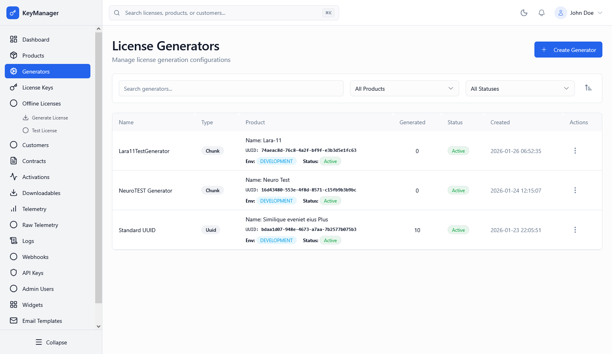
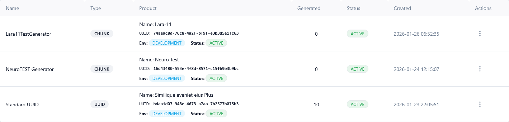
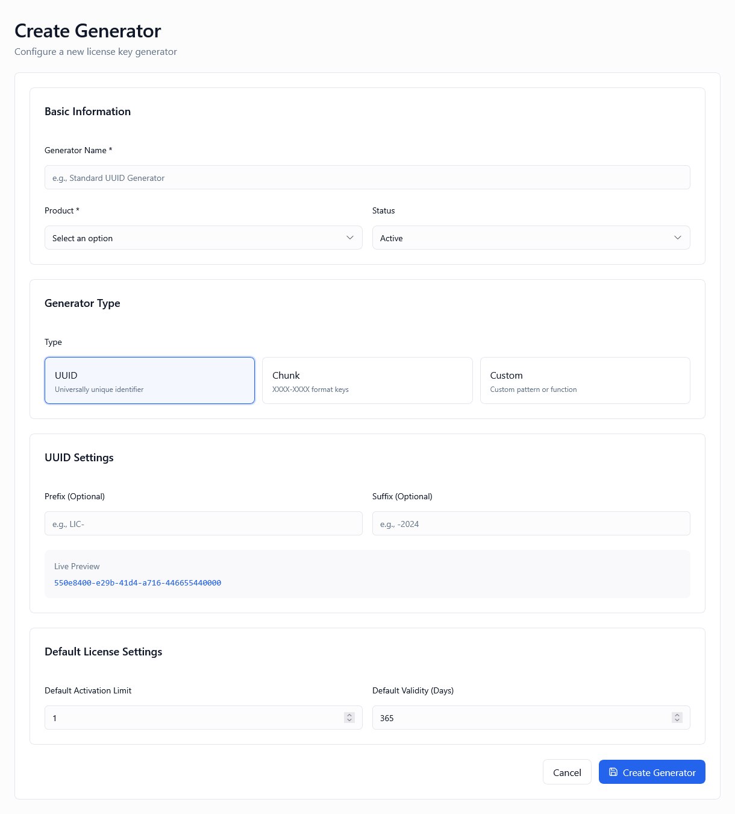
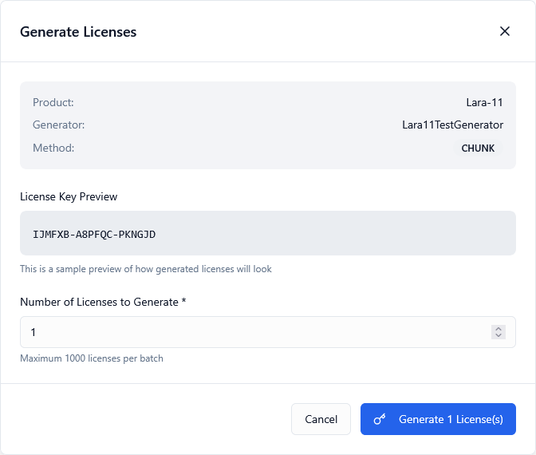
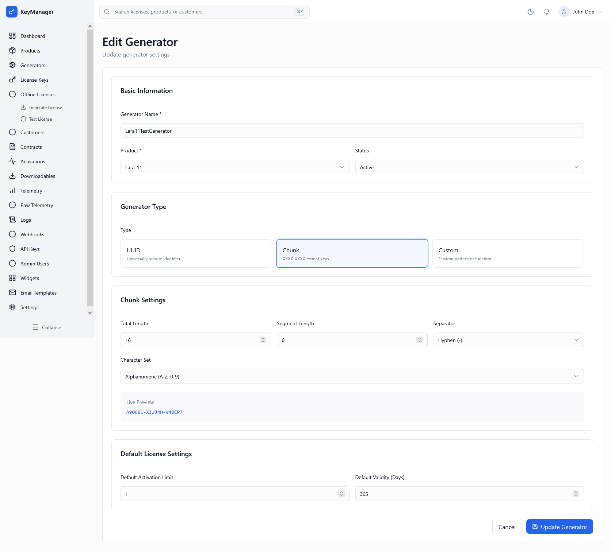
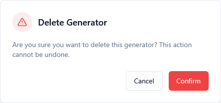

*Screenshot of the License Generators page showing the list view with search, filters, and action buttons*

---

## What Is This Page?

The **License Generators** page is where you define and manage the configurations that control how license keys are created for your products. Each generator acts as a template that determines:

* The **format** of generated license keys (UUID, chunk-based, or custom)
* The **activation limits** and validity rules
* Product-specific **feature flags** and metadata
* The **environment** (production, staging, development) where licenses are valid

Think of generators as "license key factories" — each one is configured once and then used repeatedly to produce licenses with consistent formatting and rules.

---

## When to Use This Page

You'll use the License Generators page when you need to:

* **Set up a new product** — Create a generator before you can issue licenses
* **Change license key formats** — Update how your license keys look (e.g., from UUIDs to chunk-based keys)
* **Adjust activation limits** — Modify how many times a license can be activated
* **Configure feature flags** — Add or update JSON-based feature toggles for licenses
* **Generate licenses in bulk** — Create 1–1000 licenses at once using a specific generator
* **Audit generator usage** — See how many licenses have been generated by each generator

💡 **Tip:** Create separate generators for different product tiers (e.g., "Basic", "Pro", "Enterprise") even if they're for the same product. This makes license management and reporting easier.

---

## What You Can Do Here

### 1. View All Generators

The main table displays all generators configured for your current environment with the following information:

| Column | Description |
|--------|-------------|
| **Name** | Human-readable generator identifier (e.g., "Pro Plan Generator") |
| **Type** | Generator method: `uuid`, `chunk`, or `custom` |
| **Product** | Associated product name, UUID, environment, and status |
| **Generated** | Total count of licenses created using this generator |
| **Status** | `active` (can generate licenses) or `inactive` (disabled) |
| **Created** | Timestamp when the generator was first created |
| **Actions** | Quick access menu (Generate, Edit, Delete) |


*The generators table with sortable columns and status badges*

---

### 2. Search and Filter Generators

#### Search Bar
Type to search across:
* Generator name
* Generator description
* Associated product name

**Example:** Searching "Pro" shows all generators related to "Pro Plan" products.

#### Product Filter
Filter generators by associated product:
* **All Products** (default) — Show generators for all products
* **[Product Name]** — Show only generators for a specific product

💡 **Tip:** Use the product filter when you have multiple generators per product (e.g., trial, standard, premium versions).

#### Status Filter
Filter by generator status:
* **All Statuses** (default) — Show active and inactive generators
* **Active** — Only show generators that can create licenses
* **Inactive** — Only show disabled generators

⚠️ **Note:** Inactive generators cannot generate new licenses but existing licenses remain valid.


*Search bar and filter dropdowns for finding generators quickly*

---

### 3. Sort Generators

Click the **Sort** icon (top-right) to open the sort modal with these options:

**Sort By:**
* **Name** — Alphabetically by generator name
* **Type** — By generator type (chunk, custom, uuid)
* **Product** — By associated product
* **Generated** — By number of licenses created (useful for finding most-used generators)
* **Status** — By active/inactive status
* **Created** — By creation date (newest or oldest first)

**Order:**
* **Ascending** (A→Z, 0→9, oldest→newest)
* **Descending** (Z→A, 9→0, newest→oldest)

💡 **Tip:** Sort by "Generated" (descending) to identify your most popular license types.


*The sort modal with field and order selection*

---

### 4. Create a New Generator

Click the **Create Generator** button (top-right) to set up a new license key template.

**Required Information:**
* **Name** — Descriptive identifier (e.g., "Enterprise Monthly Plan")
* **Product** — Which product this generator belongs to
* **Type** — How license keys are formatted (see Generator Types below)
* **Status** — Active (can generate licenses) or Inactive (disabled)

**Optional Settings:**
* **Description** — Internal notes about this generator's purpose
* **Activation Limits** — Maximum number of devices/installations per license
* **Validity Period** — How long licenses remain active (days, months, years, or lifetime)
* **Feature Flags** — JSON object defining enabled features
* **Metadata Template** — Default metadata applied to all generated licenses


*The generator creation form with all configuration options*

---

### 5. Generator Types

#### UUID-Based (Standard UUID v4)

**Description:** Generates licenses using universally unique identifiers (36 characters).

**Format Example:**
```
a3f2c5b7-1234-5678-abcd-ef0123456789
```

**When to Use:**
* You want maximum uniqueness (collision-resistant)
* License format doesn't matter to end users
* You're integrating with systems that expect UUIDs

**Configuration Options:**
* Prefix (optional) — Add text before the UUID
* Suffix (optional) — Add text after the UUID

**✅ Best Practice:** UUID generators are the safest default choice for new products.

---

#### Chunk-Based (Formatted Segments)

**Description:** Generates licenses in readable segments separated by a delimiter.

**Format Example:**
```
ABCD-EFGH-1234-5678
XXXX-XXXX-XXXX-XXXX-XXXX
PRO-2024-AXBF-QW12
```

**When to Use:**
* Users need to type licenses manually (no copy-paste)
* You want branded or human-readable license keys
* Marketing prefers specific formatting

**Configuration Options:**
* **Length** — Total characters (excluding separators)
* **Segment Length** — Characters per segment (e.g., 4 for "XXXX")
* **Separator** — Delimiter between segments (usually `-`, `_`, or `.`)
* **Prefix** — Optional text at the start (e.g., "PRO-")
* **Suffix** — Optional text at the end (e.g., "-2024")
* **Character Set** — Allowed characters (alphanumeric, uppercase, etc.)

**Example Configuration:**
| Setting | Value | Result |
|---------|-------|--------|
| Length | 16 | 16 random characters |
| Segment Length | 4 | Grouped in sets of 4 |
| Separator | `-` | Segments joined with hyphens |
| Prefix | `PRO-` | Starts with "PRO-" |
| Result | | `PRO-ABCD-EFGH-1234-5678` |

**✅ Best Practice:** Use segment length of 4–5 characters for easy manual entry. Avoid ambiguous characters (0/O, 1/I, 5/S).

---

#### Custom (User-Defined Logic)

**Description:** Generates licenses using a custom algorithm or external service.

**Format Example:**
```
CUSTOM-[your-logic]-SUFFIX
ENT-20240115-ABC123XYZ-V2
```

**When to Use:**
* You have specific business rules for license formatting
* You're migrating from a legacy licensing system
* You need to integrate with third-party license generation

**Configuration Options:**
* **Custom Function** — PHP/Laravel code or API endpoint
* **Prefix** — Optional text at the start
* **Suffix** — Optional text at the end
* **Validation Rules** — Regex or custom validation logic

⚠️ **Warning:** Custom generators require code deployment. Test thoroughly before using in production.

**❗ Important:** Custom generators must return unique values and handle collision detection.

---

### 6. Generate Licenses in Bulk

From the **Actions** menu (⋮) for any generator, click **Generate Licenses** to open the bulk generation modal.


*The license generation modal showing product, generator, and preview information*

**Modal Sections:**

#### Generator Info (Read-Only)
* **Product** — Product name
* **Generator** — Generator name
* **Method** — Generator type (uuid, chunk, custom)

#### License Key Preview
Shows a sample of how generated licenses will look. Refresh the modal to see different previews.

💡 **Tip:** Use the preview to verify your generator configuration before creating hundreds of licenses.

#### Number of Licenses to Generate
* **Input:** Number between 1 and 1,000
* **Limit:** Maximum 1,000 licenses per batch
* **Validation:** Real-time error checking

**How It Works:**

1. Enter desired quantity (e.g., 100)
2. Click **Generate [X] License(s)**
3. System creates licenses in the background
4. Success/error notification appears
5. Generator's "Generated" counter increments
6. New licenses appear on the License Keys page with status `available`

**✅ Best Practices:**
* Generate licenses in batches of 100–500 for best performance
* For larger quantities (5,000+), run multiple batches
* Always check the preview before generating
* Monitor the Background Jobs page for batch progress

**❗ Important:** Generated licenses start with status `available` and must be assigned to customers before activation.

---

### 7. Edit a Generator

From the **Actions** menu (⋮), click **Edit** to modify an existing generator.

**Editable Fields:**
* Name, description, and status
* Activation limits and validity period
* Feature flags and metadata template

**Non-Editable Fields:**
* Generator type (uuid/chunk/custom)
* Associated product
* Environment

⚠️ **Warning:** Changing activation limits or validity periods only affects **new** licenses. Existing licenses retain their original settings.

💡 **Tip:** If you need to change the generator type, create a new generator instead of editing.


*The generator edit form with pre-populated values*

---

### 8. Delete a Generator

From the **Actions** menu (⋮), click **Delete** to remove a generator.

**Confirmation Required:** A modal appears asking you to confirm deletion.

**What Happens:**
* The generator is permanently removed
* **Existing licenses** generated by this generator **remain valid**
* You **cannot** generate new licenses from this generator
* Deletion is logged in the audit trail

**When to Delete:**
* The generator was created by mistake
* The associated product is deprecated
* You're consolidating multiple generators into one

**When NOT to Delete:**
* Active licenses are still using this generator (mark it inactive instead)
* You might need historical reference (mark it inactive instead)

❗ **Important:** Deletion is permanent and cannot be undone. Consider marking the generator as "inactive" instead if you're unsure.


*The deletion confirmation dialog*

---

## How It Works

### Generator Lifecycle

```
1. Create Generator
   ↓
2. Configure Format & Rules
   ↓
3. Generate Licenses (1–1000 per batch)
   ↓
4. Licenses Created with Status "Available"
   ↓
5. Assign Licenses to Customers
   ↓
6. Customers Activate Licenses
   ↓
7. (Optional) Edit Generator Settings
   ↓
8. (Optional) Mark Inactive or Delete
```

---

### Environment Scoping

**Critical Concept:** Generators are **environment-scoped**. This means:

* A generator created in **production** only generates licenses for **production**
* A generator created in **staging** only generates licenses for **staging**
* You cannot generate production licenses from a staging generator (and vice versa)

**Why This Matters:**
* Prevents accidental production license creation during testing
* Allows safe experimentation in development/staging
* Enforces data isolation between environments

**✅ Best Practice:** Create identical generators in each environment (dev, staging, production) for consistent testing.

---

### License Key Uniqueness

**How the System Ensures Uniqueness:**

1. **UUID Generators:** Mathematically unique (1 in 2^122 collision probability)
2. **Chunk Generators:** Database check before insertion (retries if collision detected)
3. **Custom Generators:** Your custom logic must handle uniqueness

**What Happens on Collision:**
* System automatically retries generation (up to 3 times)
* If all retries fail, an error is returned
* Failed licenses are logged for investigation

**❗ Important:** Keep chunk generators' length sufficient (minimum 12 characters recommended) to avoid frequent collisions.

---

### Generator Performance

**Generation Speed:**

| Quantity | Typical Duration | Method |
|----------|-----------------|---------|
| 1–10 | Instant (< 1 second) | Synchronous |
| 11–100 | 1–5 seconds | Synchronous |
| 101–1000 | 5–30 seconds | Background job |
| 1000+ | Use multiple batches | Background jobs |

💡 **Tip:** For large quantities (10,000+), generate in batches of 500–1000 over time rather than all at once.

---

## Common Use Cases

### Use Case 1: Setting Up a New Product

**Scenario:** You're launching a new SaaS product with Basic, Pro, and Enterprise tiers.

**Steps:**
1. Create the product on the Products page
2. Create 3 generators:
   * **Basic Plan Generator** — Limited activations, 1-year validity
   * **Pro Plan Generator** — More activations, lifetime validity, extra features
   * **Enterprise Generator** — Unlimited activations, custom metadata
3. Configure feature flags for each tier (JSON):
   ```json
   {
     "max_users": 5,
     "api_access": false,
     "priority_support": false
   }
   ```
4. Generate initial license pool (e.g., 100 licenses per tier)
5. Assign licenses to customers as they purchase

---

### Use Case 2: Migrating from Legacy License Format

**Scenario:** Your old system used 12-character keys like `ABCD1234WXYZ`, but you want UUID-based keys going forward.

**Steps:**
1. Create a **new UUID generator** for new customers
2. Keep the **old chunk generator inactive** (don't delete)
3. Gradually assign new customers UUID licenses
4. Existing customers keep their original licenses
5. After 1 year, consider migrating old customers (with notification)

💡 **Tip:** Run both generators in parallel during the migration period to avoid disrupting existing users.

---

### Use Case 3: Seasonal or Promotional Licenses

**Scenario:** You want to create limited-time licenses for a Black Friday sale.

**Steps:**
1. Create a new generator named "Black Friday 2024 Promo"
2. Set validity period to **90 days** (shorter than regular licenses)
3. Set status to **Active**
4. Generate promotional licenses
5. After the sale, mark generator as **Inactive**
6. Licenses remain valid for 90 days but no new ones can be created

---

### Use Case 4: Trial vs. Paid License Differentiation

**Scenario:** You want trial licenses to be clearly distinguishable from paid licenses.

**Steps:**
1. **Trial Generator:**
   * Prefix: `TRIAL-`
   * Validity: 14 days
   * Feature flags: `{ "trial": true, "max_projects": 1 }`
   
2. **Paid Generator:**
   * No prefix (clean UUID)
   * Validity: Lifetime
   * Feature flags: `{ "trial": false, "max_projects": 100 }`

This makes it obvious in your license list which licenses are trials.

---

## Tips & Tricks

### 💡 Naming Conventions
* Use descriptive names: `Enterprise-Annual-2024` instead of `Generator1`
* Include tier and period: `Pro-Monthly`, `Basic-Lifetime`
* Add environment suffix in dev/staging: `Pro-Monthly-DEV`

### 💡 Feature Flag Best Practices
* Keep feature flags flat (avoid deep nesting)
* Use consistent key names across generators
* Document flag meanings in the generator description
* Example structure:
  ```json
  {
    "tier": "pro",
    "max_devices": 5,
    "api_access": true,
    "priority_support": true,
    "analytics": true
  }
  ```

### 💡 Activation Limits
* **Unlimited (-1):** Use for enterprise or server licenses
* **1–3:** Suitable for personal use software
* **5–10:** Good for small team products
* **25+:** Consider seat-based licensing instead

### 💡 Batch Generation Strategy
* Generate licenses **before** you need them (overnight batches)
* Keep a buffer of 50–100 unassigned licenses per product
* Monitor "Generated" counts to predict when to create more

### 💡 Archival Strategy
* Don't delete old generators (mark inactive instead)
* Generators serve as historical documentation
* Future audits may need to reference old generator configs

---

## Troubleshooting

### ❗ Problem: "Failed to generate licenses"

**Possible Causes:**
* Generator is inactive
* Product is inactive
* Database connection issue
* Custom generator logic error

**Solutions:**
1. Check generator status (must be "active")
2. Verify product status on Products page
3. Check Background Jobs page for error details
4. Review logs for specific error messages

---

### ❗ Problem: Duplicate license keys generated

**Possible Causes:**
* Chunk generator length too short
* Custom generator not checking uniqueness
* Race condition during bulk generation

**Solutions:**
1. Increase chunk length to 16+ characters
2. Update custom generator to query existing licenses
3. Reduce batch size (use 100–500 instead of 1000)
4. Contact support if duplicates persist

---

### ❗ Problem: Generated licenses don't appear in License Keys page

**Possible Causes:**
* Wrong environment selected
* Licenses generated in background job (not instant)
* Database sync delay

**Solutions:**
1. Verify you're viewing the correct environment
2. Check Background Jobs page for completion status
3. Refresh the License Keys page after 30 seconds
4. Filter by status "Available" on License Keys page

---

### ❗ Problem: Cannot edit generator type

**Why:** Generator type is immutable once created (data integrity protection).

**Solution:** Create a new generator with the desired type and mark the old one inactive.

---

### ❗ Problem: Modal doesn't open when clicking "Generate Licenses"

**Possible Causes:**
* JavaScript error
* Browser extension blocking modal
* Permissions issue

**Solutions:**
1. Hard refresh the page (Ctrl+Shift+R / Cmd+Shift+R)
2. Disable browser extensions temporarily
3. Check browser console for errors (F12)
4. Verify you have permission to generate licenses

---

## Keyboard Shortcuts

| Shortcut | Action |
|----------|--------|
| `/` | Focus search bar |
| `Esc` | Close modal |
| `Ctrl/Cmd + K` | Open global search (if enabled) |

---

## Validation Rules

When creating or editing a generator:

| Field | Rules |
|-------|-------|
| Name | Required, 3–100 characters, unique per product |
| Product | Required, must exist and be active |
| Type | Required, must be `uuid`, `chunk`, or `custom` |
| Activation Limits | Integer, -1 (unlimited) or 1–1000 |
| Validity Period | Positive integer or "lifetime" |
| Feature Flags | Valid JSON object |

---

## Security Considerations

### 🔒 Access Control
* Only admins with "License Management" permission can create/edit/delete generators
* Generator creation is logged in audit trail
* License generation events are tracked

### 🔒 Environment Isolation
* Production generators cannot generate staging licenses
* Prevents accidental cross-environment data leakage
* Each environment has its own generator database

### 🔒 License Key Security
* Keys are generated using cryptographically secure random functions
* UUIDs use UUID v4 (random, not predictable)
* Chunk generators use secure randomness (not sequential)

⚠️ **Warning:** Never commit generator secrets or custom logic to public repositories.

---

## Integration with Other Pages

**Related Admin Pages:**
* **[Products]()** — Create products before creating generators
* **[License Keys]()** — View licenses created by generators
* **[Contracts]()** — Automate license generation via contracts
* **[Background Jobs]()** — Monitor bulk generation progress
* **[Logs]()** — Audit generator creation and usage

**Related Settings:**
* **[License Settings]()** — Global license defaults
* **[General Settings]()** — Environment configuration

---

## How to Access

1. Log in to the **Admin Portal**
2. Click **License Generators** in the left sidebar navigation
3. Or use the global search (type "generators")

---

## Frequently Asked Questions

### Q: Can I change a generator's type after creation?
**A:** No. Generator type is immutable. Create a new generator if you need a different type.

### Q: What happens to existing licenses if I edit a generator?
**A:** Existing licenses are **not affected**. Changes only apply to **newly generated** licenses.

### Q: Can I generate licenses for multiple products at once?
**A:** No. Each generation batch is tied to one generator (and thus one product). Generate separately for each product.

### Q: How many generators can I create per product?
**A:** There's no hard limit, but we recommend 1–5 generators per product (e.g., one per tier or subscription period).

### Q: Can I delete a generator if licenses were already generated from it?
**A:** Yes, but **those licenses remain valid**. Deletion only prevents **new** license generation.

### Q: What's the maximum batch size for license generation?
**A:** 1,000 licenses per batch. For larger quantities, run multiple batches.

### Q: Can I export a list of licenses generated by a specific generator?
**A:** Yes. Go to the License Keys page, filter by the product, then export. (Future feature: filter by generator UUID.)

### Q: Do inactive generators affect existing licenses?
**A:** No. Inactive generators only prevent **new** license generation. Existing licenses work normally.

---

## Summary

The **License Generators** page is your command center for defining how license keys are created. By configuring generators carefully, you control:

✅ License key format (UUIDs, chunks, or custom)  
✅ Activation limits and validity periods  
✅ Feature flags and metadata  
✅ Bulk license generation (1–1000 per batch)  
✅ Environment-specific isolation  

**Best Practices:**
* Create separate generators for each product tier
* Use descriptive names with tier and period info
* Keep chunk generators at 16+ characters to avoid collisions
* Generate licenses in advance (buffer of 50–100 unassigned)
* Mark old generators inactive instead of deleting them
* Test generator configs in staging before production

**Next Steps:**
* Create your first generator: **[Products]()** → **Create Generator**
* Generate licenses: Actions menu → **Generate Licenses**
* Assign licenses to customers: **[License Keys]()** → **Assign**

---

*Last updated: 2024*
