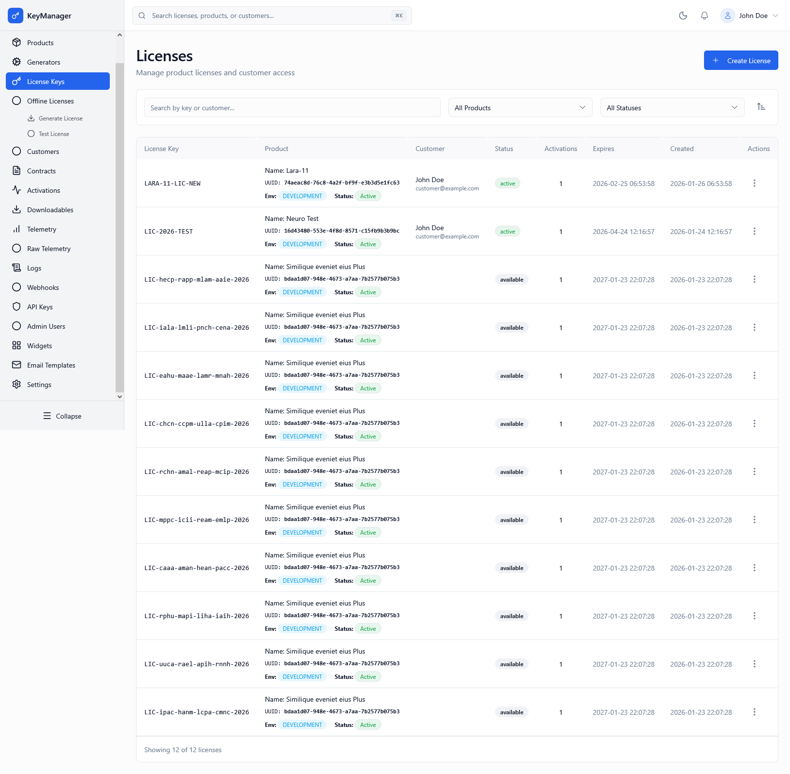
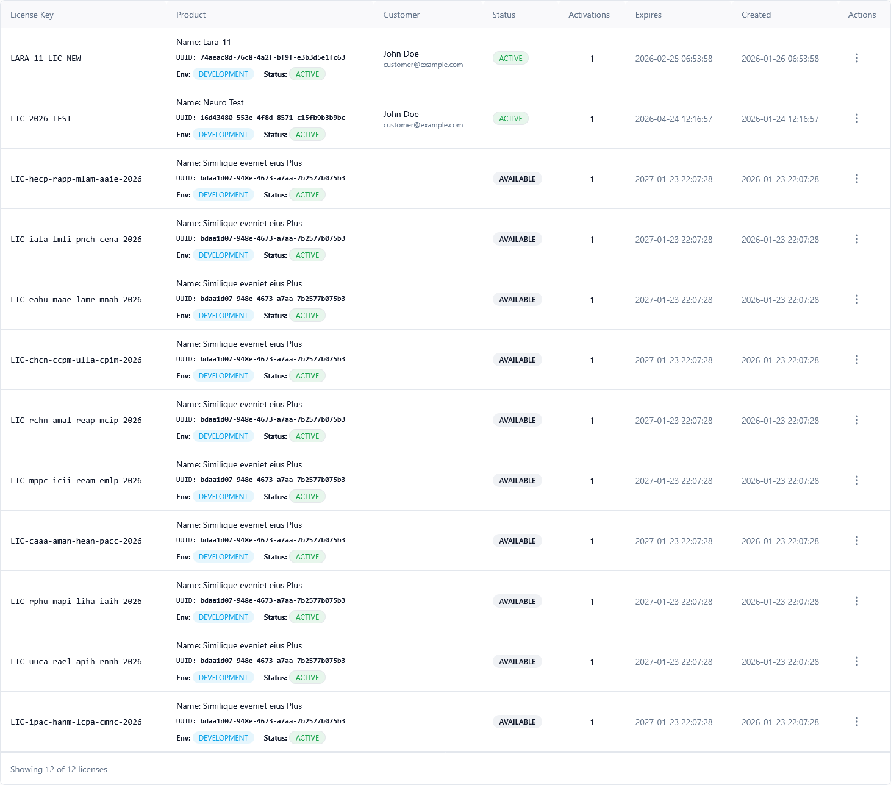
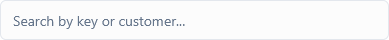
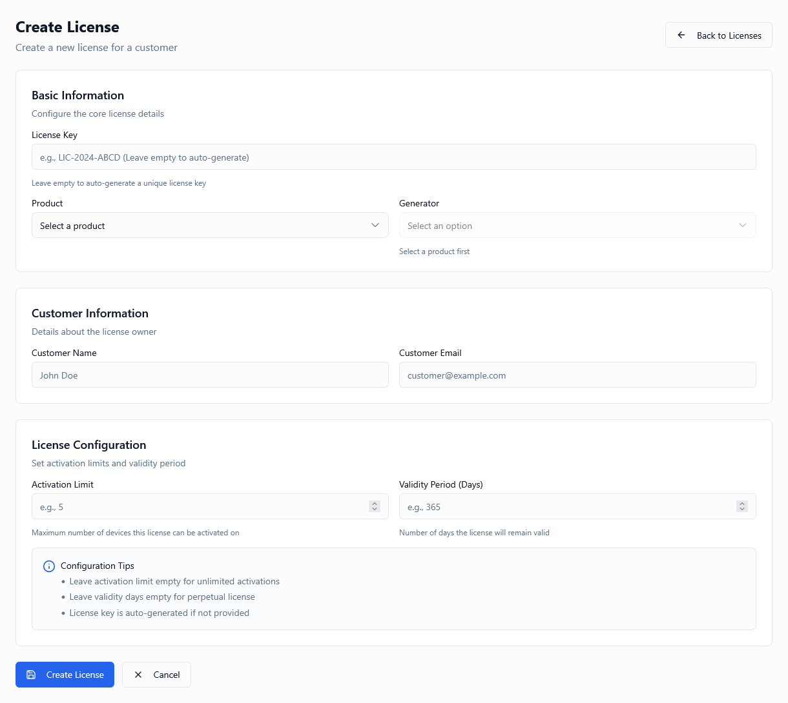
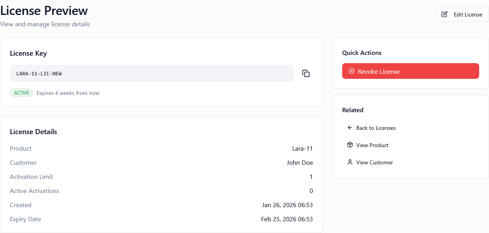
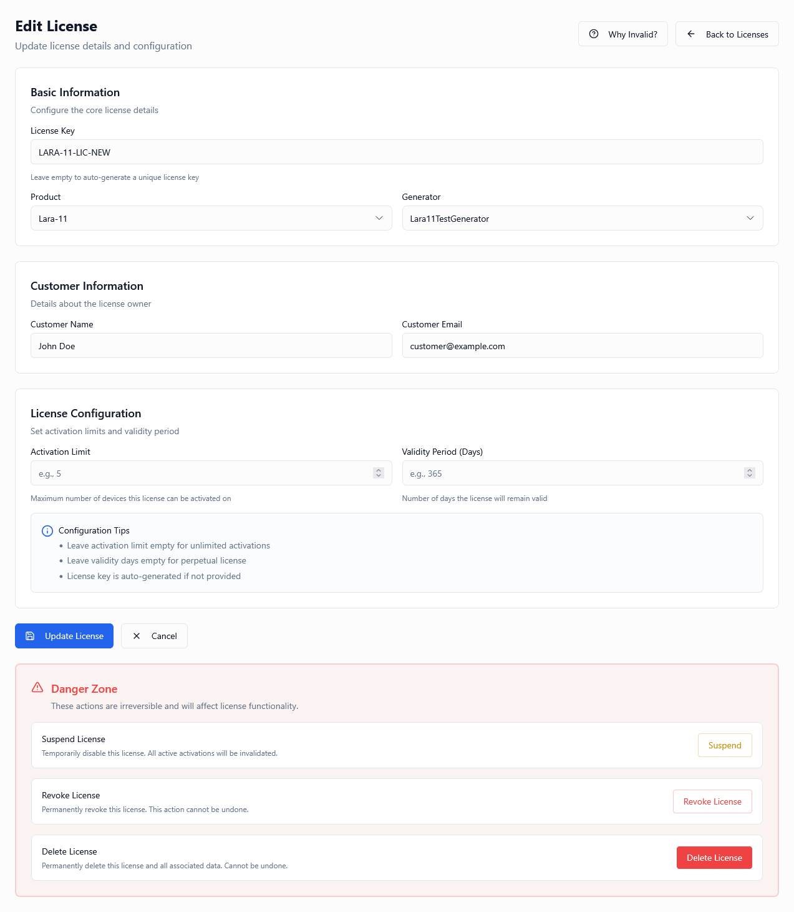
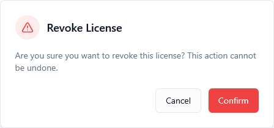
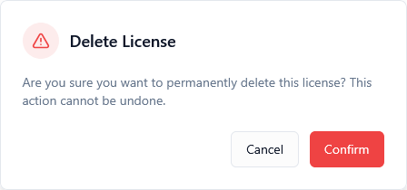

*Screenshot of the License Keys page showing the list view with search, filters, and license management actions*

---

## What Is This Page?

The **License Keys** page is the central hub for managing all licenses in your system. This is where you:

* **View all licenses** across all products and customers
* **Track license states** (available, assigned, active, suspended, expired, revoked)
* **Search and filter** licenses by key, customer, product, or status
* **Manage license lifecycle** (create, edit, assign, revoke, delete)
* **Preview licenses** for API/SDK integration testing
* **Monitor activations** and usage patterns

Think of this page as your "license control center" — every license key issued by your system appears here, regardless of which generator created it or which customer owns it.

---

## When to Use This Page

You'll use the License Keys page when you need to:

* **Search for a specific license** — Find a license by its key, customer email, or product name
* **Check license status** — See if a license is available, active, suspended, or revoked
* **Assign licenses to customers** — Connect available licenses to specific customer accounts
* **Troubleshoot activation issues** — Review activation limits and current usage
* **Revoke compromised licenses** — Immediately disable leaked or abused licenses
* **Preview license details** — Generate offline validation files or API test data
* **Audit license distribution** — See which customers have which licenses
* **Manage expirations** — Identify licenses nearing their expiry date
* **Bulk license operations** — Export, filter, and manage licenses at scale

💡 **Tip:** Bookmark specific filter combinations (e.g., "Active + Product X") using your browser for quick access to frequently viewed license segments.

---

## What You Can Do Here

### 1. View All Licenses

The main table displays all licenses in your current environment with the following columns:

| Column | Description |
|--------|-------------|
| **License Key** | The actual license key string (UUID, chunk-based, or custom format) |
| **Product** | Product name, UUID, environment, and status |
| **Customer** | Customer name and email (if assigned) |
| **Status** | Current license state (see License States below) |
| **Activations** | Current activation limit (e.g., `5` means up to 5 devices) |
| **Expires** | Expiration date or "Lifetime" for non-expiring licenses |
| **Created** | Timestamp when the license was first generated |
| **Actions** | Quick access menu (Preview, Edit, Revoke, Delete) |


*The licenses table showing all key information at a glance*

---

### 2. License States Explained

Licenses follow a **strict state machine** that prevents invalid transitions. Understanding these states is critical:

#### Available
* **Definition:** License has been generated but not yet assigned to a customer
* **Can activate:** No (must be assigned first)
* **Next states:** Assigned
* **Common scenario:** License just created from a generator, waiting in the pool

#### Assigned
* **Definition:** License is linked to a customer but hasn't been activated yet
* **Can activate:** Yes (customer can now activate it)
* **Next states:** Active
* **Common scenario:** Customer received the license key but hasn't used it yet

#### Active
* **Definition:** License is currently in use by one or more devices
* **Can activate:** Yes (if under activation limit)
* **Next states:** Suspended, Expired, Revoked
* **Common scenario:** Normal working state — customer is actively using the product

#### Suspended
* **Definition:** License is temporarily disabled (usually due to abuse detection or payment issues)
* **Can activate:** No (all activations are blocked)
* **Next states:** Active (can be unsuspended)
* **Common scenario:** Abuse threshold reached, payment failed, or manual suspension

#### Expired
* **Definition:** License has passed its validity period
* **Can activate:** No (time-based expiry enforced)
* **Next states:** Revoked (if needed)
* **Common scenario:** Trial period ended, subscription not renewed

#### Revoked
* **Definition:** License is permanently disabled (cannot be undone)
* **Can activate:** No (irre versible block)
* **Next states:** None (final state)
* **Common scenario:** License key leaked, customer refund issued, terms of service violation

**State Transition Diagram:**
```
Available → Assigned → Active ⇄ Suspended
                ↓         ↓
              Expired  ← ←
                ↓
              Revoked (terminal)
```

⚠️ **Important:** The system enforces these transitions. You cannot skip states or move backward (except Active ↔ Suspended).


*Visual representation of license state transitions*

---

### 3. Search Licenses

Type in the search bar to find licenses across multiple fields:

**Searchable Fields:**
* License key (full or partial match)
* Customer email
* Customer name
* Product name

**Search Examples:**
| Search Query | Finds |
|--------------|-------|
| `ABC123` | Licenses containing "ABC123" in the key |
| `john@example.com` | All licenses assigned to john@example.com |
| `Pro Plan` | Licenses for products with "Pro Plan" in the name |
| `example.com` | Licenses for customers with @example.com email domain |

💡 **Tip:** Use partial matches for efficiency. Searching "ABC" finds "ABC123-DEF456" without typing the full key.


*The search bar with autocomplete suggestions*

---

### 4. Filter Licenses

#### Product Filter
Filter licenses by their associated product:
* **All Products** (default) — Show licenses for all products
* **[Product Name]** — Show only licenses for a specific product

**Use Case:** When you want to see all licenses for your "Enterprise Plan" product to audit distribution.

#### Status Filter
Filter by license state:
* **All Statuses** (default) — Show licenses in any state
* **Available** — Unassigned licenses ready to be distributed
* **Assigned** — Licenses given to customers but not yet activated
* **Active** — Currently in-use licenses
* **Suspended** — Temporarily disabled licenses
* **Expired** — Time-expired licenses
* **Revoked** — Permanently disabled licenses

**Use Cases:**
* Filter by "Available" to see your unassigned license pool
* Filter by "Active" to count how many customers are currently using the product
* Filter by "Expired" to identify renewal opportunities
* Filter by "Suspended" to review abuse cases

💡 **Tip:** Combine filters! Select "Pro Plan" product + "Active" status to see all active Pro customers.


*Product and status filter dropdowns*

---

### 5. Sort Licenses

Click the **Sort** icon (top-right) to open the sort modal with these options:

**Sort By:**
* **License Key** — Alphabetically by the license key string
* **Product** — By product name (useful when viewing multi-product licenses)
* **Customer** — By customer name (find specific customer's licenses)
* **Status** — By state (groups Available → Assigned → Active, etc.)
* **Activations** — By activation limit (find high-limit enterprise licenses)
* **Expires** — By expiration date (identify licenses expiring soon)
* **Created** — By creation date (newest or oldest licenses first)

**Order:**
* **Ascending** (A→Z, 0→9, oldest→newest, nearest expiry→farthest)
* **Descending** (Z→A, 9→0, newest→oldest, farthest→nearest)

**Common Sort Combinations:**
| Sort By | Order | Use Case |
|---------|-------|----------|
| Expires | Ascending | Find licenses expiring soonest |
| Created | Descending | See recently generated licenses |
| Status | Ascending | Group licenses by state for review |
| Activations | Descending | Find enterprise licenses first |

💡 **Tip:** Sort by "Expires" (ascending) weekly to proactively reach out to customers before their licenses expire.


*The sort modal with field and order selection*

---

### 6. Create a New License

Click the **Create License** button (top-right) to manually create a single license.

**When to Create Manually:**
* You need a license immediately for testing or emergency customer support
* You want a specific license key format not available in generators
* You're creating a special one-off license for a partner or influencer

**Required Information:**
* **Product** — Which product this license belongs to
* **Generator** — Which generator template to use (defines format and rules)

**Optional Configuration:**
* **Customer** — Assign to a specific customer immediately
* **Activation Limit** — Override the generator's default limit
* **Expiry Date** — Override the generator's default validity period
* **Feature Flags** — Add custom JSON flags for this license
* **Metadata** — Additional key-value data

💡 **Tip:** For bulk creation (10+ licenses), use the **Generators** page instead. This form is optimized for single licenses.


*The license creation form with all fields*

---

### 7. Actions Menu (Per License)

Click the **⋮ icon** in the Actions column for each license to access these options:

#### Preview License
Opens a preview modal showing:
* Full license details (key, product, customer, status, etc.)
* Offline validation file (downloadable JSON)
* API integration code samples (cURL, PHP, JavaScript, Python)
* Activation history

**Use Cases:**
* Generate offline validation files for air-gapped customers
* Get code samples for SDK integration testing
* Review activation history for troubleshooting


*The license preview modal with offline file and code samples*

---

#### Edit License
Opens the license edit form where you can modify:

**Editable Fields:**
* Customer assignment
* Activation limit
* Expiry date
* Feature flags
* Metadata

**Non-Editable Fields:**
* License key (immutable once generated)
* Product (cannot change product association)
* Environment (cannot move between production/staging)

⚠️ **Warning:** Editing an active license takes effect immediately. Changes are reflected in real-time API validation responses.

**When to Edit:**
* Customer upgraded their plan (increase activation limit)
* Customer requested an extension (update expiry date)
* Enable/disable specific features (edit feature flags)

💡 **Tip:** Always preview the license after editing to verify your changes.


*The license edit form with pre-populated values*

---

#### Inactivate License
Temporarily disables an active license.

**What Happens:**
* License status changes from `active` to `inactive`
* All activation attempts fail immediately
* Existing activations remain recorded but blocked
* Customer receives "License Inactive" error in API responses

**When to Use:**
* Payment processing issue (temporary suspension until payment clears)
* Customer requested pause in service
* Investigating potential abuse before revoking

**Can Be Reversed:** Yes (see Reactivate below)

⚠️ **Note:** This is different from "Suspended" (abuse-triggered) and "Revoked" (permanent).

---

#### Reactivate License
Re-enables an inactive license.

**What Happens:**
* License status changes from `inactive` back to `active`
* Activation attempts succeed again (within limits)
* Customer can immediately use the product
* Event is logged in audit trail

**When to Use:**
* Payment issue resolved
* Customer resumed service
* Abuse investigation completed (no violation found)

💡 **Tip:** Notify the customer before reactivating to avoid confusion.

---

#### Revoke License
Permanently disables a license (irreversible).

**Confirmation Required:** A modal appears asking you to confirm revocation.

**What Happens:**
* License status changes to `revoked` (terminal state)
* All activation attempts fail permanently
* Existing activations are deactivated immediately
* Customer receives "License Revoked" error
* Cannot be reactivated (no undo)

**When to Use:**
* License key was leaked or shared publicly
* Customer issued a chargeback or refund
* Terms of service violation
* Key no longer valid per business decision

**Cannot Be Reversed:** Revocation is permanent. If you need reversibility, use "Inactivate" instead.

❗ **Important:** Communicate with the customer before revoking unless it's an emergency (leak, abuse, fraud).


*The revocation confirmation dialog with warning*

---

#### Delete License
Permanently removes a license from the database.

**Confirmation Required:** A modal appears asking you to confirm deletion.

**What Happens:**
* License is permanently deleted (cannot be recovered)
* All activation history is removed
* Audit trail entry is created (for compliance)
* License key becomes available for re-generation (collision-safe)

**When to Delete:**
* License was created by mistake during testing
* You need to clean up old development/staging licenses
* GDPR/privacy compliance requires data removal

**When NOT to Delete:**
* The license was ever activated (use "Revoke" instead for audit trail)
* You might need historical reference
* Compliance requires retaining transaction records

⚠️ **Warning:** Deletion is permanent and bypasses the recycle bin. Use "Revoke" if you're unsure.


*The deletion confirmation dialog*

---

## How It Works

### License Lifecycle Flow

```
1. Generate License (via Generator)
   ↓
2. License Created with Status "Available"
   ↓
3. Assign to Customer
   ↓
4. Status Changes to "Assigned"
   ↓
5. Customer Activates License
   ↓
6. Status Changes to "Active"
   ↓
7. (Optional Paths)
   a. Suspend → Reactivate (cycle repeatable)
   b. Expire (time-based)
   c. Revoke (permanent)
   d. Delete (data removal)
```

---

### Environment Scoping

**Critical Concept:** Licenses are **environment-scoped**. This means:

* A license in **production** only validates in **production**
* A license in **staging** only validates in **staging**
* You cannot move a license between environments

**Why This Matters:**
* Prevents production licenses from being used in development
* Allows safe testing in staging without affecting real customers
* Enforces data isolation and security boundaries

✅ **Best Practice:** Always verify you're viewing the correct environment before making changes.

---

### Activation Limits

**How Limits Work:**

* **Limit = 5:** License can be activated on up to 5 devices
* **Limit = 1:** Single-device license (common for desktop software)
* **Limit = -1:** Unlimited activations (enterprise/server licenses)

**What Happens When Limit Reached:**

1. New activation attempts return "Limit Exceeded" error
2. Customer must deactivate an existing device to free a slot
3. Admins can manually increase the limit via Edit License

💡 **Tip:** Set realistic limits based on your product type:
* **Desktop apps:** 2–3 (personal computer + laptop)
* **Mobile apps:** 3–5 (phone + tablet + family members)
* **SaaS products:** Per-seat or unlimited
* **Server software:** Unlimited or per-core limits

---

### Expiration Handling

**Types of Expiry:**

1. **Time-Based:** License expires after X days/months/years
2. **Lifetime:** Never expires (NULL expiry date)
3. **Subscription:** Renews automatically (external payment processor)

**What Happens on Expiry:**

* License status automatically changes to `expired`
* All activation attempts fail with "License Expired" error
* Existing activations remain valid until next validation check
* Renewal flow (if implemented) offers the customer a new license

💡 **Tip:** Configure grace periods in License Settings to allow 7–14 days past expiry for payment processing delays.

---

## Common Use Cases

### Use Case 1: Assigning a License to a New Customer

**Scenario:** Customer just purchased your Pro Plan and needs a license immediately.

**Steps:**
1. Go to License Keys page
2. Filter by **Status: Available** and **Product: Pro Plan**
3. Find an unassigned license
4. Click **Actions (⋮)** → **Edit License**
5. Select the customer from the dropdown
6. Click **Save**
7. Status changes from `available` to `assigned`
8. Customer receives the license key via email (if configured)

💡 **Tip:** Keep a buffer of 50–100 available licenses per product to avoid delays during high-volume sales periods.

---

### Use Case 2: Troubleshooting "Activation Limit Reached"

**Scenario:** Customer reports they can't activate the license on a new device.

**Steps:**
1. Search for the license key in the search bar
2. Check the **Activations** column (e.g., shows `3`)
3. Click **Actions (⋮)** → **Preview License**
4. Review activation history (see which devices are activated)
5. Options:
   * **Increase limit:** Edit License → Change activation limit to `5`
   * **Deactivate old device:** Contact customer to deactivate unused device
   * **Upgrade plan:** Offer customer enterprise license with unlimited activations

---

### Use Case 3: Handling a Leaked License Key

**Scenario:** You discover a license key posted on a public forum.

**Steps:**
1. Search for the leaked license key
2. Note the customer it's assigned to
3. Click **Actions (⋮)** → **Revoke License** (immediate)
4. Contact the customer:
   * Explain the situation
   * Offer a replacement license
5. Assign a new license from the Available pool
6. Consider:
   * Enabling abuse detection (Settings → Abuse Detection)
   * Implementing HWID binding (prevents easy sharing)

❗ **Important:** Revoke first, explain later. Speed is critical when a key is publicly exposed.

---

### Use Case 4: Managing Trial License Expiry

**Scenario:** You want to convert trial licenses to paid licenses for paying customers.

**Steps:**
1. Filter by **Status: Expired** and **Product: Trial Plan**
2. Identify customers who upgraded to paid plans
3. For each customer:
   * Revoke the old trial license (clean up)
   * Assign a new paid license from the Paid Plan pool
4. For customers who didn't upgrade:
   * Send renewal email (if automated)
   * Or leave expired for historical reference

💡 **Tip:** Automate this with webhooks. Configure a webhook to trigger when licenses expire, then handle conversion via API.

---

### Use Case 5: Auditing License Distribution

**Scenario:** Your CFO asks "How many customers have active licenses for Product X?"

**Steps:**
1. Filter by **Product: Product X**
2. Filter by **Status: Active**
3. Count the rows in the table
4. Optional: Export the list using the export button (if available)
5. Review activation limits to calculate total device coverage

**Example Report:**
* Total Active Licenses: 247
* Average Activation Limit: 5 devices
* Maximum Potential Activations: 1,235 devices

---

## Tips & Tricks

### 💡 Search Efficiency
* Use partial license keys: `ABC` instead of `ABC123-DEF456-GHI789`
* Search by domain: `@company.com` finds all licenses for that organization
* Combine search + filters for laser-focused results

### 💡 Filter Combinations
* **Available + Product X** → See unassigned license pool for Product X
* **Active + Expires: Sort Ascending** → Prioritize renewal outreach
* **Suspended + Created: Last 7 days** → Review recent abuse cases

### 💡 Bulk Operations Strategy
* Generate licenses overnight (use Generators page for batches of 500)
* Assign licenses via API/CSV import for large customer lists
* Export filtered lists for reporting or CRM integration

### 💡 Status Monitoring
* Check "Available" count weekly to maintain healthy license pools
* Monitor "Suspended" licenses daily for abuse patterns
* Review "Expired" licenses monthly for renewal campaigns

### 💡 Customer Communication
* Always notify customers before revoking or suspending (except emergencies)
* Send "License Expiring Soon" reminders 30, 14, and 7 days before expiry
* Provide clear instructions when assigning new licenses

---

## Troubleshooting

### ❗ Problem: "License not found" when searching

**Possible Causes:**
* Wrong environment selected
* License was deleted
* Typo in search query

**Solutions:**
1. Verify you're in the correct environment (production vs. staging)
2. Check the license key spelling (copy-paste if possible)
3. Search by customer email instead
4. Check audit logs for deletion events

---

### ❗ Problem: Customer says license is "Invalid" but shows "Active" in admin

**Possible Causes:**
* Environment mismatch (customer using staging key in production)
* License was just activated (API cache delay)
* Customer's API integration has wrong environment URL

**Solutions:**
1. Verify customer is hitting the correct API endpoint
2. Check product environment matches customer's environment
3. Wait 30 seconds and retry (API cache TTL)
4. Preview the license and provide offline validation file for testing

---

### ❗ Problem: Cannot edit license (Edit button disabled)

**Possible Causes:**
* License is revoked (terminal state)
* Permission issue (not admin or license manager)
* License belongs to different environment

**Solutions:**
1. Check license status (revoked licenses cannot be edited)
2. Verify your admin permissions
3. Confirm environment matches

---

### ❗ Problem: License disappeared after filtering

**It didn't disappear** — filters are hiding it.

**Solution:**
1. Click **All Statuses** and **All Products**
2. Search by license key
3. Check which status it's currently in

---

### ❗ Problem: Customer has two licenses for the same product

**Possible Scenarios:**
* Customer upgraded (old license + new license)
* Error during assignment process
* Different product tiers (Trial + Paid)

**Solutions:**
1. Identify which license is active
2. Revoke the unused license
3. If both are active, check with customer which they're using
4. Clarify in your customer portal which license is current

---

## Keyboard Shortcuts

| Shortcut | Action |
|----------|--------|
| `/` | Focus search bar |
| `Esc` | Close modal |
| `Ctrl/Cmd + K` | Open global search (if enabled) |
| `Ctrl/Cmd + F` | Browser search within table |

---

## Validation Rules

When creating or editing a license:

| Field | Rules |
|-------|-------|
| License Key | Immutable, unique per environment, generated by system |
| Product | Required, must exist and be active |
| Customer | Optional (for available licenses), must exist if assigned |
| Activation Limit | Integer, -1 (unlimited) or 1–10000 |
| Expiry Date | Future date or NULL (lifetime) |
| Feature Flags | Valid JSON object |
| Metadata | Valid JSON object, max 10KB |

---

## Security Considerations

### 🔒 Access Control
* Only admins with "License Management" permission can create/edit/delete licenses
* Revocation and deletion require confirmation modals
* All state changes are logged in audit trail

### 🔒 License Key Security
* Keys are never shown in plain text in logs (truncated to first 8 characters)
* Preview modal requires admin re-authentication (configurable)
* Offline validation files are time-limited (expire after 24 hours)

### 🔒 Environment Isolation
* Production licenses cannot validate in staging (and vice versa)
* Prevents accidental cross-environment key leakage
* Each environment has isolated database

### 🔒 Rate Limiting
* Validation API is rate-limited per license key
* Prevents brute-force key guessing
* Protects against abuse and DDoS

⚠️ **Warning:** Never expose license keys in public repositories, client-side code, or error messages.

---

## Integration with Other Pages

**Related Admin Pages:**
* **[Generators]()** — Create licenses in bulk
* **[Products]()** — Configure products before generating licenses
* **[Customers]()** — Manage customer accounts
* **[Activations]()** — View device-level activation history
* **[Contracts]()** — Automate license assignment via contracts
* **[Background Jobs]()** — Monitor bulk operations

**Related Settings:**
* **[License Settings]()** — Global license defaults and grace periods
* **[Abuse Detection]()** — Configure automatic suspension rules

---

## How to Access

1. Log in to the **Admin Portal**
2. Click **Licenses** or **License Keys** in the left sidebar navigation
3. Or use the global search (type "licenses")
4. Or access via direct URL: `/admin/licenses`

---

## Frequently Asked Questions

### Q: Can I generate licenses directly from this page?
**A:** No. Use the **Generators** page for bulk generation or the **Create License** button for single licenses.

### Q: What happens to activations when I revoke a license?
**A:** All activations are immediately deactivated. Customers receive "License Revoked" errors on their next validation check.

### Q: Can I unrevoke a license?
**A:** No. Revocation is permanent. If you need reversibility, use "Inactivate" instead.

### Q: How do I bulk-assign licenses to customers?
**A:** Use the API or CSV import feature (Admin → Bulk Operations). The UI is optimized for individual assignments.

### Q: Can I change a license's product after creation?
**A:** No. Product association is immutable. Create a new license if the customer needs a different product.

### Q: How do I export a list of licenses?
**A:** Apply your desired filters, then use the Export button (top-right) to download CSV or JSON.

### Q: What's the difference between "Suspended" and "Inactive"?
**A:** "Suspended" is triggered by abuse detection rules (automatic). "Inactive" is manual admin action (temporary pause).

### Q: Can customers see their license status?
**A:** Yes, if enabled. The Customer Portal shows customers their licenses and statuses (but not admin-only fields).

### Q: How long are deleted licenses retained in audit logs?
**A:** Deletion events are logged permanently, but the license data itself is permanently removed. Configure retention in Logging Settings.

---

## Summary

The **License Keys** page is your primary interface for managing the entire license lifecycle. Key capabilities:

✅ View all licenses across products and customers  
✅ Search by key, customer, or product  
✅ Filter by status (available, assigned, active, etc.)  
✅ Assign licenses to customers  
✅ Manage activation limits and expiry dates  
✅ Suspend, revoke, or delete licenses  
✅ Preview licenses for offline validation  
✅ Track license states through the state machine  

**Best Practices:**
* Maintain a buffer of available licenses per product (50–100)
* Filter by "Expires" weekly to proactively reach out to customers
* Use "Inactivate" for temporary issues, "Revoke" for permanent
* Always preview licenses after editing to verify changes
* Communicate with customers before major status changes
* Review "Suspended" licenses daily for abuse patterns
* Export filtered lists monthly for reporting

**Next Steps:**
* Assign your first license: Filter → Available → Edit → Select Customer
* Preview a license: Actions → Preview → Download offline file
* Troubleshoot activation issues: Search → Preview → Review activation history

---

*Last updated: 2024*
