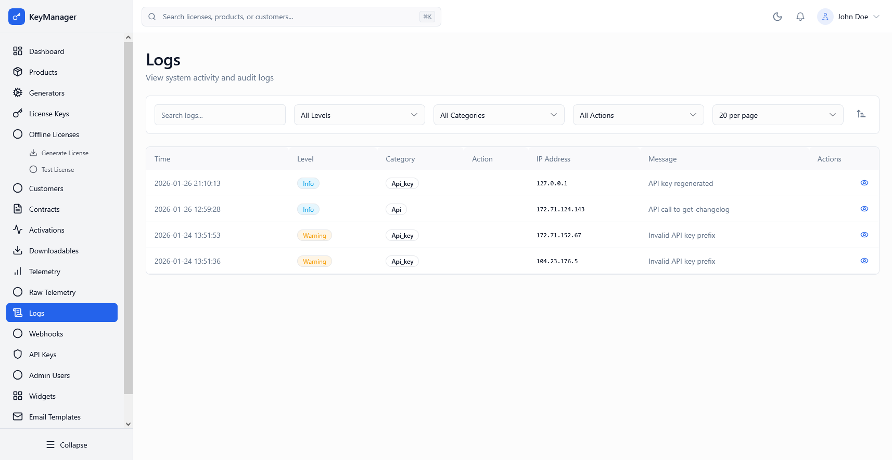

*Screenshot of the System Logs page with activity timeline*

---

## What Is This Page?

The **System Logs** page shows all operational activity in the Admin Portal. Track admin actions, API calls, authentication attempts, errors, and system events for troubleshooting and security auditing.

---

## When to Use This Page

* **Investigate errors** — Find out what went wrong when something fails
* **Monitor API activity** — Review API calls and integrations
* **Audit security** — Check admin actions and login attempts
* **Debug issues** — Search logs to understand system behavior
* **Verify changes** — Confirm when actions were performed
* **Compliance** — Keep records of platform activity

---

## What You Can Do Here

### 1. View System Logs

| Column | Description |
|--------|-------------|
| **Time** | When the action occurred (sorted newest first by default) |
| **Level** | Log severity: Error, Warning, Info, Debug |
| **Action** | What happened (e.g., "create_license", "update_product") |
| **Resource** | What was affected (e.g., "License", "Product", "Admin") |
| **User** | Who performed the action or system component |
| **IP Address** | Source IP of the request (for security tracking) |
| **Details** | Additional context or error message |

### 2. Search & Filter

* **Search:** By action name, message content, IP address, resource type
* **Level Filter:** All Levels, Error, Warning, Info, Debug
* **Per Page:** Display 10, 20, 50, or 100 logs per page

### 3. Sort Logs

Click the **Sort** button (⊕) to customize sort order:

* **Sort By:** Time, Level, Action, Resource, User, or IP Address
* **Order:** Ascending (oldest first) or Descending (newest first)

### 4. Common Log Actions

| Action | Description |
|--------|-------------|
| **create_*** | New resource created (e.g., create_license, create_product) |
| **update_*** | Existing resource modified |
| **delete_*** | Resource deleted or disabled |
| **activate_license** | License activated for use |
| **deactivate_license** | License disabled |
| **login** | Admin logged in |
| **logout** | Admin logged out |
| **export_*** | Data exported to file |
| **import_*** | Data imported from file |
| **api_call** | External API request |
| **webhook_sent** | Webhook delivery triggered |
| **job_queued** | Background job started |
| **job_completed** | Background job finished |
| **job_failed** | Background job errored |

### 5. Understand Log Levels

**Error** (Red)
- System failures or critical issues
- Action failed or could not complete
- Requires investigation
- Example: "Failed to activate license - invalid HWID"

**Warning** (Orange)
- Unusual but handled situations
- No immediate failure but worth monitoring
- Example: "Rate limit approached for API key"

**Info** (Blue)
- Normal operational activities
- Successful actions and state changes
- Example: "License created successfully"

**Debug** (Gray)
- Detailed technical information
- Used for development troubleshooting
- Only visible if debug logging enabled

---

## Common Workflows

### Workflow 1: Find Failed License Activation

**Steps:**
1. Go to **System Logs**
2. Click **Sort** button
3. Select **Sort By:** "Action"
4. Filter **Level:** "Error"
5. Search for "activate" in search box
6. Review "Details" column for error message
7. Check "Time" to see when it happened
8. Check "IP Address" to verify request source

**Example findings:**
- "Invalid HWID format" → Customer device has compatibility issue
- "Rate limit exceeded" → Customer hit activation limit, need to deactivate old device first
- "License expired" → License key is no longer valid

### Workflow 2: Investigate Suspicious Admin Activity

**Steps:**
1. Go to **System Logs**
2. Filter **Level:** "Info" (normal actions leave info logs)
3. Search for admin email or IP address
4. Review actions performed
5. Check timestamps for unusual times
6. If suspicious:
   - Go to [Admin Users]() and deactivate the account
   - Document the incident
   - Review password reset logs

**Red flags:**
- Multiple failed login attempts
- Actions at unusual hours
- Bulk license deletions
- Large exports from system

### Workflow 3: Troubleshoot API Integration Issues

**Steps:**
1. Go to **System Logs**
2. Filter **Level:** "Error"
3. Search for relevant API key or customer
4. Sort **By Time** (newest first)
5. Review recent API errors
6. Check "Details" for specific error message

**Common API errors:**
- "Invalid API key" → Key is expired or wrong
- "Permission denied" → Key lacks required scope
- "Rate limit exceeded" → Too many requests, implement exponential backoff
- "Invalid request format" → Check API documentation

### Workflow 4: Analyze System Performance Issues

**Steps:**
1. Go to **System Logs**
2. Filter **Level:** "Warning"
3. Look for performance-related messages:
   - "Slow query detected"
   - "High memory usage"
   - "Job queue backlog"
4. Note the timestamps
5. Cross-reference with [Telemetry]() if available

---

## Log Retention

Logs are **automatically purged** based on [retention policies]().

### Default Retention
- **System Logs:** 3 months (configurable)
- **Job Logs:** 1 month
- **API Logs:** 3 months

### To Change Retention

1. Go to [Settings → Retention Policies]()
2. Select **System Logs**
3. Choose new retention period (1, 3, 6, 9, or 12 months)
4. Save

### Note About Audit Trails

For **permanent, immutable records**, see [Audit Trails](). These cannot be purged and maintain a complete history of all state-changing actions.

---

## Important Distinctions

### Logs vs. Audit Trails

| Feature | Logs | Audit Trails |
|---------|------|--------------|
| **Purpose** | Operational troubleshooting | Compliance & legal record |
| **Retention** | Auto-purged per policy | Never deleted |
| **Mutability** | Immutable once created | Immutable once created |
| **Coverage** | All system activity | State-changing actions only |
| **Searchable** | Yes | Yes (different interface) |
| **Storage** | Database (purgeable) | Database (permanent) |

---

## Troubleshooting

**Problem:** Logs page is slow or doesn't load

**Solution:** Logs table can get large. Try:
- Reduce date range in search
- Apply more specific filters (by level or action)
- Reduce "Per Page" to 10 or 20
- Contact support if consistently slow

**Problem:** Can't find specific log entry

**Solution:**
- Logs are auto-purged after retention period (default 3 months)
- Check [retention policy settings]()
- If older than retention, check [Audit Trails]() instead
- Try broader search terms

**Problem:** Log details are truncated in table

**Solution:**
- Hover over the "Details" column to see full message
- Click the log row to expand (if detail view available)
- Adjust browser window width for more horizontal space

---

## Related Pages

* [Admin Users]() — Manage who has admin access
* [Settings → Retention Policies]() — Configure how long logs are kept
* [Settings → Audit Trails]() — View immutable activity records
* [Profile]() — Your admin account settings
* [Telemetry]() — Usage analytics and piracy detection

---

## How to Access

**Navigation:** Admin Portal → **Logs**
**URL:** `/admin/logs`
**Shortcut:** `Ctrl+K` / `Cmd+K` → type "logs"

**Permission Required:** Admin or higher role
