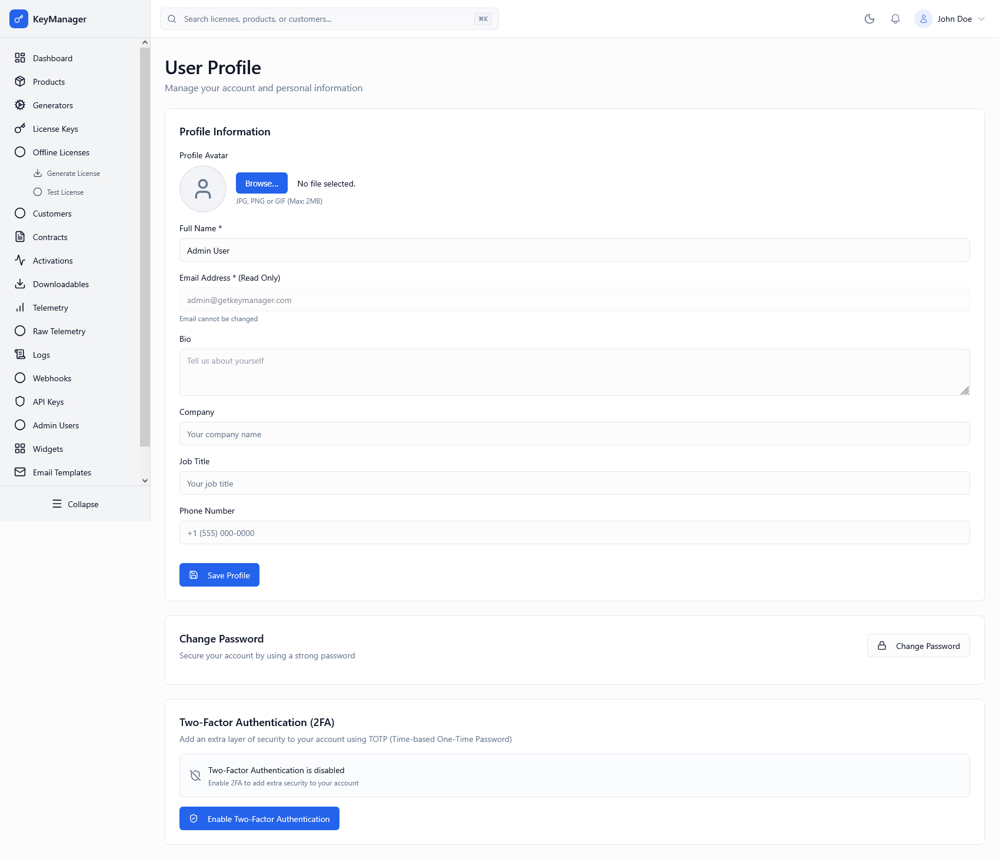

# Profile & Security

*Screenshot of the Profile page with personal information and security settings*

---

## What Is This Page?

The **Profile & Security** page is your personal account dashboard. Manage your profile information, change your password, enable two-factor authentication, and monitor your account security.

---

## When to Use This Page

* **Update profile info** — Change name, bio, company, contact details
* **Change password** — Update your login password regularly for security
* **Enable 2FA** — Add two-factor authentication for extra security
* **Manage recovery codes** — Save backup codes for account recovery
* **Monitor security** — Check if your account has been accessed securely

---

## What You Can Do Here

### 1. Profile Information

Edit your public profile details that appear in the system.

**Available Fields:**

| Field | Description | Required |
|-------|-------------|----------|
| **Profile Avatar** | Upload a profile picture (JPG, PNG, GIF, max 2MB) | No |
| **Full Name** | Your display name in the system | Yes |
| **Email Address** | Your login email (read-only, cannot be changed) | Yes |
| **Bio** | Short biography or description about you | No |
| **Company** | Your organization or company name | No |
| **Job Title** | Your position or role | No |
| **Phone Number** | Contact phone number | No |

**To Update Profile:**

1. Scroll to **Profile Information** section
2. Update any fields as needed
3. Click **Upload** next to Avatar (optional) to change your picture
4. Click **Save Profile** at the bottom
5. Success message appears confirming changes

### 2. Change Password

Keep your account secure by changing your password regularly.

**To Change Password:**

1. Scroll to **Change Password** section
2. Click **Change Password** button
3. Modal opens with three fields:
   - **Current Password** — Enter your current password
   - **New Password** — Enter a new password (min 8 characters)
   - **Confirm Password** — Re-enter the new password
4. Click **Update Password**
5. Password is immediately changed
6. Success message appears

**Password Requirements:**
- Minimum 8 characters
- Recommended: Mix of uppercase, lowercase, numbers, and symbols
- Cannot be same as previous password
- Changed password takes effect immediately

**Security Tips:**
- Change password every 90 days
- Use unique passwords (not reused across services)
- Never share your password with anyone
- Consider using a password manager
- Enable 2FA for additional security

### 3. Two-Factor Authentication (2FA)

Add a second layer of security to your account using TOTP (Time-based One-Time Password).

**What is 2FA?**

Two-factor authentication requires:
1. Your password (something you know)
2. A time-based code from an authenticator app (something you have)

This prevents unauthorized access even if your password is compromised.

**Compatible Authenticator Apps:**
- Google Authenticator
- Microsoft Authenticator
- Authy
- FreeOTP
- 1Password
- LastPass
- Any TOTP-compatible app

**To Enable 2FA:**

1. Scroll to **Two-Factor Authentication** section
2. Click **Enable Two-Factor Authentication**
3. Setup modal appears with:
   - QR code for scanning
   - Manual secret key (if you can't scan)
4. Open your authenticator app
5. Either:
   - Scan the QR code, OR
   - Manually enter the secret key
6. App generates a 6-digit code
7. Enter the code in "Enter 6-digit code" field
8. Click **Confirm & Enable**
9. Recovery codes are shown (save these!)
10. Success message appears

**Download Options:**
- **Download QR Code** — Save QR as SVG file for backup
- **Download Secret Key** — Save text file with manual entry key

**Save Recovery Codes:**
- 8 recovery codes are generated
- Each code can be used once
- Use when authenticator app is unavailable
- Store in safe location (password manager, secure folder)
- Click **Copy All** to copy codes

**To Disable 2FA:**

1. Scroll to **Two-Factor Authentication** section
2. Click **Disable 2FA** button (only appears if 2FA enabled)
3. Confirm the action
4. 2FA is immediately disabled
5. You'll only need password to login

**View Recovery Codes:**

1. Scroll to **Two-Factor Authentication** section (if enabled)
2. Click **View Recovery Codes**
3. Codes are displayed (blurred for security)
4. Click **Copy All** to copy all codes at once

---

## Login with 2FA

When 2FA is enabled, login requires two steps:

**Step 1:** Enter email and password (normal login)

**Step 2:** Enter authenticator code
- App generates a new 6-digit code every 30 seconds
- Enter the code in the 2FA prompt
- Time is displayed counting down

**If you lose your authenticator:**
- Use a recovery code instead of the 6-digit code
- Each recovery code works once
- Contact support if you've lost all recovery codes

---

## Security Best Practices

**Change Password:**
- Every 90 days
- If you suspect compromise
- When team member is offboarded
- After accessing from public Wi-Fi

**Enable 2FA:**
- Recommended for all admins (required for Super Admins)
- Store recovery codes securely
- Avoid sharing authenticator apps between devices

**Profile Info:**
- Keep name and contact info current
- Use company email, not personal
- Update if company changes

**Monitor Activity:**
- Go to [Logs](../logs) to check your activity
- Report suspicious login attempts
- Check IP addresses in logs for unfamiliar locations

**Account Recovery:**
- Save recovery codes in password manager
- Keep alternate authentication method ready
- Document account setup for emergencies

---

## Common Workflows

### Workflow 1: First-Time Setup (New Admin)

**Steps:**
1. Log in with initial password (received in email)
2. Go to **Profile & Security**
3. Click **Change Password** → set strong password
4. Update **Profile Information** with your details
5. Enable **2FA:**
   - Click "Enable Two-Factor Authentication"
   - Scan QR code with authenticator app
   - Enter the code to confirm
6. **Save recovery codes** in password manager
7. Complete! You're now secured

### Workflow 2: Enable 2FA After Already Having an Account

**Steps:**
1. Go to **Profile & Security**
2. Scroll to **Two-Factor Authentication**
3. Click **Enable Two-Factor Authentication**
4. Modal opens showing QR code
5. Open your authenticator app
6. Add new account (usually a + button)
7. Scan the QR code
8. App shows 6-digit code
9. Enter code in the modal
10. Save recovery codes
11. Click **Confirm & Enable**
12. 2FA is now required for login

### Workflow 3: Lost Access to Authenticator App

**Steps:**
1. At 2FA login screen, look for "Can't access your code?" or similar
2. Click and enter a recovery code (from your saved codes)
3. Successfully log in
4. Go to **Profile & Security**
5. Disable old 2FA (**Disable 2FA** button)
6. Re-enable 2FA with new device:
   - Click **Enable Two-Factor Authentication**
   - Setup QR code again
   - Confirm with new device
7. Save new recovery codes

### Workflow 4: Regular Security Audit

**Monthly Steps:**
1. Go to **Profile & Security**
2. Check password was changed < 90 days ago
3. Verify 2FA is enabled
4. Check [Logs](../logs) for any unfamiliar login IPs
5. Review [Admin Users](../admins) page for unauthorized accounts

---

## Troubleshooting

**Problem:** "Email cannot be changed" error

**Solution:** Email is your unique identifier and cannot be modified. To use a different email:
- Contact system administrator to deactivate old account
- Create new admin account with new email
- Transfer any permissions/data if needed

**Problem:** Can't scan QR code with authenticator app

**Solution:**
- Try downloading QR code and scanning from file
- Use manual secret key entry instead:
  1. In authenticator app, select "Enter Setup Key"
  2. Copy-paste the secret key shown in modal
  3. Continue with verification
- Ensure good lighting and camera focus
- Try different authenticator app

**Problem:** Authenticator code doesn't work

**Solution:**
- Check system time on your phone (should be synchronized)
- Ensure you're entering the current code (not old one)
- Codes expire every 30 seconds, try next code if near boundary
- Use a recovery code instead
- Check that app is showing code for correct account (if multiple)

**Problem:** Lost all recovery codes

**Solution:**
- You must disable 2FA:
  1. Click **Disable 2FA** button (requires current authenticator code)
  2. Re-enable 2FA from scratch
  3. Immediately save new recovery codes
- If you lost authenticator app too, contact system administrator

**Problem:** Profile changes don't save

**Solution:**
- Check all required fields have values
- Verify avatar file is correct format (JPG, PNG, GIF)
- Check avatar file size < 2MB
- Try clearing browser cache
- Try different browser
- Check browser console for errors (F12)

**Problem:** Password change shows "Current password incorrect"

**Solution:**
- Ensure Caps Lock is off
- Check you're entering current password, not new one
- If forgotten, contact system administrator
- Cannot self-reset if you've forgotten current password

---

## What's Your Email? (Important to Know)

Your email address is **read-only** and cannot be changed from this page. It is:
- Your unique identifier in the system
- Your login email
- Used for password recovery
- Cannot be modified or transferred

If you need to change your email:
1. Contact your system administrator
2. They deactivate your current account
3. You create new account with new email
4. Admin transfers your permissions/roles

---

## Related Pages

* [Admin Users](../admins) — View all admin accounts (Super Admin only)
* [Logs](../logs) — Check your account activity
* [Settings](../settings) — System-wide configuration (Super Admin only)
* [Dashboard](../dashboard) — Main overview

---

## How to Access

**Navigation:** Admin Portal → **Profile** (top right, often your avatar/name)
**URL:** `/admin/profile`
**Shortcut:** `Ctrl+K` / `Cmd+K` → type "profile"

**Permission Required:** All authenticated users
