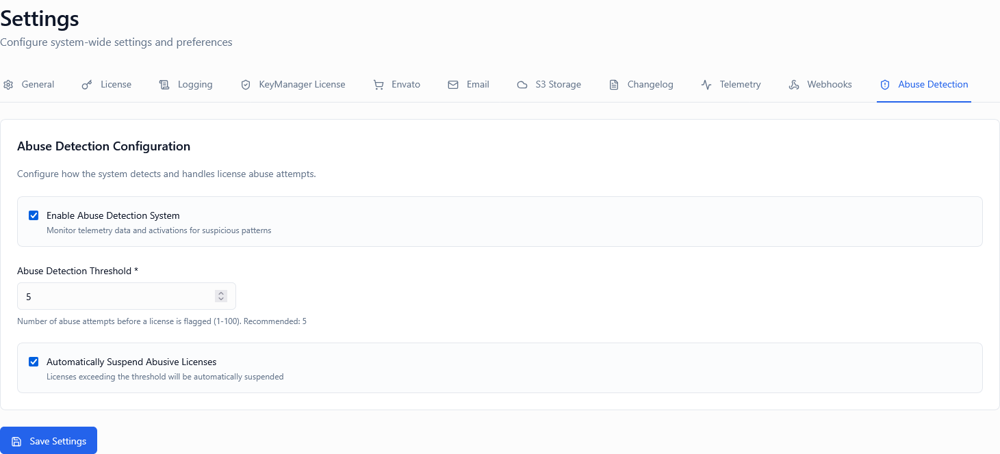
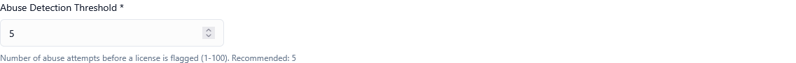
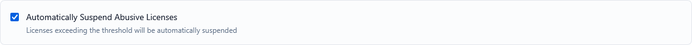

*Screenshot of Abuse Detection settings tab*

---

## Overview

Abuse detection monitors license activations and flags **suspicious activation patterns** (for example, excessive activations across devices or locations in a short time). When configured correctly, it helps you:

* Prevent license sharing and key leakage
* Automatically respond to abnormal usage
* Reduce manual monitoring and support overhead

These controls work together:

1. **Enable Abuse Detection** – Turns monitoring on or off
2. **Abuse Threshold** – Defines when usage becomes suspicious
3. **Auto-Suspend on Abuse** – Enforces automatic action

---

## Enable Abuse Detection

**Type:** Toggle (On / Off)  
**Default:** On

### Description

Enables or disables abuse monitoring for licenses.

* **ON**: The system actively evaluates activation behavior against defined rules
* **OFF**: No abuse evaluation is performed. All activations are allowed unless blocked by other limits

### When to Enable

Enable this option if:

✅ Your product is distributed publicly or via marketplaces  
✅ License keys can be reused or copied  
✅ You want early detection of misuse  
✅ You operate at scale and need automation  

### When to Disable

You may temporarily disable abuse detection:

🔧 During internal testing or QA  
🔧 For trusted enterprise customers  
🔧 While troubleshooting false positives  

> ⚠️ **Warning**: Disabling abuse detection also disables threshold evaluation and auto-suspension.

---

## Abuse Threshold (Number of Suspicious Activations)

**Type:** Numeric input  
**Default:** 5  
**Range:** 1-100

*Screenshot showing threshold configuration*

### Description

Defines the **maximum number of suspicious activations** allowed before a license is considered abusive.

A *suspicious activation* may include patterns such as:

* Rapid activations within a short time window (e.g., 10 devices in 1 hour)
* Activations from multiple IPs, regions, or countries
* Repeated re-activations beyond normal usage
* Activations from known VPN or proxy servers
* Unusual device fingerprint patterns

### How It Works

1. Each suspicious activation increments an internal counter
2. When the counter **reaches or exceeds** the abuse threshold:
   * The license is marked as *abused*
   * Enforcement actions may occur (depending on Auto-Suspend setting)
   * Event is logged for review

### Example Scenarios

| Threshold | Behavior | Use Case |
| --------- | -------- | -------- |
| **1** | Very strict; first suspicious activity triggers | High-security APIs, enterprise software |
| **3** | Moderately strict; 2-3 violations before action | SaaS products, cloud services |
| **5** | Balanced; suitable for most desktop software | **Recommended default** |
| **10** | Lenient; tolerates some legitimate edge cases | Consumer software, trial licenses |

### Real-World Example

**Scenario**: Desktop software with threshold = 3

1. User activates on work PC (activation 1) ✅
2. User activates on laptop (activation 2) ✅
3. User travels and activates on hotel Wi-Fi (activation 3, different IP) ⚠️ Suspicious +1
4. User's friend tries to activate with same key (activation 4, different device) ⚠️ Suspicious +2
5. Another friend activates (activation 5) ⚠️ Suspicious +3 → **Threshold reached!**

### Best Practices

**Starting Out:**
1. Start with a **moderate value (3–5)**
2. Monitor abuse logs for 30 days
3. Adjust based on false positive rate
4. Tighten for high-piracy products
5. Relax for legitimate multi-device use cases

**Monitoring:**
- Review flagged licenses weekly
- Check if suspended licenses are legitimate users
- Adjust threshold if seeing too many false positives

💡 **Tip**: It's better to start lenient and tighten than to frustrate legitimate customers

---

## Auto-Suspend on Abuse

**Type:** Toggle (On / Off)  
**Default:** Off

*Screenshot showing auto-suspend toggle*

### Description

Automatically suspends a license when the abuse threshold is reached.

* **ON**: The license is immediately suspended
* **OFF**: The license is only flagged; no automatic action is taken

### What Happens on Auto-Suspension

When enabled and abuse is detected:

1. ⛔ License status changes to **Suspended**
2. 🚫 All further activations and validations fail
3. 📱 SDKs and APIs return a suspension response
4. 📧 Optional notification email to admin (if configured)
5. 📝 Event is logged for audit and review
6. 🔔 Alert appears in admin dashboard

### When to Enable

Enable auto-suspension if:

✅ You want zero-tolerance enforcement  
✅ Your product is frequently pirated  
✅ You operate at scale and need automation  
✅ You have a clear abuse policy communicated to users  
✅ You can quickly respond to support requests about suspensions  

### When to Keep Disabled

Keep disabled if:

❌ You prefer manual review before action  
❌ You sell to enterprise or offline environments  
❌ You want to notify customers before enforcement  
❌ Your support team needs to investigate first  
❌ You have low abuse rates  

### Manual vs Automatic Enforcement

| Approach | Pros | Cons |
|----------|------|------|
| **Manual (Auto-Suspend OFF)** | Flexible, fewer false positives, better customer experience | Requires monitoring, delayed response, manual work |
| **Automatic (Auto-Suspend ON)** | Immediate protection, scales well, zero admin effort | May frustrate legitimate users, requires good thresholds |

### Recovery Process

If a legitimate user is auto-suspended:

1. User contacts support
2. Admin reviews abuse log
3. Admin determines it was false positive
4. Admin unsuspends license manually
5. Admin may adjust abuse threshold
6. User can activate again

💡 **Tip**: Have a clear support process for handling suspension appeals

---

## Recommended Configurations

### SaaS / API Products

**High-value targets for abuse**

* **Enable Abuse Detection:** ON
* **Abuse Threshold:** 1–2
* **Auto-Suspend on Abuse:** ON

**Reasoning:** API keys are easily shared. Immediate suspension prevents ongoing abuse.

---

### Desktop / On-Premises Software

**Moderate abuse risk, legitimate multi-device use**

* **Enable Abuse Detection:** ON
* **Abuse Threshold:** 3–5
* **Auto-Suspend on Abuse:** OFF or ON (with review process)

**Reasoning:** Users may legitimately use multiple devices. Manual review prevents false positives.

---

### Internal / Trial Licenses

**Low abuse risk, testing environment**

* **Enable Abuse Detection:** OFF or ON with high threshold
* **Abuse Threshold:** 10+
* **Auto-Suspend on Abuse:** OFF

**Reasoning:** Internal teams need flexibility. Trials should be lenient to encourage evaluation.

---

### Enterprise / B2B Software

**Trusted customers, contracted usage**

* **Enable Abuse Detection:** ON (for monitoring)
* **Abuse Threshold:** High (10-20)
* **Auto-Suspend on Abuse:** OFF

**Reasoning:** Enterprise customers have contracts. Use abuse detection for insights, not enforcement.

---

## Important Notes

⚠️ **Abuse detection does not replace activation limits** – they complement each other

🔄 **Suspension can usually be reversed** by an admin

📊 **Always review abuse logs** before permanently revoking a license

�� **Communicate your policy** to customers clearly

📧 **Set up notifications** so admins know when abuse is detected

---

## Summary Table

| Setting | Purpose | Typical Value |
| ---------------------- | ----------------------------- | ------------- |
| Enable Abuse Detection | Turns monitoring on/off | ON |
| Abuse Threshold | Defines tolerance level | 3-5 |
| Auto-Suspend on Abuse | Enforces automatic protection | OFF (manual review) or ON (zero-tolerance) |

---

## Testing Your Configuration

### Step 1: Set Threshold to 2 (for testing)

Temporarily lower the threshold so you can trigger abuse with fewer activations.

### Step 2: Create a Test License

Generate a test license key for experimentation.

### Step 3: Activate Multiple Times

Activate from different devices, IPs, or using different identifiers in rapid succession.

### Step 4: Monitor the Logs

Watch the abuse detection logs to see when suspicions are flagged.

### Step 5: Verify Suspension (if Auto-Suspend ON)

Confirm the license is suspended after threshold is reached.

### Step 6: Reset and Adjust

Unsuspend the test license, adjust thresholds based on findings, and set production values.

---

## Frequently Asked Questions

**Q: What if a legitimate user triggers abuse detection?**  
A: They should contact support. An admin can review the case, unsuspend the license, and adjust settings if needed.

**Q: Can I whitelist specific customers from abuse detection?**  
A: Not currently, but you can set a very high threshold for specific products used by trusted customers.

**Q: How long does the abuse counter persist?**  
A: The counter resets after a configurable time period (typically 24-72 hours of normal behavior).

**Q: What data is used to detect suspicious activations?**  
A: Device fingerprints, IP addresses, geographic locations, activation frequency, and activation patterns.

**Q: Can users see they've been flagged for abuse?**  
A: If auto-suspended, they'll receive an error message. Otherwise, flagging is admin-only visibility.

---

## How to Access

1. Log in to the Admin Portal
2. Navigate to **Settings** in the main menu
3. Click the **Abuse Detection** tab
4. Configure the three settings
5. Click **Save Settings** at the bottom

---

## Related Settings

- [Settings Overview]() - All settings tabs
- [License Settings]() - Related to license behavior
- [Logging Settings]() - Track abuse events

---

**Proper configuration ensures strong protection without disrupting legitimate users.**
