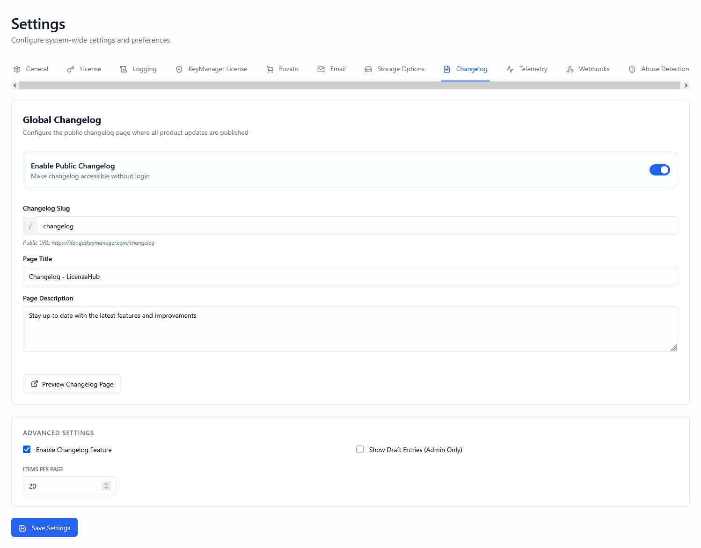
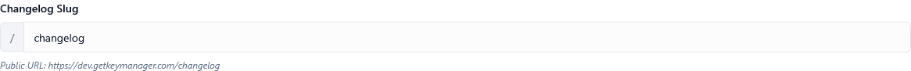

*Screenshot of Changelog Settings tab*

---

## Overview

Changelog settings control how your product updates, releases, and version history are displayed to customers and the public. A well-configured changelog:

* Keeps customers informed about new features, fixes, and improvements
* Builds transparency and trust with your user base
* Improves SEO through regularly updated content
* Reduces support inquiries by proactively communicating changes
* Demonstrates active development and product momentum

These controls work together:

1. **Enable Changelog** – Turns the changelog feature on or off
2. **Public Access** – Controls whether the changelog is publicly accessible
3. **Items Per Page** – Manages pagination for better user experience
4. **Show Drafts** – Allows previewing unpublished entries
5. **Changelog Slug** – Defines the URL path for accessing the changelog

---

## Enable Changelog

**Type:** Toggle (On / Off)  
**Default:** On

### Description

Enables or disables the changelog feature system-wide.

* **ON**: Changelog entries are stored and can be displayed to users
* **OFF**: The changelog feature is completely disabled. No entries are shown, and the changelog URL returns 404

### When to Enable

Enable this option if:

✅ You want to communicate product updates to customers  
✅ You're building a SaaS product with regular releases  
✅ You want to improve transparency and customer trust  
✅ You need to demonstrate active development for sales/marketing  
✅ You want to reduce "What's new?" support questions  

### When to Disable

You may disable the changelog if:

🔧 Your product is in early development with no public releases  
🔧 You communicate updates through other channels exclusively (email, in-app notifications)  
🔧 You're temporarily rebranding or restructuring your content  
🔧 Your product is in maintenance mode with no planned updates  

> ⚠️ **Warning**: Disabling the changelog also disables all public access, regardless of the Public Access setting.

---

## Public Access

**Type:** Toggle (On / Off)  
**Default:** Off


*Screenshot showing public access toggle*

### Description

Determines whether the changelog is accessible to **non-authenticated users** (the general public, search engines, potential customers).

* **ON**: Anyone can view the changelog at your configured URL (no login required)
* **OFF**: Only authenticated users (logged-in customers) can view the changelog

### How It Works

When **Public Access is ON**:
1. Changelog is accessible at your public URL (e.g., `yoursite.com/changelog`)
2. Search engines can index your updates (improves SEO)
3. Potential customers can see your development activity
4. No authentication or login is required
5. Social media shares work without requiring login

When **Public Access is OFF**:
1. Users must be logged in to view changelog
2. Unauthenticated visitors see a 403 Forbidden or redirect to login
3. Content is not indexed by search engines
4. Only existing customers can see updates

### When to Enable

Enable public access if:

✅ You want to attract new customers by showcasing active development  
✅ You're building a public SaaS product or marketplace item  
✅ You want SEO benefits from regularly updated content  
✅ Your marketing strategy includes transparent public updates  
✅ You want to build trust with potential customers before purchase  
✅ You're competing in a crowded market and want to stand out  

### When to Disable

Keep public access disabled if:

❌ Your product is enterprise/B2B with confidential features  
❌ Updates contain competitive or proprietary information  
❌ You only want existing customers to see what's new  
❌ Your product is in private beta or early access  
❌ Updates include security fixes you don't want to disclose publicly  
❌ You prefer controlled communication through email only  

### SEO Considerations

**Public Changelog Benefits:**
* Fresh, regularly updated content signals site activity to Google
* Keyword-rich update descriptions improve search rankings
* Structured data markup can generate rich snippets
* Internal linking opportunities to feature pages
* Builds domain authority through quality content

**SEO Best Practices:**
1. Use descriptive titles with product keywords
2. Write detailed release notes (not just version numbers)
3. Include screenshots or videos of new features
4. Link to related documentation or tutorials
5. Use consistent formatting and semantic HTML
6. Add meta descriptions for major releases

💡 **Tip**: Public changelogs perform exceptionally well for developer tools, SaaS products, and marketplace items.

---

## Items Per Page

**Type:** Numeric input  
**Default:** 10  
**Range:** 5-50


*Screenshot showing pagination configuration*

### Description

Defines **how many changelog entries** are displayed per page before pagination is applied.

This setting directly impacts:
* Page load time (fewer items = faster load)
* User experience (scrolling vs clicking through pages)
* Mobile device performance
* Search engine crawling efficiency

### How It Works

1. Entries are ordered by date (newest first by default)
2. The first N entries are shown on page 1
3. Remaining entries are split across additional pages
4. Pagination controls appear at the bottom
5. URL parameters track current page (e.g., `?page=2`)

### Example Scenarios

| Items Per Page | Behavior | Use Case |
| -------------- | -------- | -------- |
| **5** | Very few entries per page; many pages | Mobile-first products, slow connections |
| **10** | Balanced pagination | **Recommended default** for most products |
| **20** | More content per page; fewer pages | Desktop software, users expect scrolling |
| **50** | Maximum allowed; minimal pagination | Archive pages, power users |

### Real-World Examples

**Scenario 1: SaaS with Weekly Updates**
- 52 updates per year
- **10 items per page** = 6 pages total
- Users see approximately 2.5 months per page
- Good balance for engagement

**Scenario 2: Desktop Software with Quarterly Releases**
- 4-8 updates per year
- **5 items per page** = 1-2 pages total
- All recent updates visible on first page
- Minimal pagination needed

**Scenario 3: API Platform with Daily Changes**
- 250+ updates per year
- **20 items per page** = 13 pages total
- Users can scan more updates at once
- Power users appreciate less clicking

### Best Practices

**Choosing the Right Value:**
1. Consider your release frequency (daily vs monthly)
2. Test on mobile devices (scrolling experience)
3. Measure actual page load times
4. Analyze user behavior (do they go to page 2?)
5. Consider your typical entry length (short bullets vs long descriptions)

**Performance Guidelines:**
- **5 items**: Best for very detailed entries with images/videos
- **10 items**: Ideal for medium-length updates with occasional screenshots
- **20 items**: Good for bullet-point style updates
- **50 items**: Only for plain text, short entries

💡 **Tip**: Start with 10 and adjust based on user feedback and analytics.

---

## Show Drafts

**Type:** Toggle (On / Off)  
**Default:** Off


*Screenshot showing draft visibility toggle*

### Description

Controls whether **draft (unpublished) changelog entries** are visible to administrators in the changelog view.

* **ON**: Draft entries appear with a "DRAFT" label (only visible to admins)
* **OFF**: Only published entries are shown, even to admins

### What Happens When Enabled

When **Show Drafts is ON**:
1. 📝 Draft entries appear in the changelog with clear "DRAFT" indicator
2. 👥 Only users with admin permissions can see drafts
3. 🔍 Admins can preview how entries will look when published
4. ✏️ Clicking a draft entry may allow quick editing
5. 🚫 Public users and regular customers never see drafts

### When to Enable

Enable draft visibility if:

✅ You're actively preparing upcoming release notes  
✅ Multiple team members collaborate on changelog content  
✅ You want to preview entries in context before publishing  
✅ You're scheduling releases and need to see upcoming announcements  
✅ You're testing entry formatting and layout  

### When to Disable

Keep disabled if:

❌ You prefer a clean view of published content only  
❌ Drafts are managed in a separate CMS or tool  
❌ You don't want to be distracted by unpublished content  
❌ You have many drafts that clutter the changelog view  

### Content Management Workflow

**Typical Process:**
1. Create new changelog entry as draft
2. Write and format the content
3. Add screenshots, links, or embedded media
4. Enable "Show Drafts" to preview in context
5. Share preview link with team for review
6. Make revisions based on feedback
7. Publish when ready (or schedule publication)
8. Disable "Show Drafts" for clean view

**Team Collaboration:**
- Marketing writes draft announcing new feature
- Product manager reviews and adds technical details
- Support team adds troubleshooting notes
- All preview together with drafts visible
- Publish when everyone approves

💡 **Tip**: Enable drafts when preparing major release announcements to perfect your messaging.

---

## Changelog Slug

**Type:** Text input  
**Default:** `changelog`  
**Format:** Lowercase alphanumeric, hyphens allowed, no spaces


*Screenshot showing slug customization*

### Description

Defines the **URL path segment** where the changelog is accessible.

For example:
- Slug: `changelog` → URL: `yoursite.com/changelog`
- Slug: `updates` → URL: `yoursite.com/updates`
- Slug: `release-notes` → URL: `yoursite.com/release-notes`
- Slug: `whats-new` → URL: `yoursite.com/whats-new`

### Formatting Rules

✅ **Allowed:**
- Lowercase letters: `a-z`
- Numbers: `0-9`
- Hyphens: `-`
- Length: 3-50 characters

❌ **Not Allowed:**
- Uppercase letters (automatically converted to lowercase)
- Spaces (use hyphens instead)
- Special characters: `@`, `#`, `$`, `%`, etc.
- Slashes: `/` (only one level deep)
- Reserved words: `admin`, `api`, `login`, `logout`

### Popular Slug Options

| Slug | URL Example | Brand/Industry |
| ---- | ----------- | -------------- |
| `changelog` | `app.example.com/changelog` | Developer tools, technical products |
| `updates` | `example.com/updates` | SaaS products, general software |
| `release-notes` | `example.com/release-notes` | Enterprise software, B2B products |
| `whats-new` | `example.com/whats-new` | Consumer apps, friendly brands |
| `news` | `example.com/news` | Multi-purpose (may include blog) |
| `product-updates` | `example.com/product-updates` | Marketing-focused brands |
| `releases` | `example.com/releases` | Open-source projects, version-focused |

### Branding Considerations

**Technical/Developer Audience:**
- Use `changelog`, `release-notes`, or `releases`
- Matches industry expectations
- Familiar terminology for technical users

**Consumer/General Audience:**
- Use `updates`, `whats-new`, or `news`
- More approachable language
- Less intimidating for non-technical users

**Enterprise/Professional:**
- Use `release-notes`, `product-updates`
- Formal tone matches business context
- Conveys stability and professionalism

### SEO Impact

**Better SEO:**
- `updates` - Higher search volume, more competitive
- `whats-new` - Natural language, voice search friendly
- `product-updates` - Longer tail, specific intent

**Developer-Focused SEO:**
- `changelog` - Technical term, developer searches
- `release-notes` - Documentation-style searches
- `api-updates` - Very specific, low competition

### Changing the Slug

⚠️ **Warning**: Changing the slug breaks existing links!

**If you must change it:**
1. Document the old URL in your redirect plan
2. Set up a 301 redirect from old slug to new slug
3. Update all internal links pointing to changelog
4. Update social media profiles and marketing materials
5. Notify customers of the new URL (if widely shared)
6. Update sitemap.xml with new URL
7. Submit new URL to Google Search Console

💡 **Tip**: Choose carefully from the start – consistency is valuable for SEO and bookmarks.

---

## Recommended Configurations

### Public SaaS Product

**Maximum transparency and engagement**

* **Enable Changelog:** ON
* **Public Access:** ON
* **Items Per Page:** 10
* **Show Drafts:** OFF (ON during release prep)
* **Changelog Slug:** `updates` or `changelog`

**Reasoning:** Public changelog builds trust, attracts customers, and improves SEO. Standard pagination handles regular release cadence.

---

### Enterprise B2B Software

**Customer-only updates with confidential features**

* **Enable Changelog:** ON
* **Public Access:** OFF
* **Items Per Page:** 10
* **Show Drafts:** OFF
* **Changelog Slug:** `release-notes`

**Reasoning:** Updates contain proprietary information. Only authenticated customers should see feature roadmap.

---

### Open-Source / Developer Tool

**Maximum visibility and community engagement**

* **Enable Changelog:** ON
* **Public Access:** ON
* **Items Per Page:** 20
* **Show Drafts:** OFF
* **Changelog Slug:** `changelog` or `releases`

**Reasoning:** Open development. Developers expect detailed technical changelogs. Higher items-per-page suits technical audience.

---

### Mobile App / Consumer Product

**User-friendly updates with approachable language**

* **Enable Changelog:** ON
* **Public Access:** ON
* **Items Per Page:** 5-7
* **Show Drafts:** OFF
* **Changelog Slug:** `whats-new`

**Reasoning:** Mobile users prefer less scrolling. Friendly language attracts consumer audience. Lower items-per-page optimized for mobile.

---

### Marketplace Product (Envato, WordPress, etc.)

**Public visibility for discoverability**

* **Enable Changelog:** ON
* **Public Access:** ON
* **Items Per Page:** 10-15
* **Show Drafts:** OFF
* **Changelog Slug:** `changelog` or `updates`

**Reasoning:** Marketplace buyers check changelog before purchasing. Public access increases sales. Detailed history demonstrates active development.

---

## Important Notes

⚠️ **Changing Public Access doesn't affect logged-in users** – they always see the changelog if enabled

🔄 **Slug changes break existing links** – implement redirects if you change it

📊 **Monitor analytics** to see which updates get the most views

📝 **Maintain consistent formatting** across all changelog entries for professional appearance

📧 **Combine with email notifications** for comprehensive customer communication

🔍 **Use structured data markup** (Schema.org) for better search engine visibility

🎨 **Match your brand voice** – technical or friendly tone depends on your audience

---

## Summary Table

| Setting | Purpose | Typical Value |
| ------- | ------- | ------------- |
| Enable Changelog | Master switch for changelog feature | ON |
| Public Access | Allow unauthenticated access | ON (public SaaS), OFF (enterprise) |
| Items Per Page | Pagination control | 10 (mobile: 5-7, technical: 20) |
| Show Drafts | Preview unpublished entries | OFF (ON during prep) |
| Changelog Slug | URL path for changelog | `changelog`, `updates`, or `release-notes` |

---

## Testing Your Configuration

### Step 1: Enable Changelog and Configure Settings

Set your desired configuration, including slug and public access settings.

### Step 2: Create Test Entries

Add 15-20 test changelog entries with varying dates to test pagination.

### Step 3: Test Public Access

**If Public Access ON:**
- Open an incognito/private browser window
- Navigate to `yoursite.com/[your-slug]`
- Verify changelog appears without login
- Check that draft entries are NOT visible

**If Public Access OFF:**
- While logged out, navigate to the changelog URL
- Verify you're redirected to login or see 403 error
- Log in and verify changelog appears

### Step 4: Test Pagination

- Verify items per page setting is working correctly
- Click through multiple pages
- Check that page numbers update in URL
- Test "next" and "previous" buttons

### Step 5: Test Draft Visibility

- Create a draft entry
- Enable "Show Drafts" (as admin)
- Verify draft appears with clear indicator
- Log out and verify draft is NOT visible publicly
- Disable "Show Drafts" and verify draft disappears from admin view

### Step 6: Test Slug Changes (Optional)

- Note your current changelog URL
- Change the slug to something different
- Verify the changelog appears at new URL
- Verify old URL returns 404
- Change slug back (or set up redirect)

### Step 7: Verify Mobile Experience

- Open changelog on mobile device
- Check readability and scrolling
- Verify pagination works on touch devices
- Test with different items-per-page values

---

## Frequently Asked Questions

**Q: Can I have different changelog settings for different products?**  
A: No, changelog settings are global. All products share the same changelog configuration. Use categories or tags within entries to filter by product.

**Q: How do I schedule a changelog entry for future publication?**  
A: Create the entry as a draft, then set a publication date. The entry will automatically publish at the scheduled time. Keep "Show Drafts" on if you want to preview it.

**Q: Will changing the slug affect my SEO?**  
A: Yes. Search engines have indexed your old URL. Implement a 301 redirect and update your sitemap. SEO recovery typically takes 2-4 weeks.

**Q: Can customers subscribe to changelog updates?**  
A: This depends on your notification settings. Check the Email Settings or Webhooks configuration to enable changelog subscriptions.

**Q: What's the best items-per-page value for SEO?**  
A: 10-20 items provides good balance. Too few (5) creates excessive pagination that search engines may not fully crawl. Too many (50) can slow page load times.

**Q: Can I embed the changelog on my marketing website?**  
A: Yes, if Public Access is ON. Use an iframe or fetch via API and display with custom styling. Ensure your CORS settings allow embedding.

**Q: Do drafts affect my published entry count?**  
A: No, drafts are not counted toward pagination. Only published entries appear in the public-facing changelog.

**Q: Can I use a custom domain for my changelog?**  
A: This depends on your hosting setup. Most platforms support custom domains. Your changelog would then be accessible at `changelog.yourdomain.com`.

**Q: How do I write effective changelog entries?**  
A: Follow this format:
- Clear title with version number
- Date of release
- Categorize updates: New Features, Improvements, Bug Fixes
- Use bullet points for scanability
- Include screenshots for visual changes
- Link to detailed documentation
- Avoid jargon (unless technical audience)

**Q: Should I include bug fixes in public changelog?**  
A: Yes, but frame positively: "Fixed issue where..." rather than "Bug that caused..." This shows you're actively maintaining the product without alarming users.

---

## Content Strategy Best Practices

### Version Numbering

**Semantic Versioning (SemVer):**
- **Major (v2.0.0):** Breaking changes, significant features
- **Minor (v1.5.0):** New features, backward compatible
- **Patch (v1.4.3):** Bug fixes, minor improvements

**Date-Based Versioning:**
- **v2024.01:** Year and month
- **v24.1.5:** Year, month, and revision
- Good for SaaS with continuous deployment

**Named Releases:**
- **v2.0 "Phoenix":** Marketing-friendly names
- Great for major versions
- Creates anticipation and brand identity

### Writing Style

**Technical Audience (Developer Tools):**
```
v2.3.0 - API Rate Limiting

- Added rate limiting to REST API endpoints (100 req/min)
- Implemented exponential backoff in SDK retry logic
- Deprecated legacy /v1/auth endpoint (remove in v3.0)
- Fixed race condition in concurrent license validation
```

**Consumer Audience (SaaS App):**
```
February 2024 Update - Work Smarter! 🚀

We've been busy making things better for you:

✨ New drag-and-drop dashboard customization
📊 Beautiful new analytics charts
🐛 Fixed an issue where some emails weren't sending
💪 Everything loads faster now
```

**Enterprise Audience (B2B Software):**
```
Release 2.3.0 - February 15, 2024

New Features:
- Single Sign-On (SSO) with SAML 2.0 support
- Advanced audit logging for compliance requirements
- Custom role-based access controls (RBAC)

Improvements:
- 40% performance improvement in report generation
- Enhanced data export options (CSV, Excel, PDF)
```

### Update Frequency

| Product Type | Recommended Frequency | Example |
| ------------ | -------------------- | ------- |
| **SaaS with CI/CD** | Weekly or bi-weekly | Group related changes together |
| **Desktop Software** | Monthly or quarterly | Align with major releases |
| **Mobile Apps** | Per app store release | Match version submissions |
| **API/Developer Tools** | Per deployment | Even minor changes documented |
| **Enterprise Software** | Quarterly | Scheduled maintenance windows |

### Entry Structure Template

```markdown
# Version X.Y.Z - Release Name (if applicable)

**Release Date:** Month DD, YYYY

## 🎉 New Features
- [Feature name]: Brief description with benefit
- [Feature name]: Brief description with benefit

## ⚡ Improvements  
- Enhanced [component]: What's better now
- Optimized [process]: Performance gains

## 🐛 Bug Fixes
- Fixed issue where [problem description]
- Resolved [specific bug] affecting [user group]

## 🔧 Technical Changes
- Updated dependency X to version Y
- Migrated to new infrastructure (developer-facing)

## 📚 Documentation
- New guide: [Link to guide]
- Updated API reference: [Link]

## ⚠️ Breaking Changes (if applicable)
- [Change description]
- Migration guide: [Link]
```

---

## Integration with Customer Communication

### Multi-Channel Strategy

**Changelog (Passive):**
- Central source of truth
- Historical reference
- SEO benefits
- Self-service information

**Email Notifications (Proactive):**
- Push updates to customers
- Higher visibility
- Time-sensitive announcements
- Personalized messages

**In-App Notifications (Contextual):**
- Feature discovery
- Right-place, right-time
- Interactive tutorials
- Engagement tracking

**Social Media (Marketing):**
- Reach wider audience
- Build excitement
- Visual content
- Community engagement

### Best Practice: Coordinated Releases

1. **T-minus 3 days:** Publish draft in changelog
2. **T-minus 1 day:** Share preview with team
3. **Launch day:** 
   - Publish changelog entry
   - Send email to customers
   - Post on social media
   - Show in-app notification
   - Update documentation
4. **T-plus 1 week:** Review engagement metrics

💡 **Tip**: Link all communication channels back to the canonical changelog entry for consistency.

---

## How to Access

1. Log in to the Admin Portal
2. Navigate to **Settings** in the main menu
3. Click the **Changelog** tab
4. Configure your desired settings
5. Click **Save Settings** at the bottom

Changes take effect immediately upon saving.

---

## Related Settings

- [Settings Overview]() - All settings tabs
- [General Settings]() - Site-wide configuration
- [Email Settings]() - Notification preferences
- [Webhooks]() - Automate changelog notifications

---

**A well-maintained changelog demonstrates commitment to your product and customers. Configure these settings thoughtfully to maximize trust, transparency, and engagement.**
