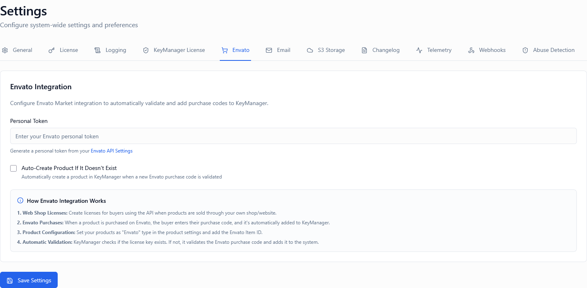
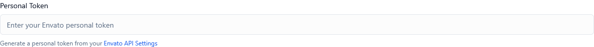

*Screenshot of Envato Integration tab*

---

## Overview

The Envato Integration connects your license management system directly to **Envato Market** (ThemeForest, CodeCanyon, VideoHive, AudioJungle, etc.), enabling **automatic license synchronization** from customer purchases. When configured correctly, it helps you:

* Automatically create licenses when customers purchase your products
* Synchronize purchase codes from Envato to your system
* Eliminate manual license creation for marketplace sales
* Reduce administrative overhead and human error
* Provide instant license delivery to customers
* Maintain accurate records of Envato-based sales

These settings work together:

1. **Envato Personal Token** – Authenticates API access to your Envato account
2. **Auto-Create Products Toggle** – Automatically creates product records when purchases are detected

---

## Envato Personal Token

**Type:** Text input (API Token)  
**Default:** Empty (not configured)  
**Required:** Yes (for integration to function)

*Screenshot showing token input field*

### Description

Your **Envato Personal Token** is an API authentication key that grants KeyManager secure, read-only access to your Envato purchase data. This token allows the system to:

* Verify customer purchases from Envato Market
* Retrieve purchase codes and buyer information
* Synchronize license data automatically
* Access item (product) details from your portfolio

The token is stored **securely encrypted** in the database and never exposed in logs or API responses.

### Security & Permissions

The token must have the following permissions enabled:

| Permission | Required | Purpose |
|------------|----------|---------|
| **View and search Envato sites** | ✅ Yes | Access to marketplace APIs |
| **View your purchases** | ✅ Yes | Retrieve customer purchase data |
| **View your item sales** | ✅ Yes | Access sales information for your items |
| **Download your purchased items** | ❌ No | Not needed for license sync |

⚠️ **Security Warning**: Never share your personal token or commit it to version control. Treat it like a password.

### How to Generate an Envato Personal Token

Follow these steps to create your token:

#### Step 1: Log in to Envato Market

1. Go to [https://build.envato.com/create-token/](https://build.envato.com/create-token/)
2. Log in with your Envato account (the account that sells products)
3. You'll be redirected to the token creation page

#### Step 2: Configure Token Permissions

1. Enter a **Token Name** (e.g., "KeyManager License Sync")
2. Enable these permissions:
   * ✅ **View and search Envato sites**
   * ✅ **View your purchases**
   * ✅ **View your item sales**
3. Leave other permissions disabled for security
4. Click **Create Token**

#### Step 3: Copy and Save Token

1. The token will be displayed **once** – copy it immediately
2. Store it securely (password manager recommended)
3. Paste it into the **Envato Personal Token** field in KeyManager
4. Click **Save Settings**

⚠️ **Important**: If you lose the token, you must generate a new one. Envato does not display tokens again after creation.

### Token Validation

After entering your token, KeyManager will:

1. ✅ Validate the token format
2. ✅ Test API connectivity to Envato
3. ✅ Verify required permissions are granted
4. ✅ Confirm your account has items for sale
5. ❌ Display an error if validation fails

💡 **Tip**: If validation fails, check that all required permissions are enabled on your token.

### When Token Is Required

You must configure a valid token if:

✅ You sell products on Envato Market (ThemeForest, CodeCanyon, etc.)  
✅ You want automatic license creation from Envato purchases  
✅ You want to verify customer purchase codes  
✅ You need to synchronize Envato sales with your license database  

### When Token Is Not Needed

You can leave this empty if:

❌ You don't sell products on Envato Market  
❌ You manually create all licenses  
❌ You use direct sales channels only (no marketplace sales)  
❌ You handle Envato purchases through a different system  

### Token Expiration and Rotation

Envato Personal Tokens **do not expire automatically**, but you should:

* 🔄 Rotate tokens annually for security
* 🔄 Regenerate if token is compromised
* 🔄 Update token if you change Envato accounts
* 🔄 Revoke old tokens when generating new ones

### Real-World Example: WordPress Theme Seller

**Scenario**: You sell a WordPress theme on ThemeForest

1. Customer purchases your theme for $59
2. Envato generates a **purchase code** (e.g., `abc123-def456-ghi789`)
3. KeyManager uses your personal token to query Envato API
4. API returns purchase details (buyer, item, purchase code)
5. KeyManager creates a license record automatically
6. Customer receives license key via email or download page
7. Customer activates theme using the license key

Without this integration, you would need to:
* Manually check Envato sales
* Manually create each license
* Manually send keys to customers
* Risk delays and errors

### Troubleshooting Connection Issues

| Error | Cause | Solution |
|-------|-------|----------|
| **Invalid token format** | Token copied incorrectly | Copy entire token, including all characters |
| **Unauthorized** | Missing permissions | Regenerate token with correct permissions |
| **API connection failed** | Network or Envato outage | Wait and retry; check Envato status page |
| **No items found** | Account has no products | Verify you're using seller account, not buyer account |
| **Token expired** | Token was revoked | Generate new token from Envato |

### Best Practices

**Security:**
1. ✅ Use a unique token for KeyManager (don't reuse across services)
2. ✅ Store token in a password manager
3. ✅ Never commit token to git repositories
4. ✅ Rotate token annually
5. ✅ Revoke token immediately if compromised

**Management:**
1. 📝 Document when token was created
2. 📝 Set calendar reminder for annual rotation
3. 📝 Test token after creation before relying on it
4. 📝 Have a backup plan if token fails
5. 📝 Monitor sync logs for authentication errors

💡 **Tip**: Create a dedicated Envato team member account for API integrations to avoid disruption if personal accounts change.

---

## Auto-Create Products Toggle

**Type:** Toggle (On / Off)  
**Default:** Off  

*Screenshot showing auto-create toggle*

### Description

Automatically creates **product records** in KeyManager when purchases are detected from Envato Market that don't match existing products.

* **ON**: New products are created automatically when Envato purchases are synchronized
* **OFF**: Only licenses are created; products must exist in KeyManager beforehand

This setting determines whether KeyManager should:
* Automatically discover new products from Envato sales
* Create product records on-the-fly
* Link Envato items to KeyManager products

### How It Works

#### When Auto-Create Is Enabled (ON)

1. KeyManager syncs purchase from Envato API
2. System checks if product exists (matches by Envato Item ID)
3. **If product doesn't exist:**
   * ✅ Product record is created automatically
   * ✅ Product name, description pulled from Envato
   * ✅ Envato Item ID is linked
   * ✅ License is created and associated
4. **If product exists:**
   * ✅ License is created and associated with existing product

#### When Auto-Create Is Disabled (OFF)

1. KeyManager syncs purchase from Envato API
2. System checks if product exists (matches by Envato Item ID)
3. **If product doesn't exist:**
   * ❌ Sync fails or is skipped
   * ❌ License is not created
   * ⚠️ Warning logged for manual review
4. **If product exists:**
   * ✅ License is created and associated with existing product

### Product Matching Logic

KeyManager matches Envato items to products using:

| Identifier | Priority | Description |
|------------|----------|-------------|
| **Envato Item ID** | 1st | Unique numeric ID from Envato (e.g., 12345678) |
| **Product Name** | 2nd | Fallback if Item ID not configured |
| **SKU** | 3rd | Manual mapping via SKU field |

💡 **Best Practice**: Always configure Envato Item ID in product settings for reliable matching.

### When to Enable

Enable auto-create if:

✅ You frequently launch new products on Envato  
✅ You want minimal manual configuration  
✅ You trust Envato data as source of truth  
✅ You prefer automated workflows  
✅ You have many products to manage  

### When to Disable

Disable auto-create if:

❌ You want full control over product creation  
❌ You manually curate product information  
❌ You need custom product configurations  
❌ You want to prevent accidental product creation  
❌ You have strict product approval workflows  

### Example Scenarios

#### Scenario 1: Theme Marketplace Seller (Auto-Create ON)

**Setup:**
* Sells 15 WordPress themes on ThemeForest
* Launches new themes monthly
* Auto-Create Products: **ON**

**Workflow:**
1. Developer publishes new theme "Modern Portfolio Pro" on ThemeForest
2. First customer purchases the theme
3. KeyManager detects purchase, creates product automatically
4. Product name: "Modern Portfolio Pro"
5. License created and linked
6. Customer activates immediately
7. Zero manual intervention required

**Benefits:**
* ✅ Instant setup for new products
* ✅ No delay between launch and licensing
* ✅ Reduced administrative work

---

#### Scenario 2: Plugin Developer (Auto-Create OFF)

**Setup:**
* Sells 3 premium plugins on CodeCanyon
* Products have complex configurations
* Auto-Create Products: **OFF**

**Workflow:**
1. Admin manually creates product in KeyManager
2. Configures activation limits, features, pricing tiers
3. Sets Envato Item ID in product settings
4. Customer purchases plugin on CodeCanyon
5. KeyManager syncs purchase, finds matching product
6. License created with pre-configured settings
7. Customer activates with correct limits

**Benefits:**
* ✅ Full control over product configuration
* ✅ Custom settings applied automatically
* ✅ Consistent product structure

---

#### Scenario 3: Multi-Marketplace Seller (Auto-Create ON, with caution)

**Setup:**
* Sells on ThemeForest AND CodeCanyon
* Same product may appear on multiple marketplaces
* Auto-Create Products: **ON**

**Risk:**
* ⚠️ Same product might be created twice (once per marketplace)

**Solution:**
* 🔧 Manually configure Envato Item IDs after first sync
* 🔧 Use SKU field to link marketplace variants
* 🔧 Consider disabling auto-create for better control

---

### What Gets Auto-Created

When a product is auto-created, KeyManager sets:

| Field | Source | Notes |
|-------|--------|-------|
| **Product Name** | Envato item name | Directly from marketplace |
| **Description** | Envato item description | Truncated if too long |
| **Envato Item ID** | Envato API | Used for future matching |
| **Status** | Active | Product is immediately usable |
| **Activation Limit** | Default from settings | Typically 1 or 3 |
| **License Type** | Default from settings | Usually "regular" |
| **Price** | Not synced | Must be set manually if needed |

💡 **Tip**: Review auto-created products periodically to verify settings and update descriptions.

### Manual vs Automatic Product Creation

| Approach | Pros | Cons |
|----------|------|------|
| **Manual (Auto-Create OFF)** | Full control, custom configuration, predictable structure | Requires setup before sales, manual work per product, potential sync failures |
| **Automatic (Auto-Create ON)** | Zero configuration, instant availability, scales effortlessly | Less control, generic defaults, potential duplicates |

### Hybrid Approach (Recommended)

Many sellers use a hybrid strategy:

1. **Enable Auto-Create** for initial setup
2. Let first purchase create product automatically
3. **Immediately review** auto-created product
4. Customize settings (limits, features, pricing)
5. Product is now properly configured
6. Future purchases use refined settings

This balances automation with control.

---

## Recommended Configurations

### High-Volume Theme/Plugin Sellers

**Many products, frequent launches**

* **Envato Personal Token:** Configured with all required permissions
* **Auto-Create Products:** ON

**Reasoning:** Automation scales better. Manual product creation becomes bottleneck with 20+ items.

---

### Boutique Product Creators

**Few products, premium positioning**

* **Envato Personal Token:** Configured
* **Auto-Create Products:** OFF

**Reasoning:** Premium products need custom configuration. Manual setup ensures quality.

---

### New to Envato Market

**First product launch**

* **Envato Personal Token:** Configured
* **Auto-Create Products:** ON (for first purchase), then OFF

**Reasoning:** Let first purchase auto-create product, then refine settings and disable to prevent issues.

---

### Multi-Product Bundles

**Selling product bundles or tiered licenses**

* **Envato Personal Token:** Configured
* **Auto-Create Products:** OFF

**Reasoning:** Bundles require complex configuration. Auto-create can't handle multi-product relationships.

---

## Important Notes

⚠️ **Personal Token is required** for any Envato integration to function

🔐 **Token security is critical** – treat it like a password

🔄 **Auto-created products use default settings** – review and customize after creation

📊 **Purchase sync runs periodically** – not real-time (typically every 15-30 minutes)

🔗 **Envato Item ID is the key** – configure it manually for reliable product matching

📧 **Customer notifications** still follow your email settings (Envato integration doesn't override)

⚠️ **Refunds aren't auto-synced** – handle Envato refunds manually in KeyManager

💡 **Test with sandbox purchases** before relying on production sync

---

## Complete Integration Workflow

### Initial Setup

1. Generate Envato Personal Token with correct permissions
2. Enter token in KeyManager settings
3. Validate token (automatic)
4. Decide on auto-create strategy (ON or OFF)
5. Save settings

### For Each Product

1. **If Auto-Create OFF:** Create product manually in KeyManager first
2. Set Envato Item ID in product settings
3. Configure activation limits, features, etc.
4. Publish product (if not already published)
5. Product is now ready for Envato purchase sync

### When Purchase Occurs

1. Customer buys product on Envato Market
2. Envato generates purchase code
3. KeyManager syncs purchase (next scheduled sync)
4. License is created (and product if auto-create enabled)
5. Customer receives license key via configured delivery method
6. Customer activates product using license key
7. Activation is validated against Envato purchase code

### Ongoing Maintenance

1. Monitor sync logs for errors
2. Review auto-created products weekly
3. Update product configurations as needed
4. Rotate personal token annually
5. Handle edge cases (refunds, chargebacks) manually

---

## Purchase Code Validation

When Envato integration is active, KeyManager can validate purchase codes:

### Validation Process

1. Customer provides Envato purchase code (e.g., `abc123-def456-ghi789`)
2. KeyManager queries Envato API using your personal token
3. Envato confirms purchase is valid and matches your item
4. KeyManager creates or updates license record
5. Customer receives license key

### Benefits

* ✅ Prevents fake purchase codes
* ✅ Verifies customer actually purchased your product
* ✅ Links Envato purchase to KeyManager license
* ✅ Enables support verification
* ✅ Provides audit trail

### Use Cases

| Scenario | Validation Method |
|----------|-------------------|
| **Automatic sync** | KeyManager syncs purchases periodically |
| **Manual verification** | Support team validates purchase code on demand |
| **Customer self-service** | Customer enters purchase code to retrieve license |
| **Support portal** | Customer proves purchase ownership |

---

## Summary Table

| Setting | Purpose | Typical Value |
| ---------------------- | ----------------------------- | ------------- |
| Envato Personal Token | Authenticates API access | Your unique token from Envato |
| Auto-Create Products | Automates product creation | OFF (manual control) or ON (full automation) |

---

## Testing Your Configuration

### Step 1: Generate Test Token

Create a personal token with required permissions on Envato.

### Step 2: Configure in KeyManager

1. Paste token into **Envato Personal Token** field
2. Set **Auto-Create Products** to ON (for testing)
3. Click **Save Settings**
4. Verify validation succeeds

### Step 3: Make Test Purchase (Sandbox)

If Envato provides a sandbox environment, make a test purchase. Otherwise, use a real purchase of your own product.

### Step 4: Trigger Manual Sync

If available, trigger a manual sync. Otherwise, wait for scheduled sync (15-30 minutes).

### Step 5: Verify Product Creation

1. Go to **Products** page
2. Check if product was created automatically
3. Verify product details match Envato item

### Step 6: Verify License Creation

1. Go to **Licenses** page
2. Check if license was created for the purchase
3. Verify license is linked to correct product
4. Check purchase code is stored

### Step 7: Test Activation

Use the license key to activate the product (via SDK or API) and confirm it works.

### Step 8: Adjust Settings

Based on test results:
* If auto-create worked well, keep ON
* If you want more control, set to OFF
* Update product settings as needed

---

## Frequently Asked Questions

**Q: What Envato marketplaces are supported?**  
A: All Envato Market platforms: ThemeForest, CodeCanyon, VideoHive, AudioJungle, GraphicRiver, PhotoDune, 3DOcean, and ActiveDen.

**Q: Is the integration real-time?**  
A: No, purchases are synced periodically (typically every 15-30 minutes). Near-real-time delivery usually occurs within this window.

**Q: What if I sell the same product on multiple marketplaces?**  
A: Each marketplace item has a unique Envato Item ID. You may need to create separate products or manually map multiple IDs to one product.

**Q: Can I sync historical purchases?**  
A: Yes, on initial setup, KeyManager can sync recent purchases (typically last 30-90 days, depending on API limits).

**Q: What happens if my token expires or is revoked?**  
A: Sync will fail and an error will be logged. You'll need to generate a new token and update settings.

**Q: Can customers use their Envato purchase code directly as a license key?**  
A: No, Envato purchase codes are used for verification. KeyManager generates separate license keys for activation.

**Q: Do I need separate tokens for each marketplace?**  
A: No, one personal token grants access to all your items across all Envato marketplaces.

**Q: What about Envato Elements subscriptions?**  
A: Envato Elements uses a different model (subscription vs. purchase). This integration is for Envato Market purchases only.

**Q: Can I disable the integration temporarily?**  
A: Yes, simply remove the personal token and save. Sync will stop but existing licenses remain active.

**Q: What if a customer receives a refund on Envato?**  
A: Refunds are not automatically synced. You should manually suspend or revoke the license in KeyManager when processing Envato refunds.

---

## How to Access

1. Log in to the Admin Portal
2. Navigate to **Settings** in the main menu
3. Click the **Envato Integration** tab
4. Configure both settings
5. Click **Save Settings** at the bottom

---

## Related Settings

- [Settings Overview]() - All settings tabs
- [General Settings]() - Core configuration
- [License Settings]() - Activation limits and license behavior
- [Webhooks]() - Trigger actions on Envato purchases

---

**Proper Envato integration enables seamless license delivery for marketplace sales while maintaining full control over your license management system.**
