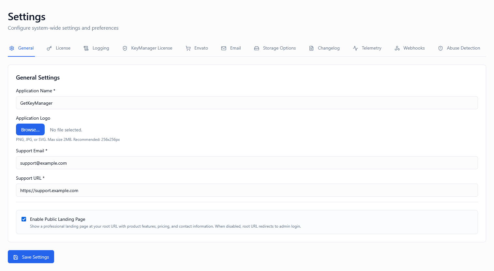
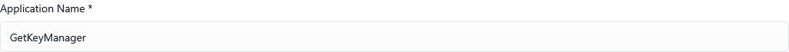
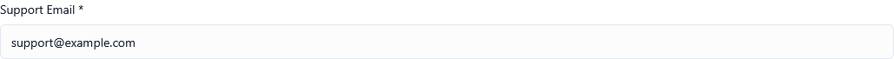
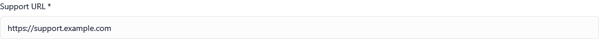
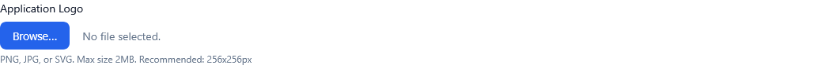
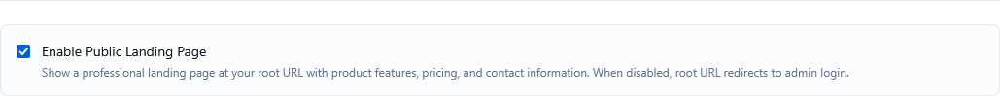

*Screenshot of General Settings tab*

---

## Overview

General Settings control the **core identity and branding** of your KeyManager platform. These settings define how your platform appears to users, customers, and support contacts. Proper configuration ensures:

* Professional brand presentation
* Clear support channels for customers
* Consistent visual identity across all portals
* Optimized landing page experience

These foundational settings include:

1. **Application Name** – Your platform's display name
2. **Support Email** – Primary contact for customer inquiries
3. **Support URL** – Link to your help center or documentation
4. **Logo Upload** – Custom branding image
5. **Landing Page Toggle** – Control homepage visibility

---

## Application Name

**Type:** Text input  
**Default:** "KeyManager"  
**Maximum Length:** 64 characters

*Screenshot showing application name configuration*

### Description

The application name appears throughout the platform interface, including:

* Browser page titles
* Email subject lines and footers
* User portal header
* Admin portal navigation
* API response metadata
* Customer-facing notifications

### When to Customize

Customize this setting when:

✅ You're white-labeling the platform for your brand  
✅ You want consistent branding across all touchpoints  
✅ You're running multiple instances for different brands  
✅ You need to match your company's official product name  

### Best Practices

**Naming Conventions:**
* Keep it short and memorable (2-3 words ideal)
* Use proper capitalization (e.g., "Acme License Portal")
* Avoid generic terms like "System" or "Platform"
* Match your official brand guidelines
* Consider SEO implications for public pages

**Examples:**

| Business Type | Application Name | Reasoning |
| ------------- | ---------------- | --------- |
| SaaS Company | "CloudSync Pro" | Matches product brand |
| Agency | "Client Portal - AgencyName" | Clear ownership |
| Enterprise | "Enterprise License Manager" | Professional, descriptive |
| Marketplace | "MarketName Licensing" | Reinforces marketplace brand |

### Real-World Example

**Scenario**: Software company "Acme Corp" selling multiple products

**Configuration:**
* Application Name: "Acme Licensing Hub"
* Result: All emails sent to customers show "Acme Licensing Hub" in subject lines
* Benefit: Professional, branded communication that builds trust

💡 **Tip**: If you operate multiple brands, deploy separate instances with different application names

---

## Support Email

**Type:** Email input  
**Default:** admin@yourdomain.com  
**Validation:** Must be valid email format

*Screenshot showing support email field*

### Description

The support email is displayed throughout the platform as the **primary contact point** for customer assistance. It appears in:

* User portal footer
* Error messages and alerts
* License suspension notifications
* Automated email footers
* API documentation pages
* Help tooltips

### When to Configure

Configure this immediately:

✅ During initial platform setup  
✅ When launching production environment  
✅ When changing support team structure  
✅ When implementing dedicated support channels  

### Best Practices

**Email Selection:**
1. Use a dedicated support address (e.g., support@, help@, licensing@)
2. Ensure it's monitored regularly (SLA: <24 hours response)
3. Set up auto-responders for acknowledgment
4. Configure spam filtering to prevent missed tickets
5. Use a shared inbox for team access

**Recommended Formats:**

| Format | Use Case | Notes |
| ------ | -------- | ----- |
| `support@domain.com` | General support | Most common, easy to remember |
| `licensing@domain.com` | Specific to licenses | Clear purpose |
| `help@domain.com` | User-friendly | Casual, approachable |
| `tickets@domain.com` | Ticketing system | Indicates formal process |

### Integration with Support Systems

**Popular Integrations:**
* **Zendesk**: Forward to your Zendesk email address
* **Freshdesk**: Use Freshdesk forwarding email
* **Help Scout**: Configure Help Scout mailbox
* **Intercom**: Set up Intercom forwarding
* **Gmail**: Use Google Workspace shared mailbox

### Real-World Example

**Scenario**: Growing SaaS company with 1,000+ licenses

**Initial Setup:**
* Support Email: `john@company.com` (founder's personal email)

**Problems Encountered:**
* Emails lost in personal inbox
* Slow response times
* No tracking or metrics

**Improved Setup:**
* Support Email: `licensing@company.com`
* Forwarded to Zendesk
* Team access for 3 support agents
* Auto-responder confirming receipt
* Average response time: 4 hours

⚠️ **Warning**: Never use a personal email address in production. Use shared, monitored addresses only.

---

## Support URL

**Type:** URL input  
**Default:** Empty (optional)  
**Validation:** Must be valid HTTP/HTTPS URL

*Screenshot showing support URL configuration*

### Description

The support URL provides customers with a direct link to your:

* Help center or knowledge base
* Documentation portal
* Community forum
* FAQ page
* Video tutorials
* Troubleshooting guides

When configured, a "Help" or "Support" link appears in the user portal, making self-service resources easily accessible.

### When to Configure

Set this up when you have:

✅ Published documentation or help articles  
✅ A knowledge base with common solutions  
✅ Community forum for user discussions  
✅ Video tutorials or guides  
✅ FAQ section on your website  

### When to Leave Empty

Leave empty if:

❌ You prefer email-only support  
❌ You don't have published documentation yet  
❌ You provide white-glove, personalized support  
❌ Your support is entirely ticket-based  

### Best Practices

**URL Selection:**
1. Use a clean, memorable URL
2. Ensure it's HTTPS (secure)
3. Point to a landing page, not a single article
4. Keep content up-to-date
5. Include search functionality
6. Optimize for mobile devices

**Recommended Platforms:**

| Platform | Best For | Example URL |
| -------- | -------- | ----------- |
| **GitBook** | Developer documentation | `https://docs.yourcompany.com` |
| **Zendesk Guide** | Help center with ticketing | `https://support.yourcompany.com` |
| **Notion** | Internal/external docs | `https://yourcompany.notion.site` |
| **WordPress** | Blog-style help content | `https://yourcompany.com/help` |
| **Intercom Articles** | In-app help | `https://help.yourcompany.com` |

### Real-World Example

**Scenario**: Desktop software with common activation issues

**Configuration:**
* Support URL: `https://docs.example.com/licensing`
* Landing page includes:
  * "How to Activate Your License" (video)
  * "Troubleshooting Activation Errors" (article)
  * "Managing Multiple Devices" (guide)
  * Search bar for quick answers
  * "Contact Support" button as fallback

**Impact:**
* 40% reduction in support tickets
* Faster resolution for common issues
* Improved customer satisfaction

💡 **Tip**: Track analytics on your support URL to identify which articles customers visit most

---

## Logo Upload

**Type:** File upload  
**Accepted Formats:** PNG, JPG, JPEG, SVG  
**Recommended Size:** 200x50px (width x height)  
**Maximum File Size:** 2MB  
**Default:** KeyManager default logo

*Screenshot showing logo upload functionality*

### Description

Upload a custom logo to replace the default KeyManager branding throughout:

* Admin portal header
* User portal header
* Email templates
* PDF documents (invoices, receipts)
* Login pages
* Password reset emails

### When to Upload a Custom Logo

Upload your logo when:

✅ White-labeling for your brand  
✅ Launching to production  
✅ Serving external customers  
✅ Building brand recognition  
✅ Matching corporate identity guidelines  

### When to Keep Default

Keep the default logo when:

🔧 Running internal/testing environments  
🔧 Proof-of-concept deployments  
🔧 You don't have finalized branding yet  

### Technical Requirements

**Image Specifications:**

| Property | Recommended | Maximum | Notes |
| -------- | ----------- | ------- | ----- |
| **Width** | 200-400px | 800px | Wider logos may be cropped |
| **Height** | 50-80px | 200px | Maintains navbar height |
| **Format** | PNG or SVG | JPG, JPEG | SVG scales best |
| **Background** | Transparent | Any | PNG/SVG support transparency |
| **File Size** | <500KB | 2MB | Smaller = faster loading |

### Best Practices

**Design Guidelines:**
1. **Use high contrast**: Ensure logo is visible on light backgrounds
2. **Horizontal format**: Wide logos work best in navigation bars
3. **Scalable**: Test at different screen sizes
4. **Simplified**: Avoid excessive detail that doesn't scale
5. **Consistent**: Match your website and product branding

**Format Recommendations:**

* **SVG** (Best): Scales perfectly, small file size, crisp on retina displays
* **PNG** (Good): Supports transparency, works everywhere
* **JPG** (Acceptable): No transparency, avoid for logos with white backgrounds

### How to Upload

1. Navigate to **Settings > General Settings**
2. Locate the **Logo Upload** section
3. Click **Choose File** or drag-and-drop
4. Select your logo file
5. Preview the uploaded logo
6. Click **Save Settings**
7. Refresh the page to see changes

### Real-World Example

**Scenario**: SaaS company rebranding from "TechStart" to "CloudMaster"

**Original State:**
* Using default KeyManager logo
* Customers confused about platform ownership

**After Logo Upload:**
* Uploaded CloudMaster logo (SVG, 300x60px)
* Logo appears in all emails and portals
* Brand consistency across customer journey
* Professional appearance increases trust

⚠️ **Warning**: Changing your logo doesn't update previously sent emails or generated PDF documents

💡 **Tip**: Keep a backup of your logo file in your documentation for future reference

---

## Landing Page Toggle

**Type:** Toggle (On / Off)  
**Default:** On

*Screenshot showing landing page toggle*

### Description

Controls whether the platform displays a public landing page at the root URL (`https://yourdomain.com/`).

* **ON**: Displays a public landing page with platform information
* **OFF**: Root URL redirects directly to login page

### What the Landing Page Includes

When enabled, the landing page typically shows:

* Platform name and tagline
* Brief description of services
* Login button for admin portal
* Login button for customer portal
* Support contact information
* Company branding and logo
* Links to documentation (if configured)

### When to Enable

Enable the landing page if:

✅ You want a public-facing entry point  
✅ You serve both admins and customers  
✅ You need to explain your service  
✅ You want SEO benefits  
✅ You run a white-labeled solution  

### When to Disable

Disable the landing page if:

❌ You prefer direct-to-login access  
❌ Your platform is internal-only  
❌ You use a separate marketing website  
❌ Security policy requires no public pages  
❌ You use a custom landing page solution  

### Behavior Comparison

| Setting | Root URL Behavior | Use Case |
| ------- | ----------------- | -------- |
| **Enabled** | Shows landing page with info and login links | Public-facing platforms |
| **Disabled** | Redirects to `/admin/login` immediately | Internal/enterprise deployments |

### SEO Considerations

**When Enabled:**
* Search engines can index your landing page
* Improves discoverability
* Provides context about your service
* Can include keywords and meta descriptions

**When Disabled:**
* Login page is the entry point (typically no-index)
* Prevents search engine indexing
* Better for private/internal platforms

### Real-World Example

**Scenario A: Public SaaS Platform**

**Configuration:**
* Landing Page: **ON**
* Result: Visitors see branded landing page explaining the service
* Call-to-action buttons for admin and customer login
* SEO-optimized with meta tags

**Scenario B: Internal Enterprise System**

**Configuration:**
* Landing Page: **OFF**
* Result: Employees bookmark `/admin/login` directly
* No public-facing content
* Streamlined access for known users

💡 **Tip**: If you disable the landing page, ensure users have direct links to the login pages they need

---

## Recommended Configurations

### Public SaaS Platform

**Customer-facing, marketed product**

* **Application Name:** Your product brand name
* **Support Email:** `support@yourdomain.com`
* **Support URL:** `https://docs.yourdomain.com`
* **Logo:** Custom SVG, professional branding
* **Landing Page:** ON

**Reasoning:** Maximize professionalism, brand consistency, and discoverability

---

### White-Label Solution

**Reselling to other businesses**

* **Application Name:** Client's brand name
* **Support Email:** Client's support email
* **Support URL:** Client's help center
* **Logo:** Client's logo
* **Landing Page:** ON (with client branding)

**Reasoning:** Complete brand customization for seamless white-labeling

---

### Internal/Enterprise System

**Private use within organization**

* **Application Name:** "Internal License Manager"
* **Support Email:** `it-support@company.com`
* **Support URL:** Internal wiki URL
* **Logo:** Company logo (optional)
* **Landing Page:** OFF

**Reasoning:** Streamlined access for internal users, no public presence needed

---

### Agency/Development Shop

**Managing licenses for client projects**

* **Application Name:** "Client Portal - AgencyName"
* **Support Email:** `licensing@agency.com`
* **Support URL:** `https://agency.com/client-support`
* **Logo:** Agency logo
* **Landing Page:** ON

**Reasoning:** Clear agency ownership while serving multiple clients

---

## Important Notes

⚠️ **Application name changes affect all emails** – existing templates update automatically

🔄 **Logo changes are immediate** – refresh browsers to see updates

📧 **Support email should be monitored** – set up auto-responders and SLA targets

🔗 **Support URL should be HTTPS** – ensures secure, trusted connections

🎨 **Logo should match brand guidelines** – consistency builds trust

---

## Summary Table

| Setting | Purpose | Typical Value |
| ------- | ------- | ------------- |
| Application Name | Platform display name | Your brand name |
| Support Email | Customer contact point | `support@domain.com` |
| Support URL | Link to help resources | `https://docs.domain.com` |
| Logo Upload | Custom branding image | Your logo (SVG/PNG) |
| Landing Page | Public homepage toggle | ON (public) or OFF (private) |

---

## Testing Your Configuration

### Step 1: Update All General Settings

Fill in all fields with production-ready values.

### Step 2: Save Settings

Click **Save Settings** at the bottom of the page.

### Step 3: Test User Experience

1. Log out of the admin portal
2. Navigate to your platform's root URL
3. Verify the landing page displays correctly (if enabled)
4. Check that your logo appears in the header
5. Confirm support email is visible in footer

### Step 4: Test Email Appearance

1. Trigger a test email (e.g., password reset)
2. Check that application name appears in subject line
3. Verify logo displays in email header
4. Confirm support email is in footer

### Step 5: Test Support Links

1. Click support URL link (if configured)
2. Ensure it opens to correct help resources
3. Verify HTTPS and no broken links

---

## Frequently Asked Questions

**Q: Can I use different logos for admin and user portals?**  
A: No, the same logo applies to both portals. This ensures brand consistency.

**Q: What happens if I don't set a support email?**  
A: A default email will display, but it may not be monitored. Always configure this setting.

**Q: Can I change the application name after launching?**  
A: Yes, but be aware it will update everywhere immediately, including in-flight emails.

**Q: Does the logo appear in PDF invoices and receipts?**  
A: Yes, your uploaded logo is used in all generated PDF documents.

**Q: What if my logo doesn't fit the navbar properly?**  
A: Use the recommended dimensions (200x50px) or upload a wider logo that will be auto-scaled.

**Q: Can I customize the landing page content?**  
A: The landing page uses a default template. For custom content, disable it and host your own.

**Q: Will changing the support email update old tickets?**  
A: No, it only affects new communications. Old emails retain the original address.

---

## How to Access

1. Log in to the Admin Portal
2. Navigate to **Settings** in the main menu
3. Click the **General Settings** tab
4. Configure each setting
5. Click **Save Settings** at the bottom

---

## Related Settings

- [Settings Overview]() - All settings tabs
- [Email Settings]() - Configure email delivery
- [Logging Settings]() - Track system activities

---

**Proper configuration of general settings ensures a professional, branded experience for all users.**
