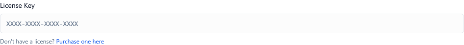

*Screenshot of KeyManager License tab*

---

## Overview

The KeyManager License settings control **the license for the KeyManager platform itself**, not the licenses you create for your customers. This setting is essential for organizations using the **Commercial or Enterprise editions** of KeyManager.

Understanding this distinction is critical:

* **Customer Licenses**: The licenses you create and distribute to your end users (managed throughout the rest of the platform)
* **Platform License**: The license that activates your KeyManager installation itself (configured here)

This tab allows you to:

* Activate your KeyManager Commercial or Enterprise edition
* Verify your current platform license status
* Manage license renewals and updates
* Access support and feature entitlements
* Ensure compliance with your KeyManager subscription

---

## Understanding KeyManager Licensing Tiers

KeyManager is available in multiple licensing tiers to meet different organizational needs:

### Community / Open Source Edition

**License Required:** ❌ None  
**Cost:** Free forever  
**Support:** Community forums and public documentation  
**Features:** Core license management functionality

The Community Edition is fully functional for basic license management needs. No platform license key is required.

**Best for:**
- Open source projects
- Small teams and startups
- Testing and evaluation
- Non-commercial use

---

### Commercial Edition

**License Required:** ✅ Yes  
**Cost:** Subscription-based  
**Support:** Email support with SLA  
**Features:** Advanced features + priority support

Includes additional capabilities such as:
- Advanced abuse detection algorithms
- Enhanced analytics and reporting
- Webhook integrations
- API rate limit increases
- Priority bug fixes and updates
- Email support with guaranteed response times

**Best for:**
- Growing businesses
- Commercial products
- Teams requiring support guarantees
- Organizations needing compliance features

---

### Enterprise Edition

**License Required:** ✅ Yes  
**Cost:** Custom pricing  
**Support:** Dedicated support with priority SLA  
**Features:** All Commercial features + enterprise capabilities

Includes everything in Commercial plus:
- SSO and advanced authentication
- Audit logging and compliance tools
- Custom integrations and workflows
- High-availability deployment options
- On-premises installation support
- Dedicated account manager
- Training and onboarding assistance
- Custom development options

**Best for:**
- Large organizations
- Regulated industries
- Mission-critical deployments
- Custom integration requirements

---

## Platform License Key

**Type:** Text input (read-only display after activation)  
**Default:** Empty (Community Edition)  
**Format:** Alphanumeric string (e.g., `KM-XXXX-XXXX-XXXX-XXXX`)


*Screenshot showing license key input field*

### Description

The **Platform License Key** field is where you enter the license key for your KeyManager Commercial or Enterprise edition. This key activates premium features, enables support entitlements, and validates your subscription status.

**Key Characteristics:**

* Validates against KeyManager's licensing server
* Tied to your organization and deployment
* Time-limited based on subscription period
* Can be updated for renewals or upgrades
* Required for Commercial/Enterprise features

### When to Configure

You need to configure this setting when:

✅ **Initial Installation** – Setting up a new Commercial/Enterprise instance  
✅ **Upgrading from Community** – Moving to a paid tier  
✅ **License Renewal** – Your subscription period has ended  
✅ **License Update** – Changing plans or adding capacity  
✅ **Migration** – Moving to a new server or infrastructure  

### How It Works

The platform license validation process follows these steps:

1. **Key Entry**: Admin enters the license key in the Platform License Key field
2. **Format Validation**: System checks the key format is correct
3. **Online Validation**: Key is validated against KeyManager licensing servers
4. **Feature Activation**: Premium features are unlocked based on license tier
5. **Periodic Verification**: License is re-verified at regular intervals (typically every 24-48 hours)
6. **Status Display**: Current license status is shown in the admin portal

#### Validation States

| State | Description | Impact |
|-------|-------------|---------|
| **Valid** | License is active and current | ✅ All features available |
| **Expiring Soon** | License expires within 30 days | ⚠️ Warning notifications shown |
| **Expired** | License has passed expiration date | ❌ Grace period active, features may be limited |
| **Invalid** | License key is incorrect or revoked | ❌ Falls back to Community Edition features |
| **No License** | No key configured | ℹ️ Community Edition mode |

### Where to Obtain Your License Key

License keys are obtained through the following channels:

#### 1. Direct Purchase

Purchase directly from the KeyManager website:
1. Visit `https://getkeymanager.com/pricing`
2. Select Commercial or Enterprise tier
3. Complete checkout process
4. Receive license key via email within minutes
5. Access license management portal for key retrieval

#### 2. Reseller Partners

Purchase through authorized resellers:
1. Contact your preferred software reseller
2. Request KeyManager Commercial/Enterprise edition
3. Complete purchase through reseller
4. Reseller provides license key
5. Register key in customer portal

#### 3. Upgrade Existing Installation

Upgrade from Community Edition:
1. Log in to your KeyManager customer account
2. Navigate to **Upgrade** section
3. Select desired tier
4. Complete payment
5. License key is generated instantly
6. Apply to your installation

#### 4. Renewal

Renew an expiring license:
1. Log in to customer portal at `https://account.getkeymanager.com`
2. View your current licenses
3. Click **Renew** on expiring license
4. Complete payment
5. License key is automatically updated
6. Platform automatically detects renewal

💡 **Tip**: Save your license key in a secure password manager alongside your KeyManager credentials

---

## License Validation Process

### Initial Activation

When you first enter a license key:

**Step 1: Format Check**
- System validates the key format matches expected pattern
- Checks for common typos or formatting errors
- Provides immediate feedback if format is invalid

**Step 2: Online Verification**
- Key is sent to KeyManager licensing servers over HTTPS
- Server validates key against subscription database
- Checks expiration date and feature entitlements
- Verifies key is not already activated on another instance (if single-instance license)

**Step 3: Instance Registration**
- Your KeyManager instance is registered with the license
- Server fingerprint is recorded for future validations
- Activation timestamp is logged

**Step 4: Feature Unlocking**
- Commercial/Enterprise features are enabled
- Feature flags are updated in database
- Admin portal reflects new capabilities
- API rate limits are adjusted

**Step 5: Confirmation**
- Success message is displayed
- License details are shown (tier, expiration, features)
- Admin can proceed with full platform access

### Ongoing Validation

After initial activation, the license is periodically re-verified:

**Every 24 Hours:**
- Background job checks license validity
- Verifies license has not been revoked
- Checks for expiration or plan changes
- Updates feature flags if subscription modified

**On Admin Login:**
- Quick validation of license status
- Display warnings if expiration approaching
- Show any license-related notifications

**On Feature Access:**
- Certain premium features trigger real-time validation
- Ensures license still covers requested capability
- Prevents unauthorized feature access

> ⚠️ **Important**: Your KeyManager instance must have internet connectivity for license validation. For air-gapped environments, contact Enterprise sales for offline licensing options.

---

## What Happens If License Is Invalid or Expired

### Invalid License Key

If an invalid license key is entered:

❌ **Immediate Effects:**
- Error message is displayed explaining the issue
- No changes are made to current license state
- System continues operating under previous license (or Community Edition)
- Admin is prompted to correct the key or contact support

🔍 **Common Causes:**
- Typo in license key
- Key from different product/vendor
- Revoked or refunded license
- Key intended for different instance

**Resolution:**
1. Double-check the license key for typos
2. Verify key was obtained from legitimate source
3. Check if key is for correct product edition
4. Contact support if issue persists

---

### Expired License

When a license reaches its expiration date, a **grace period** is provided:

#### Grace Period (Days 1-14)

⚠️ **During the first 14 days after expiration:**

**Still Available:**
- ✅ All Commercial/Enterprise features remain active
- ✅ Customer licenses continue to function normally
- ✅ API access is maintained
- ✅ Existing configurations are preserved

**Warnings Shown:**
- 🔔 Banner notification in admin portal
- 📧 Email notifications to admin users (days 1, 7, 14)
- ⚠️ Warning message on every login
- 📊 Dashboard notice about expiration

**Purpose:**
- Prevents service disruption due to forgotten renewals
- Allows time to complete renewal process
- Maintains business continuity
- Provides multiple notification opportunities

💡 **Tip**: Set up a calendar reminder 30 days before expiration to avoid grace period activation

---

#### Extended Grace Period (Days 15-30)

⚠️ **During days 15-30 after expiration:**

**Feature Limitations Begin:**
- ⚠️ Some advanced features are disabled
- ⚠️ API rate limits are reduced
- ⚠️ New customer license creation may be limited
- ✅ Existing customer licenses still validate
- ✅ Core platform remains operational

**Increased Warnings:**
- 🔴 Red alert banner on all pages
- 📧 Daily email notifications
- 🚫 Modal warning on login
- ⏰ Countdown to full restriction

---

#### Post-Grace Period (Day 31+)

❌ **After grace period expires:**

**Platform Reverts to Community Edition:**
- 🔒 Commercial/Enterprise features are locked
- 🔒 Advanced integrations are disabled
- 🔒 Premium support access is removed
- ✅ Basic license validation continues for existing licenses
- ✅ Data is preserved and not deleted
- ✅ Admin portal remains accessible

**Data Retention:**
- All customer data remains intact
- Licenses are not deleted or modified
- Historical analytics are preserved
- Configuration settings are maintained

**To Restore Service:**
1. Renew your license through customer portal
2. Enter new license key in this settings tab
3. Features are immediately restored
4. No data recovery needed

> ⚠️ **Critical**: Even after grace period expiration, your customer licenses remain operational for validation. Your customers are not impacted—only admin platform features are restricted.

---

## License Renewal Process

### Standard Renewal (Before Expiration)

**30 Days Before Expiration:**

1. **Receive Notification**
   - Email notification from KeyManager billing
   - Banner appears in admin portal
   - Invoice is generated and sent

2. **Review Renewal Options**
   - Log in to customer portal
   - Review current plan and pricing
   - Option to upgrade, downgrade, or continue same tier

3. **Complete Renewal Payment**
   - Pay through customer portal or invoice
   - Use saved payment method or enter new one
   - Receive confirmation email immediately

4. **Automatic Key Update**
   - License key is automatically extended
   - No action needed in admin portal
   - System detects renewal on next validation check (within 24 hours)
   - Expiration date is updated automatically

💡 **Best Practice**: Enable auto-renewal in customer portal to prevent any service interruption

---

### Renewal During Grace Period

**If License Has Already Expired:**

1. **Urgent Renewal**
   - Log in to customer portal
   - Navigate to expired licenses
   - Click **Renew Now**
   - Complete payment with priority processing

2. **Receive Updated Key**
   - New license key is generated (if license was fully expired)
   - Receive key via email
   - Access key in customer portal

3. **Apply to Your Instance**
   - Navigate to Settings > KeyManager License
   - Enter new license key
   - Save settings
   - Validation occurs immediately
   - Features are restored instantly

4. **Verify Restoration**
   - Check license status shows as "Valid"
   - Verify expiration date is correct
   - Test premium features
   - Confirm warnings are cleared

---

### Upgrade During Renewal

You can upgrade your tier during renewal:

**From Commercial to Enterprise:**

1. Navigate to customer portal
2. Select **Upgrade** during renewal
3. Pay difference in pricing
4. New Enterprise license key is issued
5. Apply key to instance
6. Enterprise features are unlocked

**Benefits:**
- Prorated billing for remaining subscription period
- Immediate access to upgraded features
- Same expiration date maintained
- Support tier is upgraded instantly

---

## Support Entitlements Tied to License

Your platform license key determines your support level and entitlements:

### Community Edition (No License)

**Support Channels:**
- 💬 Community forums
- 📚 Public documentation
- 🐛 GitHub issues (bug reports)
- 📝 Blog and tutorials

**Response Times:**
- No guaranteed response time
- Best-effort community assistance
- Updates on regular release schedule

**Included:**
- Access to all public resources
- Community-contributed guides
- Basic security updates

---

### Commercial Edition License

**Support Channels:**
- 📧 Email support (support@getkeymanager.com)
- 💬 Community forums
- 📚 Complete documentation
- 🎫 Support ticket system

**Response Times:**
- **Critical Issues**: 4 business hours
- **High Priority**: 8 business hours
- **Normal Priority**: 24 business hours
- **Low Priority**: 48 business hours

**Included:**
- Priority bug fixes
- Feature requests consideration
- Security patch priority
- Quarterly product updates
- Version upgrade assistance
- Configuration guidance

**Support Hours:**
- Business hours: Monday-Friday, 9 AM - 5 PM (your timezone)
- Emergency support: Critical issues only

---

### Enterprise Edition License

**Support Channels:**
- 📞 Phone support
- 📧 Email support (priority queue)
- 💬 Dedicated Slack channel
- 🎫 Priority ticket system
- 👤 Dedicated account manager

**Response Times:**
- **Critical Issues**: 1 hour (24/7)
- **High Priority**: 2 business hours
- **Normal Priority**: 4 business hours
- **Low Priority**: 8 business hours

**Included:**
- 24/7 emergency support
- Dedicated account manager
- Quarterly business reviews
- Proactive monitoring and recommendations
- Priority feature development
- Custom integration assistance
- Architectural consultation
- Training and onboarding
- Upgrade planning and execution
- Security audit assistance

**Support Hours:**
- 24/7 for critical issues
- Extended hours for high priority
- Dedicated contact for your organization

---

## Multi-Instance Licensing

### Single-Instance Licenses (Standard)

**Default Behavior:**

Most Commercial and Enterprise licenses are **single-instance** by default:

* ✅ Activates one KeyManager installation
* ✅ Can be moved between servers (deactivation required)
* ❌ Cannot run on multiple production instances simultaneously
* ✅ Development/staging instances may be included (check license terms)

**Attempting Multi-Instance Activation:**

If you try to activate the same key on a second instance:

1. Second instance attempts validation
2. Licensing server detects key already active
3. Error message is returned
4. Administrator is notified of attempted duplicate activation
5. Original instance remains active
6. Second instance operates in Community Edition mode

**Proper Migration Process:**

To move your license to a new server:

1. **On Old Server:**
   - Navigate to Settings > KeyManager License
   - Click **Deactivate License**
   - Confirm deactivation
   - License is released from this instance

2. **On New Server:**
   - Navigate to Settings > KeyManager License  
   - Enter your license key
   - Click **Activate**
   - License is now bound to new instance

💡 **Tip**: For planned migrations, deactivate on old server first. For emergency moves (old server crashed), contact support to release the license.

---

### Multi-Instance Licenses (Available for Enterprise)

**Enterprise customers can purchase multi-instance licenses for:**

* High-availability deployments
* Geographic distribution
* Development/staging/production environments
* Disaster recovery instances
* Load-balanced clusters

**How It Works:**

1. Purchase specifies number of instances (e.g., 3-instance license)
2. Single license key can activate up to specified number
3. Each instance registers independently
4. Licensing server tracks active instance count
5. Exceeding count prevents additional activations

**Use Cases:**

**High Availability:**
```
Production Setup:
- Primary instance (US East)
- Secondary instance (US West)  
- Tertiary instance (EU)
3-instance Enterprise license required
```

**Environment Separation:**
```
Development Lifecycle:
- Production instance
- Staging instance
- Development instance
3-instance Enterprise license recommended
```

**Load Balancing:**
```
Scaled Deployment:
- Load balancer
  - Instance 1
  - Instance 2
  - Instance 3
- Shared database
3-instance Enterprise license required
```

> ⚠️ **Important**: Multi-instance licensing requires Enterprise edition and custom pricing. Contact sales for configuration.

---

## Best Practices

### Security

🔒 **Protect Your License Key:**
- Store in password manager or secrets vault
- Never commit to version control
- Limit access to admin users only
- Rotate if accidentally exposed
- Use environment variables for deployment automation

🔒 **Monitor License Status:**
- Set up calendar reminders for renewal
- Configure admin email notifications
- Review license dashboard monthly
- Track expiration dates in procurement system

---

### Operational Excellence

📅 **Renewal Planning:**
- Enable auto-renewal in customer portal
- Add expiration date to team calendar
- Budget for renewal 60 days in advance
- Review usage to determine if upgrade needed
- Plan for multi-year purchase to lock in pricing

🔄 **Change Management:**
- Document license key location for team
- Include in disaster recovery procedures
- Test deactivation/reactivation process annually
- Maintain backup contact for KeyManager support
- Document tier features to justify budget

---

### Cost Optimization

💰 **Right-Sizing Your License:**
- Start with Commercial edition for most teams
- Upgrade to Enterprise only when features needed
- Consider multi-year discounts
- Evaluate actual feature usage quarterly
- Downgrade if over-licensed (during renewal)

💰 **Multi-Instance Planning:**
- Use single-instance license with fail-over plan initially
- Add multi-instance only when high availability required
- Development/staging often included—verify with support
- Consider containerized deployment sharing license

---

## Important Notes

⚠️ **The platform license does NOT affect your customer licenses**  
Even if your platform license expires or is invalid, your customers can still validate their licenses during grace periods.

🔄 **License keys are tied to your subscription**  
Canceling your subscription will eventually invalidate the license after grace period.

📊 **Keep your account information current**  
Ensure email and billing information is up-to-date in the customer portal to receive renewal notifications.

🔒 **License keys are non-transferable**  
You cannot share your license key with other organizations or resell it.

📧 **Support requires valid license**  
Email and phone support requires an active Commercial or Enterprise license.

🌐 **Internet connectivity is required**  
License validation requires periodic connection to KeyManager servers (typically every 24-48 hours).

---

## Summary Table

| Aspect | Community Edition | Commercial Edition | Enterprise Edition |
|--------|------------------|-------------------|-------------------|
| **License Required** | No | Yes | Yes |
| **Cost** | Free | Subscription | Custom |
| **Support** | Community | Email (SLA) | 24/7 + Dedicated |
| **Features** | Core | Advanced | All + Custom |
| **Multi-Instance** | N/A | No (default) | Available |
| **Validation Frequency** | N/A | Every 24h | Every 24h |
| **Grace Period** | N/A | 30 days | 30 days |
| **Offline Licensing** | N/A | No | Available |

---

## Testing Your Configuration

### Test Scenario 1: Activate License

**Objective:** Verify license activation works correctly

1. Obtain a test or production license key
2. Navigate to Settings > KeyManager License
3. Enter license key in Platform License Key field
4. Click **Save Settings**
5. **Expected Result:** Success message appears, license details are displayed
6. Verify expiration date is shown correctly
7. Confirm Commercial/Enterprise features are now available
8. Check that license status shows "Valid" with green indicator

---

### Test Scenario 2: Invalid License Key

**Objective:** Confirm proper handling of invalid keys

1. Navigate to Settings > KeyManager License
2. Enter an obviously invalid key (e.g., "TEST-INVALID-KEY-12345")
3. Click **Save Settings**
4. **Expected Result:** Error message appears explaining key is invalid
5. Verify no changes were made to current license state
6. Confirm platform still operates under previous license tier

---

### Test Scenario 3: Expiration Warning

**Objective:** Verify expiration notifications work (if license expiring soon)

1. If possible, use a license that expires within 30 days
2. Log in to admin portal
3. **Expected Result:** Warning banner appears about upcoming expiration
4. Check that expiration date is prominently displayed
5. Verify email notifications were sent to admin users
6. Confirm renewal link is provided in notification

---

### Test Scenario 4: Feature Access

**Objective:** Confirm premium features are available with license

1. Activate a Commercial or Enterprise license
2. Navigate to features exclusive to your tier (e.g., Advanced Analytics, SSO)
3. **Expected Result:** Features are accessible and functional
4. Attempt to access Enterprise feature with Commercial license
5. **Expected Result:** Appropriate message if feature not included in tier
6. Verify API rate limits match licensed tier

---

## Frequently Asked Questions

**Q: What happens to my customer licenses if my platform license expires?**  
A: Your customers can still validate their licenses throughout the grace period and beyond. The platform license affects admin features, not customer license validation. However, you won't be able to create new customer licenses or access premium admin features after grace period.

**Q: Can I use the same license key on multiple servers?**  
A: By default, no. Standard licenses are single-instance. Enterprise customers can purchase multi-instance licenses. For development/staging, check your license terms or contact support—these may be included.

**Q: How do I move my license to a new server?**  
A: Deactivate the license on the old server (Settings > KeyManager License > Deactivate), then activate on the new server with the same key. If the old server is unavailable, contact support to release the license.

**Q: What if I lose my license key?**  
A: Log in to your customer portal at `https://account.getkeymanager.com` to retrieve your license key. It's also in your original purchase confirmation email.

**Q: Can I upgrade from Community to Commercial without reinstalling?**  
A: Yes! Simply purchase a Commercial license and enter the key in Settings > KeyManager License. All your data and configurations are preserved.

**Q: What happens during the grace period?**  
A: For the first 14 days, everything works normally with warning notifications. Days 15-30, some advanced features are limited. After 30 days, the platform operates in Community Edition mode, but all data is preserved.

**Q: Do I need internet access for license validation?**  
A: Yes, the platform validates the license every 24 hours. For air-gapped environments, Enterprise customers can request offline licensing—contact sales.

**Q: Can I downgrade from Enterprise to Commercial?**  
A: Yes, during renewal you can select a lower tier. Enterprise-specific features will be disabled, but core Commercial features remain. Evaluate feature dependencies before downgrading.

**Q: What's included in the license price?**  
A: License includes platform usage rights, all features in your tier, support according to tier SLA, updates and patches, and renewal at current pricing (with advance notice of changes).

**Q: How is multi-instance licensing priced?**  
A: Multi-instance licensing is available for Enterprise customers with custom pricing based on number of instances needed. Contact sales for a quote.

---

## How to Access

1. Log in to the Admin Portal
2. Navigate to **Settings** in the main menu
3. Click the **KeyManager License** tab
4. View current license status or enter new license key
5. Click **Save Settings** to activate license changes

---

## Related Settings

- [Settings Overview]() - All settings tabs
- [General Settings]() - Platform configuration
- [Telemetry Settings]() - Usage reporting
- [Dashboard]() - View license status summary

---

**Proper license configuration ensures full access to KeyManager features, guaranteed support, and business continuity.**
