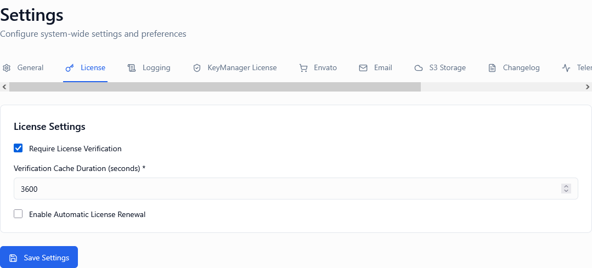

*Screenshot of License Settings tab*

---

## Overview

License Settings control the **core behavior of license validation and lifecycle management** across your platform. These settings directly impact how licenses are verified, cached, and automatically managed. Proper configuration ensures:

* Secure license validation
* Optimal performance through caching
* Automated renewal workflows
* Compliance with licensing policies
* Reduced manual administration

These critical settings include:

1. **Require License Verification** – Enforce validation before activation
2. **License Cache Duration** – Control validation performance
3. **Enable Auto-Renewal** – Automate subscription renewals

---

## Require License Verification

**Type:** Toggle (On / Off)  
**Default:** On  
**Security Impact:** HIGH

*Screenshot showing license verification requirement*

### Description

When enabled, every license must pass validation checks before it can be activated or used. This setting enforces a **security-first approach** to license management.

* **ON**: All licenses are validated against the database and business rules before activation
* **OFF**: Licenses can be activated without full verification (NOT RECOMMENDED for production)

### What Verification Includes

When verification is required, the system checks:

* ✅ License key exists in the database
* ✅ License is not expired
* ✅ License is not suspended or banned
* ✅ Activation limits are not exceeded
* ✅ Product association is valid
* ✅ Customer account is active
* ✅ No abuse flags are active
* ✅ Geographic restrictions are satisfied (if configured)
* ✅ Time-based restrictions are satisfied (if configured)

### When to Enable (RECOMMENDED)

Enable verification in:

✅ **Production environments** – Always  
✅ **Customer-facing deployments** – Mandatory  
✅ **Commercial products** – Essential for revenue protection  
✅ **Compliance-sensitive industries** – Required for audit trails  
✅ **Public APIs** – Prevents unauthorized access  

### When to Disable (RARE CASES ONLY)

Disable verification only in:

⚠️ **Development environments** – For rapid testing  
⚠️ **Internal tooling** – Non-commercial, trusted users  
⚠️ **Performance testing** – Benchmarking activation speed  
⚠️ **Offline-first products** – With alternative validation mechanisms  

> ⚠️ **CRITICAL WARNING**: Disabling verification in production exposes your platform to:
> * License piracy and unauthorized usage
> * Revenue loss from bypassed licensing
> * Inability to enforce activation limits
> * No audit trail for compliance
> * Security vulnerabilities

### Impact on Performance

| Verification Status | Activation Speed | Security Level | Recommended For |
| ------------------- | ---------------- | -------------- | --------------- |
| **Enabled** | ~100-300ms | High | Production, customer-facing |
| **Disabled** | ~10-50ms | Low/None | Development, testing only |

### Real-World Example

**Scenario**: Desktop software with 10,000 active licenses

**Initial Configuration:**
* Require Verification: **OFF** (mistakenly left from development)

**Problems Encountered:**
* Pirated keys circulated online
* Expired licenses continued to work
* Suspended abusers could still activate
* No way to enforce activation limits

**Corrected Configuration:**
* Require Verification: **ON**

**Results:**
* 95% reduction in pirated activations
* Expired licenses properly blocked
* Abuse detection working as intended
* Full audit trail for compliance

💡 **Tip**: Never disable verification in production. The performance difference is negligible compared to security risks.

---

## License Cache Duration

**Type:** Numeric input (minutes)  
**Default:** 60 minutes  
**Range:** 5-1440 minutes (5 minutes to 24 hours)

*Screenshot showing cache duration settings*

### Description

Defines how long validated license data is cached before requiring re-validation. This setting balances **performance vs real-time enforcement**.

When a license is validated:
1. The result is stored in cache
2. Subsequent validations within the cache period use cached data
3. After the cache expires, fresh validation occurs
4. Cache is automatically cleared on license status changes

### How It Works

**First Validation (Cache Miss):**
1. Client requests license validation
2. System queries database (full verification)
3. Result is cached for configured duration
4. Response sent to client (~200ms)

**Subsequent Validations (Cache Hit):**
1. Client requests validation
2. System checks cache
3. Cached result returned immediately (~10ms)
4. No database query needed

**After Cache Expiry:**
1. Cache entry expires automatically
2. Next validation performs full check
3. New cache entry created

### When to Use Short Durations (5-30 minutes)

Use shorter cache durations for:

✅ **SaaS/API products** – Real-time enforcement critical  
✅ **High-value licenses** – Minimize unauthorized usage window  
✅ **Frequently changed licenses** – Faster propagation of status changes  
✅ **Abuse-prone products** – Reduce time between detection and blocking  
✅ **Subscription services** – Ensure timely expiration enforcement  

### When to Use Long Durations (120-1440 minutes)

Use longer cache durations for:

✅ **Desktop/offline software** – Users may be offline  
✅ **Low-risk products** – Internal tools, trusted users  
✅ **High-volume APIs** – Reduce database load  
✅ **Stable licenses** – Infrequent status changes  
✅ **Performance-critical apps** – Minimize latency  

### Cache Duration Recommendations

| Product Type | Recommended Duration | Reasoning |
| ------------ | -------------------- | --------- |
| **SaaS Web Apps** | 15-30 minutes | Balance real-time enforcement with performance |
| **REST APIs** | 30-60 minutes | Standard for API caching |
| **Desktop Software** | 120-240 minutes | Users may be offline temporarily |
| **Mobile Apps** | 60-120 minutes | Network conditions vary |
| **IoT/Embedded** | 240-1440 minutes | Intermittent connectivity expected |
| **Internal Tools** | 180-360 minutes | Low risk, prioritize performance |

### Real-World Examples

**Example 1: SaaS Analytics Platform**

**Configuration:**
* Cache Duration: **30 minutes**
* Product: Cloud-based analytics

**Reasoning:**
* Users are always online
* Subscription changes should propagate quickly
* When subscription expires, block access within 30 minutes
* Database load is manageable with 30-min cache

**Example 2: Desktop Video Editor**

**Configuration:**
* Cache Duration: **180 minutes (3 hours)**
* Product: Desktop creative software

**Reasoning:**
* Users often work offline
* License changes are infrequent
* Longer cache prevents disruption during offline work
* Users typically work in 4-8 hour sessions

**Example 3: High-Volume API**

**Configuration:**
* Cache Duration: **240 minutes (4 hours)**
* Product: REST API with 1M+ validations/day

**Reasoning:**
* Extreme performance requirements
* Database load reduction critical
* License changes are rare
* 4-hour enforcement window acceptable

### Impact on Enforcement

| Duration | Status Change Propagation | Database Load | Use Case |
| -------- | ------------------------- | ------------- | -------- |
| **5 min** | Near real-time | High | Critical security |
| **30 min** | Very fast | Moderate-High | SaaS products |
| **60 min** | Fast | Moderate | Balanced default |
| **120 min** | Delayed | Low-Moderate | Desktop software |
| **240+ min** | Slow | Low | Offline/IoT |

### Cache Invalidation Events

The cache is **automatically cleared** when:

* License is suspended or unsuspended
* License is expired (status change)
* License is deleted
* Activation limit is modified
* Product association is changed
* Admin manually clears cache

💡 **Tip**: Manual cache clearing is available via Admin Portal when immediate enforcement is needed

### Best Practices

**Performance Optimization:**
1. Start with 60 minutes (default)
2. Monitor database load and query times
3. If database is overloaded, increase duration
4. If enforcement is too slow, decrease duration

**Security Considerations:**
1. Never set longer than your billing cycle
2. For monthly subscriptions, max 1440 minutes (24 hours)
3. For annual licenses, 240-720 minutes acceptable
4. For high-value products, prefer shorter durations

**Testing Your Configuration:**
1. Set cache duration to desired value
2. Validate a test license
3. Suspend the license
4. Attempt validation again immediately (should still be cached)
5. Wait for cache to expire
6. Validate again (should fail)

⚠️ **Warning**: Setting cache too short (<5 minutes) can overload your database during high traffic

---

## Enable Auto-Renewal

**Type:** Toggle (On / Off)  
**Default:** Off

*Screenshot showing auto-renewal configuration*

### Description

Automatically renews subscription-based licenses before they expire, when integrated with payment processors.

* **ON**: System attempts automatic renewal when licenses near expiration
* **OFF**: Licenses must be manually renewed by customer or admin

### How Auto-Renewal Works

**When a License Approaches Expiration:**

1. **7 Days Before**: System flags license for renewal
2. **3 Days Before**: First renewal attempt triggered
3. **Payment Processing**: Charge customer's stored payment method
4. **Success**: License is automatically extended for next period
5. **Failure**: Customer receives payment failure notification
6. **1 Day Before**: Final renewal attempt if previous failed
7. **Expiration**: If all attempts fail, license expires normally

### What Auto-Renewal Requires

To function properly, auto-renewal needs:

✅ **Payment processor integration** (Stripe, PayPal, etc.)  
✅ **Stored customer payment methods** (cards on file)  
✅ **Email configuration** (for renewal notifications)  
✅ **Webhook integration** (for payment confirmations)  
✅ **Product pricing** (defined renewal amounts)  

### When to Enable

Enable auto-renewal if:

✅ You offer subscription-based licenses (monthly, annual)  
✅ Payment processor integration is configured  
✅ Customers expect automatic billing  
✅ You want to reduce churn from forgotten renewals  
✅ You operate a SaaS or subscription business model  

### When to Keep Disabled

Keep disabled if:

❌ You use perpetual licenses (one-time purchase)  
❌ Payment processor is not integrated  
❌ You prefer manual renewal processes  
❌ Customers control their own renewal timing  
❌ Your business model is usage-based, not time-based  
❌ You require manual approval for renewals  

### Auto-Renewal vs Manual Renewal

| Approach | Advantages | Disadvantages |
| -------- | ---------- | ------------- |
| **Auto-Renewal (ON)** | Reduces churn, predictable revenue, hands-off for customers | Requires payment integration, surprise charges, failed payment handling |
| **Manual Renewal (OFF)** | Customer control, no surprise charges, simpler setup | Higher churn, manual work, reminder emails needed |

### Real-World Examples

**Example 1: SaaS Subscription Product**

**Business Model:**
* Monthly subscriptions at $49/month
* Payment via Stripe
* Target: Small businesses

**Configuration:**
* Enable Auto-Renewal: **ON**

**Implementation:**
1. Customer signs up with credit card
2. License issued for 30 days
3. 3 days before expiration, auto-renewal attempts
4. Card charged automatically
5. License extended for another 30 days
6. Customer receives receipt email

**Results:**
* 92% renewal rate
* Reduced churn from 15% to 8%
* Eliminated manual renewal processing

**Example 2: Enterprise Perpetual Licenses**

**Business Model:**
* One-time purchase + optional annual support
* Manual invoicing for renewals
* Target: Large corporations

**Configuration:**
* Enable Auto-Renewal: **OFF**

**Reasoning:**
* Perpetual licenses don't expire
* Support renewals require procurement approval
* Manual invoicing matches enterprise processes
* Customers prefer scheduled, manual renewals

**Example 3: Hybrid Model**

**Business Model:**
* Monthly auto-renewing OR annual manual renewal
* Customer chooses billing preference

**Configuration:**
* Enable Auto-Renewal: **ON** (for monthly plans)
* Manual processing for annual plans

**Implementation:**
* Monthly subscribers: Auto-renewal active
* Annual subscribers: Receive renewal reminders at 60/30/7 days
* Admin manually processes annual renewals after payment

### Customer Communication

**When Auto-Renewal is Enabled:**

1. **At Purchase**: Clearly state auto-renewal terms
2. **Confirmation Email**: Remind customer of auto-renewal
3. **7 Days Before**: Send upcoming renewal notification
4. **On Renewal**: Send receipt and thank you
5. **On Failure**: Send payment failure notice with action steps

**Email Sequence Example:**

| Timing | Email | Purpose |
| ------ | ----- | ------- |
| **At Purchase** | "Welcome! Your subscription auto-renews on [date]" | Set expectations |
| **7 Days Before** | "Your license renews in 7 days ($49)" | Advance notice |
| **On Renewal** | "Renewal successful! Thank you for continuing" | Confirmation |
| **Failure** | "Payment failed - Update your card to avoid interruption" | Action required |

### Handling Failed Renewals

**When Auto-Renewal Fails:**

1. **First Failure**: Retry in 24 hours
2. **Second Failure**: Retry in 48 hours
3. **Third Failure**: Send final notice to customer
4. **Grace Period**: Allow 7 days to update payment
5. **Expiration**: License expires if not resolved

**Customer Actions:**
* Update payment method in customer portal
* Contact support for assistance
* Manually renew if needed

### Legal and Compliance Considerations

**Required Disclosures:**
* ⚠️ Auto-renewal terms must be clearly disclosed at purchase
* ⚠️ Customers must be notified before charges
* ⚠️ Easy cancellation must be available
* ⚠️ Comply with regional laws (e.g., California auto-renewal law)

💡 **Tip**: Include auto-renewal terms in your Terms of Service and link prominently at checkout

### Best Practices

**Implementation Checklist:**
1. ✅ Configure payment processor integration
2. ✅ Test auto-renewal with test licenses
3. ✅ Set up renewal notification emails
4. ✅ Create failed payment recovery workflow
5. ✅ Document terms in customer agreement
6. ✅ Provide self-service cancellation option
7. ✅ Monitor renewal success rates

**Monitoring:**
* Track renewal success rate (target: >90%)
* Monitor failed payment reasons
* Analyze churn patterns
* Review customer feedback on renewals

---

## Recommended Configurations

### SaaS/Subscription Products

**Monthly or annual recurring billing**

* **Require Verification:** ON
* **Cache Duration:** 30 minutes
* **Auto-Renewal:** ON

**Reasoning:** Security-first with real-time enforcement and automated renewals for predictable revenue.

---

### Desktop/On-Premises Software

**One-time purchase or manual renewals**

* **Require Verification:** ON
* **Cache Duration:** 180 minutes
* **Auto-Renewal:** OFF

**Reasoning:** Offline-friendly caching, security maintained, manual renewal process for perpetual licenses.

---

### High-Volume APIs

**REST APIs with millions of validations**

* **Require Verification:** ON
* **Cache Duration:** 240 minutes
* **Auto-Renewal:** OFF or ON (depends on business model)

**Reasoning:** Performance optimization through longer caching, still maintains security baseline.

---

### Internal/Enterprise Tools

**Low-risk internal applications**

* **Require Verification:** ON (even for internal)
* **Cache Duration:** 360 minutes
* **Auto-Renewal:** OFF

**Reasoning:** Maintain audit trails, maximize performance, manual control for enterprise procurement.

---

### IoT/Embedded Devices

**Intermittent connectivity expected**

* **Require Verification:** ON
* **Cache Duration:** 720-1440 minutes
* **Auto-Renewal:** ON (if connectivity available)

**Reasoning:** Very long cache for offline periods, automated renewals when device connects.

---

## Important Notes

⚠️ **Never disable verification in production** – Security risks far outweigh performance gains

🔄 **Cache is automatically invalidated** on license status changes – No manual clearing needed

📊 **Monitor renewal success rates** – Target >90% for healthy subscription business

⏱️ **Cache duration affects enforcement speed** – Balance performance vs real-time needs

💳 **Auto-renewal requires payment integration** – Test thoroughly before enabling

---

## Summary Table

| Setting | Purpose | Typical Value |
| ------- | ------- | ------------- |
| Require Verification | Enforce security checks | ON (always) |
| Cache Duration | Balance performance vs enforcement | 60 minutes (default), adjust based on product type |
| Auto-Renewal | Automate subscription renewals | ON (subscriptions) or OFF (perpetual) |

---

## Testing Your Configuration

### Step 1: Configure License Settings

Set all three settings according to your product type.

### Step 2: Create a Test License

Generate a test license key with short expiration (e.g., 1 hour).

### Step 3: Test Verification

**With Verification ON:**
1. Activate the test license
2. Verify it succeeds with valid license
3. Suspend the license in admin portal
4. Attempt activation again – should fail immediately

**Cache Duration Testing:**
1. Set cache to 5 minutes
2. Activate test license (cache created)
3. Suspend the license
4. Attempt validation immediately (should succeed - cached)
5. Wait 6 minutes
6. Validate again (should fail - cache expired)

### Step 4: Test Auto-Renewal (if applicable)

**Prerequisites:**
* Payment processor configured
* Test payment method on file
* Test subscription license

**Testing:**
1. Create license expiring in 1 day
2. Configure auto-renewal attempts
3. Wait for renewal window
4. Verify renewal attempt occurs
5. Check email notifications sent
6. Confirm license extended

### Step 5: Production Deployment

Once testing is complete:
1. Set production cache duration
2. Enable auto-renewal (if using subscriptions)
3. Monitor renewal success rates
4. Adjust settings based on real-world performance

---

## Frequently Asked Questions

**Q: What happens if I change cache duration while licenses are already cached?**  
A: New duration applies to future cache entries. Existing cached entries expire on their original schedule.

**Q: Can I set different cache durations for different products?**  
A: No, cache duration is platform-wide. Consider your highest-security product when setting this value.

**Q: Does auto-renewal work with all payment processors?**  
A: Auto-renewal requires webhook support from your payment processor. Stripe, PayPal, and Braintree are fully supported.

**Q: What if a customer's card is declined during auto-renewal?**  
A: The system retries based on configured schedule and sends failure notifications. Customer can update payment method.

**Q: Can customers opt out of auto-renewal?**  
A: Yes, provide a self-service cancellation option in the customer portal for compliance.

**Q: How does cache invalidation work?**  
A: When a license is modified, the cache entry is immediately cleared. Next validation performs fresh check.

**Q: Should I disable verification to improve performance?**  
A: No. Use longer cache duration instead. Disabling verification eliminates all security controls.

---

## How to Access

1. Log in to the Admin Portal
2. Navigate to **Settings** in the main menu
3. Click the **License Settings** tab
4. Configure each setting
5. Click **Save Settings** at the bottom
6. Test with a trial license before production use

---

## Related Settings

- [Settings Overview](../) - All settings tabs
- [Abuse Detection](../abuse-detection) - Automated abuse prevention
- [Logging Settings](../logging) - Track validation events
- [Webhook Settings](../webhooks) - Payment processor integrations

---

**Proper license configuration ensures security, performance, and automated revenue management.**
