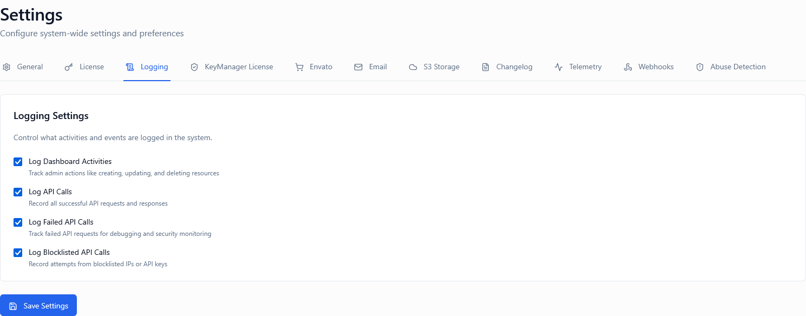

*Screenshot of Logging Settings tab*

---

## Overview

Logging settings control what system activities are captured, stored, and made available for audit, debugging, compliance, and security analysis. When configured correctly, comprehensive logging helps you:

* **Maintain audit trails** for compliance (SOC2, HIPAA, GDPR)
* **Debug issues** by reviewing API call patterns and failures
* **Monitor security** by tracking unauthorized access attempts
* **Analyze usage patterns** to understand customer behavior
* **Investigate incidents** with complete activity history
* **Demonstrate compliance** during audits and security reviews

These settings work together to provide complete visibility:

1. **Log Dashboard Activities** – Captures admin actions in the web interface
2. **Log API Calls** – Records all successful API requests
3. **Log Failed API Calls** – Tracks unsuccessful API attempts
4. **Log Blocklisted API Calls** – Monitors blocked or rejected requests

Each toggle can be independently enabled or disabled based on your operational, compliance, and security requirements.

> 💡 **Tip**: Start with all logging enabled during initial deployment, then adjust based on storage costs and performance requirements.

---

## Log Dashboard Activities

**Type:** Toggle (On / Off)  
**Default:** On


*Screenshot showing Dashboard Activities toggle*

### Description

Enables or disables logging of all administrative actions performed through the Admin Portal web interface.

* **ON**: Every action taken by administrators in the web UI is recorded with timestamp, user, and details
* **OFF**: Dashboard activities are not logged; only direct API calls (if enabled) are tracked

### What Gets Logged

When enabled, dashboard activity logging captures:

* **License Management**: Creation, modification, suspension, deletion, activation/deactivation
* **User Actions**: Login attempts (success/failure), logout, password changes, profile updates
* **Settings Changes**: Any modification to system settings across all tabs
* **Customer Management**: Creating, editing, or deleting customer records
* **Product Configuration**: Product creation, updates, pricing changes, feature modifications
* **Bulk Operations**: Mass license imports, exports, batch updates
* **Search and Filtering**: What data admins are viewing and searching
* **Report Generation**: Which reports are run and by whom
* **Webhook Management**: Adding, modifying, or deleting webhook endpoints
* **Email Template Changes**: Modifications to notification templates

### Log Entry Contents

Each dashboard activity log entry includes:

| Field | Description | Example |
|-------|-------------|---------|
| **Timestamp** | Exact date and time (UTC) | `2024-01-15 14:32:18 UTC` |
| **Admin User** | Email or username of admin | `admin@company.com` |
| **Action Type** | Category of action | `LICENSE_SUSPENDED` |
| **Resource** | What was affected | `License #12345` |
| **Details** | Specific changes made | `Reason: Payment failure` |
| **IP Address** | Admin's IP address | `203.0.113.42` |
| **Session ID** | Unique session identifier | `sess_a4f8d2c1...` |
| **User Agent** | Browser and OS information | `Mozilla/5.0 Chrome/120.0` |

### When to Enable

Enable dashboard activity logging if:

✅ **Compliance Requirements**: You need audit trails for SOC2, ISO 27001, HIPAA, or GDPR  
✅ **Security Monitoring**: You want to track who does what in your system  
✅ **Accountability**: Multiple admins access the system and you need attribution  
✅ **Incident Investigation**: You need to reconstruct what happened during incidents  
✅ **Change Tracking**: You want to know when and why settings were modified  
✅ **Support Debugging**: Customer support needs to review admin actions  
✅ **Legal Requirements**: Your industry requires complete activity logs  

### When to Disable

You might disable dashboard logging only if:

🔧 **Cost Constraints**: Log storage costs are prohibitively expensive  
🔧 **Single Admin**: You're a solo operator who doesn't need self-tracking  
🔧 **Privacy Concerns**: Your jurisdiction restricts activity monitoring  
🔧 **Performance**: Your database is under extreme load (rare scenario)  

> ⚠️ **Warning**: Disabling dashboard logging removes your audit trail and makes incident investigation nearly impossible. This is **strongly discouraged** for production environments.

### How It Works

1. Admin performs action in dashboard (e.g., suspends a license)
2. System intercepts the action before executing it
3. Log entry is created with full context
4. Action is executed
5. Log entry is finalized with result (success/failure)
6. Entry is stored in database with indexed timestamp
7. Admin can review logs in Dashboard → Activity Logs section

### Real-World Example

**Scenario**: Security incident investigation

```
Timeline of Events:
------------------
14:23:45 - admin@company.com logged in from 198.51.100.10
14:24:12 - admin@company.com viewed License #48291 details
14:24:33 - admin@company.com suspended License #48291 
           Reason: "Suspicious activation pattern"
14:25:01 - admin@company.com added note to Customer #1893
           Note: "Customer contacted support regarding suspension"
14:27:18 - admin@company.com unsuspended License #48291
           Reason: "False positive - verified legitimate user"
14:28:02 - admin@company.com logged out
```

This complete trail allows you to:
- Understand the sequence of events
- Know who made decisions and why
- Reconstruct the incident for review
- Demonstrate due diligence in audits

### Best Practices

**For Security:**
1. ✅ Keep enabled at all times in production
2. ✅ Review logs weekly for suspicious patterns
3. ✅ Set up alerts for sensitive actions (bulk deletes, setting changes)
4. ✅ Restrict access to logs to senior administrators only
5. ✅ Export and archive logs monthly for long-term retention

**For Compliance:**
1. 📋 Document your log retention policy (typically 1-7 years)
2. 📋 Ensure logs include all required audit fields
3. 📋 Implement tamper-proof log storage
4. 📋 Regularly review logs as part of compliance checks
5. 📋 Train admins that their actions are logged

**For Operations:**
1. 🔍 Use logs to identify repetitive manual tasks that could be automated
2. 🔍 Monitor for admin errors or misconfigurations
3. 🔍 Track which features admins use most frequently
4. 🔍 Identify training needs based on error patterns

### Privacy Considerations

Dashboard activity logging involves collecting admin user data:

* **Data Minimization**: Logs capture necessary actions, not sensitive content
* **Access Control**: Only authorized admins should access activity logs
* **Retention Limits**: Implement automatic log deletion per retention policy
* **Anonymization**: Consider anonymizing logs after a certain period
* **GDPR Rights**: Admins may have right to access or delete their activity data

💡 **Tip**: Clearly disclose to admin users that their actions are logged for security and compliance purposes.

---

## Log API Calls

**Type:** Toggle (On / Off)  
**Default:** On


*Screenshot showing Log API Calls toggle*

### Description

Enables or disables logging of all **successful** API requests made to your KeyManager instance.

* **ON**: Every successful API call is recorded with full request and response metadata
* **OFF**: Only failed API calls (if enabled separately) are logged; successful calls are not tracked

### What Gets Logged

When enabled, API call logging captures:

* **License Operations**: Activate, validate, deactivate, check status
* **Product Queries**: Retrieve product information, pricing, features
* **Customer Operations**: Create, update, retrieve customer data
* **Webhook Deliveries**: Outgoing webhook calls and responses
* **Bulk Operations**: Batch activations, imports, exports via API
* **Analytics Queries**: Usage statistics, reports, dashboard data
* **Configuration Reads**: Retrieving settings, policies, limits

### Log Entry Contents

Each API call log entry includes:

| Field | Description | Example |
|-------|-------------|---------|
| **Timestamp** | Exact request time (UTC + milliseconds) | `2024-01-15 14:32:18.426 UTC` |
| **Endpoint** | API path called | `/api/v1/licenses/activate` |
| **Method** | HTTP method | `POST` |
| **Status Code** | HTTP response code | `200` |
| **Response Time** | Duration in milliseconds | `142ms` |
| **Request IP** | Client IP address | `198.51.100.33` |
| **API Key** | Identifier of key used (partial) | `km_live_abc...xyz` |
| **Request Size** | Bytes sent | `256 bytes` |
| **Response Size** | Bytes received | `1,024 bytes` |
| **User Agent** | Client application | `KeyManager-SDK/2.1.0 Python/3.11` |
| **License Key** | Key involved (if applicable) | `XXXX-XXXX-XXXX-####` (partially masked) |

> 💡 **Note**: Sensitive data like complete license keys, API keys, and passwords are automatically masked or hashed in logs.

### When to Enable

Enable API call logging if:

✅ **Usage Analytics**: You want to understand how customers use your product  
✅ **Performance Monitoring**: You need to track API response times and identify slowdowns  
✅ **Debugging**: You troubleshoot integration issues with customers  
✅ **Billing**: You charge based on API usage and need accurate counts  
✅ **Capacity Planning**: You analyze traffic patterns to plan infrastructure  
✅ **Compliance**: Regulations require API access logs (e.g., PCI DSS)  
✅ **Rate Limiting**: You need historical data to set appropriate rate limits  

### When to Disable

Consider disabling API call logging if:

⚠️ **High Volume**: You process millions of API calls and storage costs are critical  
⚠️ **Performance**: Database write load from logging impacts API latency (rare)  
⚠️ **Privacy**: Your product requires minimal data collection  
⚠️ **Redundancy**: You have external API gateway logging (AWS API Gateway, Cloudflare, etc.)  

> 💡 **Tip**: Instead of fully disabling, consider sampling (log 1 in 100 requests) or logging only specific endpoints.

### How It Works

1. Client makes API request (e.g., license activation)
2. Request passes through authentication layer
3. Request handler begins processing
4. If logging enabled, system captures request metadata
5. Business logic executes (activation performed)
6. Response is generated
7. Response metadata and timing are captured
8. Complete log entry is written to database asynchronously
9. API response returns to client (logging doesn't block response)

### Performance Impact

API call logging is designed to have minimal performance impact:

* **Asynchronous Writing**: Logs are written after response is sent
* **Batch Inserts**: Multiple logs are batched for efficiency
* **Indexed Storage**: Logs use time-series optimized indexes
* **Typical Overhead**: < 5ms per request (not added to API latency)
* **Storage Growth**: ~500 bytes per log entry

**Example Volume Calculations:**

| API Calls/Day | Logs/Month | Storage/Month | Annual Storage |
|---------------|------------|---------------|----------------|
| 10,000 | 300,000 | ~150 MB | ~1.8 GB |
| 100,000 | 3,000,000 | ~1.5 GB | ~18 GB |
| 1,000,000 | 30,000,000 | ~15 GB | ~180 GB |
| 10,000,000 | 300,000,000 | ~150 GB | ~1.8 TB |

### Real-World Example

**Scenario**: Customer reports "intermittent activation failures"

With API call logging enabled, you can:

```
Query: Show all API calls for license key DEMO-2024-PROD-1234 in last 7 days

Results:
--------
✅ Jan 8, 09:15:23 - Activation success - 145ms - IP: 203.0.113.5
✅ Jan 9, 14:22:11 - Activation success - 132ms - IP: 203.0.113.5
❌ Jan 10, 10:45:02 - Activation failed - 201ms - IP: 203.0.113.5 
   Error: Activation limit reached
✅ Jan 11, 08:30:19 - Validation success - 89ms - IP: 203.0.113.5
✅ Jan 12, 13:15:44 - Deactivation success - 112ms - IP: 203.0.113.5
✅ Jan 13, 09:05:33 - Activation success - 138ms - IP: 203.0.113.5

Diagnosis:
----------
Not intermittent - customer hit activation limit on Jan 10.
After deactivation on Jan 12, new activation succeeded.
Customer needs training on activation/deactivation workflow.
```

Without logging, you'd have no visibility into the actual behavior.

### Best Practices

**For Analytics:**
1. 📊 Generate weekly reports on most-used endpoints
2. 📊 Track API adoption rates among customers
3. 📊 Identify which SDK versions are in use
4. 📊 Monitor geographic distribution of API calls
5. 📊 Measure success rates by endpoint

**For Debugging:**
1. 🐛 Create dashboard showing recent calls for each customer
2. 🐛 Set up alerts for unusual patterns (sudden traffic spikes)
3. 🐛 Enable detailed logging temporarily for problem customers
4. 🐛 Export logs to external tools (Elasticsearch, Splunk) for deep analysis

**For Optimization:**
1. ⚡ Identify slow endpoints needing performance tuning
2. ⚡ Find endpoints with high error rates
3. ⚡ Discover opportunities to add caching
4. ⚡ Optimize most frequently called endpoints first

### Storage and Retention

**Recommended Retention Periods:**

| Purpose | Retention | Reasoning |
|---------|-----------|-----------|
| **Recent Debugging** | 7-30 days | Hot storage, fast queries |
| **Monthly Reports** | 90 days | Trend analysis, billing verification |
| **Compliance Audit** | 1-7 years | Legal requirements (archive to cold storage) |
| **Permanent Historical** | Aggregated only | Store summaries, not individual logs |

**Archival Strategy:**
1. Keep last 30 days in primary database (fast access)
2. Move 30-90 day logs to compressed storage
3. Archive older logs to cold storage (S3, Glacier)
4. Aggregate and delete logs older than retention policy
5. Ensure archived logs are tamper-proof for compliance

---

## Log Failed API Calls

**Type:** Toggle (On / Off)  
**Default:** On


*Screenshot showing Log Failed API Calls toggle*

### Description

Enables or disables logging of **unsuccessful** API requests - calls that return error status codes (4xx, 5xx) or encounter exceptions.

* **ON**: Every failed API call is recorded with error details and context for debugging
* **OFF**: Failed calls are not logged separately (may still appear in general API logs if enabled)

### What Gets Logged

When enabled, failed API call logging captures:

* **Authentication Failures**: Invalid API keys, expired tokens, missing credentials
* **Authorization Errors**: Insufficient permissions, access denied
* **Validation Errors**: Malformed requests, missing required fields, invalid data
* **Business Logic Failures**: Activation limits reached, license suspended, product not found
* **Rate Limit Violations**: Too many requests from a client
* **Server Errors**: Internal errors, database timeouts, external service failures
* **Network Issues**: Request timeouts, connection failures

### Log Entry Contents

Each failed API call log includes everything from successful API logs, plus:

| Additional Field | Description | Example |
|------------------|-------------|---------|
| **Error Code** | Application error code | `ERR_LICENSE_SUSPENDED` |
| **Error Message** | Human-readable error | `License suspended due to payment failure` |
| **Stack Trace** | Internal error trace (if server error) | `at LicenseController.activate:142` |
| **Validation Errors** | Specific field errors | `license_key: Required field missing` |
| **Retry Count** | If request was retried | `3 attempts` |
| **Original Request Body** | Complete request (sanitized) | `{"license_key":"DEMO-..."}` |

### When to Enable

Enable failed API call logging if:

✅ **Critical for Debugging**: Failed calls are the most important to troubleshoot  
✅ **Security Monitoring**: Detect brute force attacks, credential stuffing  
✅ **Integration Issues**: Help customers fix API integration problems  
✅ **Error Rate Tracking**: Monitor system health and reliability  
✅ **SLA Compliance**: Track error rates against service level agreements  
✅ **Support Efficiency**: Give support team visibility into customer issues  

### When to Disable

You might disable (rarely recommended) if:

⚠️ **Already Logged**: General API logging is enabled and includes failures  
⚠️ **Privacy Concerns**: Error messages might contain sensitive data  
⚠️ **Low Value**: You have nearly zero API failures (unlikely)  

> ⚠️ **Warning**: Disabling this setting makes it extremely difficult to diagnose customer integration issues and security incidents. **Keep this enabled** unless you have compelling reasons.

### How It Works

1. Client makes API request
2. Request processing encounters an error:
   - Authentication fails
   - Validation fails  
   - Business rule violation
   - System exception
3. Error handler is triggered
4. If failed API logging enabled, detailed log entry created
5. Error response is formatted
6. Client receives error response
7. Log entry is written asynchronously

### Error Categories

| Category | HTTP Status | Examples | Priority |
|----------|-------------|----------|----------|
| **Client Errors** | 400-499 | Bad request, unauthorized, not found | Medium |
| **Authentication** | 401, 403 | Invalid API key, expired token | **High** |
| **Rate Limiting** | 429 | Too many requests | Medium |
| **Server Errors** | 500-599 | Internal error, database timeout | **Critical** |
| **Validation** | 400, 422 | Missing fields, invalid format | Low |

### Real-World Example

**Scenario**: Sudden spike in authentication failures

```
Alert: Authentication failure rate exceeded 10% threshold

Investigation:
--------------
Time: Jan 15, 2024 14:00-15:00
Total Requests: 15,432
Failed Auth: 2,108 (13.7%)

Top Errors:
-----------
1. "API key not found" - 1,845 failures (87.5%)
   - All from customer_id: 4892
   - IP: 198.51.100.15
   - User Agent: Python-urllib/3.8

2. "API key expired" - 263 failures (12.5%)
   - Multiple customers affected
   - All API keys expired on Jan 15, 00:00

Root Cause:
-----------
Customer #4892 deployed code with incorrect API key (test key in production).
Multiple customers have keys expiring today (scheduled rotation).

Actions:
--------
1. Contact customer #4892 about API key error
2. Email customers with expiring keys
3. Extend grace period for expired keys
4. Add monitoring for API key expiration dates
```

Without failed API logging, this incident would be invisible or require manual customer reports.

### Security Use Cases

Failed API call logs are essential for detecting:

**Brute Force Attacks:**
```
Pattern: 1,000+ authentication failures from single IP in 10 minutes
Action: Block IP, require API key rotation
```

**Credential Stuffing:**
```
Pattern: Multiple API keys tried from same IP with sequential guessing
Action: Implement rate limiting, alert security team
```

**Enumeration Attacks:**
```
Pattern: Sequential license key validation attempts with incrementing IDs
Action: Add CAPTCHA to public endpoints, block suspicious IPs
```

**Account Takeover Attempts:**
```
Pattern: Valid API key with many "unauthorized" errors (permission changes)
Action: Investigate if customer account compromised
```

### Best Practices

**For Security:**
1. 🔐 Review authentication failures daily
2. 🔐 Set up alerts for unusual failure patterns
3. 🔐 Automatically block IPs with excessive failures
4. 🔐 Correlate failures with abuse detection system
5. 🔐 Share failure patterns with security team

**For Support:**
1. 🎯 Create customer-facing dashboard showing their API errors
2. 🎯 Include common errors in API documentation
3. 🎯 Build automated responses to common errors
4. 🎯 Proactively notify customers of persistent failures
5. 🎯 Analyze error messages to improve API usability

**For Development:**
1. 💻 Track error rates by API version (find regression)
2. 💻 Identify confusing error messages needing improvement
3. 💻 Discover edge cases not covered by tests
4. 💻 Prioritize fixes based on failure frequency
5. 💻 Monitor error rates after deployments

---

## Log Blocklisted API Calls

**Type:** Toggle (On / Off)  
**Default:** On


*Screenshot showing Log Blocklisted API Calls toggle*

### Description

Enables or disables logging of API requests that are **blocked or rejected** by security policies before processing.

* **ON**: All blocked requests are logged with reasons and context
* **OFF**: Blocklisted calls are silently rejected without logging (not recommended)

A blocklisted API call is one that is rejected by:
- IP blocklists (banned addresses)
- API key blocklists (revoked or abusive keys)
- Country/region restrictions
- Known malicious user agents
- Requests matching abuse patterns
- Security rules (SQL injection attempts, etc.)

### What Gets Logged

When enabled, blocklisted API call logging captures:

* **IP-Based Blocks**: Requests from banned IP addresses
* **API Key Blocks**: Calls using revoked or blocklisted keys
* **Geographic Blocks**: Requests from restricted countries
* **Pattern-Based Blocks**: Malicious request signatures
* **Rate Limit Blocks**: Excessive requests beyond limits
* **Security Rule Triggers**: WAF-style rule violations
* **Abuse Detection Blocks**: Automatically blocked suspicious behavior

### Log Entry Contents

Each blocklisted API call log includes:

| Field | Description | Example |
|-------|-------------|---------|
| **Timestamp** | When request was blocked | `2024-01-15 14:32:18.123 UTC` |
| **Block Reason** | Why it was blocked | `IP_BLOCKLISTED` |
| **Rule ID** | Specific rule triggered | `RULE_GEO_BLOCK_CN` |
| **Request IP** | Source IP address | `192.0.2.99` |
| **Request Path** | Attempted endpoint | `/api/v1/licenses/activate` |
| **API Key** | Key used (if present) | `km_live_abc...` (partial) |
| **User Agent** | Client identifier | `curl/7.68.0` |
| **Country Code** | Geographic origin | `CN` |
| **Request Fingerprint** | Unique request signature | `hash_a4f8d2c1...` |
| **Threat Score** | Calculated risk level (0-100) | `85 (High Risk)` |

### When to Enable

Enable blocklisted API call logging if:

✅ **Essential for Security**: Monitor and investigate blocked threats  
✅ **Threat Intelligence**: Build understanding of attack patterns  
✅ **False Positive Detection**: Identify legitimate users incorrectly blocked  
✅ **Compliance Reporting**: Document security measures for audits  
✅ **Attack Attribution**: Track sources and patterns of malicious activity  
✅ **Policy Refinement**: Improve blocklist rules based on data  
✅ **Incident Response**: Investigate security incidents thoroughly  

### When to Disable

You might disable only if:

⚠️ **Privacy Regulations**: Laws prohibit logging rejected requests  
⚠️ **Extreme Volume**: Under DDoS with millions of blocked requests  
⚠️ **Storage Limits**: Database completely full (temporary emergency measure)  

> ⚠️ **Critical Warning**: Disabling blocklist logging creates a security blind spot. You won't know who's trying to attack your system or if blocks are working correctly. **This should remain enabled** in nearly all cases.

### How It Works

1. API request arrives at gateway/firewall
2. Security checks run **before** authentication:
   - IP against blocklist
   - Country against restrictions
   - Request signature against attack patterns
   - Rate limits checked
3. If any check fails:
   - Request is immediately rejected (not processed)
   - If logging enabled, detailed block entry created
   - Client receives generic error (no details about block reason)
   - Log entry written asynchronously
4. Security team can review blocked attempts

### Block Reasons Explained

| Reason Code | Description | Typical Response |
|-------------|-------------|------------------|
| `IP_BLOCKLISTED` | IP manually added to blocklist | Investigate for false positive |
| `GEO_BLOCKED` | Request from restricted country | Verify geo-restriction policy |
| `API_KEY_REVOKED` | Key explicitly revoked | User needs to contact support |
| `RATE_LIMIT_EXCEEDED` | Too many requests too fast | Wait and retry (legitimate) |
| `ABUSE_PATTERN_DETECTED` | Matches known attack signature | Likely malicious |
| `MALFORMED_REQUEST` | Invalid syntax or protocol violation | Possibly attack attempt |
| `USER_AGENT_BLOCKED` | Known malicious bot or scanner | Definitely malicious |
| `SQL_INJECTION_ATTEMPT` | Contains SQL injection patterns | Critical security threat |

### Real-World Example

**Scenario**: Detecting and responding to credential stuffing attack

```
Alert: Unusual blocklist activity detected

Timeline:
---------
14:00:00 - Normal traffic: ~50 API calls/minute
14:15:30 - Spike begins: 2,000+ calls/minute
14:16:00 - Rate limits triggered, requests start being blocked

Blocklist Log Analysis:
-----------------------
Time Range: 14:15:30 - 14:45:00
Blocked Requests: 45,892
Unique IPs: 342 (distributed attack)
Top Block Reason: RATE_LIMIT_EXCEEDED (89%)
Secondary: INVALID_API_KEY (11%)

Attack Pattern:
---------------
- Sequential API key guessing: km_live_aaa, km_live_aab, km_live_aac...
- Distributed across multiple IPs (botnet)
- User agents rotating (evasion attempt)
- Geographic origin: Mixed (VPN/proxy usage)

Response Actions:
-----------------
1. Implement CAPTCHA for authentication endpoints
2. Add pattern-based blocking for sequential key guessing
3. Require MFA for admin API operations
4. Contact hosting provider to block identified botnet IPs
5. Force API key rotation for all customers (precautionary)
6. Publish security advisory to customers

Outcome:
--------
Attack blocked with zero successful compromises.
45,892 malicious requests prevented from reaching application layer.
No legitimate customers affected.
```

This level of visibility and response is **only possible** with blocklist logging enabled.

### Security Monitoring

**Daily Review Checklist:**
1. ✅ Check total blocked requests (establish baseline)
2. ✅ Review top block reasons (identify trends)
3. ✅ Investigate high threat score requests
4. ✅ Look for false positives (legitimate users blocked)
5. ✅ Analyze geographic distribution of blocks
6. ✅ Check if any IPs should be permanently banned

**Red Flags to Watch For:**
- 🚨 Sudden spike in blocked requests (active attack)
- 🚨 Many blocks from same IP (persistent attacker)
- 🚨 SQL injection or XSS attempt patterns (critical threat)
- 🚨 Blocks from legitimate customer IPs (false positive)
- 🚨 Sequential key guessing patterns (credential stuffing)

### Best Practices

**For Security Teams:**
1. 🛡️ Export blocklist logs to SIEM system (Splunk, QRadar)
2. 🛡️ Set up real-time alerts for critical block reasons
3. 🛡️ Maintain threat intelligence feed of known bad IPs
4. 🛡️ Quarterly review of all blocklist rules for effectiveness
5. 🛡️ Coordinate with application security team on patterns

**For Operations:**
1. ⚙️ Monitor false positive rate (should be < 0.1%)
2. ⚙️ Document process for customers to appeal blocks
3. ⚙️ Implement automatic IP blocklist expiration (e.g., 30 days)
4. ⚙️ Create runbooks for common attack scenarios
5. ⚙️ Test blocklist rules regularly with safe simulations

**For Compliance:**
1. 📋 Include blocklist metrics in security reports
2. 📋 Demonstrate proactive threat prevention in audits
3. 📋 Retain blocklist logs per compliance requirements
4. 📋 Document incidents prevented by blocking
5. 📋 Show continuous improvement of security posture

### Privacy and Ethical Considerations

Logging blocked requests raises privacy questions:

**Balancing Security and Privacy:**
- **Collect**: IP, timestamp, request type (security essential)
- **Avoid**: Full request bodies, user credentials, personal data
- **Mask**: API keys, license keys, identifiable information
- **Limit**: Retention to compliance minimum (e.g., 90 days)
- **Control**: Access restricted to security team only

**Regional Considerations:**
- **GDPR (EU)**: Logging for security is legitimate interest; must be proportionate
- **CCPA (California)**: Security logs generally exempt from access requests
- **Chinese Cybersecurity Law**: May require different data handling
- **Consult**: Legal counsel for jurisdiction-specific requirements

---

## Recommended Configurations

### Production Environment (Standard)

**Balanced approach for most deployments**

* **Log Dashboard Activities:** ON
* **Log API Calls:** ON
* **Log Failed API Calls:** ON
* **Log Blocklisted API Calls:** ON

**Reasoning:** Complete visibility with manageable storage costs. Suitable for companies with moderate traffic (< 10M API calls/day).

**Retention:** 90 days hot, 1 year archive

---

### High-Security Environment

**Maximum audit trail for regulated industries**

* **Log Dashboard Activities:** ON
* **Log API Calls:** ON (consider sampling at scale)
* **Log Failed API Calls:** ON
* **Log Blocklisted API Calls:** ON

**Additional Measures:**
- Export all logs to immutable storage (WORM)
- Enable log integrity checking (checksums)
- Implement real-time SIEM integration
- Require MFA for log access
- Quarterly third-party log audits

**Retention:** 7 years archive (compliance requirement)

**Use Cases:** Healthcare (HIPAA), Finance (SOX), Government (FedRAMP)

---

### High-Volume Environment

**Optimized for scale (> 100M API calls/day)**

* **Log Dashboard Activities:** ON (low volume, always log)
* **Log API Calls:** ON with 1% sampling OR OFF (use external gateway)
* **Log Failed API Calls:** ON (failures are critical)
* **Log Blocklisted API Calls:** ON (security essential)

**Optimization Strategy:**
- Sample successful API calls (log 1 in 100)
- Use time-series database for logs (InfluxDB, TimescaleDB)
- Implement hot/warm/cold storage tiers
- Aggregate old logs into summaries
- Consider external API gateway logging (AWS API Gateway, Kong)

**Reasoning:** Failed and blocked calls are most important. Sampling successful calls provides usage insights without full storage burden.

---

### Development/Staging Environment

**Detailed logging for debugging**

* **Log Dashboard Activities:** ON
* **Log API Calls:** ON
* **Log Failed API Calls:** ON
* **Log Blocklisted API Calls:** ON

**Additional Settings:**
- Lower retention (7-30 days)
- Include verbose error details
- Log request/response bodies (sanitized)
- Enable debug-level application logging

**Reasoning:** Development environments benefit from maximum detail for troubleshooting. Storage costs are minimal with low traffic.

---

### Minimal Configuration (Not Recommended)

**Only for extremely resource-constrained environments**

* **Log Dashboard Activities:** ON (critical for security)
* **Log API Calls:** OFF
* **Log Failed API Calls:** ON (critical for debugging)
* **Log Blocklisted API Calls:** ON (critical for security)

⚠️ **Warning:** This configuration significantly limits visibility and troubleshooting capabilities. Only use if absolutely necessary.

---

## Important Notes

📊 **Logs are stored in your database** – monitor database size and implement archival

🔐 **Access to logs should be restricted** – they contain sensitive operational data

⏰ **All timestamps are UTC** – convert to local time zone when reviewing

🔍 **Logs are searchable** – use filters effectively to find relevant entries

📈 **Log volume impacts performance slightly** – usually negligible (< 5% overhead)

💾 **Implement log rotation** – prevent database bloat with retention policies

🚨 **Set up alerts** – don't just log; actively monitor for anomalies

🔒 **Logs may contain PII** – follow data protection regulations

📤 **Export capabilities** – integrate with external log management systems

🧹 **Regular cleanup** – delete or archive old logs per retention policy

---

## Summary Table

| Setting | Purpose | Typical State | Storage Impact |
| ----------------------- | ---------------------------------- | ------------- | -------------- |
| Log Dashboard Activities | Track admin actions for audit | ON | Low (< 1GB/year) |
| Log API Calls | Monitor API usage and performance | ON | High (varies by volume) |
| Log Failed API Calls | Debug integration and security issues | ON | Low (< 5% of total) |
| Log Blocklisted API Calls | Track blocked threats and attacks | ON | Low (depends on attacks) |

---

## Testing Your Configuration

### Step 1: Enable All Logging

Start with all four settings enabled to establish baseline behavior.

### Step 2: Generate Test Activities

**Dashboard Actions:**
1. Create a test license
2. Modify a setting
3. Generate a report
4. Review activity logs

**API Calls:**
1. Make successful API call (e.g., license validation)
2. Check API logs for entry
3. Note response time and log details

**Failed API Calls:**
1. Make request with invalid API key
2. Attempt activation with invalid license key
3. Verify failures appear in logs with error details

**Blocklisted Calls:**
1. Add your test IP to blocklist temporarily
2. Attempt API call
3. Verify block is logged
4. Remove IP from blocklist

### Step 3: Review Log Entries

Navigate to **Dashboard → Logs** and verify:
- ✅ All actions appear in appropriate log sections
- ✅ Timestamps are accurate
- ✅ Details include sufficient context for debugging
- ✅ Sensitive data is properly masked
- ✅ Logs are searchable and filterable

### Step 4: Test Log Retention

1. Configure retention policy (e.g., 30 days)
2. Verify automated cleanup runs
3. Confirm old logs are archived or deleted
4. Test archive access and restore if implemented

### Step 5: Measure Performance Impact

**Baseline Test:**
1. Disable all logging temporarily
2. Run performance test (100 API calls)
3. Record average response time

**Logging Enabled Test:**
1. Enable all logging
2. Run same performance test
3. Compare response times

**Expected Result:** < 10% increase in response time

### Step 6: Validate Integrations

If using external log management:
1. Verify logs export to SIEM/log aggregator
2. Test alert rules trigger correctly
3. Confirm log format is parseable
4. Check for any gaps or delays in export

### Step 7: Security Testing

1. Simulate attack (from safe test environment)
2. Verify blocklist logging captures attempts
3. Test that alerts fire appropriately
4. Confirm incident response runbook works

---

## Frequently Asked Questions

**Q: How long should I retain logs?**  
A: Minimum 90 days for operational debugging. For compliance: 1-7 years depending on regulations (SOC2: 1 year, HIPAA: 6 years, SOX: 7 years). Implement archival to cold storage for cost efficiency.

**Q: Do logs contain sensitive customer data?**  
A: Logs contain metadata (what happened, when, who) but sensitive values are masked. Complete license keys, API keys, and passwords are never stored in plaintext. Some PII (IP addresses, user IDs) may be present for security purposes.

**Q: Can I export logs to external systems?**  
A: Yes, KeyManager supports log export to SIEM systems, log aggregators (Splunk, Elasticsearch), and object storage (S3). Configure webhooks or use the API to pull logs programmatically.

**Q: What's the performance impact of logging?**  
A: Minimal. Logs are written asynchronously and batched. Typical overhead is < 5ms per request and doesn't affect API response times. At extreme scale (> 100M calls/day), consider sampling.

**Q: How do I troubleshoot missing log entries?**  
A: Check: (1) Setting is enabled, (2) Database has free space, (3) No errors in system logs, (4) Log retention policy hasn't deleted them, (5) Filters/search aren't hiding them.

**Q: Are logs tamper-proof?**  
A: Standard logs are stored in database and can be modified by database admins. For compliance requiring immutable logs, enable log export to WORM (write-once-read-many) storage or blockchain-based audit systems.

**Q: Can customers access their own logs?**  
A: By default, no. Logs are admin-only. You can build customer-facing analytics showing their API usage without exposing full logs. Some jurisdictions (GDPR) may give customers right to access their activity data.

**Q: What happens if database fills up during high traffic?**  
A: New logs may be dropped or queued temporarily. Set up monitoring alerts for database disk space. Implement log rotation and archival to prevent this scenario.

**Q: How do I investigate a specific incident?**  
A: Use log search with filters: (1) Time range, (2) Customer ID or license key, (3) Error type or block reason, (4) IP address. Export matching logs for detailed analysis.

**Q: Should I log request/response bodies?**  
A: Generally NO for privacy and storage reasons. Log only metadata (endpoint, status, timing). Enable body logging temporarily for specific debugging with customer consent.

**Q: How do I comply with GDPR "right to erasure"?**  
A: Document that logs are kept for security/fraud prevention (legitimate interest). You may need to anonymize or delete user-specific logs upon request, while retaining aggregated security data.

**Q: Can I customize what gets logged?**  
A: Standard settings control major categories. For custom logging, use webhooks to receive events and log to your own systems with your specific requirements.

---

## How to Access

### Via Admin Portal

1. Log in to the Admin Portal at `https://yourdomain.com/admin`
2. Navigate to **Settings** in the main navigation menu
3. Click the **Logging** tab
4. Review current settings (each shows ON/OFF status)
5. Toggle any setting to change configuration
6. Click **Save Settings** at the bottom of the page
7. Confirm success message appears

### Via API

Update logging settings programmatically:

```bash
curl -X PUT https://yourdomain.com/api/v1/settings/logging \
  -H "Authorization: Bearer YOUR_ADMIN_API_KEY" \
  -H "Content-Type: application/json" \
  -d '{
    "log_dashboard_activities": true,
    "log_api_calls": true,
    "log_failed_api_calls": true,
    "log_blocklisted_api_calls": true
  }'
```

### Viewing Logs

**Dashboard Activities:**
- Navigate to **Dashboard → Activity Logs**
- Filter by date, admin user, action type
- Export to CSV for analysis

**API Call Logs:**
- Navigate to **Analytics → API Logs**
- Filter by endpoint, status, customer, time range
- View detailed request/response metadata

**Failed API Logs:**
- Navigate to **Analytics → API Logs → Failures**
- See error messages and stack traces
- Group by error type for pattern analysis

**Blocklist Logs:**
- Navigate to **Security → Blocked Requests**
- Review threat scores and block reasons
- Whitelist IPs if false positives detected

---

## Related Settings

- [Settings Overview]() - All settings categories
- [Abuse Detection]() - Automatic abuse monitoring
- [Security Settings]() - Additional security controls
- [Webhooks]() - Real-time event notifications
- [Email Settings]() - Notification configuration
- [Storage Settings]() - Log retention and archival

---

## Log Management Best Practices Summary

### ✅ Do This

1. ✅ **Enable all logging in production** for complete visibility
2. ✅ **Implement log retention policy** based on compliance requirements
3. ✅ **Set up automated archival** to cold storage after 90 days
4. ✅ **Monitor log storage usage** and set up alerts
5. ✅ **Review security logs weekly** for anomalies
6. ✅ **Export critical logs** to external SIEM for redundancy
7. ✅ **Document incident response** procedures using logs
8. ✅ **Train admin team** on log access and interpretation
9. ✅ **Mask sensitive data** in logs automatically
10. ✅ **Test log retrieval** regularly to ensure accessibility

### ❌ Avoid This

1. ❌ **Don't disable logging** to save costs (penny-wise, pound-foolish)
2. ❌ **Don't ignore failed API logs** (they indicate real problems)
3. ❌ **Don't leave logs unmonitored** (logging without reviewing is useless)
4. ❌ **Don't store logs indefinitely** (privacy risk and cost)
5. ❌ **Don't grant log access** to all admins (limit to security team)
6. ❌ **Don't log sensitive data** in plaintext (passwords, credit cards)
7. ❌ **Don't rely only on internal logs** (have external backup)
8. ❌ **Don't skip testing** log archival and restore procedures
9. ❌ **Don't forget compliance** requirements for your industry
10. ❌ **Don't wait for incidents** to implement proper logging

---

**Comprehensive logging is the foundation of security, compliance, and operational excellence. Invest in proper log management from day one.**
