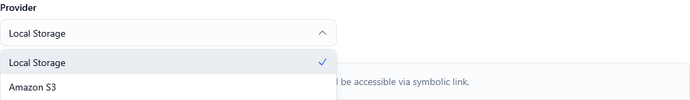
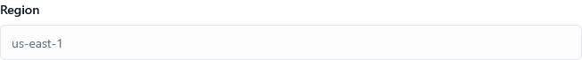
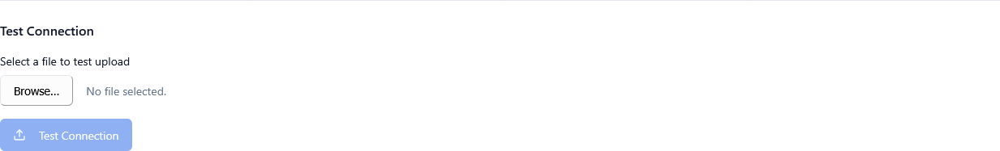

*Screenshot of Storage Settings tab*

---

## Overview

Storage settings control where and how your platform stores **files, product images, downloads, and backups**. When configured correctly, they help you:

* Store product attachments, license files, and customer downloads
* Scale storage independently from your application servers
* Reduce infrastructure costs by using cloud-optimized storage
* Provide fast, global access to files via CDN integration
* Maintain secure, redundant backups

These settings work together:

1. **Storage Driver** – Selects the storage backend (Local, S3, S3-Compatible)
2. **AWS Credentials** – Authenticates with your storage provider
3. **Region & Bucket** – Specifies where files are stored
4. **Public URL** – Defines how files are accessed by users
5. **Test Connection** – Validates your configuration

---

## Storage Driver

**Type:** Dropdown selection  
**Default:** Local  
**Options:** Local, S3, S3-Compatible


*Screenshot showing storage driver dropdown*

### Description

Determines which storage backend the platform uses for file operations.

* **Local**: Stores files on the application server's filesystem
* **S3**: Uses Amazon S3 or AWS-compatible services
* **S3-Compatible**: Uses third-party S3-compatible storage (DigitalOcean Spaces, Wasabi, MinIO, Backblaze B2)

### When to Use Local Storage

Use local storage if:

✅ You're just starting out and testing the platform  
✅ You have minimal storage needs (<10 GB)  
✅ You run a single-server deployment  
✅ You have fast local disks (SSD/NVMe)  
✅ Your users are geographically concentrated  

### When to Use S3 Storage

Use S3 or S3-compatible storage if:

✅ You need scalability and redundancy  
✅ You plan to scale to multiple servers  
✅ You want automatic backups and versioning  
✅ You need CDN integration for global performance  
✅ You want to offload storage from application servers  
✅ You have users distributed globally  

### Storage Driver Comparison

| Feature | Local | S3 | S3-Compatible |
|---------|-------|----|--------------| 
| **Setup Complexity** | Simple | Moderate | Moderate |
| **Scalability** | Limited by disk | Unlimited | Unlimited |
| **Cost at Scale** | Server-dependent | Pay-per-GB | Often cheaper than S3 |
| **Redundancy** | Manual backups | Automatic | Provider-dependent |
| **CDN Integration** | Requires setup | Native CloudFront | Varies by provider |
| **Multi-Server Support** | ❌ No | ✅ Yes | ✅ Yes |
| **Best For** | Development, small deployments | Production, AWS ecosystem | Cost-conscious production |

> ⚠️ **Warning**: Changing storage drivers requires migrating existing files. Plan the migration carefully.

---

## AWS Access Key ID

**Type:** Text input  
**Default:** Empty  
**Required:** When using S3 or S3-Compatible storage

### Description

The access key ID from your AWS IAM user or S3-compatible service.

* Used for authentication with the storage service
* Part of the credential pair (Access Key ID + Secret Access Key)
* Should have appropriate S3 permissions

### Required IAM Permissions

Your IAM user must have these permissions:

```json
{
  "Version": "2012-10-17",
  "Statement": [
    {
      "Effect": "Allow",
      "Action": [
        "s3:PutObject",
        "s3:GetObject",
        "s3:DeleteObject",
        "s3:ListBucket"
      ],
      "Resource": [
        "arn:aws:s3:::your-bucket-name",
        "arn:aws:s3:::your-bucket-name/*"
      ]
    }
  ]
}
```

### Security Best Practices

🔐 **Create a dedicated IAM user** for KeyManager (don't use root credentials)  
🔐 **Use least-privilege permissions** (only grant required S3 actions)  
🔐 **Rotate keys regularly** (every 90 days recommended)  
🔐 **Never commit keys to version control**  
🔐 **Use environment variables** for sensitive credentials  
🔐 **Enable MFA for the IAM account** in AWS console  

> ⚠️ **Warning**: Exposed access keys can lead to unauthorized access and unexpected AWS bills.

💡 **Tip**: Use AWS Organizations and SCPs to limit what compromised keys can do.

---

## AWS Secret Access Key

**Type:** Password input (masked)  
**Default:** Empty  
**Required:** When using S3 or S3-Compatible storage

### Description

The secret access key paired with your AWS Access Key ID.

* Kept secret and never displayed after initial entry
* Used to sign API requests to S3
* Should be stored securely and never logged

### Important Notes

⚠️ **Cannot be retrieved after creation** – Save it when AWS generates it  
⚠️ **Treat like a password** – Never share or expose it  
⚠️ **Regenerate if compromised** – Immediately create new credentials if exposed  

### What to Do If Keys Are Compromised

1. **Immediately deactivate** the compromised key in AWS IAM
2. **Generate new credentials** with a fresh Access Key ID and Secret
3. **Update KeyManager settings** with new credentials
4. **Review AWS CloudTrail logs** for unauthorized activity
5. **Check for unexpected S3 charges** in billing console
6. **Rotate all related credentials** as a precaution

💡 **Tip**: Use AWS IAM Access Analyzer to monitor external access to your buckets.

---

## AWS Region

**Type:** Dropdown or text input  
**Default:** us-east-1  
**Required:** When using S3 or S3-Compatible storage


*Screenshot showing region dropdown*

### Description

Specifies the AWS region where your S3 bucket is located.

* Must match the bucket's actual region
* Affects latency for storage operations
* Impacts data residency and compliance

### Common AWS Regions

| Region Code | Location | Use Case |
|-------------|----------|----------|
| **us-east-1** | US East (N. Virginia) | Default, lowest cost, highest availability |
| **us-west-2** | US West (Oregon) | West coast users, disaster recovery |
| **eu-west-1** | Europe (Ireland) | European users, GDPR compliance |
| **eu-central-1** | Europe (Frankfurt) | German data residency requirements |
| **ap-southeast-1** | Asia Pacific (Singapore) | Asian markets |
| **ap-northeast-1** | Asia Pacific (Tokyo) | Japanese customers |

### How to Choose a Region

**Considerations:**

1. **User Location**: Choose a region close to your primary user base
2. **Compliance**: Some industries require data to stay in specific regions
3. **Cost**: Pricing varies by region (us-east-1 is often cheapest)
4. **Availability**: Not all AWS services are in all regions
5. **Disaster Recovery**: Consider a secondary region for backups

### Region-Specific Settings for S3-Compatible Providers

**DigitalOcean Spaces:**
```
Region: nyc3, sfo3, sgp1, fra1, ams3
Format: nyc3 (not us-east-1)
```

**Wasabi:**
```
Region: us-east-1, us-west-1, eu-central-1, ap-northeast-1
Format: Standard AWS region codes
```

**Backblaze B2:**
```
Region: us-west-001, eu-central-003
Format: Provider-specific codes
```

💡 **Tip**: Use CloudFront or a CDN to serve content globally regardless of bucket region.

---

## S3 Bucket Name

**Type:** Text input  
**Default:** Empty  
**Required:** When using S3 or S3-Compatible storage

### Description

The name of your S3 bucket where files will be stored.

* Must be globally unique across all AWS accounts
* Must follow AWS naming conventions
* Should be created before configuring KeyManager

### S3 Bucket Naming Rules

✅ **Must be 3-63 characters long**  
✅ **Lowercase letters, numbers, hyphens only**  
✅ **Must start with letter or number**  
✅ **No underscores, spaces, or uppercase**  
✅ **Cannot be formatted as IP address** (e.g., 192.168.1.1)  

### Example Valid Bucket Names

```
keymanager-prod-files
my-company-license-storage
product-downloads-2024
cdn-assets-us-east
```

### Example Invalid Bucket Names

```
KeyManager-Files          ❌ (uppercase)
my_company_storage        ❌ (underscores)
files..bucket             ❌ (consecutive periods)
bucket-.com               ❌ (hyphen next to period)
```

### Bucket Configuration Best Practices

**Security:**
* 🔒 Enable **Bucket Versioning** for file recovery
* 🔒 Enable **Default Encryption** (AES-256 or KMS)
* 🔒 Configure **CORS** only for necessary origins
* 🔒 Block public access unless files need to be public
* 🔒 Enable **Access Logging** for audit trails

**Performance:**
* ⚡ Enable **Transfer Acceleration** for global uploads
* ⚡ Use **Intelligent-Tiering** for cost optimization
* ⚡ Configure **Lifecycle Policies** to archive old files

**Cost Optimization:**
* 💰 Set up **Lifecycle Rules** to transition to cheaper storage classes
* 💰 Use **S3 Intelligent-Tiering** for unpredictable access patterns
* 💰 Delete **incomplete multipart uploads** after 7 days
* 💰 Enable **CloudWatch metrics** to monitor costs

> ⚠️ **Warning**: Make sure the bucket exists in the specified region before testing connection.

---

## S3 Public URL

**Type:** Text input (URL)  
**Default:** Empty  
**Required:** For serving public files

### Description

The base URL used to access files stored in your bucket.

* Used for generating download links
* Can be the bucket's default URL or a custom domain
* Should include protocol (https://)

### URL Format Options

**AWS S3 Default URL:**
```
https://bucket-name.s3.region.amazonaws.com
https://your-bucket.s3.us-east-1.amazonaws.com
```

**AWS S3 Website Endpoint:**
```
http://bucket-name.s3-website-region.amazonaws.com
```

**CloudFront CDN:**
```
https://d1234abcdef.cloudfront.net
https://cdn.yourdomain.com (with custom domain)
```

**DigitalOcean Spaces:**
```
https://bucket-name.region.digitaloceanspaces.com
https://bucket-name.region.cdn.digitaloceanspaces.com (with CDN)
```

**Wasabi:**
```
https://s3.wasabisys.com/bucket-name
https://s3.region.wasabisys.com/bucket-name
```

**Backblaze B2:**
```
https://f001.backblazeb2.com/file/bucket-name
```

### CDN Configuration

**Why Use a CDN?**

✅ Faster downloads for global users  
✅ Reduced bandwidth costs  
✅ HTTPS for custom domains  
✅ DDoS protection  
✅ Cache control and optimization  

**Popular CDN Options:**

| CDN Provider | Integration | Cost |
|--------------|-------------|------|
| **AWS CloudFront** | Native S3 integration | Pay-per-GB, free tier available |
| **Cloudflare** | R2 or external storage | Free tier, paid plans from $20/mo |
| **DigitalOcean CDN** | Built into Spaces | Free with Spaces |
| **BunnyCDN** | S3-compatible | From $1/TB |
| **KeyCDN** | Pull zones | Pay-per-GB |

💡 **Tip**: Using a CDN can reduce S3 data transfer costs by 50-80%.

---

## S3 Endpoint

**Type:** Text input (URL)  
**Default:** Empty (uses AWS default)  
**Required:** For S3-compatible providers

### Description

Custom endpoint URL for S3-compatible storage providers.

* Only needed for non-AWS services
* Must include protocol (https://)
* Leave empty when using standard AWS S3

### Provider-Specific Endpoints

**DigitalOcean Spaces:**
```
https://nyc3.digitaloceanspaces.com
https://sfo3.digitaloceanspaces.com
https://sgp1.digitaloceanspaces.com
https://fra1.digitaloceanspaces.com
```

**Wasabi:**
```
https://s3.wasabisys.com (US East 1)
https://s3.us-west-1.wasabisys.com
https://s3.eu-central-1.wasabisys.com
https://s3.ap-northeast-1.wasabisys.com
```

**MinIO (Self-Hosted):**
```
https://minio.yourdomain.com:9000
http://192.168.1.100:9000 (development)
```

**Backblaze B2:**
```
https://s3.us-west-001.backblazeb2.com
https://s3.eu-central-003.backblazeb2.com
```

**Cloudflare R2:**
```
https://account-id.r2.cloudflarestorage.com
```

### Complete Configuration Examples

#### DigitalOcean Spaces Configuration

```
Storage Driver: S3-Compatible
Access Key: DO00ABC123XYZ789
Secret Key: ••••••••••••••••••••
Region: nyc3
Bucket: keymanager-files
Public URL: https://keymanager-files.nyc3.digitaloceanspaces.com
Endpoint: https://nyc3.digitaloceanspaces.com
```

#### Wasabi Configuration

```
Storage Driver: S3-Compatible
Access Key: WASABI_ACCESS_KEY_ID
Secret Key: ••••••••••••••••••••
Region: us-east-1
Bucket: my-keymanager-bucket
Public URL: https://s3.wasabisys.com/my-keymanager-bucket
Endpoint: https://s3.wasabisys.com
```

#### MinIO (Local/Self-Hosted) Configuration

```
Storage Driver: S3-Compatible
Access Key: minioadmin
Secret Key: ••••••••••••••••••••
Region: us-east-1
Bucket: keymanager
Public URL: https://minio.company.local:9000/keymanager
Endpoint: https://minio.company.local:9000
```

#### Backblaze B2 Configuration

```
Storage Driver: S3-Compatible
Access Key: 001abc123def456789
Secret Key: ••••••••••••••••••••
Region: us-west-001
Bucket: keymanager-prod
Public URL: https://f001.backblazeb2.com/file/keymanager-prod
Endpoint: https://s3.us-west-001.backblazeb2.com
```

> ⚠️ **Warning**: Incorrect endpoints will cause connection failures. Always verify the endpoint URL with your provider's documentation.

---

## Test Connection Button

**Type:** Action button  
**Purpose:** Validates storage configuration


*Screenshot showing test connection button*

### Description

Validates your storage configuration by attempting to:

1. Connect to the storage service
2. Authenticate with provided credentials
3. Access the specified bucket
4. Write a test file
5. Read the test file back
6. Delete the test file

### Test Results

**✅ Success:**
* Green notification: "Storage connection successful"
* All credentials and settings are correct
* Bucket is accessible and writable
* Safe to save configuration

**❌ Failure Messages:**

| Error | Cause | Solution |
|-------|-------|----------|
| **Invalid credentials** | Wrong Access Key or Secret | Double-check credentials in provider console |
| **Bucket not found** | Bucket doesn't exist or wrong name | Create bucket or verify name |
| **Access denied** | Insufficient permissions | Grant s3:PutObject, s3:GetObject, s3:DeleteObject |
| **Invalid region** | Region mismatch | Verify bucket region matches setting |
| **Connection timeout** | Network or endpoint issue | Check endpoint URL and firewall rules |
| **Signature mismatch** | Incorrect endpoint or region | Verify endpoint format for your provider |

### Testing Best Practices

💡 **Always test before saving** – Catch configuration errors early  
💡 **Test after credential rotation** – Verify new keys work  
💡 **Test from production environment** – Ensure network connectivity  
💡 **Monitor test file cleanup** – Verify test files are deleted  

> ⚠️ **Warning**: Test connection writes a small file to your bucket. Ensure you have write permissions.

---

## Cost Considerations

### Storage Costs by Provider (As of 2024)

| Provider | Storage Cost | Transfer Out | Free Tier | Notes |
|----------|--------------|--------------|-----------|-------|
| **AWS S3** | $0.023/GB/mo | $0.09/GB | 5 GB storage, 20k GET, 2k PUT for 12 months | Standard pricing varies by region |
| **DigitalOcean Spaces** | $5/mo flat | $0.01/GB over 1TB | None | Includes 250 GB storage + 1 TB transfer |
| **Wasabi** | $5.99/TB/mo | Free | None | Minimum 1 TB, no egress fees |
| **Backblaze B2** | $5/TB/mo | $0.01/GB | 10 GB storage, 1 GB download/day | First 3x storage in transfer is free |
| **Cloudflare R2** | $0.015/GB/mo | Free | 10 GB/mo free | Zero egress fees |
| **MinIO (Self-Hosted)** | Server costs only | None | N/A | Requires infrastructure management |

### Cost Optimization Strategies

**Storage:**
* 📊 Use **lifecycle policies** to move old files to cheaper storage tiers
* 📊 Enable **compression** for compressible file types
* 📊 Delete **temporary or unused files** regularly
* 📊 Use **deduplication** to avoid storing identical files

**Bandwidth:**
* 🌐 Use a **CDN** to reduce S3 transfer costs
* 🌐 Enable **CloudFront** or provider CDN
* 🌐 Set proper **cache headers** for static assets
* 🌐 Consider **Cloudflare R2** for zero egress costs

**Requests:**
* ⚡ Cache file metadata to reduce **LIST operations**
* ⚡ Batch operations instead of individual API calls
* ⚡ Use **CloudFront** to reduce GET requests to origin

💡 **Tip**: For high-traffic applications, Cloudflare R2 or Wasabi can save thousands in egress fees.

---

## Performance Optimization

### Upload Performance

**For Large Files:**
* Enable **multipart upload** (files >100 MB)
* Use **S3 Transfer Acceleration** for global uploads
* Configure **concurrent connections** in SDK

**For Many Small Files:**
* Batch upload operations when possible
* Use **asynchronous processing**
* Consider **concatenating** tiny files

### Download Performance

**CDN Integration:**
* Set up **CloudFront** or provider CDN
* Configure **cache-control headers** appropriately
* Use **edge locations** close to users

**Direct Downloads:**
* Generate **presigned URLs** for direct S3 access
* Set appropriate **expiration times**
* Enable **range requests** for resumable downloads

### Recommended Settings by File Type

| File Type | Cache Duration | Storage Class | Compression |
|-----------|----------------|---------------|-------------|
| **Product Images** | 1 year | Standard | Yes (WebP) |
| **Software Downloads** | 1 month | Standard or IA | No |
| **License Files** | 1 week | Standard | No |
| **Backups** | No cache | Glacier/Deep Archive | Yes |
| **Logs** | No cache | IA or Glacier | Yes |

---

## Security Best Practices

### Bucket Security Checklist

✅ **Enable bucket versioning** for file recovery  
✅ **Enable default encryption** (AES-256 minimum)  
✅ **Block all public access** unless specifically needed  
✅ **Enable access logging** to audit bucket activity  
✅ **Use bucket policies** to restrict access by IP or VPC  
✅ **Enable MFA Delete** for critical buckets  
✅ **Configure CORS** only for required origins  
✅ **Review IAM policies** regularly for least privilege  
✅ **Enable AWS CloudTrail** for API audit logs  
✅ **Set up AWS Config** rules for compliance monitoring  

### Credential Security

🔐 **Never hardcode credentials** in source code  
🔐 **Use environment variables** or secrets management  
🔐 **Rotate keys every 90 days** minimum  
🔐 **Audit credential usage** with CloudTrail  
🔐 **Revoke unused credentials** immediately  
🔐 **Use temporary credentials** (STS) when possible  
🔐 **Enable MFA for IAM users** with S3 access  

### Data Protection

**Encryption:**
* Enable **encryption at rest** (SSE-S3, SSE-KMS, or SSE-C)
* Use **HTTPS only** for data in transit
* Consider **client-side encryption** for sensitive data

**Access Control:**
* Use **presigned URLs** with expiration for temporary access
* Implement **bucket policies** for IP/VPC restrictions
* Configure **VPC endpoints** for private access
* Enable **S3 Object Lock** for compliance and immutability

> ⚠️ **Warning**: Public buckets can expose sensitive data and lead to security breaches. Always review public access settings.

---

## Recommended Configurations

### Startup / Development

**Minimal cost, easy setup**

* **Storage Driver:** Local or S3-Compatible (DigitalOcean Spaces)
* **Region:** Closest to your server
* **Bucket:** Single bucket for all files
* **Public URL:** Provider default or CDN included
* **Cost:** $0-5/month

**Reasoning:** Keep it simple and cheap while validating product-market fit.

---

### Small Business / SaaS

**Balanced cost and reliability**

* **Storage Driver:** S3-Compatible (Wasabi or Backblaze B2)
* **Region:** Primary user location
* **Bucket:** Separate buckets for files vs backups
* **Public URL:** Provider CDN or Cloudflare
* **Cost:** $10-50/month

**Reasoning:** Better price-performance ratio than AWS S3 for growing businesses.

---

### Enterprise / High-Traffic

**Maximum reliability and performance**

* **Storage Driver:** S3 (AWS)
* **Region:** Multi-region with replication
* **Bucket:** Separate buckets per environment and file type
* **Public URL:** CloudFront with custom domain
* **Cost:** $100-1000+/month

**Reasoning:** AWS provides best ecosystem integration, SLAs, and global infrastructure.

---

### Compliance / Regulated Industries

**Data residency and audit requirements**

* **Storage Driver:** S3 or S3-Compatible in required region
* **Region:** Specific region for compliance (e.g., eu-central-1 for GDPR)
* **Bucket:** Encrypted, versioned, with Object Lock
* **Public URL:** Private or authenticated access only
* **Cost:** Varies by requirements

**Reasoning:** Meet regulatory requirements for data location, encryption, and audit trails.

---

## Migration Guide

### Moving from Local to S3 Storage

**Step 1: Set up S3 bucket**
* Create bucket in desired region
* Configure encryption and versioning
* Set up IAM user with appropriate permissions

**Step 2: Upload existing files**
* Use AWS CLI: `aws s3 sync /local/path s3://bucket-name/`
* Or use GUI tools like Cyberduck or S3 Browser
* Verify file count and sizes match

**Step 3: Update KeyManager settings**
* Configure S3 credentials and bucket settings
* Test connection to verify
* Save settings

**Step 4: Verify application**
* Test file uploads through application
* Test file downloads
* Check generated URLs

**Step 5: Clean up**
* Keep local files as backup initially
* Delete local files after 30 days of stable operation

### Moving Between S3 Providers

**Use AWS CLI or rclone:**

```bash
# Using AWS CLI
aws s3 sync s3://old-bucket s3://new-bucket --source-region us-east-1 --region eu-west-1

# Using rclone (supports all providers)
rclone sync old-provider:bucket new-provider:bucket --progress
```

💡 **Tip**: Use a migration tool or script to avoid downtime during large migrations.

---

## Important Notes

⚠️ **Storage settings require application restart** – Changes may not take effect immediately

🔄 **Changing drivers requires data migration** – Plan carefully before switching storage backends

📊 **Monitor storage costs regularly** – Set up billing alerts in your provider console

🔒 **Protect credentials like passwords** – Never expose them in logs or version control

📧 **Set up monitoring** – Configure alerts for failed uploads or access denied errors

🌐 **Test from multiple locations** – Ensure global users can access files

---

## Summary Table

| Setting | Purpose | Typical Value |
|---------|---------|---------------|
| Storage Driver | Selects storage backend | S3 or S3-Compatible |
| AWS Access Key ID | Authentication credential | Provider-specific |
| AWS Secret Access Key | Authentication secret | Provider-specific |
| AWS Region | Bucket location | us-east-1, eu-west-1, etc. |
| S3 Bucket Name | Target storage bucket | keymanager-prod-files |
| S3 Public URL | File access URL | CloudFront or provider CDN |
| S3 Endpoint | Custom provider endpoint | Provider-specific (or empty for AWS) |
| Test Connection | Validates configuration | N/A (action button) |

---

## Testing Your Configuration

### Step 1: Choose and Prepare Your Storage Provider

Select a provider (AWS, DigitalOcean, Wasabi, etc.) and create an account if needed.

### Step 2: Create Storage Bucket

Create a bucket following provider documentation and naming conventions.

### Step 3: Generate Access Credentials

Create an IAM user or API key with S3 permissions (PutObject, GetObject, DeleteObject, ListBucket).

### Step 4: Configure KeyManager Settings

Enter all storage settings including credentials, region, bucket name, and endpoint (if applicable).

### Step 5: Test Connection

Click the **Test Connection** button and verify success message appears.

### Step 6: Upload Test File

Use the application to upload a product image or file attachment.

### Step 7: Verify File Access

Generate a download link and verify the file is accessible via the public URL.

### Step 8: Monitor Logs

Check application logs for any storage-related errors or warnings.

### Step 9: Set Up Monitoring

Configure provider-specific alerts for failed uploads or excessive costs.

### Step 10: Document Configuration

Save your configuration details (without credentials) for disaster recovery.

---

## Frequently Asked Questions

**Q: Can I use multiple storage backends simultaneously?**  
A: Not currently. KeyManager uses a single storage driver for all files. You must choose one backend.

**Q: What happens to existing files if I change storage providers?**  
A: Files remain in the old storage. You must manually migrate them to the new provider. Plan for downtime or gradual migration.

**Q: How do I rotate storage credentials?**  
A: Generate new credentials in your provider console, update KeyManager settings, test connection, then deactivate old credentials.

**Q: Can I use S3-compatible storage with AWS CloudFront?**  
A: Yes, but you'll need to configure CloudFront with a custom origin pointing to your S3-compatible provider's URL.

**Q: Do I need a CDN for small deployments?**  
A: Not required, but recommended even for small deployments if you have global users or serve large files frequently.

**Q: How do I backup files stored in S3?**  
A: Enable bucket versioning, set up cross-region replication, or use AWS Backup. For non-AWS providers, use scheduled sync scripts.

**Q: What's the difference between S3 and S3-Compatible?**  
A: "S3" uses AWS S3 endpoints by default. "S3-Compatible" requires you to specify a custom endpoint for third-party providers.

**Q: Can I migrate from one provider to another without downtime?**  
A: Yes, with careful planning: sync files to new provider, configure new storage in testing, then switch after validation.

**Q: Are there file size limits?**  
A: AWS S3 supports up to 5 TB per file. Most S3-compatible providers have similar limits. Check your specific provider's documentation.

**Q: How do I troubleshoot "Access Denied" errors?**  
A: Verify IAM permissions include s3:PutObject, s3:GetObject, s3:DeleteObject. Check bucket policies and ACLs don't block access.

---

## How to Access

1. Log in to the Admin Portal
2. Navigate to **Settings** in the main menu
3. Click the **Storage** tab
4. Configure the storage driver and provider-specific settings
5. Click **Test Connection** to validate
6. Click **Save Settings** at the bottom

---

## Related Settings

- [Settings Overview]() - All settings tabs
- [General Settings]() - Application configuration
- [Email Settings]() - Notification delivery
- [Backup Settings]() - Database backups (may use same storage)

---

**Proper storage configuration ensures reliable file delivery, optimal performance, and cost-effective scaling.**
