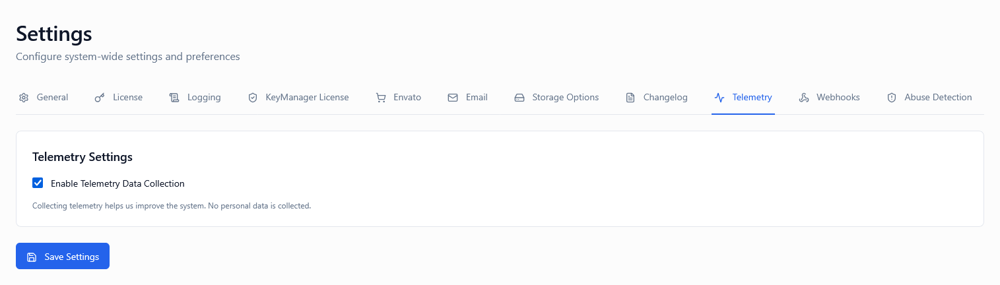
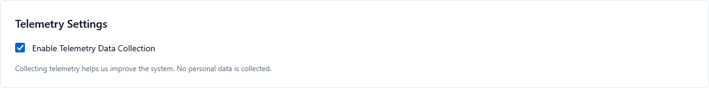

# Telemetry Settings

*Screenshot of Telemetry Settings tab*

---

## Overview

Telemetry enables you to collect **anonymized usage data** from your deployed products to understand how customers use your software in the field. When configured correctly, telemetry helps you:

* Understand feature adoption and usage patterns
* Identify performance bottlenecks and stability issues
* Prioritize product roadmap based on real-world data
* Detect crashes and errors before customers report them
* Measure user engagement and retention metrics
* Make data-driven product decisions

These controls work together:

1. **Enable Telemetry** – Turns data collection on or off
2. **Storage Duration** – Controls how long telemetry data is retained

---

## Enable Telemetry

**Type:** Toggle (On / Off)  
**Default:** Off

### Description

Enables or disables telemetry data collection from your products in the field.

* **ON**: The system actively collects, processes, and stores usage data from activated licenses
* **OFF**: No telemetry data is collected, transmitted, or stored. Products function normally without sending any usage metrics

### What Data Is Collected

When enabled, the telemetry system may collect:

📊 **Usage Metrics**
* Feature usage frequency and patterns
* Session duration and frequency
* User workflow patterns
* Settings and configuration choices
* API endpoint usage statistics

🎯 **Feature Adoption**
* Which features are actively used
* Feature discovery patterns
* Time to first use of new features
* Feature abandonment rates

⚡ **Performance Data**
* Application startup time
* Response time metrics
* Memory usage patterns
* CPU utilization
* Network latency

🔧 **Stability Information**
* Crash reports and stack traces
* Error logs and exception types
* Unhandled exception frequency
* Application hang detection

🖥️ **Environment Context**
* Operating system and version
* Hardware specifications (CPU, RAM)
* Application version and build number
* License type and activation status
* Geographic region (country-level only)

💡 **User Interaction Events**
* Button clicks and menu selections
* Navigation patterns
* Search queries within the application
* Time spent in different sections

⚠️ **What Is NOT Collected**

The telemetry system is designed with privacy in mind and does NOT collect:

* ❌ Personally identifiable information (PII)
* ❌ Customer names, emails, or contact details
* ❌ User-created content or documents
* ❌ Passwords or authentication credentials
* ❌ File names or directory structures
* ❌ Specific IP addresses (only country-level geo-data)
* ❌ Keystroke logging or screen captures

### When to Enable

Enable telemetry if:

✅ You want to understand how customers use your product  
✅ You need data to prioritize feature development  
✅ You want to detect issues before customers report them  
✅ You operate at scale and need automated insights  
✅ You want to measure feature ROI  
✅ You need crash reporting for stability improvements  
✅ Your privacy policy permits anonymized data collection  
✅ You're committed to being transparent with customers  

### When to Disable

You may keep telemetry disabled:

🔧 For air-gapped or offline enterprise deployments  
🔧 When customer contracts prohibit data collection  
🔧 For products handling highly sensitive data  
🔧 In regulated industries with strict data policies (healthcare, finance)  
🔧 During internal testing to avoid polluting production data  
🔧 When you lack privacy policy coverage  
🔧 For products sold in regions with restrictive data laws  

> ⚠️ **Warning**: Enabling telemetry requires updating your privacy policy and providing clear disclosure to customers about what data is collected and how it's used.

> ⚠️ **GDPR Compliance**: If you operate in the EU or serve EU customers, ensure your telemetry collection is GDPR-compliant. This includes obtaining appropriate consent, providing data access mechanisms, and honoring deletion requests.

### Privacy & Transparency Best Practices

**Clear Communication:**
1. ✅ Disclose telemetry collection in your privacy policy
2. ✅ Provide an in-app notice during first launch
3. ✅ Offer customers a way to opt-out
4. ✅ Document what data is collected
5. ✅ Explain how data benefits product improvement

**Technical Safeguards:**
1. 🔒 Use HTTPS/TLS for all telemetry transmission
2. 🔒 Anonymize data before transmission
3. 🔒 Implement data retention policies
4. 🔒 Provide data deletion mechanisms
5. 🔒 Regular security audits of telemetry infrastructure

💡 **Tip**: Transparency builds trust. Customers are more likely to accept telemetry when you're open about what you collect and why.

---

## Storage Duration (Days)

**Type:** Numeric input  
**Default:** 90 days  
**Range:** 1-730 days (2 years maximum)

*Screenshot showing storage duration configuration*

### Description

Defines how long telemetry data is retained before being automatically deleted from the system.

After this period expires:
* 🗑️ Telemetry data is permanently deleted
* 📊 Aggregated reports remain available (without raw data)
* ⏰ Deletion occurs automatically via scheduled cleanup jobs
* 🔄 Shorter retention reduces storage costs and privacy risk
* 📈 Longer retention enables trend analysis over time

### How It Works

1. Telemetry data arrives and is stored with a timestamp
2. Each day, a cleanup job runs to identify expired data
3. Data older than the configured duration is permanently deleted
4. Aggregated metrics are calculated and stored separately before deletion
5. Reports show trends based on aggregated data, not individual events

### Example Scenarios

| Duration | Behavior | Use Case |
| -------- | -------- | -------- |
| **7 days** | Very short retention; minimal storage | Testing phase, minimal data needs |
| **30 days** | Recent data only; good for active monitoring | Early-stage products, rapid iteration |
| **90 days** | Quarterly view; balanced approach | **Recommended default for most products** |
| **180 days** | Semi-annual analysis; seasonal trends | Mature products with established patterns |
| **365 days** | Annual comparison; full yearly trends | Enterprise products, compliance requirements |
| **730 days** | Maximum retention; multi-year analysis | Long-term research, historical comparison |

### Real-World Examples

**Scenario 1: SaaS Product (90 days)**

You're running a cloud-based productivity tool:
* Need to track feature adoption over quarters
* Balance between insight depth and storage costs
* Comply with GDPR "data minimization" principle
* **Setting**: 90 days provides 3-month trends without excessive retention

**Scenario 2: Desktop Software (180 days)**

You sell desktop software with infrequent updates:
* Release major updates every 6 months
* Want to compare user behavior before/after releases
* Need to identify long-term stability patterns
* **Setting**: 180 days captures two release cycles

**Scenario 3: Mobile App (30 days)**

You have a fast-moving mobile app:
* Release updates every 2-3 weeks
* Need immediate feedback on feature performance
* Focus on recent user behavior
* **Setting**: 30 days keeps data fresh and actionable

**Scenario 4: Enterprise Software (365 days)**

You provide enterprise software with annual contracts:
* Customers want usage reports for renewal decisions
* Need to demonstrate value over contract period
* Compliance requires year-over-year comparisons
* **Setting**: 365 days supports annual business reviews

### Data Retention & Privacy Regulations

| Regulation | Requirement | Recommended Duration |
| ---------- | ----------- | -------------------- |
| **GDPR** (EU) | Data minimization; retain only as long as necessary | 90-180 days maximum unless justified |
| **CCPA** (California) | Disclose retention period; honor deletion requests | 90-365 days with clear disclosure |
| **PIPEDA** (Canada) | Keep only as long as needed for stated purpose | 90-180 days for product improvement |
| **LGPD** (Brazil) | Limited retention aligned with collection purpose | 90-180 days recommended |

### Storage Cost Considerations

Longer retention increases storage costs:

| Duration | Relative Storage Cost | Monthly Cost (per 10k users)* |
| -------- | -------------------- | ----------------------------- |
| 7 days | Minimal | ~$5-10 |
| 30 days | Low | ~$20-40 |
| 90 days | Moderate | ~$60-120 |
| 180 days | High | ~$120-240 |
| 365 days | Very High | ~$240-480 |
| 730 days | Maximum | ~$480-960 |

*Estimates based on typical telemetry data volumes; actual costs vary by event frequency and data richness.

💡 **Tip**: Start with 90 days and extend only if you have specific analytical needs that require longer history.

### Best Practices

**Starting Out:**
1. Begin with **90 days** as a baseline
2. Review telemetry dashboards regularly
3. Identify minimum retention for your needs
4. Reduce if shorter windows provide sufficient insight
5. Extend only with clear business justification

**Optimization:**
1. ✅ Set retention to the **minimum viable duration**
2. ✅ Document retention policy in privacy policy
3. ✅ Review and adjust quarterly
4. ✅ Export critical data before reducing retention
5. ✅ Consider data sovereignty laws in your markets

**Compliance:**
1. 📋 Document why you chose your retention period
2. 📋 Ensure alignment with privacy policy
3. 📋 Implement user data deletion mechanisms
4. 📋 Regular audits of stored telemetry
5. 📋 Train support team on data requests

---

## Recommended Configurations

### Early-Stage Startup / MVP

**Rapid iteration, limited resources**

* **Enable Telemetry:** ON
* **Storage Duration:** 30-60 days

**Reasoning:** Need quick feedback on feature usage. Short retention reduces costs while building product-market fit.

---

### Established SaaS Product

**Mature product, regular updates**

* **Enable Telemetry:** ON
* **Storage Duration:** 90-120 days

**Reasoning:** Balanced retention for quarterly reviews and trend analysis. Supports feature planning cycles.

---

### Desktop / On-Premises Software

**Infrequent updates, offline usage**

* **Enable Telemetry:** ON (with opt-out)
* **Storage Duration:** 180-365 days

**Reasoning:** Longer update cycles require extended data to compare major releases. Opt-out respects offline users.

---

### Enterprise B2B Software

**Annual contracts, compliance requirements**

* **Enable Telemetry:** ON (with customer consent)
* **Storage Duration:** 365 days

**Reasoning:** Annual reporting for customer success. Longer retention supports renewal conversations.

---

### Regulated Industry (Healthcare, Finance)

**Strict compliance, sensitive environments**

* **Enable Telemetry:** OFF or ON with strict controls
* **Storage Duration:** 30-60 days (if enabled)

**Reasoning:** Minimize data collection and retention. Ensure compliance with industry regulations.

---

### Internal / Trial Products

**Testing and evaluation**

* **Enable Telemetry:** OFF (for internal) / ON (for trials)
* **Storage Duration:** 30 days

**Reasoning:** Internal tools don't need telemetry. Trial telemetry helps understand evaluation patterns.

---

## Important Notes

⚠️ **Privacy is paramount** – Always be transparent about data collection

🔒 **Security matters** – Encrypt telemetry data in transit and at rest

📋 **Legal compliance** – Ensure telemetry aligns with regional data protection laws

📊 **Aggregate, don't track individuals** – Focus on patterns, not personal behavior

🔄 **Provide opt-out mechanisms** – Respect users who prefer not to share data

📧 **Update privacy policies** – Keep documentation current with collection practices

💬 **Respond to data requests** – Honor customer requests for data access or deletion

🎯 **Use data responsibly** – Collect only what's needed for stated purposes

---

## Telemetry Implementation Checklist

### Before Enabling Telemetry

✅ Update privacy policy to disclose data collection  
✅ Add in-product notice about telemetry  
✅ Implement opt-out mechanism in your software  
✅ Set up secure data transmission (HTTPS/TLS)  
✅ Configure anonymization of sensitive data  
✅ Establish data retention policy  
✅ Train support team on telemetry questions  
✅ Set up telemetry dashboards for analysis  

### After Enabling Telemetry

✅ Monitor data collection volume  
✅ Review data for unexpected PII leakage  
✅ Validate dashboards show useful insights  
✅ Set up alerts for anomalous patterns  
✅ Schedule regular data reviews  
✅ Document findings and action items  
✅ Adjust retention based on actual needs  
✅ Respond to customer inquiries promptly  

---

## Summary Table

| Setting | Purpose | Typical Value |
| ------- | ------- | ------------- |
| Enable Telemetry | Turns data collection on/off | OFF (default) or ON with disclosure |
| Storage Duration | Controls data retention period | 90 days (balanced) |

---

## Testing Your Configuration

### Step 1: Enable Telemetry in Test Environment

Configure telemetry in a non-production environment first.

### Step 2: Set Short Storage Duration

Use 7-14 days for initial testing to validate data flow.

### Step 3: Integrate SDK in Test Product

Add telemetry SDK to your test application with proper configuration.

### Step 4: Generate Test Events

Trigger various user actions and features in your test product.

### Step 5: Verify Data Collection

Check the admin portal to confirm telemetry events are being received.

### Step 6: Review Data Quality

Inspect collected data for accuracy and completeness. Verify no PII is present.

### Step 7: Test Data Retention

Wait for retention period to expire and verify data is deleted automatically.

### Step 8: Configure Production Settings

Apply tested configuration to production environment.

### Step 9: Monitor Initial Deployment

Watch carefully during first weeks to catch any issues.

### Step 10: Iterate and Optimize

Adjust settings based on actual usage patterns and business needs.

---

## Frequently Asked Questions

**Q: Is telemetry required for KeyManager to function?**  
A: No. Telemetry is entirely optional. Your licenses work normally with telemetry disabled.

**Q: Can customers see what telemetry data is sent?**  
A: Implement transparency by providing an in-app data viewer or detailed documentation. This builds trust.

**Q: What happens to data after storage duration expires?**  
A: Raw telemetry events are permanently deleted. Aggregated reports and trends remain available.

**Q: Can I export telemetry data before it's deleted?**  
A: Yes. Use the telemetry dashboard export features to save data for long-term analysis before retention expires.

**Q: Does telemetry work with offline licenses?**  
A: Telemetry requires internet connectivity. Offline licenses can queue events and transmit when reconnected.

**Q: How much does telemetry storage cost?**  
A: Costs depend on event volume and retention. See the Storage Cost Considerations table above for estimates.

**Q: Can I disable telemetry for specific customers?**  
A: Yes. Implement an opt-out mechanism in your application or provide admin controls per license/product.

**Q: Is telemetry data encrypted?**  
A: Yes. All telemetry transmission uses TLS encryption. Storage encryption is also recommended.

**Q: How do I handle GDPR data deletion requests?**  
A: Implement a data deletion mechanism that allows removing telemetry data associated with specific users or licenses.

**Q: Can I use telemetry data for marketing?**  
A: Only if explicitly disclosed in your privacy policy and users have opted in. Product improvement is the primary purpose.

**Q: What if I accidentally collect PII?**  
A: Immediately purge the data, update your SDK to filter PII, and notify affected users per applicable regulations.

**Q: Can I segment telemetry by product or license type?**  
A: Yes. Telemetry dashboards support filtering by product, version, license type, and other attributes.

---

## Data Insights and Analytics

### Key Metrics to Track

Once telemetry is enabled, focus on these high-value metrics:

**Feature Adoption Rate**
* Percentage of users who discover and use new features
* Time from release to first use
* Feature stickiness (repeated use)

**User Engagement**
* Daily/weekly/monthly active users
* Session frequency and duration
* Retention cohorts over time

**Performance Benchmarks**
* 95th percentile response times
* Crash rate and affected users
* Application startup performance

**User Journey Analysis**
* Common navigation paths
* Drop-off points in workflows
* Feature discovery methods

**Platform Distribution**
* OS version adoption rates
* Hardware capability trends
* Geographic distribution

💡 **Tip**: Create a monthly telemetry review meeting to turn data into actionable product improvements.

---

## Integration with Product Development

### Using Telemetry in Your Workflow

**Product Planning**
* Identify most-used features to prioritize improvements
* Find unused features to deprecate or redesign
* Discover feature gaps based on user behavior

**Quality Assurance**
* Catch bugs in the wild that escaped QA testing
* Identify edge cases from real usage patterns
* Prioritize bug fixes by impact

**Customer Success**
* Proactive outreach when usage drops
* Identify power users for case studies
* Measure feature ROI for renewals

**Engineering**
* Performance regression detection
* Capacity planning based on usage trends
* A/B testing measurement

---

## How to Access

1. Log in to the Admin Portal
2. Navigate to **Settings** in the main menu
3. Click the **Telemetry** tab
4. Configure the two settings
5. Review your privacy policy and legal compliance
6. Click **Save Settings** at the bottom
7. Integrate telemetry SDK into your products

---

## Related Settings

- [Settings Overview](../) - All settings tabs
- [Logging Settings](../logging) - System event logging
- [License Settings](../license) - License configuration
- [General Settings](../general) - Overall system settings

---

**Telemetry done right balances valuable product insights with respect for customer privacy.**
