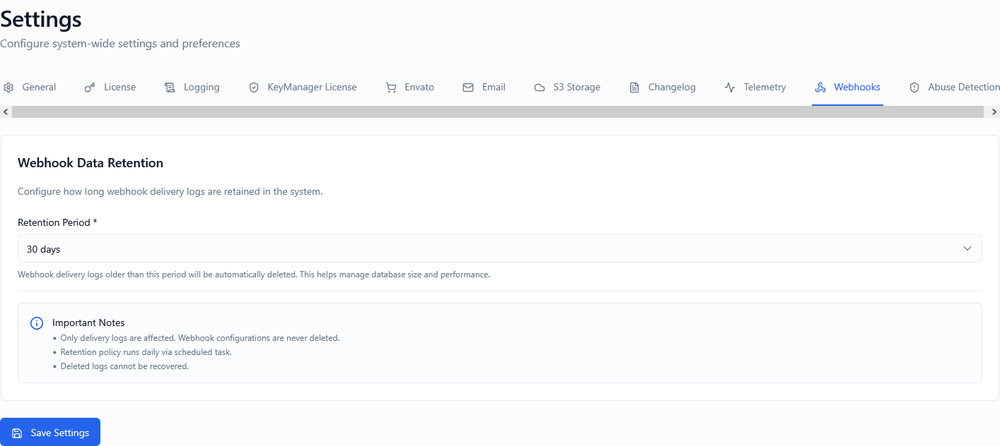
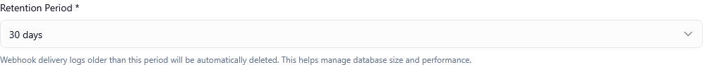

*Screenshot of Webhook Settings tab*

---

## Overview

Webhooks enable real-time event notifications from the license management system to your own applications and services. When configured correctly, webhooks help you:

* Receive instant notifications about license lifecycle events
* Integrate license data into your own systems automatically
* Build custom workflows and automations
* Maintain audit trails and compliance records
* Trigger downstream processes based on license state changes

The webhook system consists of two main components:

1. **Webhook Endpoints** – URLs you configure to receive event notifications
2. **Webhook Delivery Logs** – Records of every delivery attempt, including requests, responses, and retry attempts

This settings tab controls how long webhook delivery logs are retained in the system.

---

## What Are Webhook Events?

The system generates webhook events for critical license lifecycle changes, including:

### License Events

* **license.created** – New license key generated
* **license.activated** – License activated on a device
* **license.deactivated** – License deactivated from a device
* **license.suspended** – License moved to suspended state
* **license.unsuspended** – License restored from suspension
* **license.expired** – License reached expiration date
* **license.revoked** – License permanently revoked
* **license.renewed** – License renewal processed
* **license.updated** – License metadata or limits modified

### Validation Events

* **validation.success** – License validation succeeded
* **validation.failed** – License validation failed
* **abuse.detected** – Suspicious activation pattern detected
* **limit.exceeded** – Activation or usage limit reached

Each webhook event includes:
- Event type and timestamp
- Full license details (key, status, metadata)
- Context about what triggered the event
- Customer information (if available)
- Device and activation details (for device-related events)

---

## What Are Webhook Delivery Logs?

Webhook delivery logs are detailed records of every attempt to deliver an event to your webhook endpoints. Each log entry contains:

### Request Information

* **Timestamp** – When the delivery was attempted (ISO 8601 format)
* **Event Type** – Which event triggered the webhook (e.g., license.activated)
* **Endpoint URL** – The destination URL that received the webhook
* **HTTP Method** – Usually POST
* **Request Headers** – All headers sent with the webhook (including signatures)
* **Request Body** – Complete JSON payload sent to your endpoint
* **Payload Size** – Size of the JSON payload in bytes

### Response Information

* **Response Status Code** – HTTP status returned by your endpoint (200, 404, 500, etc.)
* **Response Headers** – Headers returned by your server
* **Response Body** – Content returned by your endpoint (first 10KB)
* **Response Time** – How long your endpoint took to respond (milliseconds)
* **Delivery Status** – Success, Failed, Pending

### Retry Information

* **Attempt Number** – Which delivery attempt this was (1st, 2nd, 3rd, etc.)
* **Max Attempts** – Total retry attempts allowed
* **Next Retry Time** – When the next retry will occur (if applicable)
* **Retry Delay** – Exponential backoff delay between retries
* **Final Status** – Whether delivery ultimately succeeded or failed

### Diagnostic Information

* **Error Messages** – Connection errors, timeouts, or other failures
* **TLS/SSL Details** – Certificate validation information
* **DNS Resolution** – IP address resolved for the endpoint
* **Network Latency** – Time spent in transit
* **Failure Reason** – Human-readable explanation of why delivery failed

---

## Webhook Retention Days

**Type:** Dropdown selection  
**Options:** 7 days, 15 days, 30 days  
**Default:** 30 days


*Screenshot showing retention configuration dropdown*

### Description

Controls how long webhook delivery logs are retained in the system before being automatically deleted.

* **7 days**: Minimal retention for basic debugging
* **15 days**: Moderate retention for regular monitoring
* **30 days**: Extended retention for compliance and analysis

After the retention period expires, delivery logs are **permanently deleted** and cannot be recovered. The deletion process runs automatically each night and removes logs older than the configured retention period.

⚠️ **Important**: Only delivery logs are deleted. The webhook endpoints themselves, event configurations, and actual license data are never affected by this setting.

### What Gets Deleted

When logs expire, the system removes:

✅ Request and response bodies  
✅ HTTP headers (both request and response)  
✅ Timing and performance metrics  
✅ Error messages and diagnostic data  
✅ Retry attempt records  

### What Is Preserved

The following data is **never deleted** regardless of retention:

🔒 Webhook endpoint configurations  
🔒 License records and history  
🔒 Aggregated delivery statistics (success rates, average response times)  
🔒 Event counters and metrics  
🔒 Security audit logs (separate from webhook logs)  

### How Retention Works

1. Webhook event occurs (e.g., license.activated)
2. System attempts delivery to configured endpoints
3. Detailed log entry is created with full request/response data
4. Log is stored and available for the retention period
5. Nightly cleanup job runs at 02:00 UTC
6. Logs older than retention period are identified
7. Expired logs are permanently deleted
8. Storage space is reclaimed

### Why Retention Matters

**Debugging and Troubleshooting**

Webhook delivery logs are essential for:
- Diagnosing why webhooks aren't reaching your endpoint
- Investigating intermittent delivery failures
- Analyzing response times and performance issues
- Understanding why your endpoint returned errors
- Reviewing the exact payload sent for an event
- Identifying network or TLS/SSL problems

**Compliance and Auditing**

Many industries require:
- Audit trails of data transmitted to third-party systems
- Records of when and how customer data was shared
- Proof of delivery for contractual obligations
- Forensic evidence for security investigations
- Timestamped records for regulatory compliance (SOC2, GDPR, HIPAA)

**Cost and Storage Management**

Webhook logs can consume significant storage:
- Each log entry can be 5-50 KB depending on payload size
- High-volume systems may generate thousands of logs per day
- Longer retention = higher storage costs
- Shorter retention = lower costs but less debugging capability

💡 **Tip**: Balance retention duration with your actual needs. Most issues are discovered within 7 days.

---

## Example Scenarios

### Scenario 1: Active Development and Integration

**Situation**: You're building a new integration that consumes webhook events. You need to debug payload formatting and endpoint responses.

**Configuration**:
* **Webhook Retention Days:** 7 days

**Reasoning**: During active development, you're monitoring webhooks daily. 7 days provides sufficient history for debugging while minimizing storage costs. You can quickly identify and fix issues.

**Expected Outcome**: You can view recent webhook attempts, debug response codes, examine exact payloads, and iterate rapidly without accumulating months of test data.

---

### Scenario 2: Production SaaS Platform

**Situation**: Your production system processes hundreds of license events daily. Customers occasionally report delayed integrations or missing notifications.

**Configuration**:
* **Webhook Retention Days:** 15 days

**Reasoning**: This provides a two-week window to investigate customer reports while balancing storage costs. Most issues are reported within a few days of occurrence.

**Expected Outcome**: When a customer reports "I didn't receive a webhook notification last week," you can search the logs, verify delivery attempts, and provide specific evidence of what was sent and when.

---

### Scenario 3: Enterprise with Compliance Requirements

**Situation**: Your organization has SOC2 certification and must maintain audit trails for external data transmissions for at least 30 days.

**Configuration**:
* **Webhook Retention Days:** 30 days

**Reasoning**: Regulatory compliance requires documented evidence of data sharing. 30-day retention satisfies audit requirements and provides ample time for internal reviews.

**Expected Outcome**: During compliance audits, you can produce complete records of all webhook deliveries, including what data was sent, when, and to which endpoints, covering the required audit period.

---

### Scenario 4: High-Volume API Service

**Situation**: Your API generates 10,000+ webhook events per day. Storage costs are becoming significant.

**Configuration**:
* **Webhook Retention Days:** 7 days

**Reasoning**: At 10KB average per log entry, you're generating ~100MB of logs daily. 30-day retention would store 3GB+. With 7-day retention, you maintain recent debugging capability while keeping storage costs manageable.

**Expected Outcome**: Recent issues can still be debugged, but storage costs are reduced by ~75% compared to 30-day retention.

---

## Real-World Example: Investigating Failed Webhooks

**Problem**: Customer reports that their license activation webhook isn't triggering their internal provisioning system.

**Investigation Process**:

### Step 1: Locate the Delivery Logs

Navigate to Admin Portal → Webhooks → Delivery Logs, and filter by:
- Event type: license.activated
- Customer or license key
- Time range: Last 7 days

### Step 2: Examine the Log Entry

You find multiple delivery attempts with these details:

```
Event: license.activated
Timestamp: 2024-01-15 14:32:18 UTC
Endpoint: https://customer.example.com/webhooks/license
Status: Failed (HTTP 503)
Attempts: 3/5
Response: Service Temporarily Unavailable
Response Time: 30,247ms
```

### Step 3: Review Request Details

The full request shows:
- Correct endpoint URL ✅
- Valid signature in headers ✅
- Complete JSON payload with all required fields ✅
- Proper content-type header ✅

### Step 4: Analyze Response

The response reveals:
- Customer's endpoint returned 503 status code
- Response took 30+ seconds (near timeout)
- Error message: "Database connection pool exhausted"

### Step 5: Resolution

You contact the customer with specific evidence:
- "Your endpoint received the webhook at 14:32:18 UTC"
- "It returned HTTP 503 after 30 seconds"
- "The error suggests your database was overloaded"
- "We've retried 3 times with exponential backoff"

Customer investigates and finds their database was experiencing high load during that time window. They fix the infrastructure issue, and you manually retry the failed webhooks.

**Outcome**: Without detailed delivery logs, this would have been impossible to diagnose. The logs provided concrete evidence of what happened and when.

---

## Retention Period Comparison

| Duration | Best For | Storage Impact | Debugging Window | Compliance |
|----------|----------|----------------|------------------|------------|
| **7 days** | Active development, high-volume systems, cost-conscious | Low (baseline) | Recent issues only | Minimal |
| **15 days** | Production systems, moderate volume | Medium (~2x) | Short-term investigations | Basic |
| **30 days** | Enterprise, compliance-driven, low volume | High (~4x) | Extended troubleshooting | Full audit trail |

---

## Best Practices

### Choosing Retention Duration

**Start with 30 days initially**:
1. Monitor how often you actually access logs older than 7 days
2. Review your compliance and audit requirements
3. Consider your average time-to-discovery for webhook issues
4. After 2-3 months, adjust based on actual usage patterns

**Indicators you need longer retention**:
- 📊 Compliance or regulatory requirements mandate it
- 🕐 Issues are often discovered weeks after they occur
- 🏢 Enterprise customers require detailed audit trails
- 🔍 You perform monthly or quarterly webhook audits
- ⚖️ Legal or contractual obligations require records

**Indicators you can use shorter retention**:
- 💰 Storage costs are a significant concern
- 🚀 You have high webhook volume (1000s per day)
- ⚡ Issues are always caught within days
- 🔧 You monitor webhooks actively and proactively
- 📉 Very few failures occur in your system

### Monitoring and Alerts

Don't rely solely on logs – set up proactive monitoring:

**Set up alerts for**:
- Webhook delivery failure rate exceeds threshold (e.g., >5%)
- Specific endpoint consistently failing
- Response times degrading over time
- Retry queue growing
- Unusual spike in failed deliveries

**Regular reviews**:
- Weekly: Check for any failed deliveries
- Monthly: Review endpoint performance and response times
- Quarterly: Analyze patterns and adjust retention if needed

**Export critical logs**:
- For regulatory compliance, export logs to external storage
- Archive important webhook interactions to your own database
- Don't rely solely on the built-in retention period for critical records

### Storage Optimization

**Reduce webhook log volume**:
1. Only subscribe to events you actually use
2. Disable test endpoints that are no longer needed
3. Use a single endpoint with event filtering instead of multiple endpoints
4. Consider batching events if your use case allows it

**Calculate your storage needs**:
```
Daily logs = (Events per day) × (Average log size)
Total storage = Daily logs × Retention days

Example:
500 events/day × 10KB/log × 30 days = 150MB
```

💡 **Tip**: If storage is a concern but compliance requires longer retention, export logs to your own archival system and use 7-day retention in the platform.

---

## Security Considerations

### What's in the Logs?

Webhook delivery logs contain:

**Sensitive data that IS logged**:
- Full license keys
- Customer email addresses
- Device identifiers and fingerprints
- IP addresses of activations
- Product and metadata fields
- Your webhook endpoint URLs
- Request/response headers (including signatures)

**Sensitive data that is NOT logged**:
- Payment information (never included in webhooks)
- Customer passwords (never included in webhooks)
- Your webhook endpoint authentication tokens (masked in logs)

### Access Control

⚠️ **Important**: Webhook delivery logs are only accessible to:
- Admin portal users with appropriate permissions
- Users with "View Webhooks" permission
- API calls authenticated with admin credentials

Regular users and customers **cannot** access webhook delivery logs.

### Compliance Implications

**GDPR Considerations**:
- Webhook logs may contain personal data (emails, IPs)
- Logs are automatically deleted after retention period (data minimization)
- Customers can request deletion of specific webhook logs (right to erasure)
- Consider shorter retention if processing EU citizen data

**Data Residency**:
- Webhook logs are stored in the same region as your primary data
- If your endpoints are in different regions, request/response data crosses boundaries
- Document data flows for compliance purposes

**Security Best Practices**:
- Use HTTPS endpoints exclusively
- Implement webhook signature verification
- Validate and sanitize webhook payloads before processing
- Monitor for unauthorized access to logs
- Regularly audit which users have webhook log access

---

## Performance Impact

### System Performance

Webhook delivery logs have minimal impact on system performance:

**During webhook delivery**:
- Logging adds <5ms to delivery time
- Async background process – doesn't block webhook sending
- Minimal CPU overhead

**During retention cleanup**:
- Cleanup runs at 02:00 UTC during low-traffic hours
- Processes in batches to avoid load spikes
- Typically completes in <30 seconds for normal volumes
- No noticeable impact on webhook delivery or API performance

### Query Performance

**Accessing logs**:
- Recent logs (last 24 hours): <100ms query time
- Older logs: May take 1-2 seconds to retrieve
- Logs are indexed by event type, timestamp, and endpoint
- Large date ranges may be slow – use filters to narrow results

**Optimization tips**:
- Filter by event type or endpoint to improve query speed
- Search smaller date ranges first
- Use export functionality for bulk analysis rather than in-browser scrolling

---

## Troubleshooting Failed Webhooks

### Common Failure Patterns

**HTTP 4xx Errors (Client-side issues)**:

| Status Code | Meaning | Common Cause | Solution |
|-------------|---------|--------------|----------|
| 400 Bad Request | Your endpoint rejected the payload | Payload validation failed | Check your endpoint's expected schema |
| 401 Unauthorized | Authentication failed | API key or signature invalid | Verify webhook signature validation |
| 403 Forbidden | Endpoint blocked the request | IP allowlist or firewall rule | Add webhook source IPs to allowlist |
| 404 Not Found | Endpoint doesn't exist | Wrong URL or endpoint deleted | Verify the endpoint URL is correct |
| 415 Unsupported Media Type | Content-Type rejected | Expecting different format | Ensure your endpoint accepts application/json |

**HTTP 5xx Errors (Server-side issues)**:

| Status Code | Meaning | Common Cause | Solution |
|-------------|---------|--------------|----------|
| 500 Internal Server Error | Your endpoint crashed | Bug in webhook handler code | Check your application logs and fix bugs |
| 502 Bad Gateway | Reverse proxy failure | Load balancer or proxy issue | Check your infrastructure |
| 503 Service Unavailable | Endpoint overloaded | High traffic or resource exhaustion | Scale your infrastructure |
| 504 Gateway Timeout | Request took too long | Slow processing or database queries | Optimize your webhook handler |

**Network Errors**:

| Error | Meaning | Solution |
|-------|---------|----------|
| Connection Refused | Nothing listening on that port | Ensure your service is running |
| Connection Timeout | Firewall blocking or endpoint unreachable | Check firewall rules and network connectivity |
| SSL Certificate Error | TLS/SSL validation failed | Ensure valid, non-expired certificate |
| DNS Resolution Failed | Domain doesn't exist or isn't resolving | Verify DNS records are correct |

### Webhook Retry Strategy

When delivery fails, the system automatically retries with exponential backoff:

**Retry Schedule**:
1. **Attempt 1**: Immediate (0 seconds)
2. **Attempt 2**: After 1 minute
3. **Attempt 3**: After 5 minutes
4. **Attempt 4**: After 15 minutes
5. **Attempt 5**: After 1 hour

**Total retry window**: ~1.5 hours

After 5 failed attempts, the webhook is marked as permanently failed and must be manually retried.

💡 **Tip**: Implement an endpoint that returns 200 OK quickly and processes the webhook asynchronously. Don't perform heavy operations during the HTTP request.

---

## Recommended Configurations

### For Startups and Small Teams

**Low webhook volume, limited resources**

* **Webhook Retention Days:** 15 days

**Reasoning**: Provides adequate debugging time without excessive storage costs. Small teams typically discover issues within 1-2 weeks.

---

### For Growing SaaS Companies

**Moderate webhook volume, customer integrations**

* **Webhook Retention Days:** 30 days

**Reasoning**: Gives you a full month to investigate customer reports. Balances customer support needs with storage costs.

---

### For Enterprise Software

**Compliance requirements, audit trails**

* **Webhook Retention Days:** 30 days

**Reasoning**: Meets most compliance frameworks' audit trail requirements. Provides comprehensive troubleshooting window.

---

### For High-Volume API Platforms

**Thousands of webhooks daily, cost-sensitive**

* **Webhook Retention Days:** 7 days

**Reasoning**: Minimizes storage costs while maintaining recent debugging capability. Combine with external archival for long-term compliance needs.

---

## Important Notes

⚠️ **Webhook logs are NOT event data** – They are delivery records. The actual license events and data remain in the system regardless of retention settings.

🔄 **Deletion is permanent** – Once logs are deleted after retention period, they cannot be recovered. Export critical logs before they expire.

📊 **Summary statistics are preserved** – Aggregated metrics (success rates, average response times) are kept indefinitely even after detailed logs are deleted.

📧 **Configure alerts separately** – Webhook delivery failures should trigger real-time alerts, not rely on manual log review.

💾 **Export for long-term retention** – If you need logs beyond 30 days for compliance, use the export functionality to archive to your own storage.

🔐 **Logs contain sensitive data** – Treat webhook delivery logs as confidential. They contain license keys, customer emails, and device information.

---

## Summary Table

| Setting | Purpose | Available Options | Typical Value |
|---------|---------|-------------------|---------------|
| Webhook Retention Days | Controls how long delivery logs are kept before automatic deletion | 7 days, 15 days, 30 days | 30 days (compliance), 15 days (balanced), 7 days (high-volume) |

---

## Testing Your Webhook Configuration

### Step 1: Set Up a Test Endpoint

Use a webhook testing service like:
- webhook.site
- requestbin.com
- Your own test server with logging

### Step 2: Configure the Endpoint

In Admin Portal → Webhooks → Endpoints:
1. Add your test endpoint URL
2. Subscribe to relevant events (e.g., license.created)
3. Save the configuration

### Step 3: Trigger a Test Event

Create a test license or perform an action that triggers a webhook:
```
1. Navigate to Licenses → Create New License
2. Fill in test details
3. Click "Create License"
```

### Step 4: Verify Delivery in Logs

Within seconds, check Admin Portal → Webhooks → Delivery Logs:
- Find the log entry for your test event
- Verify status is "Success" (HTTP 200)
- Click to view full request/response details
- Confirm payload contains expected data

### Step 5: Test Failure Scenarios

Temporarily break your endpoint to test retry behavior:
1. Change endpoint URL to an invalid address
2. Trigger another event
3. Watch delivery logs show retry attempts
4. Observe exponential backoff timing

### Step 6: Test Retention

Set retention to 7 days (for testing) and note:
- Logs remain accessible within retention period
- Older logs are deleted by nightly cleanup job
- Endpoint configuration is unaffected

### Step 7: Restore Production Settings

After testing:
1. Remove test endpoints
2. Restore retention to production value (typically 30 days)
3. Verify real endpoints are working correctly

---

## Frequently Asked Questions

**Q: What happens if I change retention from 30 days to 7 days?**  
A: Logs older than 7 days will be deleted during the next nightly cleanup (02:00 UTC). This deletion is permanent and cannot be undone.

**Q: Can I export webhook logs before they're deleted?**  
A: Yes. Navigate to Webhooks → Delivery Logs, apply your desired filters, and click "Export to CSV" or "Export to JSON". Export before the retention period expires.

**Q: Do webhook logs count toward my storage quota?**  
A: Yes. Webhook delivery logs are included in your overall storage usage. Higher retention or higher webhook volume increases storage consumption.

**Q: How can I see how much storage my webhook logs are using?**  
A: Navigate to Settings → Storage tab to view a breakdown of storage usage by category, including webhook logs.

**Q: What if I need logs older than 30 days for a legal investigation?**  
A: You should proactively export and archive important logs to your own storage system. Logs deleted from the platform cannot be recovered.

**Q: Can I set different retention periods for different webhooks?**  
A: No. The retention setting applies globally to all webhook delivery logs. Consider exporting specific events to your own system if you need varied retention.

**Q: Are failed deliveries deleted at the same time as successful ones?**  
A: Yes. All delivery logs (success or failure) are subject to the same retention period based on their creation timestamp.

**Q: How do I manually retry a failed webhook?**  
A: In the Delivery Logs, find the failed webhook entry, click the "⋮" menu, and select "Retry Delivery". This creates a new delivery attempt with a new log entry.

**Q: Can customers see webhook delivery logs for their licenses?**  
A: No. Webhook delivery logs are only visible to admin users. Customers cannot access these logs through the User Portal.

**Q: What's the difference between webhook logs and event logs?**  
A: Event logs record what happened in your system (e.g., "License XYZ was activated"). Webhook logs record the delivery attempts to notify external systems about those events. Event logs are permanent; webhook logs are temporary.

**Q: If my endpoint is down, will retries continue beyond the retention period?**  
A: No. Retries stop after 5 attempts (~1.5 hours). If delivery fails after all retries, the log will be marked as "Permanently Failed" and will be deleted after the retention period. Manual retry is required.

---

## How to Access

1. Log in to the Admin Portal
2. Navigate to **Settings** in the main menu
3. Click the **Webhooks** tab
4. Adjust the **Webhook Retention Days** dropdown
5. Click **Save Settings** at the bottom

Changes take effect immediately. The next nightly cleanup job (02:00 UTC) will apply the new retention period.

---

## Related Settings

- [Settings Overview]() - All settings tabs
- [Logging Settings]() - General system logging configuration
- [Storage Settings]() - Overall storage management
- [Telemetry Settings]() - Event tracking and analytics

---

**Proper webhook log retention balances debugging capability, compliance requirements, and storage costs. Choose a retention period that matches your operational needs and monitoring practices.**
