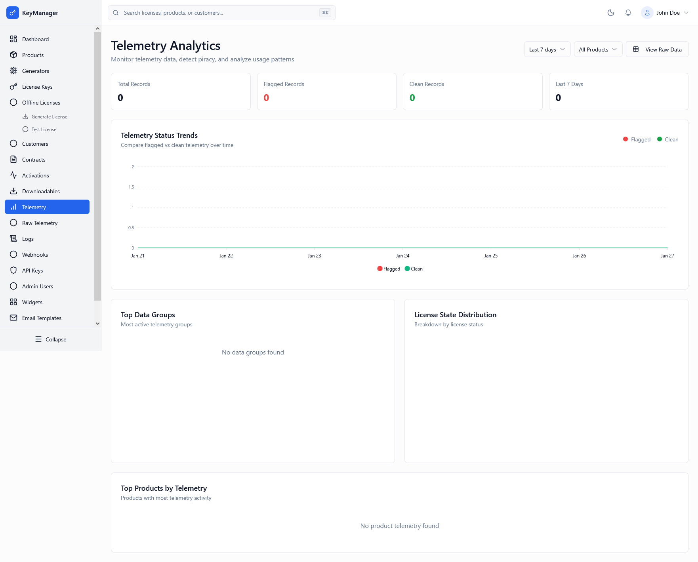

*Screenshot of the Telemetry Analytics dashboard with usage trends*

---

## What Is This Page?

The **Telemetry Analytics** page provides deep insights into how your products are being used in the real world. Monitor activation patterns, detect potential piracy, and analyze technical data sent from customer installations.

---

## When to Use This Page

* **Monitor product adoption** — See how many unique devices are actively using your software
* **Detect piracy** — Identify unusual spikes in usage or blocked activation attempts
* **Analyze version distribution** — Track which versions of your product are most common
* **Investigate usage anomalies** — Find customers with excessive device counts or environmental mismatches
* **Export data** — Download raw telemetry for external business intelligence tools

---

## What You Can Do Here

### 1. Key Statistics

Track the health and scale of your telemetry network:
* **Total Records:** Lifetime count of all telemetry points received in this environment.
* **Flagged Records:** Percentage of records that failed validation (potential piracy).
* **Clean Records:** Percentage of records from valid, active licenses.
* **Recent Activity:** Total records received within the selected time range.

### 2. Time Range & Product Filters

The dashboard updates in real-time based on your selection:
* **Time Range:** Filter data by 24 Hours, 7 Days, 30 Days, or 90 Days.
* **Product Filter:** View analytics for a specific product or the entire catalog.

### 3. Piracy Detection Alerts

A critical section that highlights potential security risks:
* **Invalid Licenses:** Telemetry received with keys that don't exist.
* **Bypassed Activations:** Usage reported without a corresponding HWID activation record.
* **Revoked Licenses:** Attempts to use licenses that have been officially revoked.
* **Environment Mismatch:** Production licenses being used in development/staging environments (or vice versa).

### 4. Telemetry Trends

A visual chart comparing **Flagged** vs. **Clean** telemetry over time. Use this to identify seasonal spikes or sudden piracy outbreaks.

### 5. View Raw Data

Click **"View Raw Data"** to access the granular telemetry table:
* See exact timestamps and IP addresses.
* Inspect full JSON payloads sent by the SDK.
* Filter by License UUID or Customer ID.

---

## Common Workflows

### Workflow 1: Investigating a Piracy Outbreak

**Goal:** Identify why there is a sudden spike in "Flagged" telemetry.

**Steps:**
1. Check the **Telemetry Trends** chart. Look for a vertical spike in the red (Flagged) line.
2. Note the **Piracy Detection Alerts** count.
3. Click **View Raw Data**.
4. Filter by the most recent "Flagged" records.
5. Inspect the "Context" or "Message" field.
6. **Action:** If a single license key is responsible for 1,000s of flagged records, go to [License Keys]() and **Revoke** that key immediately.

### Workflow 2: Monitoring a New Version Launch

**Goal:** Ensure customers are successfully migrating to a newly released version.

**Steps:**
1. Set the **Time Range** to "Last 24 Hours".
2. Select the specific **Product**.
3. Scroll down to the **Version Distribution** table (if available) or check raw data.
4. Compare record counts between the old and new version strings.

---

## Data Handling Rules

To ensure forensic completeness, the Telemetry service follows these strict rules:
* **Permissive Receiving:** We accept malformed or invalid data rather than discarding it.
* **Flag-First Storage:** Data that fails validation is stored but clearly marked as "Flagged".
* **Immutable Records:** Telemetry points cannot be edited once received.
* **Environmental Isolation:** Telemetry never crosses between Production and Staging.

---

## Troubleshooting

**Problem:** Stats show "0 Records" but I know my product is sending data.

**Solution:**
1. Verify the **Environment** toggle. Data sent to a Production API key will not show up in the Staging dashboard.
2. Check your [API Logs]() for failed `/api/v1/telemetry` calls.
3. Verify your SDK configuration includes the correct API Key.

---

## Related Pages

* [Dashboard]() — View simplified telemetry widgets
* [License Keys]() — Link telemetry back to specific users
* [Data Retention Policies]() — Configure when old telemetry is purged
* [System Logs]() — Audit the telemetry receiving process

---

## How to Access

**Navigation:** Admin Portal → **Telemetry**
**URL:** `/admin/telemetry`

**Permission Required:** Admin or higher role
