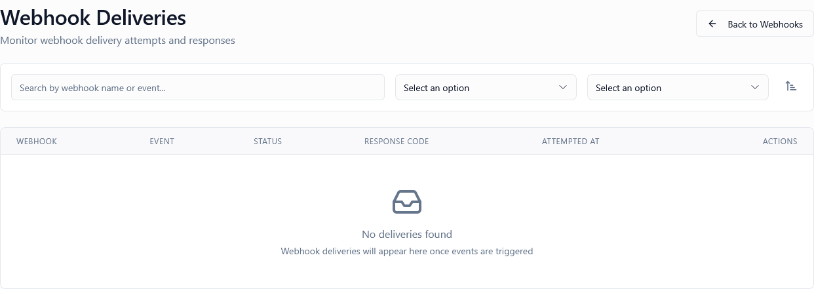

*Screenshot of the Webhook Deliveries log page*

---

## What Is This Page?

The **Webhook Deliveries** page is your central monitoring hub for all outgoing webhook notifications. It provides a detailed log of every attempt made by the platform to send event data to your configured endpoints, along with the results of those attempts.

---

## When to Use This Page

*   **Audit Integration Health** — Ensure your external systems are successfully receiving data.
*   **Debug Failures** — Investigate why a specific webhook target is returning errors (e.g., 404 or 500).
*   **Manual Retries** — Re-send a failed webhook notification after you've fixed an issue on your server.
*   **Inspect Payloads** — View the exact JSON data that was sent to your endpoint.
*   **Verify Response Times** — Monitor how quickly your server responds to platform events.

---

## What You Can Do Here

### 1. Delivery Log Table

The table shows the history of all delivery attempts.

| Column | Description |
| :--- | :--- |
| **Webhook** | The name and URL of the destination webhook. |
| **Event** | The type of event that triggered the delivery (e.g., `license.assigned`). |
| **Status** | **Success** (server returned 2xx code) or **Failed** (any other response). |
| **Response Code** | The HTTP status code returned by your server (e.g., 200, 404, 500). |
| **Attempted At** | The exact timestamp of the delivery attempt. |
| **Actions** | Retry failure, View full details (payload and response). |

### 2. Search & Filter

*   **Search**: Find deliveries by webhook name, event type, or URL.
*   **Event Filter**: Drill down to specific categories like License, Activation, or Product events.
*   **Status Filter**: Show only Successful or Failed delivery attempts.
*   **Sort**: Organize results by timestamp, status, or response code.

### 3. Detailed Delivery View

Clicking the **View** icon (👁️) opens a comprehensive breakdown of the specific attempt:

*   **Request Info**: Full URL, Request Method (POST), and list of HTTP headers (including security signatures).
*   **Payload**: The raw JSON object that was sent in the request body.
*   **Response**: The raw body returned by your server, which is invaluable for debugging internal errors.

### 4. Retry Logic

If a delivery fails, the system provides several ways to recover:

*   **Automatic Retries**: Based on your [system settings](../settings), the platform will automatically attempt to re-send the data with exponential backoff.
*   **Manual Retry**: Click the **Retry** icon (🔄) in the Actions column to trigger an immediate re-delivery attempt. This is useful after you've fixed a bug on your receiving endpoint.

---

## Common Workflows

### Workflow 1: Troubleshooting a 500 Internal Server Error

**Goal**: Find out why your server is crashing when receiving a webhook.

**Steps**:
1.  Go to **Webhook Deliveries**.
2.  Filter by **Status**: "Failed".
3.  Find the entry with **Response Code**: "500".
4.  Click the **View** icon.
5.  Check the **Response Body** — it often contains a stack trace or error message from your server.
6.  Check the **Payload** — verify if the data structure is what your code expects.

### Workflow 2: Manually Recovering Data After Downtime

**Goal**: Re-submit all failed events after your server was offline.

**Steps**:
1.  Navigate to **Webhook Deliveries**.
2.  Search for the specific webhook name.
3.  Identify the attempts made during the downtime (e.g., "Connection Refused").
4.  For the most critical events, click the **Retry** icon next to each one.
5.  Verify that the new attempt results in a **Success** status.

---

## Technical Details

*   **Timeout**: The platform waits for a maximum of 10 seconds for your server to respond.
*   **Retry Policy**: Default is 3 automatic retries over a 30-minute period (configurable).
*   **Data Retention**: Delivery logs are automatically purged after 30 days to optimize database performance. See [Retention Policies](../retention-policies).
*   **Signatures**: Every delivery includes an `X-Webhook-Signature` header computed using your Webhook Secret.

---

## Troubleshooting

**Problem**: I see "Success" but my system didn't process the data.
*   **Check Server Logs**: Your server may have returned a 200 OK but then failed during internal background processing.
*   **Verify Endpoint**: Ensure you haven't pointed the webhook to a "black hole" or a testing endpoint like `webhook.site` that you've forgotten about.

**Problem**: I see "Connection Timeout".
*   **Network Access**: Ensure our platform's outgoing IPs aren't blocked by your firewall.
*   **Server Load**: Your server might be too slow to respond within the 10-second window.

---

## Related Pages

*   [Webhooks](../webhooks) — Create and manage your webhook configurations.
*   [Data Retention Policies](../retention-policies) — Configure how long these logs are kept.
*   [Logs](../logs) — View high-level system activity including webhook job starts.

---

## How to Access

**Navigation**: Admin Portal → **Webhook Deliveries**
**URL**: `/admin/webhook-deliveries`

**Permission Required**: Admin or higher role
