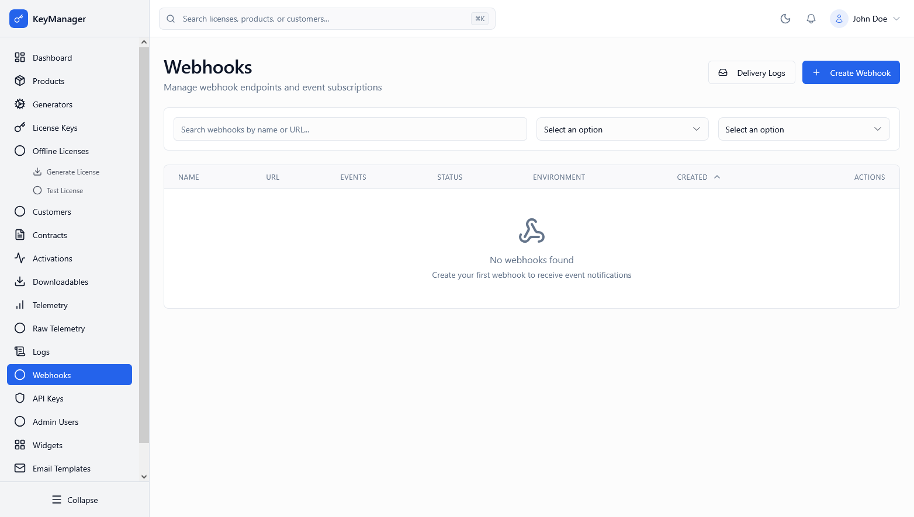

*Screenshot of the Webhooks management page*

---

## What Is This Page?

The **Webhooks** page allows you to configure real-time notifications for events happening within the License Management Platform. When an event occurs (like a license being activated), the system will send an HTTP POST request to your specified URL, enabling you to integrate with external systems effortlessly.

---

## When to Use This Page

*   **Synchronize Customer Data** — Update your CRM when a license is assigned.
*   **Provisioning** — Trigger server setup when a new contract is created.
*   **Slack/Discord Alerts** — Get notified in your team chat when an activation fails.
*   **Custom Analytics** — Stream event data to your own data warehouse in real-time.
*   **Fraud Prevention** — Trigger investigation when a telemetry flag is raised.

---

## What You Can Do Here

### 1. View Webhooks

The main list displays all configured webhooks for the current environment.

| Column | Description |
| :--- | :--- |
| **Name** | A friendly name for identifying the webhook. |
| **URL** | The destination endpoint that will receive the events. |
| **Environment** | Production, Staging, or Development. |
| **Events** | Count of event types this webhook is subscribed to. |
| **Status** | Active (receiving events) or Inactive (paused). |
| **Actions** | Edit, Delete, or toggle the Active status. |

### 2. Search & Filter

*   **Search**: Filter by webhook name or URL.
*   **Environment Filter**: View webhooks for Production, Staging, or Development.
*   **Status Filter**: Show only Active or Inactive webhooks.

### 3. Create/Edit Webhook

When adding or modifying a webhook, you can configure:

*   **Name**: A descriptive name (e.g., "CRM Sync").
*   **Target URL**: The full URL start with `https://` where payloads will be sent.
*   **Environment**: Select which platform environment triggers this webhook.
*   **Webhook Secret**: A secure key starting with `whsec_` used to sign payloads. You should use this to verify the request came from our platform.
*   **Description**: Optional notes about what this webhook is for.
*   **Status**: Toggle whether the webhook is currently active.

### 4. Event Selection

Select from a comprehensive list of system events to subscribe to:

**License Events**
*   `license.created`, `license.updated`, `license.deleted`
*   `license.assigned`, `license.activated`, `license.deactivated`
*   `license.suspended`, `license.expired`, `license.revoked`

**Activation Events**
*   `activation.created`, `activation.deleted`, `activation.failed`

**Product Events**
*   `product.created`, `product.updated`, `product.deleted`

**Contract Events**
*   `contract.created`, `contract.updated`, `contract.deleted`, `contract.suspended`

**Telemetry Events**
*   `telemetry.received`, `telemetry.flagged`

---

## Security Best Practices

*   **Use HTTPS**: Always use secure `https://` URLs for your endpoints.
*   **Verify Signatures**: Use the **Webhook Secret** provided to verify that the `X-Webhook-Signature` header in the request is valid. This prevents attackers from spoofing events.
*   **IP allowlisting**: If possible, restrict your endpoint to only accept connections from our platform's outgoing IP addresses.
*   **Idempotency**: Ensure your endpoint can handle the same event multiple times (e.g., in case of a retry).

---

## Common Workflows

### Workflow 1: Setting up an Activation Alert

**Steps:**
1.  Click **"Create Webhook"**.
2.  Enter name "Slack Activation Alerts".
3.  Enter your Slack webhook or middleware URL.
4.  Select **Environment**: "Production".
5.  Check **Events**: `activation.created` and `activation.failed`.
6.  Click **Save**.
7.  Test a license activation to see the data flow.

### Workflow 2: Updating a Webhook Endpoint

**Steps:**
1.  Find your webhook in the list.
2.  Click the **Edit** icon.
3.  Update the **Target URL** to your new endpoint.
4.  Optionally **Generate New Secret** if security was compromised.
5.  Click **Save**.

---

## Troubleshooting

**Problem**: The webhook isn't receiving events.
*   **Check Status**: Ensure the webhook toggle is set to **Active**.
*   **Check Environment**: Verify the event is happening in the same **Environment** as the webhook.
*   **Check Deliveries**: Go to [Webhook Deliveries](../webhook-deliveries) to see if there were failed attempts and check the response code.

**Problem**: My server says the signature is invalid.
*   **Secret Mismatch**: Ensure you are using the correct **Webhook Secret** for that specific webhook.
*   **Payload Modification**: Ensure your server is reading the raw request body before any parsing (like JSON decoding) for signature verification.

---

## Related Pages

*   [Webhook Deliveries](../webhook-deliveries) — View delivery logs and retry failures.
*   [Settings](../settings) — Configure default webhook retry policies.
*   [API Documentation](../../api) — Details on the webhook payload structure.

---

## How to Access

**Navigation**: Admin Portal → **Webhooks**
**URL**: `/admin/webhooks`

**Permission Required**: Admin or higher role
